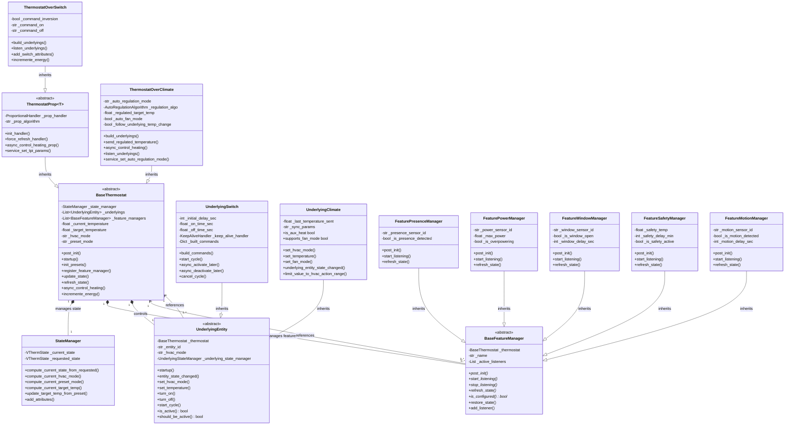

# Base Classes Documentation

## Overview

This document describes the core base classes architecture of the Versatile Thermostat integration for Home Assistant. The architecture follows a modular design with clear separation of concerns through:

- **Inheritance hierarchy** for different thermostat types
- **Composition pattern** for features through managers
- **State management** centralized in dedicated classes
- **Generic types** for underlying entity management

## Class Diagram



## Core Classes

### BaseThermostat

**File:** [base_thermostat.py](../../custom_components/versatile_thermostat/base_thermostat.py)

**Purpose:** Abstract base class for all VersatileThermostat climate entities. Implements the core thermostat logic shared across all types.

**Key Responsibilities:**
- Manages thermostat state through `StateManager`
- Orchestrates feature managers (presence, window, power, etc.)
- Controls underlying entities (switches or climates)
- Handles preset modes and temperature targets
- Implements the main control loop
- Tracks energy consumption

**Main Attributes:**
- `_state_manager: StateManager` - Manages current and requested states
- `_underlyings: List[UnderlyingEntity]` - List of controlled underlying entities
- `_feature_managers: List[BaseFeatureManager]` - List of all feature managers
- `_current_temperature: float` - Current measured temperature
- `_target_temperature: float` - Target temperature
- `_hvac_mode: str` - Current HVAC mode (heat, cool, off, etc.)
- `_preset_mode: str` - Current preset (comfort, eco, away, etc.)

**Lifecycle Methods:**
```python
async def async_added_to_hass()  # Add to Home Assistant
async def post_init()             # Initialize after construction
async def startup()               # Start the thermostat
```

**State Management:**
```python
def update_state()                # Update current/requested states
async def refresh_state()         # Refresh from feature managers
```

**Control:**
```python
async def async_control_heating() # Main control loop (abstract)
```

**Inheritance Hierarchy:**
```
BaseThermostat (abstract)
├── ThermostatProp[T] (abstract)
│   └── ThermostatOverSwitch
└── ThermostatOverClimate
```

---

### ThermostatProp[T]

**File:** [prop_algorithm.py](../../custom_components/versatile_thermostat/prop_algorithm.py)

**Purpose:** Base class for thermostats using proportional algorithms (TPI - Time Proportional Integral). Generic type `T` represents the underlying entity type.

**Key Responsibilities:**
- Manages proportional algorithm handler (TPI, Smart PI)
- Delegates heating control calculations to the handler
- Provides services for algorithm parameter adjustment

**Main Attributes:**
- `_prop_handler: ProportionalHandler` - The algorithm handler (TPIHandler, SmartPIHandler)
- `_prop_algorithm: str` - Algorithm type name

**Algorithm Control:**
```python
def init_handler()                     # Initialize handler from config
def force_refresh_handler()            # Force recalculation
async def async_control_heating_prop() # Control via proportional algorithm
```

**Services:**
```python
async def service_set_tpi_params()     # Change TPI parameters
async def service_set_auto_tpi()       # Enable auto TPI learning
```

---

### ThermostatOverSwitch

**File:** [thermostat_switch.py](../../custom_components/versatile_thermostat/thermostat_switch.py)

**Purpose:** Thermostat controlling switches (relays, heaters) using TPI algorithm to simulate continuous regulation through on/off cycles.

**Key Responsibilities:**
- Controls one or more switches
- Uses TPI algorithm for proportional control
- Calculates energy consumption based on power and duty cycle
- Supports command inversion for specific hardware (fil pilote)

**Main Attributes:**
- `_command_inversion: bool` - Invert ON/OFF commands
- `_command_on: str` - Custom ON command
- `_command_off: str` - Custom OFF command

**Underlying Management:**
```python
def build_underlyings()           # Create UnderlyingSwitch instances
def listen_underlyings()          # Listen to switch state changes
```

**Energy Calculation:**
```python
def incremente_energy()           # Calculate energy based on power × ON time
```

**Underlying Type:** Uses `UnderlyingSwitch` entities

---

### ThermostatOverClimate

**File:** [thermostat_climate.py](../../custom_components/versatile_thermostat/thermostat_climate.py)

**Purpose:** Thermostat controlling other climate entities. Adds advanced features (presence, window detection, etc.) to existing thermostats. Supports automatic temperature regulation using PI algorithm.

**Key Responsibilities:**
- Controls one or more climate entities
- Implements auto-regulation to adjust target temperature
- Supports fan mode automation
- Synchronizes settings with underlying climates
- Aggregates HVAC actions from multiple underlyings

**Main Attributes:**
- `_auto_regulation_mode: str` - Regulation mode (NONE, LIGHT, MEDIUM, STRONG, etc.)
- `_regulation_algo: AutoRegulationAlgorithm` - PI algorithm for regulation
- `_regulated_target_temp: float` - Calculated regulated temperature
- `_auto_fan_mode: bool` - Auto fan mode enabled
- `_follow_underlying_temp_change: bool` - Track underlying temperature changes

**Auto-Regulation:**
```python
async def send_regulated_temperature()        # Send adjusted temperature
def service_set_auto_regulation_mode()        # Configure regulation mode
```

**Control:**
```python
async def async_control_heating()             # Calculate HVAC action from underlyings
```

**Underlying Type:** Uses `UnderlyingClimate` entities

---

### UnderlyingEntity

**File:** [underlyings.py](../../custom_components/versatile_thermostat/underlyings.py)

**Purpose:** Abstract base class representing an underlying entity (switch or climate) controlled by the thermostat.

**Key Responsibilities:**
- Listens to underlying entity state changes
- Executes commands on the underlying entity
- Manages cycle timing (for TPI)
- Tracks entity state and availability

**Main Attributes:**
- `_thermostat: BaseThermostat` - Reference to parent thermostat
- `_entity_id: str` - Home Assistant entity ID
- `_hvac_mode: str` - Current HVAC mode
- `_underlying_state_manager: UnderlyingStateManager` - State management

**Lifecycle:**
```python
async def startup()                    # Start listening to entity
async def entity_state_changed()      # Handle state changes
```

**Control (Abstract):**
```python
async def set_hvac_mode()             # Set HVAC mode
async def set_temperature()           # Set target temperature
async def turn_on()                   # Turn on the entity
async def turn_off()                  # Turn off the entity
```

**Cycle Management:**
```python
async def start_cycle()               # Start a control cycle
def add_cycle_start_listener()        # Register cycle callback
```

**Properties:**
```python
@property
def is_active() -> bool              # Is the entity currently active?

@property
def should_be_active() -> bool       # Should the entity be active?
```

**Subclasses:**
- `UnderlyingSwitch` - For switch entities
- `UnderlyingClimate` - For climate entities

---

### UnderlyingSwitch

**File:** [underlyings.py](../../custom_components/versatile_thermostat/underlyings.py)

**Purpose:** Represents a switch (relay) controlled using TPI (Time Proportional Integral) algorithm.

**Key Responsibilities:**
- Executes TPI cycles (on_time / off_time)
- Handles delayed activation/deactivation
- Supports custom commands
- Implements keep-alive functionality

**Main Attributes:**
- `_initial_delay_sec: int` - Initial delay before first cycle
- `_on_time_sec: float` - ON duration in current cycle
- `_off_time_sec: float` - OFF duration in current cycle
- `_keep_alive_handler: KeepAliveHandler` - Maintains state
- `_built_commands: Dict` - Constructed ON/OFF commands

**TPI Cycle:**
```python
async def start_cycle(on_percent, off_percent, on_time_sec, off_time_sec)
    # Start a TPI cycle with calculated durations

async def async_activate_later(delay_sec)
    # Turn ON after delay

async def async_deactivate_later(delay_sec)
    # Turn OFF after delay

def cancel_cycle()
    # Cancel current cycle
```

**Command Building:**
```python
def build_commands(command_on, command_off, command_inversion)
    # Build service calls for ON/OFF
```

---

### UnderlyingClimate

**File:** [underlyings.py](../../custom_components/versatile_thermostat/underlyings.py)

**Purpose:** Represents a climate (thermostat) entity controlled by VersatileThermostat.

**Key Responsibilities:**
- Sends HVAC mode and temperature to underlying climate
- Synchronizes settings (fan mode, swing, etc.)
- Tracks underlying climate capabilities
- Handles auto fan mode

**Main Attributes:**
- `_last_temperature_sent: float` - Last temperature sent to underlying
- `_sync_params: str` - Synchronization parameters configuration

**Control:**
```python
async def set_hvac_mode(hvac_mode)        # Change HVAC mode
async def set_temperature(temperature)     # Set target temperature
async def set_fan_mode(fan_mode)          # Set fan mode
async def set_swing_mode(swing_mode)      # Set swing mode
async def set_humidity(humidity)          # Set target humidity
```

**State Tracking:**
```python
async def underlying_entity_state_changed()
    # Handle changes from the underlying climate

def limit_value_to_hvac_action_range(value, hvac_action)
    # Ensure temperature is within valid range
```

**Exposed Properties:**
From underlying climate entity:
- HVAC modes, presets, temperatures (min/max/step)
- Fan modes, swing modes
- Aux heat support
- Current temperature and humidity

---

### StateManager

**File:** [state_manager.py](../../custom_components/versatile_thermostat/state_manager.py)

**Purpose:** Manages the thermostat's current (effective) and requested (user-desired) states. Applies constraints from feature managers.

**Key Responsibilities:**
- Maintains two states: `current` (actual) and `requested` (desired)
- Computes current state by applying constraints
- Determines effective HVAC mode, preset, and temperature
- Provides state attributes for Home Assistant

**Main Attributes:**
- `_current_state: VThermState` - Current effective state
- `_requested_state: VThermState` - User-requested state

**State Computation:**
```python
def compute_current_state_from_requested()
    # Apply all constraints to determine current state

def compute_current_hvac_mode() -> str
    # Safety → Window → Auto-start/stop → Central mode → Requested

def compute_current_preset_mode() -> str
    # Overpowering → Safety → Central mode → Timed preset → Requested

def compute_current_target_temp() -> float
    # Window → Motion → Presence → Requested
```

**Priority Chain:**

**HVAC Mode Priority:**
1. Safety mode (highest priority)
2. Window open detection
3. Auto start/stop feature
4. Central mode
5. Requested mode (lowest priority)

**Preset Mode Priority:**
1. Overpowering detection (highest priority)
2. Safety mode
3. Central mode preset
4. Timed preset
5. Requested preset (lowest priority)

**Temperature Priority:**
1. Window open temperature
2. Motion detected temperature
3. Presence detected temperature
4. Requested temperature (default)

**Usage Example:**
```python
# User sets heating mode
state_manager._requested_state.hvac_mode = HVAC_MODE_HEAT

# Compute effective state
state_manager.compute_current_state_from_requested()

# If window is open, current state may be OFF despite request
current_hvac = state_manager._current_state.hvac_mode  # May be OFF
```

---

### BaseFeatureManager

**File:** [feature_manager.py](../../custom_components/versatile_thermostat/feature_manager.py)

**Purpose:** Abstract base class for all feature managers. Each manager handles a specific feature (presence detection, window detection, power management, etc.).

**Key Responsibilities:**
- Initialize feature from configuration
- Listen to relevant sensors
- Update thermostat state when feature activates
- Clean up listeners on shutdown

**Main Attributes:**
- `_thermostat: BaseThermostat` - Reference to parent thermostat
- `_name: str` - Manager name for logging
- `_active_listeners: List` - Active event listeners

**Abstract Interface:**
```python
async def post_init(entry_infos: dict)
    # Initialize from config entry (abstract)

async def start_listening()
    # Start listening to sensors (abstract)

async def stop_listening()
    # Stop all listeners (abstract)

async def refresh_state()
    # Update feature state (abstract)

@property
def is_configured() -> bool
    # Is this feature configured? (abstract)
```

**Utility Methods:**
```python
def add_listener(remove_listener_func)
    # Register a listener cancellation function

async def restore_state(old_state)
    # Restore feature state from saved state
```

**Concrete Implementations:**

#### FeaturePresenceManager
Detects presence/absence and adjusts temperatures accordingly.
- Monitors presence sensor
- Switches between presence/absence presets

#### FeaturePowerManager
Monitors power consumption and reduces heating when limit exceeded.
- Monitors power sensor
- Activates "overpowering" state when max power reached

#### FeatureWindowManager
Detects open windows and turns off heating.
- Monitors window/door sensors
- Applies window open delay before action

#### FeatureSafetyManager
Safety timeout - turns off if no temperature update.
- Monitors last temperature update time
- Sets safety preset after timeout

#### FeatureMotionManager
Adjusts temperature based on motion detection.
- Monitors motion sensors
- Changes temperature when motion detected

#### FeatureAutoStartStopManager
Auto-starts/stops thermostat based on temperature.
- No external sensors
- Uses temperature thresholds

#### FeatureLockManager
Locks thermostat controls.
- Prevents user changes when locked

#### FeatureTimedPresetManager
Activates preset for a limited time.
- Automatic reversion to previous preset

#### FeatureHeatingFailureDetectionManager
Detects heating failures.
- Monitors temperature slope
- Alerts when heating ineffective

---

## Inheritance and Composition Overview

### Inheritance Tree

```
BaseThermostat (abstract base)
├── ThermostatProp[T] (proportional algorithms)
│   └── ThermostatOverSwitch (controls switches)
└── ThermostatOverClimate (controls climates)

UnderlyingEntity (abstract base)
├── UnderlyingSwitch (switch control)
└── UnderlyingClimate (climate control)

BaseFeatureManager (abstract base)
├── FeaturePresenceManager
├── FeaturePowerManager
├── FeatureWindowManager
├── FeatureSafetyManager
├── FeatureMotionManager
├── FeatureAutoStartStopManager
├── FeatureLockManager
├── FeatureTimedPresetManager
└── FeatureHeatingFailureDetectionManager
```

### Composition Relationships

```
BaseThermostat
├── owns StateManager (1:1)
├── owns UnderlyingEntity[] (1:many)
└── owns BaseFeatureManager[] (1:many)

UnderlyingEntity
└── references BaseThermostat (many:1)

BaseFeatureManager
└── references BaseThermostat (many:1)

StateManager
└── owns VThermState × 2 (current + requested)
```

---

## Data Flow

### 1. Initialization Flow

```
User creates thermostat config
    ↓
async_setup_entry() called
    ↓
ThermostatOverSwitch / ThermostatOverClimate instantiated
    ↓
BaseThermostat.__init__() creates StateManager
    ↓
async_added_to_hass() adds entity to Home Assistant
    ↓
post_init() initializes feature managers
    ↓
build_underlyings() creates UnderlyingEntity instances
    ↓
startup() starts listeners and control loop
```

### 2. User Command Flow

```
User calls climate.set_temperature service
    ↓
async_set_temperature() method called
    ↓
Updates StateManager._requested_state
    ↓
StateManager.compute_current_state_from_requested()
    ↓
Applies constraints from feature managers
    ↓
Computes _current_state (effective state)
    ↓
async_control_heating() executes control
    ↓
Commands sent to UnderlyingEntity instances
    ↓
UnderlyingSwitch.start_cycle() or UnderlyingClimate.set_temperature()
```

### 3. Sensor Event Flow

```
Temperature sensor state changes
    ↓
Sensor listener callback triggered
    ↓
_async_temperature_changed() called
    ↓
Updates _current_temperature
    ↓
async_control_heating() called
    ↓
TPI algorithm calculates on_percent / off_percent
    ↓
UnderlyingSwitch.start_cycle() executes
    ↓
Async delays for on_time and off_time
```

### 4. Feature Manager Event Flow

```
Window sensor opens
    ↓
FeatureWindowManager listener triggered
    ↓
Window delay timer started
    ↓
After delay: refresh_state() called
    ↓
StateManager.compute_current_state_from_requested()
    ↓
Window constraint forces HVAC_MODE_OFF
    ↓
async_control_heating() turns off underlyings
```

---

## Design Patterns Used

### 1. Template Method Pattern
`BaseThermostat` defines the skeleton of the control algorithm, with subclasses implementing specific behaviors:
- `async_control_heating()` - Abstract method
- `ThermostatOverSwitch` - TPI-based control
- `ThermostatOverClimate` - Delegation to underlying climates

### 2. Strategy Pattern
`ProportionalHandler` abstracts different proportional algorithms:
- `TPIHandler` - Classic TPI algorithm
- `SmartPIHandler` - Advanced PI with learning

### 3. Observer Pattern
Feature managers observe sensors and notify the thermostat:
- Sensors → Feature Manager → Thermostat state update

### 4. Composition over Inheritance
Features are composed rather than inherited:
- `BaseFeatureManager` instances added to `BaseThermostat`
- Easy to add/remove features without changing base class

### 5. State Pattern
`StateManager` encapsulates state logic:
- Current vs. Requested state separation
- Constraint application centralized

---

## Extension Points

### Adding a New Thermostat Type

1. Inherit from `BaseThermostat` or `ThermostatProp[T]`
2. Implement `build_underlyings()` to create underlying entities
3. Implement `async_control_heating()` for control logic
4. Register in `create_thermostat()` factory function

### Adding a New Feature

1. Create class inheriting from `BaseFeatureManager`
2. Implement abstract methods:
   - `post_init()` - Initialize from config
   - `start_listening()` - Listen to sensors
   - `refresh_state()` - Update thermostat
   - `is_configured` - Check if enabled
3. Register in `BaseThermostat.post_init()`

### Adding a New Underlying Type

1. Create class inheriting from `UnderlyingEntity`
2. Implement abstract methods:
   - `set_hvac_mode()`
   - `set_temperature()`
   - `turn_on()` / `turn_off()`
3. Use in thermostat's `build_underlyings()`

---

## Key Concepts

### TPI (Time Proportional Integral)
- Converts continuous target temperature to on/off cycles
- `on_percent = 0.6` → 60% ON, 40% OFF over cycle period
- Simulates proportional control with discrete switches

### Auto-Regulation
- PI algorithm adjusts target temperature based on actual temperature
- Compensates for under/over-performing climates
- Modes: NONE, LIGHT, MEDIUM, STRONG, SLOW

### State Priority
The `StateManager` applies features in priority order to compute the effective state:
1. Safety constraints (highest)
2. Physical constraints (window)
3. Automation features (auto-start)
4. User requests (lowest)

This ensures safety and energy saving override user commands when necessary.

---

## Thread Safety and Async

- All control methods are `async` for non-blocking operation
- State updates protected by Home Assistant's event loop
- Timers use `async_call_later` for proper async execution
- Listeners cleaned up in `async_will_remove_from_hass()`

---

## Testing Considerations

### Unit Testing
- Mock `StateManager` for state logic tests
- Mock `UnderlyingEntity` for control tests
- Mock feature managers to test constraint application

### Integration Testing
- Test full initialization flow
- Test state transitions with multiple features
- Test TPI cycle timing
- Test energy calculation accuracy

---

## Performance Notes

- Listeners debounced to avoid excessive updates
- State computation cached when possible
- TPI cycles minimize switch wear
- Feature managers only active when configured

---

## Debugging Tips

### Enable Debug Logging
```yaml
logger:
  default: info
  logs:
    custom_components.versatile_thermostat: debug
```

### Key Debug Points
- `StateManager.compute_current_state_from_requested()` - State logic
- `async_control_heating()` - Control decisions
- `UnderlyingSwitch.start_cycle()` - TPI cycle execution
- Feature manager `refresh_state()` - Feature activation

### Common Issues
1. **Heating not starting**: Check `StateManager` constraints
2. **Incorrect temperature**: Check sensor entity_id
3. **Rapid cycling**: Adjust TPI parameters
4. **Features not working**: Verify sensor entity_ids

---

## Future Improvements

- Support for valve control (0-100% opening)
- Multi-zone coordination
- Predictive algorithms using weather forecast
- Machine learning for TPI optimization
- Support for cooling mode in all thermostat types

