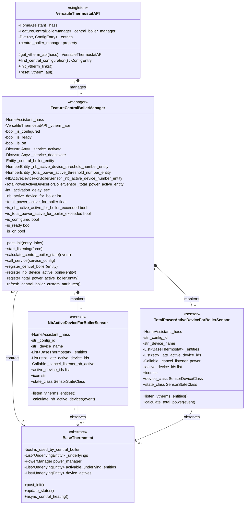

# Central Boiler Feature Documentation

## Overview

This document describes the central boiler feature of the Versatile Thermostat integration for Home Assistant. The central boiler feature enables coordinated control of a central heating system (such as a boiler or furnace) based on the activation status and power consumption of multiple VTherm instances.

The architecture uses a manager-based pattern to:

- Monitor the number of active VTherm devices
- Track the total active power consumption
- Activate/deactivate a central boiler based on configurable thresholds
- Provide real-time metrics and state information through sensor entities

## Class Diagram



## Components

### VersatileThermostatAPI

The singleton API class that manages all global Versatile Thermostat functionality, including the central boiler feature.

**Key Responsibilities:**
- Provides centralized access to the boiler manager via `central_boiler_manager` property
- Manages initialization of all VTherm links and sensors
- Stores and retrieves central configuration settings
- Manages the lifecycle of the API instance

**Key Methods:**
- `get_vtherm_api(hass)`: Returns or creates the singleton API instance
- `init_vtherm_links(entry_id)`: Initializes all VTherm entities and links
- `central_boiler_manager`: Property providing access to the boiler manager

### FeatureCentralBoilerManager

The core manager for central boiler functionality, responsible for determining when the boiler should be activated or deactivated.

**Key Attributes:**
- `_is_configured`: Indicates if activation/deactivation services are configured
- `_is_ready`: Indicates if all required entities are registered and available
- `_is_on`: Current boiler state (True=on, False=off, None=unknown)
- `_service_activate`: Service configuration for boiler activation
- `_service_deactivate`: Service configuration for boiler deactivation
- `_activation_delay_sec`: Optional delay before activating the boiler
- `_nb_active_device_number_entity`: Reference to sensor tracking active device count
- `_total_power_active_entity`: Reference to sensor tracking total active power

**Key Responsibilities:**
1. **Configuration Management**: Loads and validates service configurations during initialization
2. **Entity Registration**: Registers sensor and number entities as they become available
3. **State Calculation**: Monitors thresholds and calculates boiler activation state
4. **Service Invocation**: Calls Home Assistant services to activate/deactivate the boiler
5. **State Monitoring**: Listens to changes in device count and power consumption

**Decision Logic:**
The boiler is activated if either condition is met:
- Number of active VTherm devices exceeds the threshold, OR
- Total active power consumption exceeds the threshold

**Key Methods:**
- `post_init(entry_infos)`: Initializes the manager with configuration data
- `start_listening(force)`: Starts monitoring entity state changes
- `calculate_central_boiler_state(event)`: Core logic determining boiler on/off state
- `register_*()`: Registers dependent entities
- `refresh_central_boiler_custom_attributes()`: Updates boiler entity attributes

### BaseThermostat

The base class for all thermostat instances that can control the central boiler.

**Key Attributes Relevant to Boiler Control:**
- `is_used_by_central_boiler`: Boolean indicating if this VTherm controls the boiler
- `device_actives`: List of currently active underlying devices (switches, valves, etc.)
- `power_manager.mean_cycle_power`: Average power consumption in the current cycle
- `activable_underlying_entities`: List of controllable entities (for power calculation)

**Interaction with Boiler Manager:**
- Provides device activity status for active count monitoring
- Provides power consumption metrics for power threshold monitoring
- Can request boiler manager to refresh its custom attributes

### NbActiveDeviceForBoilerSensor

A sensor entity that tracks the number of VTherm devices actively demanding heating/cooling and configured to control the central boiler.

**Key Attributes:**
- `_attr_native_value`: Current count of active devices
- `_attr_active_device_ids`: List of entity IDs of active devices
- `_entities`: List of BaseThermostat instances that control the boiler

**Key Responsibilities:**
- Monitors all VTherm devices configured for central boiler control
- Calculates the count of currently active devices
- Maintains the list of active device entity IDs
- Updates the manager with new calculations

**Sensor Properties:**
- **Name**: "Nb device active for boiler"
- **Icon**: "mdi:heat-wave"
- **State Class**: MEASUREMENT
- **Extra Attributes**: `active_device_ids` (list of entity IDs)

### TotalPowerActiveDeviceForBoilerSensor

A sensor entity that tracks the total power consumption of all VTherm devices actively controlling the central boiler.

**Key Attributes:**
- `_attr_native_value`: Current total power in watts
- `_attr_active_device_ids`: List of entity IDs contributing to power
- `_entities`: List of BaseThermostat instances being monitored

**Key Responsibilities:**
- Monitors VTherm power consumption from all relevant devices
- Aggregates power metrics from active devices
- Maintains the list of contributing device entity IDs
- Updates the manager with new power calculations

**Sensor Properties:**
- **Name**: "Total power active for boiler"
- **Icon**: "mdi:flash-auto"
- **Device Class**: POWER
- **Unit of Measurement**: W (watts)
- **State Class**: MEASUREMENT
- **Extra Attributes**: `active_device_ids` (list of entity IDs)

## Interaction Flow

### Initialization

```
1. VersatileThermostatAPI is instantiated
   ↓
2. FeatureCentralBoilerManager is created (internal to API)
   ↓
3. Configuration is loaded via post_init()
   ↓
4. NbActiveDeviceForBoilerSensor is created and registers with manager
   ↓
5. TotalPowerActiveDeviceForBoilerSensor is created and registers with manager
   ↓
6. Number entities (thresholds) are created and register with manager
   ↓
7. Central boiler entity registers with manager
   ↓
8. start_listening() is called → manager begins monitoring state changes
```

### State Change Processing

```
When a BaseThermostat changes state:
   ↓
1. NbActiveDeviceForBoilerSensor.calculate_nb_active_devices() is triggered
   ↓
2. TotalPowerActiveDeviceForBoilerSensor.calculate_total_power() is triggered
   ↓
3. Both sensors update their values and notify the manager
   ↓
4. FeatureCentralBoilerManager.calculate_central_boiler_state() is triggered
   ↓
5. Manager evaluates thresholds:
      - nb_active_device >= threshold? OR
      - total_power >= threshold?
   ↓
6. If state changed:
      - Call activation service (with optional delay), or
      - Call deactivation service
   ↓
7. Update manager state and send events
```

### Boiler Activation Decision

```
calculate_central_boiler_state(event):
    ↓
    if not is_ready:
        return  # Manager not fully configured
    ↓
    active = is_nb_active_active_for_boiler_exceeded OR
             is_total_power_active_for_boiler_exceeded
    ↓
    if state_changed:
        if active:
            if activation_delay > 0:
                schedule activation after delay
            else:
                activate immediately
        else:
            deactivate immediately (cancel any pending activation)
```

## Configuration

The central boiler feature requires:

1. **Service Configuration**:
   - `CONF_CENTRAL_BOILER_ACTIVATION_SRV`: Service to call for boiler activation
   - `CONF_CENTRAL_BOILER_DEACTIVATION_SRV`: Service to call for boiler deactivation

2. **Threshold Entities**:
   - Number entity for active device count threshold
   - Number entity for total power threshold

3. **Sensor Entities**:
   - Sensor for current active device count
   - Sensor for current total power consumption

4. **Central Boiler Entity**:
   - A binary sensor or switch entity representing the boiler state

## State Management

The manager maintains three key states:

| State           | Meaning                                | When Set                   |
| --------------- | -------------------------------------- | -------------------------- |
| `is_configured` | Services are properly configured       | During post_init()         |
| `is_ready`      | All 4 required entities are registered | When last entity registers |
| `is_on`         | Boiler is currently on                 | During state calculation   |

The manager is only ready (`is_ready=True`) when:
- `is_configured` is True
- All 4 required entities are registered:
  1. Number threshold for active devices
  2. Number threshold for total power
  3. Sensor for active device count
  4. Sensor for total power
- The central boiler entity is registered

## Key Features

### Dual-Threshold Activation

The boiler activates if **either** threshold is exceeded:
- Number of active devices ≥ configured threshold, **OR**
- Total active power ≥ configured power threshold

This allows flexible boiler control based on different scenarios:
- Activate if many thermostats demand heat (device count)
- Activate if one thermostat demands significant power (power consumption)

### Delayed Activation

An optional activation delay can be configured to prevent boiler cycling. The delay:
- Is applied only on activation
- Can be cancelled if another deactivation condition occurs
- Is used to smooth out rapid on/off transitions

### Real-Time Monitoring

Both sensor entities provide:
- Current calculated values (device count, total power)
- Lists of contributing device entity IDs
- Automatic refresh when thresholds change

### Event Logging

The feature sends VTherm-specific events on boiler state changes:
- `vtherm_central_boiler_event` events with activation/deactivation details
- Includes threshold values for diagnostics

## Testing Considerations

For testing purposes, the manager provides:
- `_set_nb_active_device_threshold()`: Manually set device count threshold
- `_set_total_power_active_threshold()`: Manually set power threshold

These methods allow unit tests to verify the boiler state calculation logic without requiring complex test fixtures.

## Error Handling

The feature handles several error scenarios:

1. **Incomplete Configuration**: Logs warnings if entities are not fully registered
2. **Service Failures**: Catches `HomeAssistantError` and logs error messages
3. **Missing Entities**: Gracefully handles missing threshold or sensor entities
4. **State Unavailability**: Treats unavailable values as None and skips thresholds

## Performance Considerations

The feature uses event-driven state monitoring:
- Listening is managed via `async_track_state_change_event`
- Only relevant entity state changes trigger calculations
- No polling or periodic recalculation
- Listeners are properly cleaned up on removal

---

*This documentation reflects the architecture as of the current implementation. See the source files for the most up-to-date implementation details.*
