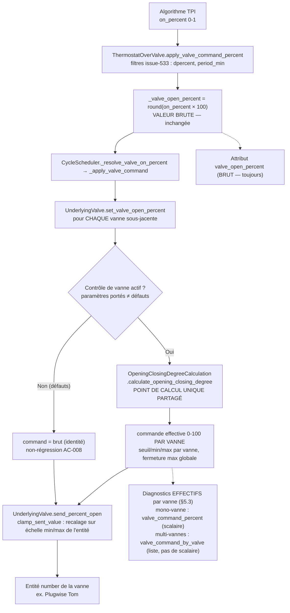
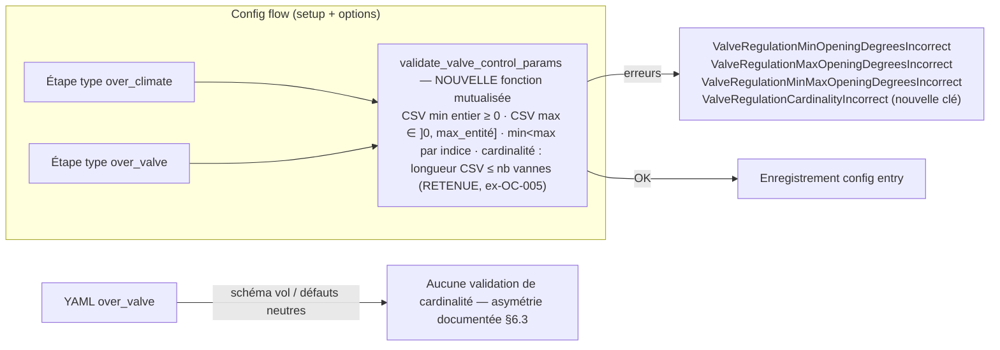

# Conception technique — Parité du contrôle de vanne pour `over_valve` / Technical design — Valve control parity for `over_valve`

- **Référence :** [issue #1348](https://github.com/jmcollin78/versatile_thermostat/issues/1348) — [discussion #1339](https://github.com/jmcollin78/versatile_thermostat/discussions/1339)
- **Version :** 1.1
- **Statut :** Proposée — convergée avec la spécification fonctionnelle v1.1 / Proposed — converged with functional specification v1.1
- **Date :** 14 septembre 2026
- **Propriétaire :** Équipe Versatile Thermostat (rédaction : agent de conception)
- **Documents sources (lus intégralement, en lecture seule) :**
  - `documentation/tech-docs/issue-1348-review.md` (rapport de revue)
  - `documentation/tech-docs/issue-1348-specification.md` (spécification fonctionnelle **v1.1**)
  - Code inspecté : `opening_degree_algorithm.py`, `thermostat_valve.py`, `thermostat_climate_valve.py`, `underlyings.py`, `cycle_scheduler.py`, `config_flow.py`, `config_schema.py`, `const.py`, `base_thermostat.py` (`clean_central_config_doublon`), `translations/en.json`
  - Tests inspectés : `tests/test_valve.py`, `tests/test_overclimate_valve.py`, `tests/test_config_flow.py` (bloc `valve_regulation`, lignes ~1274-1810)

> Aucun code, configuration, dépendance ou entité Home Assistant n'a été modifié lors de la conception. Ce document est le seul livrable. / No code, configuration, dependency or Home Assistant entity was modified. This document is the only deliverable.

---

## 1. Synthèse des confirmations exigées / Required confirmations

| Confirmation                  | Statut                                                                   | Résumé                                                                                                                                                                                                                                                                                                                                                                                                                       |
| ----------------------------- | ------------------------------------------------------------------------ | ---------------------------------------------------------------------------------------------------------------------------------------------------------------------------------------------------------------------------------------------------------------------------------------------------------------------------------------------------------------------------------------------------------------------------- |
| **Périmètre**                 | ✅ Conçu — identique à la spécification v1.1                              | Portage complet des 4 paramètres (`opening_threshold_degree`, `min_opening_degrees`, `max_closing_degree`, `max_opening_degrees`) vers `over_valve` ; CSV et sémantiques identiques à `over_climate` régulation directe ; seuil et fermeture max globaux ; min/max par vanne ; calcul et validations **mutualisés sans copie de formule**. **Aucune configuration centrale** dans le périmètre (BR-004 v1.1, AC-013 retiré). |
| **Couverture exigences/AC**   | ✅ FR-001..FR-009 et **tous les critères actifs AC-001..AC-012** couverts | La règle de cardinalité des listes trop longues (FR-007/AC-007) est **retenue et mutualisée** : ajoutée une seule fois, appliquée aux deux variantes, y compris `over_climate` (renforcement assumé, à noter en changelog). AC-013 a été **retiré** de la spécification v1.1 (aucun critère central n'est applicable). Détail : §11.                                                                                         |
| **Contradictions bloquantes** | ✅ Aucune                                                                 | Les trois constats de la conception v1.0 sont clos : (C1) fichier de tests corrigé dans la spécification v1.1 (`tests/test_valve.py`) ; (C2) AC-013 et l'éligibilité centrale retirés du périmètre (BR-004 amendé) ; (C3) cardinalité entérinée comme exigence mutualisée (FR-007/AC-007). Toutes les questions D1–D4 de la v1.0 sont **résolues** (§10.2) ; **aucune décision ne reste à soumettre**.                       |
| **Testabilité**               | ✅ Oui                                                                    | Le point de calcul unique est déjà une méthode statique pure, testable par table ; les flux config-flow existants ont déjà une base de tests à étendre ; la structure de diagnostics retenue (§5.3) est entièrement assertable par attributs d'état. Stratégie : §9.                                                                                                                                                         |

---

## 2. Objectif, périmètre et exigences couvertes

### FR
Porter sur le type `over_valve` les quatre paramètres de contrôle physique de vanne aujourd'hui réservés à `over_climate` en régulation directe (`ThermostatOverClimateValve`), en réutilisant **strictement** le point de calcul unique existant (`OpeningClosingDegreeCalculation.calculate_opening_closing_degree`) et en mutualisant les règles de validation du flux de configuration. La commande brute TPI reste exposée intacte (`valve_open_percent`) ; la commande effective est exposée en diagnostic **par vanne** quand le contrôle est actif (structure §5.3, résolution H2).

Périmètre exact (conforme à la spécification v1.1 §7) :
- **Inclus :** les 4 paramètres en setup flow, options flow et YAML pour `over_valve` ; transformation par vanne ; attributs de diagnostic brut/effectif ; validations mutualisées (dont la cardinalité des listes, appliquée aussi à `over_climate`) ; documentation et traductions dans **toutes les langues publiées du dépôt** ; neutralité des formulations.
- **Exclus :** toute modification du comportement `over_climate` (hors renforcement volontaire de la validation partagée des listes trop longues, assumé par FR-007) ; **éligibilité à la configuration centrale des quatre paramètres** (aucune variante ne les centralise ; BR-004 v1.1 : la config centrale n'est pas consultée pour eux) ; changement du format CSV persisté ; support spécifique Plugwise Tom ; réglage par entité de service (BR-007) ; migration de données (inutile) ; évolutions non fonctionnelles ; traductions hors dépôt.

### EN (mirror)
Port the four physical valve-control parameters to `over_valve`, strictly reusing the single calculation point and shared config validation. Raw TPI stays exposed as `valve_open_percent`; the effective command is exposed as a **per-valve** diagnostic when control is active (§5.3, resolves H2). Exclusions follow spec v1.1 §7 unchanged, including: no central configuration for these parameters (BR-004 v1.1), and the shared overly-long-list validation also tightening `over_climate` (deliberate, per FR-007).

---

## 3. Éléments existants vérifiés et dépendances

Tous les faits suivants ont été vérifiés par lecture directe du code (aucune inférence non étiquetée).

### 3.1 Point de calcul unique (le cœur de la mutualisation)
`opening_degree_algorithm.py` — `OpeningClosingDegreeCalculation.calculate_opening_closing_degree(brut_valve_open_percent, min_opening_degree, max_opening_degree, opening_threshold, max_closing_degree)` :
- si `bvop >= seuil et bvop > 0` : interpolation linéaire `min_od + (max_od - min_od) / (100 - ot) * (bvop - ot)` ;
- sinon : `1 - max_cd` (i.e. `100 - max_closing_degree` en pourcentage) ;
- retourne `(round(degree * 100), 100 - round(degree * 100))` ;
- garde : `min_od >= max_od` → `min_od := opening_threshold` (et log d'avertissement).

**Vérification AC-001 par le code :** seuil 20, min 30, max 80, brut 25 → pente `(80-30)/(100-20) = 0.625` ; `30 + 0.625 × (25-20) = 33.125` → arrondi **33**. L'arithmétique de l'AC-001 est conforme à l'implémentation. ✔

**Appelant unique actuel :** `UnderlyingValveRegulation.send_percent_open` (`underlyings.py` ~l.1487). C'est le seul endroit du code où la méthode est invoquée : la mutualisation est donc déjà effective de fait ; il s'agit de l'étendre à `over_valve` **sans la dupliquer**.

### 3.2 Variante `over_climate` (référence à imiter, sans la modifier)
- `thermostat_climate_valve.py` — `ThermostatOverClimateValve.post_init` : lecture des 4 paramètres ; éclatement CSV avec défauts par indice (min → `0` ; max → attribut `max` de l'entité `number` sous-jacente, sinon `100`) ; création d'un `UnderlyingValveRegulation` par sous-jacent.
- `underlyings.py` — `UnderlyingValveRegulation(UnderlyingValve)` (~l.1376) : porte `min/max_opening_degree` par vanne, `opening_threshold`, `max_closing_degree` ; `send_percent_open` appelle le calcul partagé puis `super().send_percent_open(opening_degree)` ; `is_device_active`/`should_device_be_active` comparent à `100 - max_closing_degree`.

### 3.3 Variante `over_valve` (cible du portage)
- `thermostat_valve.py` — `ThermostatOverValve(ThermostatProp[UnderlyingValve])` : `recalculate()` → `apply_valve_command_percent(on_percent, force)` (filtres issue-533 : `dpercent`, `period_min`) → `_valve_open_percent` (entier 0-100, **brut TPI**). Aucun paramètre de contrôle de vanne n'y est lu aujourd'hui.
- `underlyings.py` — `UnderlyingValve` (~l.1167) : `set_valve_open_percent()` clampe `self._thermostat.valve_open_percent` puis `send_percent_open()` ; `clamp_sent_value(value) = round(max(min_open, min(value / 100 × max_open, max_open)))` recale la commande 0-100 sur l'échelle `min`/`max` de l'entité `number` (attributs lus par `init_valve_state_min_max_open`) ; `check_and_repair()` renvoie la dernière valeur si dérive > 0.5.
- `cycle_scheduler.py` — `CycleScheduler` : en mode vanne (`_detect_valve_mode` via `UnderlyingEntityType.VALVE`), `apply_valve_update(hvac_mode, on_percent)` → résout `apply_valve_command_percent` → `_apply_valve_command` → pour chaque sous-jacent : `await under.set_valve_open_percent()`. **Le chemin d'envoi par vanne existe déjà** : aucune modification du planificateur n'est requise.

### 3.4 Flux de configuration, validations et configuration centrale
- `const.py` : les 4 constantes existent déjà (`CONF_OPENING_THRESHOLD_DEGREE` l.149, `CONF_MIN_OPENING_DEGREES` l.146, `CONF_MAX_OPENING_DEGREES` l.147, `CONF_MAX_CLOSING_DEGREE` l.148) — **aucune nouvelle constante nécessaire**.
- `config_schema.py` : `build_step_valve_regulation_schema()` (4 paramètres, défauts `0` / `""` / `""` / `100`) ; `build_step_thermostat_valve_schema()` (entités sous-jacentes, `prop_function`, `ac_mode`, `auto_regulation_dtemp/period_min` — **aucun** paramètre de contrôle de vanne).
- `config_flow.py` : étape `async_step_valve_regulation` + entrée de menu `valve_regulation` ; `is_valve_regulation_selected()` ; `validate_input` contient : validation CSV min (entier ≥ 0 → `ValveRegulationMinOpeningDegreesIncorrect`), validation CSV max (par vanne : `> 0` et ≤ `max` de l'entité → `ValveRegulationMaxOpeningDegreesIncorrect`), contrôle croisé min < max (`ValveRegulationMinMaxOpeningDegreesIncorrect`), `check_valve_regulation_nb_entities` (cardinalité des listes d'**entités** opening/closing degree, pas des CSV min/max).
- **Fait clé (validé par la spécification v1.1, ex-OC-005) :** il n'existe aujourd'hui **aucune** validation de longueur des CSV min/max par rapport au nombre de vannes sous-jacentes ; les listes trop longues sont silencieusement tolérées pour `over_climate`. La spécification v1.1 **retient** l'ajout de cette règle, **une seule fois, mutualisée**, s'appliquant aux deux variantes — y compris `over_climate`, pour lequel les listes trop longues deviennent rejetées. Ce renforcement est assumé (FR-007 : « rejeter une liste incohérente ne peut pas casser une configuration existante valide ») et sera noté en changelog.
- **Fait clé (validé par la spécification v1.1, ex-OC-002, BR-004 amendé) :** aucun des 4 paramètres n'apparaît dans un schéma `STEP_CENTRAL_*` (le schéma central avancé = paramètres de sécurité uniquement ; `STEP_CENTRAL_TPI_DATA_SCHEMA` = coefficients TPI uniquement). La configuration centrale ne supporte ces paramètres **ni pour `over_valve` ni pour `over_climate`**. **Décision de périmètre : la configuration centrale n'est pas consultée pour ces quatre paramètres et ne les fournit pas** ; l'éligibilité centrale est une évolution future (spécification §8 évolution 2), hors de cette issue.

### 3.5 Traductions, langues publiées et tests
- `translations/en.json` : les clés `valve_regulation` (labels + descriptions des 4 paramètres) et les erreurs existent déjà (bloc init et bloc options). Les libellés n'ont donc **pas** à être inventés : ils seront réutilisés pour `over_valve` (FC-005 : cohérence des libellés).
- **Langues publiées (AS-004, ex-OC-001 résolu) :** l'ensemble exact des langues à mettre à jour est celui des fichiers présents dans `translations/` (au minimum `cs`, `de`, `en`, `fr`, `pl` — à recenser exhaustivement au moment du développement ; **aucune traduction « probable » hors dépôt**). Toutes les langues publiées sont mises à jour **dans le même changement** (FR-009, FC-005).
- `tests/test_config_flow.py` (l.~1274-1810) : tests existants de l'étape `valve_regulation` — navigation, `valve_regulation_nb_entities_incorrect`, validations min/max, conflits min/max, **+ nouveaux tests de cardinalité** pour les deux variantes.
- `tests/test_valve.py` : tests `over_valve` existants (`test_over_valve_full_start`, `test_over_valve_regulation`, `test_bug_533`) s'appuyant sur les assertions `entity.valve_open_percent`. (La spécification v1.1 cite bien `tests/test_valve.py` — le constat C1 de la conception v1.0 est clos.)

### 3.6 Divergence `over_climate` à ne PAS porter (décision de conception)
`ThermostatOverClimateValve.post_init` contient `self._opening_threshold_degree = max(opening_threshold, regulation_threshold)` : cette ligne fusionne `auto_regulation_dtemp` (seuil d'hystérésis **température**) dans le seuil d'ouverture — une sémantique propre à `over_climate`. En `over_valve`, `auto_regulation_dpercent` est une hystérésis de **pourcentage** aux sémantiques différentes ; porter cette fusion changerait le comportement `over_valve` et violerait FR-008. **Décision : ne pas porter cette ligne** ; divergence intentionnelle, documentée (DC-2). Les deux TODO existants dans `thermostat_climate_valve.py` (`# TODO c'est pas possible ici`, `# TODO pas bon`) confirment que ce morceau d'`over_climate` est fragile et ne doit pas servir de modèle.

---

## 4. Vue d'ensemble de la solution

### 4.1 Responsabilités des composants

| Composant                                 | Fichier                                        | Responsabilité dans la conception                                                                                                                                                                                                                                                                                                                                                                   | Nature                       |
| ----------------------------------------- | ---------------------------------------------- | --------------------------------------------------------------------------------------------------------------------------------------------------------------------------------------------------------------------------------------------------------------------------------------------------------------------------------------------------------------------------------------------------- | ---------------------------- |
| `OpeningClosingDegreeCalculation`         | `opening_degree_algorithm.py`                  | **Inchangé**. Unique point de calcul brut → effectif.                                                                                                                                                                                                                                                                                                                                               | Aucune modification          |
| `ThermostatOverValve`                     | `thermostat_valve.py`                          | Lecture des 4 paramètres au `post_init` ; éclatement CSV avec défauts par vanne (min → 0, max → attribut `max` de l'entité, sinon 100) ; exposition des paramètres effectifs aux sous-jacents ; attributs de diagnostic (structure §5.3).                                                                                                                                                           | Étendu                       |
| `UnderlyingValve`                         | `underlyings.py`                               | Port de paramètres de contrôle optionnels (min/max effectifs par vanne + références thermostat pour seuil/fermeture max) ; application de la transformation **dans le chemin `set_valve_open_percent`** en appelant la méthode statique partagée ; composition avec `clamp_sent_value` (§6.2) ; mémorisation par vanne de la dernière command effective (pour `check_and_repair` et le diagnostic). | Étendu                       |
| `UnderlyingValveRegulation`               | `underlyings.py`                               | **Comportement inchangé** : continue d'appeler la même méthode statique dans `send_percent_open` (plus envoi de l'entité closing-degree, propre à `over_climate`).                                                                                                                                                                                                                                  | Inchangé                     |
| `CycleScheduler`                          | `cycle_scheduler.py`                           | **Inchangé** : appelle déjà `under.set_valve_open_percent()` par vanne.                                                                                                                                                                                                                                                                                                                             | Aucune modification          |
| `build_step_thermostat_valve_schema`      | `config_schema.py`                             | Ajout des 4 paramètres (mêmes types/défauts que `build_step_valve_regulation_schema` : `opening_threshold_degree` défaut 0, `min/max_opening_degrees` défaut `""`, `max_closing_degree` défaut 100).                                                                                                                                                                                                | Étendu                       |
| `async_step_thermostat_valve` / options   | `config_flow.py`                               | Ajout des 4 paramètres à l'étape type `over_valve` (setup + options) ; **réutilisation** de `validate_valve_control_params` (nouvelle fonction mutualisée, §6.3).                                                                                                                                                                                                                                   | Étendu                       |
| `validate_valve_control_params` (nouveau) | `config_flow.py`                               | Extraction des validations existantes de `validate_input` (CSV min, CSV max, min < max) **+ règle de cardinalité des listes** (longueur CSV ≤ nombre de vannes) en une fonction appelée à la fois par l'étape `valve_regulation` (over_climate) et l'étape `thermostat_valve` (over_valve).                                                                                                         | Nouveau (refactor mutualisé) |
| Traductions                               | `translations/*.json`                          | Réutilisation des clés existantes de `valve_regulation` pour le contexte `over_valve` ; ajout des clés spécifiques à l'étape `over_valve` et de la clé d'erreur de cardinalité ; retrait des formulations de compatibilité universelle (FR-009). **Toutes les langues publiées du dépôt** sont mises à jour dans le même changement (AS-004).                                                       | Étendu                       |
| Docs                                      | `documentation/*/over-valve.md`, `README-*.md` | Ajout des 4 paramètres ; neutralité des formulations (FR-009).                                                                                                                                                                                                                                                                                                                                      | Étendu                       |

### 4.2 Diagramme du flux de calcul (mode vanne, après portage)

### 4.3 Diagramme du flux de configuration mutualisé

**Renforcement d'`over_climate` assumé :** la règle de cardinalité s'applique aussi à l'étape `valve_regulation` d'`over_climate`, qui tolère aujourd'hui les listes trop longues. Ce changement de comportement est volontaire (FR-007 v1.1), sans risque pour une configuration existante valide, et sera signalé en changelog.

---

## 5. Modèle d'entités, données persistées et états

### 5.1 Paramètres persistés (Config Entry / YAML)
Identiques en noms, types et défauts à `over_climate` (FC-001) :

| Clé                        | Type      | Défaut                             | Portée                                 |
| -------------------------- | --------- | ---------------------------------- | -------------------------------------- |
| `opening_threshold_degree` | int 0-100 | `0`                                | Globale au VTherm                      |
| `min_opening_degrees`      | CSV str   | `""` (→ `0`/vanne)                 | Par vanne (i-ème valeur → i-ème vanne) |
| `max_opening_degrees`      | CSV str   | `""` (→ `max` entité, sinon `100`) | Par vanne                              |
| `max_closing_degree`       | int 0-100 | `100`                              | Globale au VTherm                      |

**Aucune migration nécessaire** (spec §7) : les VTherms `over_valve` existants n'ont pas ces clés ; les défauts neutres reproduisent le comportement actuel (§6.2). **Ces quatre clés ne figurent dans aucun schéma `STEP_CENTRAL_*` et ne seront ajoutées à aucun** (BR-004 v1.1) : aucun champ de configuration centrale n'est lu, créé ou modifié pour eux.

### 5.2 État en mémoire (par VTherm)
- `ThermostatOverValve` : `_opening_threshold_degree: int`, `_min_opening_degrees: list[int]` (après éclatement CSV), `_max_opening_degrees: list[int]`, `_max_closing_degree: int`, `have_valve_control: bool` (contrôle actif) — calculés au `post_init` avec les défauts par indice (min → 0 ; max → attribut `max` de l'entité sous-jacente via `init_valve_state_min_max_open`/équivalent, sinon 100), reproduisant la logique de `ThermostatOverClimateValve.post_init`.
- `UnderlyingValve` : **nouveaux attributs optionnels** `_ctrl_min_opening_degree: int | None`, `_ctrl_max_opening_degree: int | None` (par vanne) et `_last_ctrl_command_percent: int | None` (dernière commande effective calculée, pour diagnostic et `check_and_repair`) ; le seuil et la fermeture max sont lus via `self._thermostat` (pas de copie locale — source unique de vérité).
- `_valve_open_percent` conserve **exactement** sa sémantique actuelle : pourcentage TPI brut 0-100 après les filtres issue-533 (AS-002, FR-006).

### 5.3 Attributs de diagnostic — structure concrète (résolution de H2 / FR-006 / AC-010)

**Condition d'exposition** (ex-OC-003, résolu) : les attributs de contrôle sont exposés **uniquement quand un contrôle de vanne est actif**, c'est-à-dire quand au moins un des 4 paramètres diffère de son défaut (`opening_threshold_degree > 0` **ou** `min_opening_degrees` ≠ `""` **ou** `max_opening_degrees` ≠ `""` **ou** `max_closing_degree != 100`). `valve_open_percent` (brut) reste exposé **toujours**, exactement comme aujourd'hui.

**Structure retenue (décision DC-5, résout H2) :**

| Cas                              | Attributs exposés                                                                                                                                                                                                                                                                                                                                          |
| -------------------------------- | ---------------------------------------------------------------------------------------------------------------------------------------------------------------------------------------------------------------------------------------------------------------------------------------------------------------------------------------------------------- |
| **Mono-vanne**, contrôle actif   | `valve_open_percent` (brut, inchangé) + `valve_command_percent` (**scalaire**, commande effective entière 0-100 de l'unique vanne) + dict `vtherm_over_valve` (ci-dessous)                                                                                                                                                                                 |
| **Multi-vannes**, contrôle actif | `valve_open_percent` (brut, inchangé) + **`valve_command_by_valve`** (nouvel attribut : liste ordonnée des commandes effectives, i-ème élément = i-ème vanne sous-jacente) + dict `vtherm_over_valve` (ci-dessous). **Aucun scalaire `valve_command_percent` n'est exposé en multi-vannes** : aucune agrégation ambiguë (min, max, moyenne) n'est retenue. |
| Contrôle inactif (défauts)       | `valve_open_percent` seul — comportement actuel inchangé (FR-008/AC-008).                                                                                                                                                                                                                                                                                  |

Cette structure est cohérente avec l'architecture existante : en mono-vanne, `valve_command_percent` satisfait littéralement AC-010/AC-001 (attribut « doit valoir 33 » attendu par la spécification) ; en multi-vannes, la spécification (FR-006 v1.1) exige une **représentation fidèle par vanne** et interdit de présenter un scalaire comme représentant chaque commande individuelle — l'absence pure et simple de scalaire est l'option la plus sûre et la plus simple (l'agrégat documenté y est autorisé mais non exigé ; ne pas l'exposer supprime toute ambiguïté). La liste `valve_command_by_valve` et les entrées `command_percent` du dict `vtherm_over_valve` portent la même information au même format.

**Dict `vtherm_over_valve` (enrichi, miroir du pattern `vtherm_over_climate_valve`), si contrôle actif :**
- `have_valve_control: bool` (toujours `true` quand le dict est exposé — gardé pour symétrie avec `over_climate` et lecture programmatique) ;
- `opening_threshold_degree: int`, `max_closing_degree: int` (réglages globaux résolus) ;
- `min_opening_degrees: list[int]`, `max_opening_degrees: list[int]` (listes résolues, une valeur par vanne, défauts appliqués) ;
- `underlying_valves: list[dict]` — une entrée par vanne sous-jacente, dans l'ordre des vannes configurées :
  - `entity_id: str` ;
  - `percent_open: int` (pourcentage brut reçu, identique pour toutes les vannes) ;
  - `min_opening_degree: int`, `max_opening_degree: int` (effectifs de la vanne) ;
  - `command_percent: int` (commande effective calculée pour cette vanne, arrondie) ;
  - `last_sent_value: int | None` (dernière valeur effectivement envoyée après `clamp_sent_value`, miroir de `last_sent_opening_value`) ;
- `last_calculation_timestamp: str` (horodatage du dernier cycle de calcul).

**Stabilité des noms existants :** `valve_open_percent` n'est jamais renommé ni redéfini pendant la transition (FC-002, FR-006 : « un seul scalaire, sémantique brute »).

---

## 6. Interfaces, événements et contrats

### 6.1 Contrat de la transformation (règles métier BR-001..BR-008)
La transformation est **sans état, déterministe** (BR-008) : elle dépend uniquement de (brut, min_i, max_i, seuil, fermeture_max).

| Brut TPI                   | Condition       | Commande effective                                                                       |
| -------------------------- | --------------- | ---------------------------------------------------------------------------------------- |
| `0 < brut < seuil`         | BR-001          | `100 - max_closing_degree`                                                               |
| `brut = 0`                 | BR-001/AC-003   | `100 - max_closing_degree`                                                               |
| `brut ≥ seuil et brut > 0` | BR-002/BR-003   | `round(min_i + (max_i - min_i) / (100 - seuil) × (brut - seuil))`, bornée [min_i, max_i] |
| `brut = 100`               | AC-004          | `max_i` (calibration garantie par la formule)                                            |
| `min_i ≥ max_i`            | garde existante | `min_i := seuil` (log d'avertissement — garde déjà dans la méthode partagée)             |

Avec les défauts (seuil 0, min 0, fermeture 100, max = max entité ≥ 100) : pente = `max/100 = 1`, origine = 0 → **identité** : commande = brut. Preuve de non-régression FR-008/AC-008 par construction.

### 6.2 Composition avec `clamp_sent_value` (point critique de conception)
Deux recalages distincts, à ne **pas** confondre :
1. **Transformation de contrôle** (cette issue) : 0-100 → 0-100 sur l'échelle normalisée [min_i, max_i] (contraintes physiques de chauffe).
2. **`clamp_sent_value`** (existant, inchangé) : 0-100 → échelle `min`/`max` **de l'entité `number`** (`round(max(min_open, min(value/100 × max_open, max_open)))`) — recalage d'échelle d'entité.

**Composition conçue** : transformation (1) d'abord, puis (2) s'applique comme aujourd'hui. Avec `max_i` par défaut = attribut `max` de l'entité (comme `over_climate`), la transformation ne rétrécit pas artificiellement l'échelle. Risque de double réduction si un utilisateur met un `max_opening_degrees` inférieur au `max` de l'entité : c'est **voulé** (plafonnement physique), pas un bug. Point explicitement couvert par un test (TR-07, §9).

### 6.3 Contrats de validation mutualisés (`validate_valve_control_params`)
Fonction extraite de `validate_input` (refactor sans changement de comportement pour `over_climate`, **hors ajout volontaire de la cardinalité**) :

| Règle                                                 | Clé d'erreur                                                                                               | Portée                                                             |
| ----------------------------------------------------- | ---------------------------------------------------------------------------------------------------------- | ------------------------------------------------------------------ |
| CSV min : entiers ≥ 0                                 | `ValveRegulationMinOpeningDegreesIncorrect` (existante)                                                    | over_climate + over_valve (mutualisé)                              |
| CSV max : par vanne `> 0` et ≤ `max` de l'entité      | `ValveRegulationMaxOpeningDegreesIncorrect` (existante)                                                    | idem                                                               |
| min[i] < max[i] par indice                            | `ValveRegulationMinMaxOpeningDegreesIncorrect` (existante)                                                 | idem                                                               |
| **Longueur CSV ≤ nb vannes** (**retenue**, ex-OC-005) | **nouvelle clé** p.ex. `ValveRegulationCardinalityIncorrect` (+ libellés dans toutes les langues publiées) | **idem — y compris over_climate** (renforcement assumé, changelog) |

Contrats : entrée = dictionnaire de données du step + liste des entités sous-jacentes (domaines `number`/`input_number`) ; sortie = dict d'erreurs vide ou non-vide ; **idempotente** (validation pure) ; réutilisée par setup **et** options flows des deux variantes. Les listes **plus courtes ou absentes** restent tolérées sans erreur (BR-006 : défaut par vanne) — seule la longueur **excessive** est rejetée (FR-007/AC-007).

**Asymétrie YAML documentée (limite assumée) :** la validation de `config_flow.py` ne s'applique qu'aux flux UI. En YAML, `vol` applique types et plages (défauts) mais pas les contrôles croisés par vanne (comme c'est déjà le cas pour `over_climate` aujourd'hui). L'éclatement au `post_init` tolère les listes courtes (BR-006) et la garde de la méthode partagée protège le min ≥ max au runtime. À signaler dans la doc utilisateur.

### 6.4 Interfaces impactées (aucun changement incompatible)
- `valve_open_percent` : inchangé (brut) — toujours exposé.
- `valve_command_percent` : nouveau, lecture seule, **mono-vanne uniquement** (contrôle actif).
- `valve_command_by_valve` : nouveau, lecture seule, **multi-vannes uniquement** (contrôle actif).
- Dict `vtherm_over_valve` : enrichi (§5.3), lecture seule, contrôle actif uniquement.
- Aucun service VTherm n'est créé/modifié (BR-007 — pas de réglage par entité de service, ni par configuration centrale).
- `vtherm_api` : non modifié (publication par vanne dans l'API = évolution future 5 de la spec).
- Applications compagnes (`heating_simulator`, `vtherm_hysteresis`, etc.) : non impactées — elles consomment `valve_open_percent`, inchangé (H3 confirmée par conception).

---

## 7. Flux nominaux, erreurs, annulations et reprise

### 7.1 Nominal
1. Setup/options UI `over_valve` → schéma étendu ; saisie ; validations mutualisées (§6.3, dont cardinalité) ; enregistrement.
2. `post_init` : éclatement CSV avec défauts ; garde `min_i ≥ max_i` → `min_i := seuil` (warn log) ; calcul `have_valve_control` ; exposition aux sous-jacents ; log `info` unique d'activation.
3. Cycle TPI : `recalculate()` → filtres 533 → `_valve_open_percent` (brut) ; `CycleScheduler.apply_valve_update` → par vanne `set_valve_open_percent()` → si contrôle actif : méthode partagée → commande effective par vanne (mémorisée `_last_ctrl_command_percent`) → `clamp_sent_value` → envoi ; `update_custom_attributes` → structure §5.3 selon mono/multi-vannes.

### 7.2 Erreurs
- Validation UI : erreurs par clés (§6.3), le step est ré-affiché, rien n'est enregistré.
- YAML invalide (hors types/plages) : les défauts neutres s'appliquent + garde runtime (warn) — comportement identique à `over_climate` aujourd'hui.
- Entité `number` sans attribut `max` : défaut max = 100 (même règle que `over_climate`).

### 7.3 Annulation / reprise (recharge, redémarrage)
- Options flow annulé : aucune persistance, l'état antérieur reste.
- Reload/restart : relecture des paramètres au `post_init` (déterministe, BR-008, sans mémoire) ; `check_and_repair()` existant continue de renvoyer la **dernière valeur envoyée** ; `last_sent_value` par vanne suit la valeur effective (après `clamp_sent_value`), miroir du pattern `over_climate`.
- VTherm sans les clés (installations existantes) : défauts neutres → identité → comportement inchangé (AC-008).

---

## 8. Sécurité, observabilité et contraintes opérationnelles

- **Sécurité** : aucune nouvelle dépendance, aucun service exposé, aucune donnée sensible ; les paramètres ne sont éditables que par config flow (BR-007), donc par un utilisateur disposant des droits de configuration HA.
- **Observabilité** : logs d'avertissement existants de la méthode partagée (min ≥ max) réutilisés ; un log `info` unique à l'activation du contrôle au `post_init` (état résumé des 4 paramètres résolus, par vanne pour min/max) ; attributs de diagnostic (§5.3) avec `last_calculation_timestamp`, conditionnés au contrôle actif (FR-006).
- **Contraintes** : versions HA supportées par le dépôt, sans nouvelle dépendance (FC-004) ; traductions dans **toutes les langues publiées du dépôt** dans le même changement (AS-004 résolu — `cs`, `de`, `en`, `fr`, `pl` au minimum, à recenser exhaustivement dans `translations/` au moment du développement) ; `valve_open_percent` renommé **jamais** pendant la transition (FC-002) ; **changelog : rejet des listes CSV trop longues désormais appliqué aussi à `over_climate`** (renforcement volontaire).
- **Configuration centrale** : aucun paramètre n'y est lu ni ajouté (BR-004 v1.1) ; aucune clé `STEP_CENTRAL_*` n'est créée ou modifiée.

---

## 9. Stratégie de tests et critères de vérification

### 9.1 Cartographie AC → tests

| ID                                             | Test / fichier cible                                     | Contenu                                                                                                                                                                                                                                                                                                                                                                                                                                                       |
| ---------------------------------------------- | -------------------------------------------------------- | ------------------------------------------------------------------------------------------------------------------------------------------------------------------------------------------------------------------------------------------------------------------------------------------------------------------------------------------------------------------------------------------------------------------------------------------------------------- |
| TR-01 / AC-001, AC-002, AC-003, AC-004, AC-008 | `tests/test_valve.py` (extension) — table-driven         | Table (seuil, min, max, fermeture, brut) → commande attendue, exécutée via un VTherm `over_valve` complet ; inclut les cas identité (défauts) et le cas Plugwise (19 %/seuil 20).                                                                                                                                                                                                                                                                             |
| TR-02 / AC-012                                 | `tests/test_api.py` ou nouveau fichier partagé           | **Même table** rejouée sur le point unique **et** à travers les deux variantes (`over_valve` et `over_climate` régulation directe) à paramètres équivalents → résultats strictement égaux (le test échoue à toute divergence).                                                                                                                                                                                                                                |
| TR-03 / AC-005, AC-011                         | `tests/test_config_flow.py` (extension du bloc existant) | Validations mutualisées depuis l'étape `over_valve` : min ≥ max par indice, hors bornes, CSV non numériques.                                                                                                                                                                                                                                                                                                                                                  |
| TR-04 / AC-007                                 | `tests/test_config_flow.py`                              | **Retenu** : listes trop longues rejetées par la cardinalité mutualisée, **pour les deux variantes** (preuve que la règle est bien mutualisée et qu'`over_climate` est bien renforcé). Listes plus courtes/absentes tolérées (BR-006/AC-006 côté validation).                                                                                                                                                                                                 |
| TR-05 / AC-006                                 | `tests/test_valve.py`                                    | Multi-vannes : CSV plus courts → défauts par vanne, aucune erreur résiduelle.                                                                                                                                                                                                                                                                                                                                                                                 |
| TR-06 / AC-009, FR-008                         | suite `tests/test_overclimate_valve.py` (inchangée)      | La suite existante `over_climate` doit passer **sans modification** (hors tests de cardinalité nouvellement étendus) — preuve de non-régression over_climate.                                                                                                                                                                                                                                                                                                 |
| TR-07 / §6.2                                   | `tests/test_valve.py`                                    | Composition contrôle + `clamp_sent_value` (entité `max` ≠ 100, `max_opening_degrees` < max entité).                                                                                                                                                                                                                                                                                                                                                           |
| TR-08 / AC-010                                 | `tests/test_valve.py`                                    | Diagnostics (§5.3) : mono-vanne contrôle actif → `valve_open_percent` (brut) et `valve_command_percent` (effectif) présents et distincts (AC-001 : 25 / 33) ; **multi-vannes → liste `valve_command_by_valve` par vanne et ABSENCE de scalaire `valve_command_percent`** ; contrôle inactif → aucun attribut de contrôle, `valve_open_percent` seul ; dict `vtherm_over_valve` conforme (by valve : `command_percent`, `last_sent_value`, min/max effectifs). |
| TR-09 / FR-009                                 | revue de doc (vérification manuelle)                     | Formulations universelles retirées des docs/traductions ; même terminologie dans **toutes les langues publiées** (recensement `translations/` exhaustif vérifié).                                                                                                                                                                                                                                                                                             |

### 9.2 Non-régression continue
- `tests/test_valve.py` existant (dont `test_bug_533`) doit passer sans modification autre que l'ajout de fixtures — preuve AC-008.
- Coverage : exécuter `./container coverage` ; viser la couverture des nouveaux chemins de `set_valve_open_percent` (branche contrôle actif/inactif, par vanne) et de `validate_valve_control_params`.
- Exécuter `./container check-config` après ajout au schéma YAML.

---

## 10. Hypothèses, décisions, risques, questions ouvertes

### 10.1 Constats de la conception v1.0 — statut clos
- **C1 (fichier de tests) : clos.** La spécification v1.1 cite `tests/test_valve.py` (le fichier réel) ; il n'y a plus de référence à un fichier inexistant.
- **C2 (config centrale / AC-013) : clos.** La spécification v1.1 a retiré AC-013 et amendé BR-004 : la configuration centrale n'est **pas consultée** pour ces quatre paramètres, pour aucune variante (constat §3.4 : aucun schéma `STEP_CENTRAL_*` ne les contient). Aucun critère central n'est applicable ; l'éligibilité centrale est évolution future 2.
- **C3 (cardinalité des listes) : clos.** La spécification v1.1 **retient** la règle comme exigence (FR-007/AC-007) : ajout **une seule fois**, mutualisée, appliquée aussi à `over_climate` ; renforcement assumé, sans risque pour une config existante valide, noté en changelog.
- **Aucune contradiction technique bloquante** entre la spécification v1.1 et le code : l'arithmétique AC-001 est conforme à l'implémentation (vérifié §3.1), le flux CycleScheduler→set_valve_open_percent par vanne existe déjà, les constantes/traductions sont réutilisables.

### 10.2 Décisions — toutes résolues, aucune question ouverte bloquante
Les questions D1–D4 de la conception v1.0 sont closes par la spécification v1.1 et la présente version :

| #   | Question (v1.0)                        | Résolution                                                                                                                                                                                                                             | Où                 |
| --- | -------------------------------------- | -------------------------------------------------------------------------------------------------------------------------------------------------------------------------------------------------------------------------------------- | ------------------ |
| D1  | Éligibilité config centrale            | **Exclue du périmètre** : aucune variante ne centralise ces paramètres ; BR-004 v1.1 interdit de consulter la config centrale pour eux ; AC-013 retiré.                                                                                | §2, §3.4, §5.1, §8 |
| D2  | Cardinalité des listes trop longues    | **Retenue** : règle ajoutée une seule fois dans le pipeline mutualisé, appliquée aux deux variantes, y compris `over_climate` ; nouvelle clé d'erreur `ValveRegulationCardinalityIncorrect` traduite dans toutes les langues publiées. | §6.3, TR-04        |
| D3  | Visibilité des attributs de diagnostic | **Uniquement si contrôle de vanne actif** (un des 4 paramètres ≠ défaut) — déjà entériné par la spec (ex-OC-003).                                                                                                                      | §5.3, TR-08        |
| D4  | Convention traductions                 | **Toutes les langues publiées du dépôt** (`translations/` : `cs`, `de`, `en`, `fr`, `pl` au minimum, recensement exhaustif au développement) mises à jour dans le même changement — confirmé par AS-004 (ex-OC-001).                   | §8, TR-09          |

**Aucune question ouverte bloquante.** Les seuls points à réexcruter en revue de code sont les hypothèses mineures H1 et H4 (ci-dessous), non bloquantes et à valider par les tests TR-01/TR-05.

### 10.3 Décisions de conception prises (avec justification)

| #                    | Décision                                                                                                                                                                                                                                                                                                                         | Justification                                                                                                                                                                                                                                                                                                                                                                                                                                                                                                                                                                                                                                                                 |
| -------------------- | -------------------------------------------------------------------------------------------------------------------------------------------------------------------------------------------------------------------------------------------------------------------------------------------------------------------------------- | ----------------------------------------------------------------------------------------------------------------------------------------------------------------------------------------------------------------------------------------------------------------------------------------------------------------------------------------------------------------------------------------------------------------------------------------------------------------------------------------------------------------------------------------------------------------------------------------------------------------------------------------------------------------------------- |
| DC-1                 | Mutualisation par **invocation partagée** de la méthode statique depuis `UnderlyingValve` (chemin over_valve) et `UnderlyingValveRegulation` (chemin over_climate), sans recheminage risqué de `UnderlyingValveRegulation`                                                                                                       | Refactor minimum : `UnderlyingValveRegulation.send_percent_open` fait aussi l'envoi de l'entité closing-degree, propre à `over_climate` ; le rerouter par `UnderlyingValve` imposerait des paramétrisations conditionnelles complexes pour un gain nul (FR-005 respecté : **une seule formule**, deux points d'invocation).                                                                                                                                                                                                                                                                                                                                                   |
| DC-2                 | **Ne pas porter** `opening_threshold_degree = max(threshold, regulation_threshold)` (divergence over_climate, §3.6)                                                                                                                                                                                                              | Sémantiques incompatibles (hystérésis température vs pourcentage) ; porter la ligne changerait le comportement over_valve (violation FR-008) et l'over_climate est exclu du périmètre.                                                                                                                                                                                                                                                                                                                                                                                                                                                                                        |
| DC-3                 | Transformation appliquée dans le chemin **par vanne** (`set_valve_open_percent`), pas au niveau du VTherm                                                                                                                                                                                                                        | FR-002/FR-004 : les min/max sont par vanne ; le brut TPI est unique ; CycleScheduler boucle déjà par vanne.                                                                                                                                                                                                                                                                                                                                                                                                                                                                                                                                                                   |
| DC-4                 | `valve_open_percent` inchangé (brut, toujours) ; commande effective exposée **par vanne**                                                                                                                                                                                                                                        | FR-006, FC-002, AS-002.                                                                                                                                                                                                                                                                                                                                                                                                                                                                                                                                                                                                                                                       |
| DC-5 (**résout H2**) | Structure de diagnostics : **mono-vanne** → scalaire `valve_command_percent` ; **multi-vannes** → liste `valve_command_by_valve` (i-ème → i-ème vanne) + entrées `command_percent` par vanne dans `vtherm_over_valve.underlying_valves` ; **aucun scalaire `valve_command_percent` en multi-vannes** (aucune agrégation ambiguë) | FR-006 v1.1 exige une représentation fidèle par vanne et interdit qu'un scalaire paraisse représenter chaque commande ; AC-001/AC-010 attendent le scalaire en mono-vanne (attendu littéral : « `valve_command_percent` doit valoir 33 »). Le seul choix ambigu restant en v1.0 était l'agrégat scalaire multi-vannes : il est **éliminé** — ne pas exposer de scalaire est plus simple, plus sûr et conforme (l'agrégat documenté est permis, non exigé). Cohérent avec l'architecture : les commandes effectives sont déjà calculées par vanne dans `set_valve_open_percent` (§3.3) ; il suffit de mémoriser `_last_ctrl_command_percent` par sous-jacent et de le publier. |

### 10.4 Hypothèses (à confirmer en revue de code, non bloquantes)
- **H1** : les attributs `min`/`max` des entités `number` sous-jacentes sont lisibles au `post_init` pour les vannes `over_valve` comme pour `over_climate` (le mécanisme `init_valve_state_min_max_open` est commun à `UnderlyingValve` — vrai par héritage ; le timing HA reste à valider par TR-01/TR-05).
- ~~H2~~ (**résolu, DC-5**) : la valeur agrégée scalaire en multi-vannes est éliminée au profit d'une représentation par vanne.
- **H3** : pas d'impact `heating_simulator`/`vtherm_hysteresis` & co. (elles consomment `valve_open_percent`, inchangé).
- **H4** (AS-06) : une seule zone de chauffe par VTherm multi-vannes — base reprise de la revue (une commande commune TPI brute).

### 10.5 Risques
- **R1 (moyen)** : composition transformation × `clamp_sent_value` mal comprise par les utilisateurs (double plafonnement) → mitigation TR-07 + doc explicite.
- **R2 (faible, assumé)** : la validation mutualisée de cardinalité change le comportement `over_climate` pour les listes trop longues (rejet au lieu de tolérance silencieuse) → aligné sur FR-007, révèle des configs douteuses ; **noté en changelog** ; TR-04 en apporte la preuve.
- **R3 (faible)** : divergence future entre les deux points d'invocation (DC-1) → mitigation AC-012/TR-02 (test d'égalité systématique).
- **R4 (faible)** : charge des attributs sur les VTherms multi-vannes → conditionnement au contrôle actif (D3) ; structure par vanne compacte (listes d'entiers).

---

## 11. Traçabilité exigences ↔ conception

| Exigence / AC                                          | Élément de conception                                                                                                   | Statut                                |
| ------------------------------------------------------ | ----------------------------------------------------------------------------------------------------------------------- | ------------------------------------- |
| FR-001                                                 | §5.1 (paramètres persistés), §4.1 `config_schema.py`/`config_flow.py`, §6.3                                             | Couvert                               |
| FR-002                                                 | §4.2 (flow), DC-3 (transformation par vanne)                                                                            | Couvert                               |
| FR-003                                                 | §6.1 (table de contrat), §3.1 (formule vérifiée)                                                                        | Couvert                               |
| FR-004                                                 | §5.2 (éclatement, défauts par indice), §6.3 (validation)                                                                | Couvert                               |
| FR-005                                                 | §3.1 (point unique), DC-1 (pas de duplication), TR-02 (AC-012)                                                          | Couvert                               |
| FR-006                                                 | §5.3 (structure de diagnostic : brut toujours ; effectif par vanne ; scalaire mono-vanne uniquement), DC-4, DC-5, TR-08 | Couvert                               |
| FR-007                                                 | §6.3 (validations mutualisées **dont cardinalité retenue et appliquée aussi à over_climate**), TR-03/TR-04              | Couvert                               |
| FR-008                                                 | §6.1 (preuve d'identité aux défauts), §7.3, DC-2 (divergence non portée), TR-01/TR-06                                   | Couvert                               |
| FR-009                                                 | §4.1 (traductions/docs dans toutes les langues publiées), §8 (AS-004), TR-09                                            | Couvert                               |
| BR-001..BR-003, BR-005, BR-006, BR-008                 | §6.1                                                                                                                    | Couverts                              |
| BR-004 (config centrale non consultée)                 | §3.4 (fait vérifié), §5.1 (aucune clé centrale lue/créée), §8                                                           | Couvert                               |
| BR-007 (pas de réglage par service ni config centrale) | §6.4 (aucun service créé, aucune clé centrale)                                                                          | Couvert                               |
| FC-001..FC-005                                         | §5.1 (noms/format identiques), §6.2, §8, §3.5 (libellés réutilisés)                                                     | Couverts                              |
| AC-001..AC-004, AC-006, AC-008..AC-012                 | TR-01, TR-02, TR-03, TR-05, TR-06, TR-07, TR-08                                                                         | Couverts (testables)                  |
| AC-005, AC-007, AC-011                                 | TR-03, TR-04 (cardinalité retenue)                                                                                      | Couverts (testables)                  |
| AC-010                                                 | §5.3 + TR-08 (brut/effectif distincts ; mono-vanne scalaire ; multi-vannes par vanne)                                   | Couvert                               |
| **AC-013**                                             | **Retiré de la spécification v1.1** — aucun critère central applicable (§3.4, BR-004 v1.1)                              | Sans objet                            |
| **AC-014 (v1.0)**                                      | Absorbé dans FR-009 (neutralité des formulations, toutes langues) — la spécification v1.1 ne définit plus d'AC-014      | Sans objet (couvert via FR-009/TR-09) |

---

## 12. Preuves de vérification du document
- Rapport de revue et spécification **v1.1** lus intégralement avant rédaction ; les trois constats (C1, C2, C3) de la v1.0 sont clos dans la spécification v1.1 et reflétés ici.
- Toutes les affirmations sur le code proviennent de lectures directes des fichiers listés en tête de document ; les numéros de ligne sont indicatifs.
- **Périmètre : identique à la spécification v1.1** (inclusions et exclusions, dont : pas de configuration centrale, cardinalité mutualisée appliquée aux deux variantes, toutes les langues publiées).
- **Couverture FR/AC : tous les critères actifs (FR-001..FR-009, AC-001..AC-012) couverts et testables** ; AC-013 retiré côté spécification, sans objet côté conception.
- **Contradictions : aucune bloquante** ; plus aucune décision ouverte (D1–D4 résolues, H2 résolue par DC-5).
- **Testabilité : confirmée** (§9, TR-01..TR-09).
