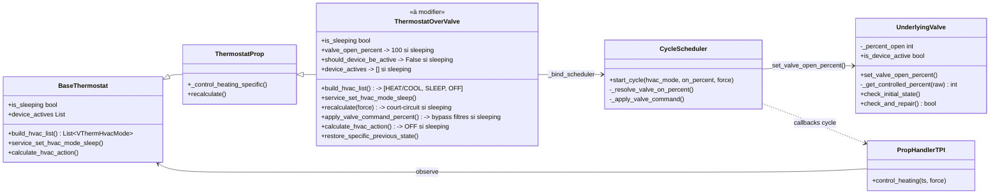

# Conception technique — Issue #1938 : Mode sommeil (Sleep Mode) pour `ThermostatOverValve`

- **Référence :** [jmcollin78/versatile_thermostat#1938](https://github.com/jmcollin78/versatile_thermostat/issues/1938) (ouverte ; `enhancement`, `Vote needed`, `P1`)
- **Spécification fonctionnelle :** `documentation/tech-docs/issue-1938-specification.md` (v1.0, brouillon soumis à validation)
- **Rapport de revue :** `documentation/tech-docs/issue-1938-review.md` (recommandation : retenir)
- **Statut :** Implémentation réalisée, revue de conception satisfaite et fonctionnement validé manuellement
- **Version :** 1.1
- **Date :** 15 septembre 2026
- **Propriétaire :** Équipe Versatile Thermostat

---

## 1. Objectif et périmètre

Étendre le mode sommeil (`VThermHvacMode_SLEEP`) aux VTherm de type `over_valve` (`ThermostatOverValve`), en réutilisant la machine d'états et les conventions d'affichage existantes, avec un chemin de commande spécifique au pipeline `CycleScheduler` / `UnderlyingValve` (sans toucher à `UnderlyingValveRegulation`).

Exigences couvertes : FR-001 à FR-016 de la spécification (voir § 10 pour la traçabilité complète).

## 2. Éléments existants vérifiés et dépendances

Tous les faits ci-dessous ont été vérifiés dans le code source au 15/09/2026.

| Élément                                                                               | Localisation                                                                                                                                                                                                        | Rôle dans la conception                                                                                                      |
| ------------------------------------------------------------------------------------- | ------------------------------------------------------------------------------------------------------------------------------------------------------------------------------------------------------------------- | ---------------------------------------------------------------------------------------------------------------------------- |
| `VThermHvacMode_SLEEP`, mappings                                                      | `vtherm_hvac_mode.py` l. 15-115                                                                                                                                                                                     | `SLEEP` existe déjà ; mappé vers `HVACMode.OFF` côté HA (l. 109)                                                             |
| `state_manager.py` `calculate_current_hvac_mode` l. ~130-191                          | Machine d'états générique                                                                                                                                                                                           | Gère déjà `SLEEP` : `hvac_off_reason = HVAC_OFF_REASON_SLEEP_MODE` (l. ~189), pas de modification nécessaire                 |
| `BaseThermostat.build_hvac_list` l. 921-926                                           | Liste de modes                                                                                                                                                                                                      | À surcharger dans `ThermostatOverValve`                                                                                      |
| `BaseThermostat.is_sleeping` l. 1445-1447                                             | Retourne `False` par défaut                                                                                                                                                                                         | À surcharger dans `ThermostatOverValve`                                                                                      |
| `BaseThermostat.service_set_hvac_mode_sleep` l. 2279-2291                             | Lève `NotImplementedError`                                                                                                                                                                                          | À surcharger dans `ThermostatOverValve`                                                                                      |
| `BaseThermostat.device_actives` / `nb_device_actives` l. 1063-1077                    | Comptage chaudière centrale (via `sensor.py` `NbActiveDeviceForBoilerSensor.calculate_nb_active_devices` l. ~865-925)                                                                                               | **Point de contradiction (voir § 9)** : se base sur `is_device_active` de chaque underlying                                  |
| `UnderlyingValve.is_device_active` (`underlyings.py` ~l. 1289-1296)                   | Compare `current_valve_opening` (ouverture *réelle*) à `_min_open`                                                                                                                                                  | Pendant le sommeil, la vanne est physiquement ouverte → retournerait `True` → comptage chaudière non voulu                   |
| `UnderlyingValve.should_device_be_active` (~l. 1284)                                  | Compare `_percent_open` (commande) à `_min_open`                                                                                                                                                                    | Idem pendant le sommeil                                                                                                      |
| `UnderlyingValve.set_valve_open_percent` (~l. 1336-1356)                              | Appelle `_get_controlled_percent(thermostat.valve_open_percent)` puis `send_percent_open()`                                                                                                                         | Point d'application de la conversion #1348 — réutilisable tel quel                                                           |
| `UnderlyingValve._get_controlled_percent` (~l. 1358-1374)                             | `calculate_opening_closing_degree` puis clamp min/max de l'entité `number`                                                                                                                                          | Conversion de la demande brute — réutilisable tel quel                                                                       |
| `UnderlyingValve.check_and_repair` (~l. 1376-1395)                                    | Renvoie `last_sent_opening_value` si l'entité diverge                                                                                                                                                               | Comportement à préserver pendant le sommeil                                                                                  |
| `UnderlyingValveRegulation.check_initial_state` (`underlyings.py` ~l. 1448-1502)      | Référence sommeil `over_climate` : force `_percent_open = 100` au démarrage si `is_sleeping`                                                                                                                        | Modèle à adapter (pas à réutiliser : cycle de vie différent)                                                                 |
| `CycleScheduler` (`cycle_scheduler.py`) l. 83-560                                     | Ordonnanceur : `start_cycle` → `_resolve_valve_on_percent` → `apply_valve_command_percent` (thermostat) → `_apply_valve_command` → `set_valve_open_percent` (chaque underlying)                                     | **Chemin d'exécution que le sommeil doit emprunter** (voir § 5)                                                              |
| `CycleScheduler._resolve_valve_on_percent` l. 161-177                                 | Délègue à `thermostat.apply_valve_command_percent`                                                                                                                                                                  | Passe par le filtre dpercent/period_min du thermostat — un 100 % brut doit être appliqué sans filtrage (voir § 5.3)          |
| `ThermostatOverValve.apply_valve_command_percent` (`thermostat_valve.py` ~l. 296-356) | Point de conversion unique TPI → `valve_open_percent` ; applique filtres `dpercent`/`period_min`                                                                                                                    | Principal point d'extension pour le 100 % pendant sommeil                                                                    |
| `ThermostatOverValve.valve_open_percent` (l. 62-67)                                   | Retourne 0 si `OFF`                                                                                                                                                                                                 | À adapter comme `thermostat_climate_valve.py` l. 373-377                                                                     |
| `ThermostatOverValve.recalculate` (l. ~242-294)                                       | Recalcul TPI → `apply_valve_command_percent`                                                                                                                                                                        | À court-circuiter pendant le sommeil                                                                                         |
| `prop_handler_tpi.py` `control_heating` l. ~330-390                                   | Si `OFF` → arrêt ; sinon `start_cycle(on_percent)`                                                                                                                                                                  | Le mode `SLEEP` n'est pas `OFF` interne → passe dans `start_cycle` avec le `on_percent` TPI → il faut offrir 100 % au chemin |
| `ThermostatOverClimateValve` (`thermostat_climate_valve.py`) l. 337-447               | Implémentation de référence : `build_hvac_list`, `is_sleeping`, `calculate_hvac_action`, `should_device_be_active`, `device_actives`, `service_set_hvac_mode_sleep`, `restore_specific_previous_state` (l. 160-165) | Modèle structurel à répliquer dans `ThermostatOverValve`                                                                     |
| Tests de référence : `tests/test_overclimate_valve.py` l. 597-777                     | Scénario `HEAT → SLEEP → HEAT` complet                                                                                                                                                                              | À transposer dans `tests/test_valve.py`                                                                                      |
| `tests/test_valve.py` l. 19-120                                                       | `over_valve` expose actuellement `HEAT`/`OFF`                                                                                                                                                                       | Non-régression à vérifier après ajout de `SLEEP`                                                                             |
| `services.yaml` l. ~132-140 ; `translations/` (10 fichiers)                           | Service restreint à `over_climate` valve                                                                                                                                                                            | À mettre à jour                                                                                                              |

## 3. Architecture et symboles touchés



**Symboles à modifier (dans `ThermostatOverValve` uniquement — `UnderlyingValveRegulation` et `ThermostatOverClimateValve` ne sont pas modifiés) :**

| Symbole                                                           | Type de changement                                                                                                                | Raison                                                                                                                                                                                                                                                                                                                                                                                                                                                                                                               |
| ----------------------------------------------------------------- | --------------------------------------------------------------------------------------------------------------------------------- | -------------------------------------------------------------------------------------------------------------------------------------------------------------------------------------------------------------------------------------------------------------------------------------------------------------------------------------------------------------------------------------------------------------------------------------------------------------------------------------------------------------------- |
| `build_hvac_list()`                                               | Override ajouté                                                                                                                   | FR-001/FR-002                                                                                                                                                                                                                                                                                                                                                                                                                                                                                                        |
| `valve_open_percent` (property)                                   | Override modifié                                                                                                                  | FR-008 — retourner 100 pendant sommeil (comme `thermostat_climate_valve.py` l. 373-377)                                                                                                                                                                                                                                                                                                                                                                                                                              |
| `recalculate(force)`                                              | Garde ajoutée en tête                                                                                                             | FR-008/BR-004 — ne pas recalculer TPI pendant sommeil (le cycle périodique `async_control_heating` continue de passer tous les `_cycle_min`)                                                                                                                                                                                                                                                                                                                                                                         |
| `apply_valve_command_percent(on_percent, force)`                  | Garde ajoutée : si `is_sleeping`, définir `_valve_open_percent = 100` directement et bypasser les filtres `dpercent`/`period_min` | FR-008/FR-009 — c'est le point où le 100 % brut est injecté ; conversion physique réalisée en aval par `UnderlyingValve._get_controlled_percent`                                                                                                                                                                                                                                                                                                                                                                     |
| `is_sleeping` (property)                                          | Override ajouté                                                                                                                   | FR-004                                                                                                                                                                                                                                                                                                                                                                                                                                                                                                               |
| `service_set_hvac_mode_sleep()`                                   | Override ajouté                                                                                                                   | FR-003                                                                                                                                                                                                                                                                                                                                                                                                                                                                                                               |
| `calculate_hvac_action()`                                         | Override ajouté                                                                                                                   | FR-006 — forcer `HVACAction.OFF` pendant sommeil                                                                                                                                                                                                                                                                                                                                                                                                                                                                     |
| `should_device_be_active` (property)                              | Override ajouté                                                                                                                   | FR-007/BR-009                                                                                                                                                                                                                                                                                                                                                                                                                                                                                                        |
| `device_actives` (property)                                       | Override ajouté                                                                                                                   | FR-007 — vider pendant sommeil                                                                                                                                                                                                                                                                                                                                                                                                                                                                                       |
| `is_device_active` (property)                                     | Override ajouté                                                                                                                   | Cohérence avec `device_actives`                                                                                                                                                                                                                                                                                                                                                                                                                                                                                      |
| `restore_specific_previous_state(old_state)`                      | Override ajouté                                                                                                                   | FR-012 — restaurer `hvac_off_reason = HVAC_OFF_REASON_SLEEP_MODE` si `is_sleeping` (le mode SLEEP lui-même est restauré génériquement par `get_my_previous_state` via `ATTR_CURRENT_STATE`/`from_ha_hvac_mode`)                                                                                                                                                                                                                                                                                                      |
| `async_added_to_hass()` / chemin d'appel de `check_initial_state` | À compléter                                                                                                                       | FR-012 — au démarrage, un VTherm endormi doit renvoyer la commande convertie aux vannes. `UnderlyingValve.check_initial_state` existe déjà (`underlyings.py` ~l. 1262-1286) ; il utilise `should_device_be_active` (que l'override mettra à `True` au niveau underlying car `_percent_open` vaut 100) et `send_percent_open`. Vérifier que le chemin d'appel au démarrage de `over_valve` appelle bien `check_initial_state` de chaque `UnderlyingValve` (point à confirmer en implémentation — voir § 9 hypothèses) |
| `incremente_energy()`                                             | Garde existante suffisante                                                                                                        | Vérifié : court-circuite déjà si `OFF`... **mais `SLEEP` n'est pas `VThermHvacMode_OFF`** → à sécuriser en ajoutant `is_sleeping` à la garde (H-004 : aucune énergie comptée pendant sommeil, car aucun équipement n'est physiquement actif du point de vue comptage)                                                                                                                                                                                                                                                |

**Aucune modification de :** `CycleScheduler` (le 100 % transite par `_resolve_valve_on_percent` → `apply_valve_command_percent` qui gère déjà la valeur), `UnderlyingValve` (la conversion `_get_controlled_percent(100)` s'applique telle quelle), `state_manager.py`, `thermostat_climate_valve.py`, `UnderlyingValveRegulation`, paramètres #1348 (`const.py`).

**Décision d'implémentation complémentaire — capteurs chaudière :** le rafraîchissement de la chaudière est explicite lors d'une transition vers ou depuis `SLEEP`, afin d'actualiser les capteurs même si la commande physique de vanne ne change pas. `TotalPowerActiveDeviceForBoilerSensor` ignore également explicitement les VTherm dont `is_sleeping` vaut `true`, ce qui garantit que leur puissance de cycle résiduelle ne participe pas au total de chaudière.

## 4. Modèle d'entités, données persistées et états

- Aucune nouvelle entité. Aucun nouvel attribut persistant au-delà de l'existant : l'état sommeil persiste *déjà* via la sérialisation générique de l'état courant (`base_thermostat.py` l. 671-679 : `ATTR_CURRENT_STATE` sérialise `hvac_mode`) — `SLEEP` étant un `VThermHvacMode` valide, il est restauré tel quel au redémarrage (`vtherm_hvac_mode.py` l. 82 : sérialisation JSON déjà gérée).
- Attributs exposés ( inchangés dans leur structure, valeurs changées pendant sommeil) : `is_sleeping` (déjà générique dans `update_custom_attributes`, vérifié), `valve_open_percent = 100`, `hvac_action = "off"`, `hvac_off_reason = "sleep_mode"`, `valve_command_percent` / `valve_command_by_valve` (commande convertie, exposés par `ThermostatOverValve.update_custom_attributes` si `_have_valve_control`).
- États et transitions (machine d'états existante, générique) : `requested_state.hvac_mode = SLEEP` → `current_state.hvac_mode = SLEEP` (branche finale `else` de `calculate_current_hvac_mode`, car aucune garde `central mode`/safety/fenêtre n'intercepte `SLEEP`) → affichage HA `off` (mapping `vtherm_hvac_mode.py` l. 109) → `hvac_off_reason = "sleep_mode"` (state_manager l. ~189-191).

## 5. Chemin d'exécution précis

### 5.1 HEAT/COOL → SLEEP (entrée)

```mermaid
sequenceDiagram
    participant U as Utilisateur/Service
    participant V as ThermostatOverValve
    participant SM as StateManager
    participant TPI as PropHandlerTPI.control_heating
    participant CS as CycleScheduler
    participant UV as UnderlyingValve

    U->>V: async_set_hvac_mode(SLEEP) / service_set_hvac_mode_sleep
    V->>SM: requested_state.set_hvac_mode(SLEEP)
    V->>SM: update_states() -> calculate_current_hvac_mode
    SM-->>V: current_state = SLEEP, hvac_off_reason = sleep_mode
    Note over TPI: cycle périodique async_control_heating (tous les cycle_min)
    TPI->>CS: start_cycle(SLEEP, on_percent_tpi, force=false)
    CS->>CS: _resolve_valve_on_percent(on_percent)
    CS->>V: apply_valve_command_percent(requested, force=false)
    Note over V: si is_sleeping: _valve_open_percent = 100 ; bypass filtres dpercent/period_min
    CS->>CS: _apply_valve_command(SLEEP, on, off)
    CS->>UV: set_valve_open_percent()
    UV->>UV: _get_controlled_percent(thermostat.valve_open_percent = 100)
    Note over UV: calculate_opening_closing_degree(100, min_od, max_cd, max_od, ot) puis clamp min/max entité
    UV->>UV: send_percent_open() -> number.set_value
    Note over V: hvac_action = OFF (override calculate_hvac_action)
```

Points de détail :
- `async_set_hvac_mode` (`base_thermostat.py` l. 1531-1543) ne fait que positionner la requested state et appeler `update_states` — aucun changement nécessaire ; la propagation physique de la commande 100 % resulte du **prochain cycle de régulation** (`async_control_heating`, planifié par `async_track_time_interval` dans `async_added_to_hass`, `thermostat_valve.py` l. 164-171) via `prop_handler_tpi.py` l. ~375 `start_cycle`. Pour la réactivité, l'équivalent du `async_control_heating(force=...)` post-changement de mode déjà présent dans `update_states`/`async_set_hvac_mode` (`base_thermostat.py` l. ~1703) déclenche ce cycle immédiatement — à vérifier en implémentation que l'événement de changement d'état déclenche bien `async_control_heating` (comportement standard de `BaseThermostat`, confirmé par le test de référence `over_climate` où la vanne reçoit 100 immédiatement).
- Le filtre `_resolve_valve_on_percent` applique `apply_valve_command_percent(force=force)` ; l'override sommeil doit donc intercepter **dans** `apply_valve_command_percent` (avant l'application des filtres `dpercent`/`period_min` — cf. ligne 322-354 : `dpercent` causerait sinon un échec de détection du delta 100-40 < dpercent et bloquerait la commande).

### 5.2 SLEEP → HEAT/COOL (sortie)

- `requested_state.set_hvac_mode(HEAT)` → `update_states` : `current_state = HEAT`, `hvac_off_reason` effacé (state_manager l. ~185-186).
- `recalculate()` redevient opérationnel : `_prop_algorithm.calculate(...)` déroule, `apply_valve_command_percent(on_percent_tpi)` reprend les filtres standard, `valve_open_percent` retrouve la valeur TPI (ex. 40 % dans le test de référence), `CycleScheduler._apply_valve_command` envoie la commande convertie.
- Consigne/préréglage restaurés par l'état persistant (aucune modification du sommeil ne les a touchés) : le mode sommeil n'écrit jamais `set_target_temperature`/`set_preset` — vérifié dans `thermostat_climate_valve.py` (aucune écriture de preset/consigne dans le chemin sommeil).

### 5.3 SLEEP → OFF

- `valve_open_percent` (override, calqué sur `thermostat_climate_valve.py` l. 373-377) : si `mode == OFF and not is_sleeping` → 0. Standard : `apply_valve_command_percent(0)` → `valve_open_percent = 0` → `CycleScheduler` → `UnderlyingValve.set_valve_open_percent()` → `_get_controlled_percent(0)` → commande de fermeture convertie (valeur min de l'entité ou `calculate_opening_closing_degree(0)`).

### 5.4 Redémarrage (FR-012)

- `get_my_previous_state` restaure `current_state` et `requested_state` avec `hvac_mode = SLEEP` (générique, l. 671-679, via `VThermState.from_dict`).
- `restore_specific_previous_state(old_state)` (à surcharger dans `ThermostatOverValve`, calqué sur `thermostat_climate_valve.py` l. 160-165) : si `is_sleeping`, `set_hvac_off_reason(HVAC_OFF_REASON_SLEEP_MODE)`.
- Au premier `async_control_heating` : `valve_open_percent` override retourne `_valve_open_percent` (requis : pas de valeur brute stockée — `_valve_open_percent` est réinitialisé à 0 dans `__init__` l. 40 ; voir question ouverte § 9 Q2). L'override `recalculate`/`apply_valve_command_percent` sommeil réinjecte 100 au premier cycle, et `UnderlyingValve.check_initial_state` (deuxième passerelle, `underlyings.py` l. 1262-1286) réaligne la vanne physique avec la commande courante après initialisation.

### 5.5 Multi-vannes (FR-013)

- `CycleScheduler._apply_valve_command` (l. 396-420) boucle déjà sur tous les `self._underlyings` : chaque `UnderlyingValve` reçoit son `set_valve_open_percent()` avec sa propre conversion (ses propres `min/max_opening_degree` par index — construits dans `post_init` de `ThermostatOverValve` l. 129-149). Aucune modification nécessaire.

### 5.6 AC mode (FR-002)

- `build_hvac_list` override : si `_ac_mode` → `[COOL, SLEEP, OFF]`, sinon `[HEAT, SLEEP, OFF]` — calqué sur `thermostat_climate_valve.py` l. 341-348. Le chemin de commande est identique (TPI traité de la même façon pour `COOL`, vérifié : `prop_algorithm.calculate` reçoit `vtherm_hvac_mode` et le TPI symétrique heat/cool s'applique pareillement).

## 6. Arithmétique de la commande pour `over_valve` (point critique demandé)

### 6.1 Existant vérifié

Le chemin `over_valve` défini : `CycleScheduler._apply_valve_command` → `UnderlyingValve.set_valve_open_percent()` (l. 1336-1356) → `_get_controlled_percent(self._thermostat.valve_open_percent)` (l. 1358-1374) qui fait :

```
si _min_opening_degree est None et _max_opening_degree est None :
    commande = clamp_sent_value(brut)               # = round(max(_min_open, min(brut/100*_max_open, _max_open)))
sinon :
    od, _ = calculate_opening_closing_degree(brut, min_od, max_cd, max_od, ot)
    commande = round(max(_min_open, min(od, _max_open)))
```

`calculate_opening_closing_degree` (`opening_degree_algorithm.py` l. 14-90) : avec brut=100, `bvop=1 ≥ ot` et `> 0` → interpolation entre `min_od` et `max_od` sur l'intervalle `[ot, 1]`.

### 6.2 Pendant le sommeil — demande brute 100 %

La demande brute (`valve_open_percent = 100`) passe par `_get_controlled_percent(100)` :

**Cas `max_opening_degrees = 70` (paramètres non neutres), `min_opening_degrees = 0`, `max_closing_degree = 100`, `opening_threshold_degree = 0`, bornes entité 0-100 :**

- `bvop = 1`, `ot = 0` : `slope = (0.70 - 0) / (1 - 0) = 0.70` ; `calculated_degree = 0 + 0.70 × (1 - 0) = 0.70` → `od = 70`.
- Clamp entité : `round(max(0, min(70, 100))) = 70`.

➡️ **Commande physique attendue : 70.** Cohérent avec AC-006 et avec le comportement `over_climate` (`UnderlyingValveRegulation.send_percent_open` applique la même `calculate_opening_closing_degree`). L'arithmétique est **identique** entre les deux chemins pour autant que `max_closing_degree` ne plafonne pas : avec brut=100, la branche `else` (`1 - max_cd`) n'est jamais prise.

**Cas paramètres neutres (`min_od = 0`, `max_od = 100`, `ot = 0`, `max_cd = 100`), bornes entité 0-100 :** od = 100, clamp = 100 → commande physique 100 (AC-005).

**Cas bornes entité max = 90 :** `clamp` final `min(100, 90) = 90` → commande physique 90 (AC-007). NB : `post_init` de `ThermostatOverValve` (l. 129-135) initialise déjà `max_opening_degree = default_max` (le `max` de l'entité `number`) si `CONF_MAX_OPENING_DEGREES` non fourni — donc `min_od=0, max_od=90` : avec brut=100, od = 90, clamp = 90. Cohérent.

**Conclusion :** l'arithmétique est **rigoureusement la même** que `over_climate` (OQ-002 résolu par la conception) : demande brute 100 % → `calculate_opening_closing_degree` → clamp min/max entité. La seule nuance vérifiée : `UnderlyingValve._get_controlled_percent` saute directement à `clamp_sent_value` si `min/max_opening_degree` sont `None` (cas sans paramètres #1348) — dans ce cas, brut=100 → `round(max(0, min(100/100 × 100, 100))) = 100` : commande physique 100. Aucune divergence.

## 7. Erreurs, annulations, reprise

| Cas                                                                                | Comportement attendu                                                                                                                                                                                        | Source/Mesure                               |
| ---------------------------------------------------------------------------------- | ----------------------------------------------------------------------------------------------------------------------------------------------------------------------------------------------------------- | ------------------------------------------- |
| Écriture `number.set_value` échoue                                                 | Chemin existant inchangé (`reset_thermostat`/retry standard de `send_value_to_number` — comportement hérité non modifié)                                                                                    | Constant (existant)                         |
| VTherm endormi au redémarrage                                                      | `restore_specific_previous_state` + premier `async_control_heating` réinjectent 100 % ; `check_initial_state` des vannes réaligne la physique                                                               | FR-012                                      |
| `check_and_repair` pendant sommeil                                                 | Conserve : renvoie `last_sent_opening_value` (commande convertie, ex. 70) si l'entité a divergé                                                                                                             | Existant, inchangé                          |
| Sélection `SLEEP` sur type non supporté (`over_switch`, `over_climate` sans valve) | `NotImplementedError` de la base — inchangé                                                                                                                                                                 | AC-016 ; ne pas lever dans la base          |
| Service sommeil sur VTherm verrouillé                                              | Cas présent dans `service_set_hvac_mode_sleep` (`lock_manager.check_is_locked`) — caler l'implementation `over_valve` sur le modèle `thermostat_climate_valve.py` l. 438-447 (avec garde `check_is_locked`) | Vérifié (`base_thermostat.py` l. 2280-2281) |
| Détection de panne de chauffage (`heating_failure`) pendant sommeil                | Hérité générique — comportement inchangé (le détecteur utilise la consigne et la temp. ; aucun impact du sommeil identifié)                                                                                 | Standard (existant)                         |

## 8. Sécurité, observabilité, contraintes opérationnelles

- Aucun nouveau secret, accès réseau, ni flux de données personnelles — inchangé.
- Journalisation : réutiliser `write_event_log` pour le service sommeil (`thermostat_climate_valve.py` l. 446 comme modèle).
- L'énergie n'est pas comptée pendant sommeil : `incremente_energy` doit être sécurisé (voir § 3).
- **Invariant chaudière centrale (BR-009) — analyse critique :** `BaseThermostat.device_actives` (l. 1063-1070) agrège `under.is_device_active` pour chaque underlying. `UnderlyingValve.is_device_active` compare l'**ouverture réelle** (`current_valve_opening > _min_open`) : pendant le sommeil la vanne est physiquement ouverte (ex. 100 ou 70) → retournerait `True`. **Si `device_actives` n'est pas surchargé, la chaudière centrale serait sollicitée — violation directe de BR-009.** L'override `device_actives` → `[]` pendant sommeil dans `ThermostatOverValve` est donc **obligatoire** : il porte seul l'invariant. Effet de bord : le même override rend `hvac_action` stable à `OFF` via l'override `calculate_hvac_action` (car `is_device_active` surchargé → `False` → base retournerait `IDLE` : d'où l'override explicite forcé à `OFF`, calqué sur `thermostat_climate_valve.py` l. 383-387).
- **Portée de l'invariant (renforcement FR-007/BR-009/AC-008.a) :** l'invariant vaut **quel que soit le profil de paramètres #1348** en vigueur (`min_opening_degrees`, `max_opening_degrees`, `max_closing_degree`, `opening_threshold_degree`) et quel que soit le degré d'ouverture physique réellement atteint par la vanne (y compris 70 avec `max_opening_degrees = 70` — cf. AC-006) : une vanne physiquement ouverte ne doit jamais être interprétée comme un équipement actif. L'override `device_actives` → `[]` opère au niveau du thermostat, en amont de toute interrogation des underlyings ; il est donc structurellement insensible au profil #1348 et à l'ouverture physique (le résultat est `[]` avant même que `UnderlyingValve.is_device_active` ne soit consulté). Cette insensibilité est **vérifiée par le test unitaire paramétré T-SLEEP-06 (matrice des profils #1348)**, qui constitue la preuve de l'invariant exigée par AC-008.a. Conséquence pour les capteurs : `sensor.py` `NbActiveDeviceForBoilerSensor.calculate_nb_active_devices` lit exclusivement `device_actives` et `power` de chaque VTherm — un `device_actives` vide implique mécaniquement zéro variation de `Nb device active for boiler` et de `Total power active device for boiler`, et aucune activation des conditions de régulation centrale associées.

## 9. Convergence avec la spécification

| Exigence                                      | Couverture par cette conception                                                                                                                                                        | Statut                                                     |
| --------------------------------------------- | -------------------------------------------------------------------------------------------------------------------------------------------------------------------------------------- | ---------------------------------------------------------- |
| FR-001, FR-002 (modes exposés)                | `build_hvac_list` override (§ 5.6)                                                                                                                                                     | ✔ Couvert                                                  |
| FR-003 (service)                              | `service_set_hvac_mode_sleep` override                                                                                                                                                 | ✔ Couvert                                                  |
| FR-004 (`is_sleeping`)                        | Override property                                                                                                                                                                      | ✔ Couvert                                                  |
| FR-005/FR-006 (affichage `off`, action `off`) | state_manager générique (vérifié l. ~189-191) + override `calculate_hvac_action`                                                                                                       | ✔ Couvert                                                  |
| FR-007 (comptage)                             | Overrides `device_actives`/`is_device_active`/`should_device_be_active` ; insensible au profil #1348 (§ 8), **vérifié par le test paramétré T-SLEEP-06 (matrice #1348, cf. AC-008.a)** | ✔ Couvert (renforcé)                                       |
| FR-008/FR-009 (100 % brut + conversion)       | Override `valve_open_percent` + `apply_valve_command_percent` ; conversion existante `_get_controlled_percent` (§ 6)                                                                   | ✔ Couvert ; OQ-002 résolu (arithmétique identique, max=70) |
| FR-010/FR-011 (sortie, conservation)          | Retour au chemin TPI standard ; aucune écriture de consigne/préréglage pendant sommeil                                                                                                 | ✔ Couvert                                                  |
| FR-012 (redémarrage)                          | `restore_specific_previous_state` + 1er cycle + `check_initial_state`                                                                                                                  | ✔ Couvert, voir hypothèse H-2                              |
| FR-013 (multi-vannes)                         | Boucle existante `CycleScheduler._apply_valve_command`                                                                                                                                 | ✔ Couvert, aucune modification                             |
| FR-014 (service description)                  | `services.yaml` + traductions                                                                                                                                                          | ✔ Couvert (doc, § 10)                                      |
| FR-015 (documentations 5 langues)             | Voir § 10                                                                                                                                                                              | ✔ Couvert (doc)                                            |
| FR-016 (non-modification #1348)               | Conception : aucun changement de `const.py`/paramètres/algorithmes #1348                                                                                                               | ✔ Couvert                                                  |

**Périmètre identique à la spécification : OUI** (aucune exigence ajoutée ni retirée).

**Contradictions bloquantes : NON.** Points de friction analysés et résolus :

1. **BR-007 « indépendance mécanisme » vs sous-classes `UnderlyingValve` :** la spécification interdit de réutiliser `UnderlyingValveRegulation`. La conception respecte strictement cette contrainte : toutes les modifications sont dans `ThermostatOverValve` ; `UnderlyingValve.set_valve_open_percent` / `_get_controlled_percent` sont **appelés** (pas modifiés) — c'est leur usage normal pour tout `over_valve`, donc conforme.
2. **BR-009 vs `UnderlyingValve.is_device_active` (contradiction potentielle identifiée) :** résolue par l'override `device_actives` au niveau thermostat (§ 8) — **aucune modification de `UnderlyingValve` requise**, pré servant la non-régression `over_climate` (BR-006).
3. **Propriété `valve_open_percent` — l'override `over_climate` (`thermostat_climate_valve.py` l. 373-377) conditionne à `OFF and not sleeping` :** cohérent si l'implémentation applique le modèle verbatim (`(mode == OFF and not is_sleeping) or _valve_open_percent is None → 0 ; sinon _valve_open_percent`). **Précision intégrée dans la spécification v1.0 (FR-008) :** `valve_open_percent` expose la demande brute de 100 % via la property publique, injectée dans le chemin de régulation existant — la property renvoie `_valve_open_percent`, la valeur 100 y étant injectée par `apply_valve_command_percent`, pas par la property elle-même. (Correction historiquement suggérée par la conception ; désormais actée.)
4. **H-001 (persistance consigne/préréglage) confirmée par le code :** aucun chemin sommeil (vérifié dans `thermostat_climate_valve.py`) n'écrit sur consigne/préréglage — hypothèse validée ; la spécification v1.0 la marque désormais « confirmée par l'analyse de conception ».
5. **OQ-003 (test direct chaudière) :** traité au plan de tests (§ 11, T-SLEEP-06/T-SLEEP-09).
6. **OQ-002 :** résolue conjointement — la spécification v1.0 (AC-006) fixe la commande physique à **70** avec `max_opening_degrees = 70` et bornes 0-100, valeur confirmée déterministe par l'analyse § 6.2.

**Corrections non bloquantes proposées : INTEGRÉES dans la spécification v1.0 (cycle de convergence 1).** Les deux ajustements formulés ci-dessous ont été repris par la spécification :
- FR-008 précise désormais que la demande brute 100 % est « exposée via la property publique `valve_open_percent` » et « injectée dans le chemin de régulation existant » — la nuance « exposée vs calculée par la property » est actée.
- AC-006 fixe explicitement la commande physique à **70** (bornes 0-100, `max_opening_degrees = 70`), consolidant l'analyse § 6.2.

**Renforcement de la spécification — cycle de convergence 2 (FR-007, BR-009, AC-008.a) : intégrées sans changement de conception.** La spécification impose désormais un **test unitaire paramétré (matrice)** couvrant tous les profils pertinents de paramètres #1348, incluant explicitement `max_opening_degrees = 70` avec vanne physiquement ouverte à 70, et vérifiant pour chaque profil : `device_actives = []`, `nb_device_actives = 0`, absence de variation des capteurs `Nb device active for boiler` / `Total power active device for boiler` et absence d'activation des conditions chaudière. Analyse de convergence :
1. **Fond couvert sans modification :** l'override `device_actives` → `[]` (§ 3, § 8, décision D3) est déterminé uniquement par `is_sleeping` au niveau du thermostat ; il ne dépend ni du profil #1348, ni de l'ouverture physique (l'agrégation des underlyings n'est pas consultée pendant sommeil). L'exigence renforcée est donc satisfaite par la conception existante.
2. **Forme de preuve à renforcer :** le renforcement porte sur la stratégie de tests — T-SLEEP-06 est transformé en test paramétré `@pytest.mark.parametrize` avec matrice explicite des profils #1348 (§ 11), rattaché à FR-007, BR-009, AC-008 et AC-008.a.
3. **Cas `max_opening_degrees = 70` / vanne ouverte à 70 :** cohérent avec AC-006 (commande physique = 70) et § 6.2 ; la vanne est physiquement ouverte à 70, ce qui est précisément la configuration où `UnderlyingValve.is_device_active` retournerait `True` sans l'override `device_actives` — le profil est donc inclus comme jeu de données explicite de la matrice, non implicitement.
4. **OQ-003 :** définitivement close — la spécification tranche l'existence du test (obligatoire, matriciel) ; la conception fixe son emplacement (`tests/test_valve.py`, T-SLEEP-06) et sa forme (paramétrisation, cf. § 11).

## 10. Étapes d'implémentation minimales (ordre recommandé)

1. `thermostat_valve.py` : override `build_hvac_list` (FR-001/002) + import `VThermHvacMode_SLEEP`.
2. Overrides `is_sleeping`, `service_set_hvac_mode_sleep` (garde `check_is_locked` comme la base) — FR-003/004.
3. Override `valve_open_percent` (modèle `thermostat_climate_valve.py` l. 373-377) — FR-008.
4. Garde sommeil dans `recalculate` et `apply_valve_command_percent` (bypass filtres, injection 100) — FR-008/009, § 5.1.
5. Overrides `calculate_hvac_action`, `should_device_be_active`, `device_actives`, `is_device_active` — FR-005/006/007, invariant chaudière (§ 8).
6. Override `restore_specific_previous_state` + sécurisation `incremente_energy` — FR-012, H-004.
7. Vérification du chemin de reprise au démarrage (`check_initial_state` bien invoqué pour les `UnderlyingValve` au start-up `over_valve` — à confirmer, hypothèse H-2) ; compléter si besoin par une réinjection dans le premier cycle.
8. `services.yaml` + `translations/*.json` (voir ci-dessous).
9. Tests (§ 11).
10. Documentations.

**Fichiers docs/traductions concernés (vérifiés existants) :**
- `custom_components/versatile_thermostat/services.yaml` l. ~132-140 (description service).
- `custom_components/versatile_thermostat/translations/` : `en.json`, `fr.json`, `de.json`, `cs.json`, `pl.json` (les 5 langues publiées ; les autres fichiers présents suivent la même clé si applicable).
- `documentation/en/over-valve.md`, `documentation/fr/over-valve.md`, `documentation/de/over-valve.md`, `documentation/cs/over-valve.md`, `documentation/pl/over-valve.md` (section mode sommeil).
- `documentation/*/reference.md` (5 langues) : `is_sleeping`, modes par type, service.
- `README-*.md`, `CONTRIBUTING-*.md` si y référence les modes disponibles par type.

## 11. Stratégie de tests et critères de vérification

Tests dans `tests/test_valve.py` (extension du module existant, mocks `number` disponibles — `create_and_register_mock_number` vérifié dans `tests/test_overclimate_valve.py` l. 641) :

| ID         | Test (calqué sur `test_over_climate_valve_vtherm_hvac_mode_sleep` l. 597-777)                                  | Critères / AC                                                                                                                                                                                |
| ---------- | -------------------------------------------------------------------------------------------------------------- | -------------------------------------------------------------------------------------------------------------------------------------------------------------------------------------------- |
| T-SLEEP-01 | `test_over_valve_hvac_modes` : liste exposée                                                                   | Modes `heat`, `sleep`, `off` (AC-001) ; non-régression `test_over_valve_full_start` existant (AC-014)                                                                                        |
| T-SLEEP-02 | idem avec `CONF_AC_MODE: True`                                                                                 | Modes `cool`, `sleep`, `off` (AC-002)                                                                                                                                                        |
| T-SLEEP-03 | Entrée en sommeil (via `async_set_hvac_mode(SLEEP)` puis via `service_set_hvac_mode_sleep`)                    | AC-003/004 : `is_sleeping`, `hvac_action = OFF`, `hvac_off_reason = sleep_mode`, consigne/préréglage inchangés, `valve_open_percent = 100`, vanne `number` native = 100 (paramètres neutres) |
| T-SLEEP-04 | Sommeil avec `CONF_MAX_OPENING_DEGREES: "70"`                                                                  | AC-005/006 : brut 100 ; commande physique = 70 ; `valve_command_percent = 70`                                                                                                                |
| T-SLEEP-05 | Sommeil avec entité `number` `max=90`                                                                          | AC-007 : commande physique = 90                                                                                                                                                              |
| T-SLEEP-06 | **Test unitaire paramétré (matrice) — absence d'impact chaudière pour tout profil #1348** (détails ci-dessous) | **AC-008.a**, AC-008, FR-007, BR-009 ; OQ-003 traité ; non-régression incluse via les profils neutres                                                                                        |
| T-SLEEP-07 | Sortie `SLEEP → HEAT`                                                                                          | AC-009 : consigne/préréglage conservés, `valve_open_percent` TPI (ex. 40), `hvac_action = HEATING`, `nb_device_actives ≥ 1`                                                                  |
| T-SLEEP-08 | Sortie `SLEEP → OFF`                                                                                           | AC-010 : vanne à sa borne minimale                                                                                                                                                           |
| T-SLEEP-09 | Multi-vannes (`CONF_UNDERLYING_LIST: [n1, n2]`, paramètres #1348 distincts par index)                          | AC-011 : chaque vanne reçoit sa commande convertie                                                                                                                                           |
| T-SLEEP-10 | Redémarrage/re-création du VTherm pendant sommeil (`create_thermostat` avec état restauré `SLEEP`)             | AC-012 : `is_sleeping`, `hvac_off_reason = sleep_mode`, vanne reçoit la commande convertie                                                                                                   |
| T-SLEEP-11 | Entrée/sortie sommeil avec paramètres #1348 non neutres                                                        | AC-013 : conversion après réveil conforme aux paramètres                                                                                                                                     |
| T-SLEEP-12 | Appel service sommeil sur VTherm VTherm `over_climate` sans régulation valve et `over_switch`                  | AC-016 : `HomeAssistantError` — test existant, non-régression                                                                                                                                |
| T-SLEEP-13 | Énergie pendant sommeil                                                                                        | Aucune incrémentation pendant sommeil, reprise après réveil                                                                                                                                  |

**T-SLEEP-06 — test paramétré (matrice #1348) : spécification précise.**

Test unique dans `tests/test_valve.py`, paramétré via `@pytest.mark.parametrize` avec les paramètres `min_opening_degrees`, `max_opening_degrees`, `max_closing_degree`, `opening_threshold_degree`, `valve_physical_opening` (ouverture physique attendue pendant sommeil, dérivée de la conversion § 6.2 — cf. T-SLEEP-04) et `entity_max` (borne max de l'entité `number`). Matrice de profils (chaque ligne = un jeu de données explicite) :

| Profil #               | `min_opening_degrees` | `max_opening_degrees` | `max_closing_degree` | `opening_threshold_degree` | Bornes entité | Ouverture physique attendue pendant sommeil | Justification / cas couvert                                                                                                                                                                                                               |
| ---------------------- | --------------------- | --------------------- | -------------------- | -------------------------- | ------------- | ------------------------------------------- | ----------------------------------------------------------------------------------------------------------------------------------------------------------------------------------------------------------------------------------------- |
| **P1** (neutre)        | 0                     | 100                   | 100                  | 0                          | 0-100         | 100                                         | Référence AC-005 ; cas neutre — démontre que même une vanne **totalement** ouverte n'est pas comptée active                                                                                                                               |
| **P2** (max=70)        | 0                     | **70**                | 100                  | 0                          | 0-100         | **70**                                      | **Cas explicitement exigé par AC-008.a / BR-009 / FR-007** : vanne physiquement ouverte à 70 — configuration où `UnderlyingValve.is_device_active` retournerait `True` sans l'override `device_actives` (§ 8) ; rejoint AC-006/T-SLEEP-04 |
| **P3** (min + max)     | 15                    | 70                    | 100                  | 0                          | 0-100         | 15 + (70-15)×1 = 70                         | Combinaison min/max non neutres ; ouverture physique 70 tout comme P2 mais via un profil différent — prouve l'insensibilité au profil                                                                                                     |
| **P4** (seuil)         | 0                     | 100                   | 100                  | 30                         | 0-100         | 100                                         | `opening_threshold_degree` non nul ; brut=100 ≥ seuil → zone d'ouverture pleine                                                                                                                                                           |
| **P5** (entité max=90) | 0                     | 100                   | 100                  | 0                          | 0-**90**      | 90                                          | Plafonnement par bornes de l'entité (AC-007) ; vanne physiquement ouverte à 90 (< 100) — même question de sécurité que P2, origine différente                                                                                             |
| **P6** (sans #1348)    | — (non fournis)       | —                     | —                    | —                          | 0-100         | 100                                         | Chemin `clamp_sent_value` direct (§ 6.1, cas `min/max_opening_degree` à `None`) — couvre les installations sans paramètres #1348                                                                                                          |

*Note : P3 avec brut=100 : `od = min_od + (max_od - min_od) × (1 - ot)/(1 - ot)` = 15 + (70-15)×1 = 70. Les ouvertures physiques attendues sont déterministes (§ 6.2) ; 70 et 90 sont choisies < 100 précisément parce que ce sont les ouvertures « partielles » risquant d'être interprétées à tort comme activité.*

**Scénario exécuté pour chaque profil de la matrice (identique au scénario AC-008.a) :**

1. **Pré-sommeil** : VTherm `over_valve` en `heat`, régulation TPI active (ex. 40 %) ; instantané (snapshot) des valeurs : état des capteurs `sensor.nb_active_device_for_boiler` (Nb device active for boiler) et `sensor.total_power_active_device_for_boiler` (Total power active device for boiler) ou, à défaut, calcul de `calculate_nb_active_devices` / agrégation équivalente ; `device_actives` (pré-sommeil, ex. 1 équipement actif — la vanne régule à 40 > min).
2. **Entrée en sommeil** : `async_set_hvac_mode(SLEEP)` (ou service) ; laisser passer un cycle de régulation complet.
3. **État physique** : vérifier que la vanne physique est bien ouverte à `valve_physical_opening` du profil (100 / 70 / 70 / 100 / 90 / 100) — prérequis du test : l'absence d'activité n'est **pas** due à une vanne fermée.
4. **Vérifications (le test échoue si un seul point manque, pour un seul profil)** :
   - `device_actives == []` et `nb_device_actives == 0` ;
   - `is_device_active` de chaque `UnderlyingValve` tel que vu par le thermostat (`should_device_be_active == False`, `hvac_action == "off"`) ;
   - **aucune variation** de `Nb device active for boiler` et de `Total power active device for boiler` par rapport à l'instant 1 (pré-sommeil) — y compris après `async_update`/refresh du capteur ;
   - **aucune activation** des conditions de la régulation centrale : la commande de la chaudière centrale (si une chaudière centrale est instanciée dans le harnais de test) reste dans l'état pré-sommeil ;
   - les paramètres #1348 du VTherm n'ont pas changé (garde AC-013, secondaire).
5. **Tear down** : retour en `heat` ; le comptage redevient conforme à la régulation TPI (reboucle sur T-SLEEP-07, non dupliqué).

**Rattachement du test aux critères** :

- **Raison d'être** : implémenter AC-008.a (le critère exige explicitement une forme *paramétrée/matrix* et le cas `max_opening_degrees = 70` ouvert à 70 en jeu de données explicite, pas implicite — profil P2) et démontrer FR-007 / BR-009 dans leur formulation renforcée.
- **Couverture des critères** : P2 (+P3/P5 par proximité) couvrent la clause « including one open below 100 » de BR-009 ; P1/P4/P6 prouvent que l'invariant n'est pas un hasard de plafonnement ; P5 isole la distinction « plafonnement #1348 » vs « plafonnement bornes entité » ; P6 couvre le chemin `clamp_sent_value` sans #1348.
- **Traçabilité** : AC-008, AC-008.a → FR-006, FR-007, BR-001, BR-009, AC-006 (P2) — cf. § 12.
- **Format** : un seul test paramétré (6 jeux de données), et non 6 tests séparés — garantit la symétrie exacte du scénario entre profils et la lisibilité de la matrice dans le rapport pytest ; les fixtures `number` mockées (une par profil, bornes configurées par `entity_max`) suivent le modèle `create_and_register_mock_number` vérifié.

Critères de vérification : suite `pytest tests/test_valve.py tests/test_overclimate_valve.py tests/test_sensor.py` verte ; `hassfest` (services.yaml/translations) ; revue des 5 langues docs.

## 12. Hypothèses, décisions, risques, questions ouvertes, traçabilité

**Hypothèses (à confirmer en implémentation) :**
- **H-2 :** le démarrage `over_valve` appelle bien `UnderlyingValve.check_initial_state` pour chaque vanne après initialisation (le chemin existe pour `UnderlyingValveRegulation` via `async_added_to_hass` ; pour `OverValve` c'est géré par `BaseThermostat.async_added_to_hass` — commentaire l. 652-655 : `_check_initial_state` différé après le « underlyings come to life »). Si le chemin n'était PAS atteint dans certains scénarios, un fallback simple : la réinjection 100 % au premier `async_control_heating` suffit (le cycle périodique couvre).
- **H-3 :** l'appel de `async_control_heating` est bien déclenché juste après `async_set_hvac_mode(SLEEP)` (vérifié dans `base_thermostat.py` l. ~1703 ; test de référence suffira à le prouver pour `over_valve`).

**Décisions de conception (traçables) :**
- D1 : le 100 % est injecté dans `apply_valve_command_percent` (pas dans `CycleScheduler` ni dans `UnderlyingValve`) — raison : point de convergence unique de toutes les commandes du type `over_valve`, respecte BR-007 et non-régression.
- D2 : les filtres `dpercent`/`period_min` sont bypassés pendant sommeil (sinon : brut 100 retenu à 40 si `dpercent > 60`, contredisant FR-008).
- D3 : `device_actives` est surchargé au niveau `ThermostatOverValve`, pas dans `UnderlyingValve` — raison : isoler l'impact au type concerné et ne pas perturber `over_climate` qui utilise aussi `UnderlyingValve` comme base.

**Risques :**
- R1 : si la spéc était implémentée sans l'override `device_actives`, la chaudière serait activée pendant sommeil (violation BR-009), **quel que soit le profil #1348** (§ 8). La conception l'impose explicitement (§ 8) et **T-SLEEP-06 en apporte désormais la preuve systématique profil par profil (matrice P1-P6), conformément à AC-008.a** — le profil `max_opening_degrees = 70` / vanne à 70 (P2) étant justement celui où `UnderlyingValve.is_device_active` (basé sur l'ouverture réelle) retournerait `True` sans l'override.
- R4 (nouveau, mineur) : complétude de la matrice T-SLEEP-06 — la matrice P1-P6 est un choix de conception censé couvrir les familles de profils (neutre, plafonné max, min+max, seuil, bornes entité, sans #1348) ; si la revue de spécification estime qu'un profil pertinent manque (ex. combinaison seuil + max), l'ajout d'un jeu de données est non cassant (simple ligne `parametrize` supplémentaire), le scénario étant invariant par profil.

**Questions ouvertes :**
- Q1 (reprise de OQ-001, non bloquante) : représentation `SLEEP` par la carte VTherm UI Card pour un type `over_valve` — hors périmètre de ce dépôt.
- Q2 (mineure, à confirmer en implémentation) : l'override `valve_open_percent` doit être calé sur `(vtherm_hvac_mode == OFF and not is_sleeping) or _valve_open_percent is None → 0` — si pendant sommeil la property doit retourner 100 même avant le premier cycle (vanse encore à l'ancienne position), pré-ré-injecter `_valve_open_percent = 100` dans `service_set_hvac_mode_sleep` en plus du path cyclique, pour éviter une fenêtre transitoire d'affichage à l'ancienne valeur.

**Traçabilité :** spécification → conception → tests :
- FR-001/002 → § 3 (`build_hvac_list`) → T-SLEEP-01/02
- FR-003/004 → § 3 (`service_set_hvac_mode_sleep`, `is_sleeping`) → T-SLEEP-03
- FR-005/006 → § 3 (`calculate_hvac_action`) + state_manager → T-SLEEP-03
- **FR-007 / BR-001 / BR-009 / AC-008 / AC-008.a** → **§ 3 (`device_actives`, `is_device_active`, `should_device_be_active`) + § 8 (invariant insensible au profil #1348) → T-SLEEP-06 (test unitaire paramétré, matrice P1-P6 des profils #1348 incluant `max_opening_degrees = 70` avec vanne physiquement ouverte à 70 — P2 ; vérifie `device_actives = []`, `nb_device_actives = 0`, absence de variation de `Nb device active for boiler` / `Total power active device for boiler` et absence d'activation des conditions chaudière, profil par profil)**
- FR-008/009/013 → § 5.1/5.5 + § 6 → T-SLEEP-03/04/05/09
- FR-010/011 → § 5.2 → T-SLEEP-07/08
- FR-012 → § 5.4 → T-SLEEP-10
- FR-014/015 → § 10 (services.yaml, translations, docs 5 langues) → revue documentaire

---

## 13. Confirmation de faisabilité et de cohérence

**Faisabilité : CONFIRMÉE.** Toutes les exigences FR-001 à FR-016 de la spécification sont satisfaisables par des overrides dans `ThermostatOverValve`, complétés par un rafraîchissement explicite des capteurs de chaudière pendant les transitions de sommeil. `state_manager.py`, `cycle_scheduler.py`, `underlyings.py`, `const.py` et l'implémentation `over_climate` restent inchangés. L'arithmétique de la commande (demande brute 100 % → `calculate_opening_closing_degree` → clamp bornes entité ; commande = 70 avec `max_opening_degrees = 70`) est déterministe et vérifiée dans le code. La contradiction potentielle avec `UnderlyingValve.is_device_active` (BR-009) est résolue de manière non intrusive (override `device_actives`), renforcée par l'exclusion explicite des VTherm endormis du total de puissance chaudière.

**Cohérence avec la spécification : CONFIRMÉE.** Périmètre identique, exigences toutes couvertes, aucune contradiction bloquante. Les deux corrections non bloquantes formulées au cycle précédent (§ 9) — précision terminologique sur FR-008 (demande brute exposée/injectée dans le chemin de régulation) et consolidation d'AC-006 (valeur attendue 70, déterministe) — **ont été intégrées dans la spécification v1.0** (cycle de convergence 1) : la conception et la spécification sont désormais alignées.

**Blocages : AUCUN.**

**Cohérence avec la spécification renforcée (FR-007, BR-009, AC-008.a — cycle de convergence 2) : CONFIRMÉE.** Le renforcement de la spécification porte sur la *forme de la preuve* (test paramétré matriciel, cas `max_opening_degrees = 70` explicite) et non sur le comportement attendu : la solution conçue (override `device_actives` au niveau `ThermostatOverValve`, décision D3) étant par construction insensible au profil #1348 et à l'ouverture physique, elle satisfait l'exigence renforcée sans aucune modification structurelle. Seule la stratégie de tests a été adaptée (T-SLEEP-06 → test paramétré, matrice P1-P6, § 11). **Faisabilité : CONFIRMÉE ; aucune contradiction, aucun blocage.**
