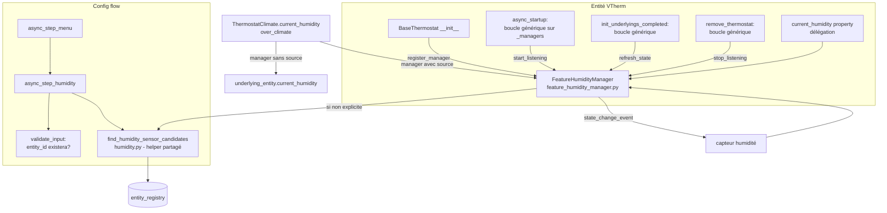

# Conception technique / Technical design — External Humidity Sensor Support (Issue #1964)

- **Fichier / File** : `documentation/tech-docs/issue-1964-design.md`
- **Issue** : [jmcollin78/versatile_thermostat#1964](https://github.com/jmcollin78/versatile_thermostat/issues/1964)
- **Version** : 1.1 · **Statut** : Draft (en attente de validation utilisateur / pending user validation)
- **Date** : 2026-09-17 · **Propriétaire / Owner** : Équipe Versatile Thermostat
- **Révision v1.1 (2026-09-17)** : refactor de la responsabilité humidité vers un `FeatureHumidityManager` dédié (décision utilisateur explicite). Aucune règle fonctionnelle changée. Voir §2 fait n°8, §3, §4.2, §5, §6, §7, §8, §10.
- **Documents amont / Upstream documents** :
  - Rapport de revue / Review report : `documentation/tech-docs/issue-1964-review.md`
  - Spécification fonctionnelle / Functional specification : `documentation/tech-docs/issue-1964-specification.md` (FR-001..FR-018, BR-001..BR-008, AC-1..AC-12, Q1..Q4)
- **Divergences avec la spécification / Deviations from the specification** : **aucune / none** (voir §10).
- **Portée du document** : conception détaillée, réalisable et testable. Aucun code n'est modifié dans le cadre de cette conception.

---

# Partie 1 — Version française

## 1. Objectif et périmètre de la conception

Cette conception traduit la spécification fonctionnelle `issue-1964-specification.md` en éléments techniques : composants affectés, modèle de données, algorithme de résolution de la source d'humidité, flux, gestion des erreurs, tests et traductions. Elle couvre l'intégralité des exigences FR-001..FR-018 et des règles BR-001..BR-008, et répond aux questions ouvertes Q1..Q4 (§9).

**Périmètre** : tous types de VTherm (`over_switch`, `over_valve`, `over_climate`) ; humidité purement exposée via l'attribut standard `current_humidity` ; résolution de source « capteur explicite > auto-détecté > entité climate sous-jacente (`over_climate`) > `None` » ; page « Humidité » facultative dans le config flow.

**Hors périmètre** (inchangé) : contrôle d'humidité, `async_set_humidity`/`set_humidity`, algorithmes de régulation, historique/statistiques, entité datetime.

## 2. Faits vérifiés dans le code (base de la conception)

Tous les faits ci-dessous ont été vérifiés sur la branche courante du dépôt :

1. **`current_humidity` n'existe que pour `over_climate`** : `thermostat_climate.py` l. 1159-1163 retourne `underlying_entity(0).current_humidity` (ou `None`). La classe de base `BaseThermostat` (héritée de `ClimateEntity`) n'override pas `current_humidity` → `None` pour `over_switch`/`over_valve` (comportement par défaut de `ClimateEntity` : `self._attr_current_humidity` s'il existe, sinon `None`).
2. **Ambiguïté `_humidity` levée (point d'attention du rapport §5)** : `_humidity` est l'humidité **cible**. Vérifications :
   - `base_thermostat.py` l. 136 et l. 412 : `self._humidity = None` en initialisation, aux côtés de `_fan_mode`, `_swing_mode` (attributs de mode cible).
   - `base_thermostat.py` l. 1589 : `async_set_humidity` (no-op dans la base) — humidité cible.
   - `thermostat_climate.py` l. 1233-1241 : `async_set_humidity` propagation aux underlyings via `set_humidity` puis `self._humidity = humidity` — **seul point d'écriture de `_humidity`**.
   - `underlyings.py` l. 808-820 : `set_humidity` appelle le service `climate.set_humidity` (SERVICE_SET_HUMIDITY) — humidité cible ; l. 987-989 : `current_humidity` lu via `get_underlying_attribute`.
   - **Conclusion** : `_humidity` n'est pas utilisé comme humidité courante dans le code actuel. La mention de `_humidity` dans les notes de l'auteur de l'issue est un choix d'implémentation local dangereux (conflit de sémantique avec l'humidité cible du ClimateEntity HA, où `_humidity` alimente `target_humidity`). **La conception interdit de réutiliser `_humidity` pour l'humidité courante.**
3. **Pattern température (modèle direct)** : `base_thermostat.py` `async_added_to_hass` (l. ~465) : listeners `async_track_state_change_event` sur `_temp_sensor_entity_id` et, si configuré, `_ext_temp_sensor_entity_id` ; lecture initiale dans `async_startup` (l. ~550-609) via `self.hass.states.get(...)` avec garde `STATE_UNAVAILABLE`/`STATE_UNKNOWN` ; gestionnaires `_async_update_temp` (~l. 2172) et `_async_update_ext_temp` (~l. 2193) : `float(state.state)`, rejet `math.isnan`/`math.isinf` via `ValueError`, log `_LOGGER.error` — la valeur précédente est **conservée** en cas d'échec de conversion (seul commentaire : « Unable to update temperature from sensor »).
4. **Config flow** : `async_step_menu` (l. 611) construit `menu_options` dynamiquement ; options conditionnelles (`window`, `motion`, `presence`, `valve_regulation`, `auto_start_stop`, `sync_device_internal_temp`) vs optionnelles inconditionnelles (`advanced`, `lock`). `generic_step` (l. 517) : validation → `merge_user_input` (les clés absentes du `user_input` mais présentes dans le schéma sont **retirées** de `self._infos` — point critique pour la désactivation) → affichage via `add_suggested_values_to_schema` (pré-remplissage depuis `self._infos`). `validate_input` (l. 202) vérifie l'existence d'état pour chaque entity_id d'une liste de clés `CONF_*` (rejet `UnknownEntity`). `check_config_complete` (l. 408) : l'humidité n'y figure pas (facultative → aucune modification nécessaire, FR-013).
5. **Schema de configuration** : `config_schema.py` — patterns `STEP_WINDOW_DATA_SCHEMA` (entity selector + flag central config), `STEP_MAIN_DATA_SCHEMA` (`EntitySelector` avec `domain=[SENSOR_DOMAIN, ...]`, suggéré par defaults).
6. **Tests** : `tests/commons.py` `send_temperature_change_event` (l. 1022) et variantes ; `tests/test_config_flow.py` (assertions `menu_options`) ; `tests/test_sensors.py` (patterns d'entités).
7. Le registre d'entités HA n'est pas utilisé aujourd'hui dans `base_thermostat.py` (aucune référence à `entity_registry` dans le fichier) — l'auto-détection sera le premier usage ; les API nécessaires (`homeassistant.helpers.entity_registry.async_get(hass)`, `er.async_get(entity_id)`, `er.entities_for_device_id(device_id)` — noms exacts à vérifier à l'implémentation, l'API `dr.entities_for_device`/`er` documentée est `RegistryEntry.device_id` + itération `er.entities.values()`) sont des API publiques stables de `homeassistant.helpers.entity_registry`.

## 3. Architecture — composants affectés et responsabilités

| Composant                                   | Responsabilité                                                                                                                                                                                                                                      | Nature de la modification                                                                                                                                                                                                                                                    |
| ------------------------------------------- | --------------------------------------------------------------------------------------------------------------------------------------------------------------------------------------------------------------------------------------------------- | ---------------------------------------------------------------------------------------------------------------------------------------------------------------------------------------------------------------------------------------------------------------------------- |
| `const.py`                                  | Nouvelles constantes de configuration                                                                                                                                                                                                               | Ajout `CONF_HUMIDITY_SENSOR`, `CONF_USE_HUMIDITY_FEATURE`                                                                                                                                                                                                                    |
| **`feature_humidity_manager.py` (nouveau)** | **Toute la responsabilité humidité** : résolution de la source (explicite/auto via `find_humidity_sensor_candidates`), état `_cur_humidity`, sensor id résolu, source, listener HA, lecture initiale, re-tentatives de démarrage et leur annulation | **Ajout** — classe `FeatureHumidityManager(BaseFeatureManager)` (§3.1)                                                                                                                                                                                                       |
| `config_schema.py`                          | Nouveau schéma d'étape `STEP_HUMIDITY_DATA_SCHEMA`                                                                                                                                                                                                  | Ajout (toggle + sélecteur, pré-remplissage via `generic_step`)                                                                                                                                                                                                               |
| `config_flow.py`                            | Option de menu « humidity » + `async_step_humidity` + validation entity_id                                                                                                                                                                          | Ajout (pattern `window`/`sync_device_internal_temp`)                                                                                                                                                                                                                         |
| `base_thermostat.py`                        | Instancie `FeatureHumidityManager` et l'enregistre via `register_manager` ; délègue l'accès à l'humidité au manager ; **ne contient plus** la logique de listener/retry/résolution spécifique humidité                                              | Ajout limité : instanciation + délégation (propriété `current_humidity`) ; **suppression** de `_resolve_humidity_source`/`_async_setup_humidity_sensor`/`_async_retry_humidity_source`/`_async_humidity_changed`/`_async_update_humidity` et des attributs humidité courante |
| `humidity.py`                               | Helper partagé `find_humidity_sensor_candidates(hass, temp_sensor_entity_id)` — utilisé par le manager **et** le config flow                                                                                                                        | Inchangé (déjà existant)                                                                                                                                                                                                                                                     |
| `thermostat_climate.py`                     | `current_humidity` conserve uniquement le repli underlying si le manager n'a pas de source                                                                                                                                                          | Override de la propriété existante (l. 1159-1164)                                                                                                                                                                                                                            |
| `underlyings.py`                            | Aucune modification (lecture `current_humidity` existante)                                                                                                                                                                                          | —                                                                                                                                                                                                                                                                            |
| `strings.json` + `translations/*.json`      | Clés UI menu + page + erreurs                                                                                                                                                                                                                       | Ajout                                                                                                                                                                                                                                                                        |
| `tests/`                                    | Tests unitaires (voir §8)                                                                                                                                                                                                                           | Ajout fichiers/cas                                                                                                                                                                                                                                                           |
| `documentation/{en,fr,de,cs,pl}`            | Doc utilisateur                                                                                                                                                                                                                                     | Mise à jour                                                                                                                                                                                                                                                                  |

### 3.1 `FeatureHumidityManager` (nouveau composant, v1.1)

Fichier `custom_components/versatile_thermostat/feature_humidity_manager.py`, classe `FeatureHumidityManager(BaseFeatureManager)`, modelé sur `FeaturePresenceManager` (§2 fait n°9). Le manager **possède** (états internes) :

- `_cur_humidity: float | None` — humidité courante (jamais persistée) ;
- `_humidity_sensor_entity_id: str | None` — source résolue (explicite ou auto-détectée) ;
- `_humidity_source: str` — `"explicit"` / `"auto"` / `"none"` ;
- `_humidity_listener_entity_id: str | None` — dédoublonnage du listener (re-résolution sans fuite de listener) ;
- `_humidity_retry_count: int` et `_cancel_humidity_retry: CALLBACK_TYPE | None` — re-tentatives de démarrage et leur annulation.

Cycle de vie héritant des conventions réelles de `BaseFeatureManager` :

| Méthode/propriété                | Comportement                                                                                                                                                                                                                                                                                                                                                                                                                                                                                                                                                   |
| -------------------------------- | -------------------------------------------------------------------------------------------------------------------------------------------------------------------------------------------------------------------------------------------------------------------------------------------------------------------------------------------------------------------------------------------------------------------------------------------------------------------------------------------------------------------------------------------------------------- |
| `__init__(vtherm, hass)`         | `super().__init__(vtherm, hass)` ; initialise tous les états ci-dessus à `None`/`"none"`/`0` (pattern `FeaturePresenceManager.__init__`)                                                                                                                                                                                                                                                                                                                                                                                                                       |
| `post_init(entry_infos)`         | Lit `CONF_HUMIDITY_SENSOR`/`CONF_USE_HUMIDITY_FEATURE` depuis `entry_infos` et mémorise le capteur de température du VTherm (`vtherm._temp_sensor_entity_id`) pour la détection ; remet `_humidity_retry_count = 0` ; **ne résout pas encore** la source (résolution différée à `start_listening`/`refresh_state`, quand `hass`/le registre sont disponibles, pattern des autres managers)                                                                                                                                                                     |
| `start_listening()`              | (1) `_resolve_humidity_source()` (algorithme §5) ; (2) si une source est résolue et différente du listener en place : `stop_listening()` puis `add_listener(async_track_state_change_event(self.hass, [sensor_entity_id], self._humidity_sensor_changed))` (pattern `FeaturePresenceManager.start_listening`) ; (3) si `source == "none"` et `_humidity_retry_count < 3` : planifie une re-tentative via `async_call_later(self.hass, 30, self._retry_humidity_source)` (délai et bornage 3 repris de l'implémentation en cours, FR-018) et mémorise le cancel |
| `stop_listening()`               | Hérité de `BaseFeatureManager.stop_listening()` (dépile `_active_listener`) **+** annulation de la re-tentative en cours (`_cancel_humidity_retry`) et remise à zéro — appelé automatiquement par `remove_thermostat` via la boucle sur `_managers`, ce qui remplace le nettoyage ad-hoc actuel dans `remove_thermostat`                                                                                                                                                                                                                                       |
| `refresh_state()`                | Lecture initiale : si une source est résolue, `hass.states.get(sensor_entity_id)` ; état présent et non `unavailable`/`unknown` → conversion via la shared `_async_update_humidity`-equivalente ; sinon `_cur_humidity = None` (retourne `True` si changement, convention `BaseFeatureManager`)                                                                                                                                                                                                                                                                |
| `is_configured`                  | `True` si une source est résolue (`_humidity_source != "none"`) — même sémantique que « la feature a de quoi travailler »                                                                                                                                                                                                                                                                                                                                                                                                                                      |
| `is_detected`                    | `True` si `is_configured` (une source explicite ou auto-détectée existe) ; aligné sur la sémantique de détection des autres managers                                                                                                                                                                                                                                                                                                                                                                                                                           |
| `humidity_sensor_changed(event)` | Reçoit `new_state` de l'événement ; états `unavailable`/`unknown`/conversion impossible → `_cur_humidity = None` + log (warning/error, sans répétition) ; `float()` avec rejet `NaN`/`Inf` (`ValueError`/`TypeError` attrapées) ; ensuite `_vtherm.update_custom_attributes()` + `_vtherm.async_write_ha_state()` — **pas de** `recalculate` (FR-012)                                                                                                                                                                                                          |

Propriétés d'exposition : `current_humidity -> float | None` (retourne `_cur_humidity` si `_humidity_source != "none"`, sinon `None`) et `humidity_source / humidity_sensor_entity_id` pour diagnostics et pour le repli `ThermostatClimate`.

`BaseThermostat` l'instancie dans `__init__` (pattern l. ~240 : `self._humidity_manager: FeatureHumidityManager = FeatureHumidityManager(self, hass)`) et l'enregistre via `self.register_manager(self._humidity_manager)` ; la boucle générique de `async_startup` (`await manager.start_listening()`) et celle de `init_underlyings_completed`/`remove_thermostat` pilotent tout le cycle — **aucun appel spécifique humidité ne reste dans `BaseThermostat`**. La propriété `BaseThermostat.current_humidity` devient une simple délégation : `return self._humidity_manager.current_humidity` (ou `None` si manager sans source). `ThermostatClimate` interroge le manager : si le manager n'a pas de source → repli `underlying_entity(0).current_humidity` (§7.2).

Diagramme de composants et flux :



## 4. Modèle de données

### 4.1 Clés de configuration (const.py)

```python
CONF_HUMIDITY_SENSOR = "humidity_sensor_entity_id"   # entity_id optionnel (reprend le nom proposé par l'auteur de l'issue)
CONF_USE_HUMIDITY_FEATURE = "use_humidity_feature"    # boolean, défaut None (= comportement historique, voir sémantique)
```

**Sémantique de `CONF_USE_HUMIDITY_FEATURE` (3 états, implémentés par présence/absence de clés comme le pattern `merge_user_input`)** :
- Clé absente de la config entry → jamais visité la page → **auto-détection active** (UC-1, « zéro configuration »).
- `False` → désactivation explicite (BR-005) : ni capteur, ni auto-détection.
- `True` (+ éventuellement `humidity_sensor_entity_id`) → capteur explicite ou, si absent du sélecteur, auto-détection.

Cela garantit FR-011/BR-002 : l'auto-détection couvre les configs existantes sans aucune action utilisateur, et la désactivation reste possible (BR-005) — le retrait de `humidity_sensor_entity_id` du `user_input` par `merge_user_input` déclenche une nouvelle détection (AC-9).

### 4.2 Attributs internes

L'ambiguïté constatée dans l'issue est levée ainsi. **Depuis la v1.1, les attributs d'humidité courante appartiennent au `FeatureHumidityManager`** (§3.1) et non plus à `BaseThermostat` :

| Attribut (porteur)                                                                         | Sémantique                                                                                                         | Existante ?      |
| ------------------------------------------------------------------------------------------ | ------------------------------------------------------------------------------------------------------------------ | ---------------- |
| `_humidity` (BaseThermostat)                                                               | **humidité cible** (target humidity, écrite par `async_set_humidity` uniquement) — **inchangé, ne pas réutiliser** | Oui              |
| `_cur_humidity` (FeatureHumidityManager)                                                   | **humidité courante** issue de la source résolue (capteur explicite/détecté) ; `None` si jamais de valeur valide   | Oui (à déplacer) |
| `_humidity_sensor_entity_id` (FeatureHumidityManager)                                      | entity_id de la source résolue (explicite ou auto-détecté) ; `None` sinon                                          | Oui (à déplacer) |
| `_humidity_source` (FeatureHumidityManager, enum str : `"explicit"` / `"auto"` / `"none"`) | provenance, pour diagnostic                                                                                        | Oui (à déplacer) |
| `_humidity_listener_entity_id` (FeatureHumidityManager)                                    | dernier entity_id écouté, pour éviter les listeners dupliqués lors des re-résolutions                              | Oui (à déplacer) |
| `_humidity_retry_count` / `_cancel_humidity_retry` (FeatureHumidityManager)                | compteur de re-tentatives et callback d'annulation (`async_call_later`, borné 3, délai 30 s)                       | Oui (à déplacer) |

On **n'utilise pas** `_attr_current_humidity` : la propriété `current_humidity` est surchargée dans `BaseThermostat` et `ThermostatClimate` (les hands off vers `_cur_humidity`), ce qui évite la double source de vérité et respecte le style du code existant (propriété plutôt qu'attribut "ha").

### 4.3 Persistance / reprise

- `_cur_humidity` n'est **pas** persisté dans `RestoreState`/`StateManager` : la lecture initiale au démarrage (§6) reprend la valeur courante du capteur ou de l'entité sous-jacente (AC-2 couvert par la lecture initiale, pas par un restore). Cohérent avec `_cur_temp`/`_cur_ext_temp` qui ne sont pas non plus restaurés mais relus.
- La source (`humidity_sensor_entity_id` explicite) est persistée dans la config entry (config flow `options`). L'auto-détection n'est **pas** persistée : elle est re-résolue à chaque démarrage/rechargement (BR-004, FR-011, AC-9) — cela évite toute divergence entre la config et un capteur auto-détecté devenu obsolète.
- Attribut de diagnostic : `humidity_sensor_entity_id` (la source résolue) exposé dans `extra_attributes`/attributs personnalisés (`update_custom_attributes`) pour observabilité — pas de nouvelle entité (pas d'entité datetime, décision D6 respectée).

## 5. Algorithme de résolution de la source

Point d'appel (v1.1) : méthode **privée du `FeatureHumidityManager`** `_resolve_humidity_source()` — `BaseThermostat` n'héberge plus cet algorithme. Appels :
1. en tête de `FeatureHumidityManager.start_listening()` (elle-même appelée par la boucle générique de `async_startup` sur `self._managers`) — FR-011 ;
2. à chaque re-tentative de démarrage (§6.4) et après rechargement de l'entité lors d'une modification de config (le reload repasse par `post_init` + `async_startup`) — AC-9.

L'algorithme lui-même est **inchangé** ; il s'appuie sur le helper partagé `find_humidity_sensor_candidates(hass, temp_sensor_entity_id)` de `humidity.py` (déjà existant, également utilisé par le config flow) :

```
FeatureHumidityManager._resolve_humidity_source():
    1. Si CONF_USE_HUMIDITY_FEATURE est explicitement False →
       _humidity_sensor_entity_id = None ; _humidity_source = "none"
       log info "humidity disabled by configuration" ; return
    2. Si humidity_sensor_entity_id (explicite) configuré →
       _humidity_sensor_entity_id = <explicite> ; _humidity_source = "explicit"
       log info "humidity sensor configured: <id>" ; return
    3. Auto-détection (aucun capteur explicite):
       candidats = find_humidity_sensor_candidates(hass, vtherm._temp_sensor_entity_id)
       a. si le capteur de température est absent / sans entrée registre / sans device → log info, source "none", return
       b. si candidats vide → log info "no humidity candidate", source "none", return
       c. si len(candidats)>1 → log info "multiples humidity candidates %s, taking first one"  (FR-005, AC-4)
       d. _humidity_sensor_entity_id = candidats[0] ; _humidity_source = "auto"
          log info "auto-detected humidity sensor: <id>"
    4. Le listener et la lecture initiale sont conformés par start_listening()/refresh_state() (§6).
```

API HA utilisées (stables, `homeassistant.helpers.entity_registry`, encapsulées dans `humidity.py`) : `async_get(hass)` (instance `EntityRegistry`), `RegistryEntry.device_id`, `RegistryEntry.domain`, `RegistryEntry.device_class`, itération de `registry.entities`. Domaine : constante `Platform.SENSOR` / `SENSOR_DOMAIN`. Le `device_class` est lu du **registre** (préférence), avec repli sur `hass.states.get(entity_id).attributes.get("device_class")` si l'entrée registre n'existe pas — FR-004/H1/H3.

Note : l'auto-détection n'ajoute **pas** de validation `device_class` pour le capteur explicite (l'utilisateur peut légitimement choisir un `input_number` ou un capteur sans device_class ; l'entity_id est valide dès lors qu'il expose un état numérique). C'est cohérent avec `CONF_TEMP_SENSOR` qui accepte plusieurs domaines.

## 6. Flux

### 6.1 Démarrage (lecture initiale + résolution)

```mermaid
sequenceDiagram
    participant HA
    participant BT as BaseThermostat
    participant HM as FeatureHumidityManager
    participant ER as EntityRegistry
    BT->>HM: __init__ + register_manager (pattern des autres managers)
    HA->>BT: async_added_to_hass
    HA->>BT: async_startup
    Note over BT: boucle génique: pour chaque manager de _managers
    BT->>HM: start_listening()
    HM->>HM: _resolve_humidity_source()
    opt auto-détection
        HM->>ER: find_humidity_sensor_candidates(hass, temp_sensor)
        HM->>HM: 1er candidat retenu + logs
    end
    opt source résolue (explicit|auto)
        HM->>HA: async_track_state_change_event(humidity_sensor_entity_id, humidity_sensor_changed)
    end
    opt re-tentative nécessaire (FR-018)
        HM->>HM: async_call_later(30 s, _retry_humidity_source) - max 3, cancel mémorisé
    end
    Note over BT: init_underlyings_completed: boucle générique refresh_state()
    BT->>HM: refresh_state()
    HM->>HA: hass.states.get(humidity_sensor_entity_id)
    opt état présent et non unavailable/unknown
        HM->>HM: _cur_humidity mis à jour ; vtherm.update_custom_attributes()
    end
```

- **Décision v1.1** : la résolution, l'écoute et la lecture initiale sont portées par le manager et déclenchées par les **boucles génériques existantes** (`async_startup` → `start_listening()`, `init_underlyings_completed` → `refresh_state()`). `BaseThermostat` ne contient **aucun** appel spécifique humidité dans son cycle de vie ; le nettoyage (listeners + re-tentative en cours) est assuré par `remove_thermostat` → boucle générique `stop_listening()`, **plus** annulation du `_cancel_humidity_retry` dans le `stop_listening()` surchargé du manager (remplace le nettoyage ad-hoc actuellement dans `remove_thermostat`).
- Pour `over_climate`, `current_humidity` (§7) n'a pas besoin de lecture du sous-jacent au démarrage : la propriété délègue à la demande.

### 6.2 Changement d'état du capteur (temps réel — AC-1, révisé FR-017)

`FeatureHumidityManager.humidity_sensor_changed(event)` (portage de `_async_humidity_changed`, pattern `_async_ext_temperature_changed`, avec propagation d'invalidité) :
1. `new_state = event.data.get("new_state")` ; si `None` ou état `STATE_UNAVAILABLE`/`STATE_UNKNOWN` → propagation de l'invalidité : `_cur_humidity = None` + log warning (sans répétition à chaque tick) ; pas de crash.
2. Conversion `float`, rejet `NaN`/`Inf` (ValueError attrapée, log `_LOGGER.error`, **`_cur_humidity = None`** — propagation, FR-017).
3. `_vtherm.update_custom_attributes()` + `_vtherm.async_write_ha_state()` (l'humidité n'affecte aucune régulation : **pas de** `recalculate`, FR-012).

### 6.3 Modification de configuration (AC-9)

Après validation de l'option « Humidité » : `merge_user_input` fusionne (ou retire, cf. §2 fait n°4) les clés dans la config entry → rechargement de l'entité → `post_init` + `async_startup` → nouvelle résolution. Cas :
- ajout d'un capteur explicite → `explicit` prime ;
- suppression du capteur explicite (le sélecteur est vidé) → la clé est retirée d'`_infos` → nouvelle auto-détection (BR-001) ;
- désactivation du toggle → `False` → repli (BR-005).

Le sélecteur pré-rempli : `generic_step` affiche le schéma avec `add_suggested_values_to_schema(data_schema, suggested_values=defaults)` où defaults = `self._infos` **+ résultat d'une auto-détection à la volée dans `async_step_humidity`** (le config flow n'a pas accès au `_humidity_sensor_entity_id` de l'entité ; il exécute le même algorithme §5 directement via `entity_registry.async_get(self.hass)` — code factorisé dans un helper partagé, par ex. `humidity.py`/`commons.py`, pour éviter la duplication entre config flow et entité). Suggested value du sélecteur = `humidity_sensor_entity_id` de `_infos` s'il existe, sinon capteur auto-détecté, sinon vide. + `description_placeholders` affichant le candidat détecté (explicite, pas de boîte noire — FR-007/AC-8).

### 6.4 États invalides et repli (AC-7, BR-003 — révisé par décisions utilisateur du 2026-09-17, FR-017/FR-018)

- Conversion impossible / `NaN` / `Inf` / état `unavailable`/`unknown` : l'invalidité est **propagée** — `_cur_humidity = None` (et non conservation de la dernière valeur valide), log (error pour conversion impossible, warning pour unavailable/unknown, sans répétition à chaque tick). `current_humidity` retourne `None`, valeur standard de l'API `ClimateEntity` (`float | None`) pour l'indéfini. Au retour d'une valeur valide, le capteur reprend immédiatement la priorité.
- Démarrage avec capteur/registry non encore chargés (ordre de chargement HA, cas fréquent — FR-018) : humidité `None` en attendant ; **re-tentatives différées bornées portées par le manager** : `async_call_later(hass, 30, _retry_humidity_source)` tant que `_humidity_source == "none"` et `_humidity_retry_count < 3` (délai 30 s, maximum 3 re-tentatives — repris de l'implémentation en cours) ; le cancel est mémorisé dans `_cancel_humidity_retry` et annulé dans `stop_listening()` (pas de callback orphelin après retrait de l'entité). Ce mécanisme complète le listener, qui se déclenche dès la première publication du capteur.
- `over_climate` sans source résolue : délégation à `underlying_entity(0).current_humidity` — comportement à l'identique de l'actuel (AC-6, FR-009).
- Jamais d'exception non gérée vers HA : tous les chemins sont dans des `try/except ValueError` (conversion) et gardes `None`/états.

### 6.5 Comportement `current_humidity` par type et par source (FR-002/FR-008/BR-008)

| Type                     | Source résolue        | Valeur                                                                                                 |
| ------------------------ | --------------------- | ------------------------------------------------------------------------------------------------------ |
| tous                     | explicit/auto         | `_cur_humidity` (ou `None` si jamais de valeur valide)                                                 |
| over_climate             | none (pas de capteur) | `underlying_entity(0).current_humidity` si underlying dispo, sinon `None` (comportement actuel strict) |
| over_switch / over_valve | none                  | `None` (comportement actuel strict, `ClimateEntity` par défaut)                                        |

## 7. Interfaces et contrats

### 7.1 `FeatureHumidityManager` (nouveau — v1.1) et `BaseThermostat` (délégation)

```python
# feature_humidity_manager.py
class FeatureHumidityManager(BaseFeatureManager):
    unrecorded_attributes = frozenset(
        {"is_humidity_configured", "humidity_manager"}
    )  # pattern des autres managers (ex. FeaturePresenceManager)

    def __init__(self, vtherm: Any, hass: HomeAssistant): ...
    def post_init(self, entry_infos: ConfigData): ...          # lit CONF_*, reset retry
    async def start_listening(self): ...                        # résolution + listener + retry
    def stop_listening(self) -> bool: ...                       # super() + cancel du retry
    async def refresh_state(self) -> bool: ...                  # lecture initiale
    @property
    def is_configured(self) -> bool: ...                         # source résolue
    @property
    def is_detected(self) -> bool: ...
    @property
    def current_humidity(self) -> float | None:
        """Humidité courante ; None si aucune source."""
        return self._cur_humidity if self._humidity_source != "none" else None
    @property
    def humidity_source(self) -> str: ...                       # "explicit" / "auto" / "none"
    @property
    def humidity_sensor_entity_id(self) -> str | None: ...
    async def humidity_sensor_changed(self, event: Event) -> None   # callback listener
    def _resolve_humidity_source(self) -> None                  # sync ; registre lu en mémoire
    async def _retry_humidity_source(self, _now) -> None        # re-tentative async_call_later
```

```python
# base_thermostat.py — délégation pure
@property
def current_humidity(self) -> float | None:
    """Humidité courante déléguée au FeatureHumidityManager."""
    return self._humidity_manager.current_humidity if self._humidity_manager else None
```

Contrats : `current_humidity` ne lève jamais ; `is_configured`/`is_detected` ne dépendent que de la source résolue ; `start_listening` est ré-entrante (re-résolution sans listener dupliqué, idémpotente grâce à `_humidity_listener_entity_id`) ; `stop_listening` annule listeners **et** re-tentative en cours.

### 7.2 `ThermostatClimate` (modification)

```python
@property
def current_humidity(self) -> float | None:   # override existant l. 1159
    if self._humidity_manager.humidity_source != "none":
        return self._humidity_manager.current_humidity
    if self.underlying_entity(0):
        return self.underlying_entity(0).current_humidity
    return None
```

`ThermostatClimate` ne conserve **que** le repli underlying pour `over_climate` quand le manager n'a pas de source. Aucune autre modification dans `thermostat_climate.py` ; `async_set_humidity` et `set_humidity` restent strictement inchangés (AC-10, FR-012).

### 7.3 Config flow / schéma

`STEP_HUMIDITY_DATA_SCHEMA` (config_schema.py) :
```python
STEP_HUMIDITY_DATA_SCHEMA = vol.Schema({
    vol.Required(CONF_USE_HUMIDITY_FEATURE, default=False): cv.boolean,
    vol.Optional(CONF_HUMIDITY_SENSOR): selector.EntitySelector(
        selector.EntitySelectorConfig(domain=[SENSOR_DOMAIN, INPUT_NUMBER_DOMAIN, NUMBER_DOMAIN]),
    ),
})
```
- `async_step_humidity` : pattern `async_step_sync_device_internal_temp` (`next_step = self.async_step_menu`, `generic_step("humidity", schema, user_input, next_step)`).
- `validate_input` : ajouter `CONF_HUMIDITY_SENSOR` à la liste des clés vérifiées (`hass.states.get(e) is None → UnknownEntity`) — FR-013/AC-8.
- `check_config_complete` : **aucune modification** (clé facultative) — FR-013.
- `async_step_menu` : `menu_options.append("humidity")` inconditionnellement (non central config), comme `advanced`/`lock` — Q3, §9.
- `strings.json` : `menu` option `humidity`, step `humidity` (title/description), placeholders `humidity_detected`, éventuellement `unknown_entity` réutilisé (déjà existant).

Contrats clés :
- idempotence : re-soumission de la page avec les mêmes valeurs ne change rien ;
- la page n'est jamais obligatoire pour finaliser le flow (pas de check_config_complete sur l'humidité) ;
- le toggle `False` retire bien `humidity_sensor_entity_id` (via `merge_user_input`) pour éviter une config hybride incohérente.

## 8. Stratégie de tests (mapping AC-1..AC-12)

Fichiers : `tests/test_humidity.py` (existant, à retargeter vers le manager), extensions de `tests/test_config_flow.py` (option, page, validation), extensions de `tests/test_sensors.py`/`test_thermostat_climate.py` si leurs harness sont plus adaptés. Mocks : entity registry via `MockConfigEntry`/statemock du pattern existant ; helper `send_humidity_change_event(hass, entity_id, humidity, date)` dans `tests/commons.py` (clone de `send_temperature_change_event`, `hass.bus.async_fire(EVENT_STATE_CHANGED, ...)`) + mock des états `hass.states.async_set`. **v1.1** : les tests existants `test_explicit_humidity_updates_and_invalid_states` (cible aujourd'hui `BaseThermostat._async_update_humidity`), `test_auto_detection_returns_no_candidate_without_temperature_registry_entry` et `test_auto_detection_returns_first_registry_humidity_candidate` (helpers `humidity.py`) sont **re-ciblés sur `FeatureHumidityManager`** (via l'instance du manager obtenue depuis le VTherm, ou une construction directe `FeatureHumidityManager(vtherm, hass)` modelée sur `tests/test_external_feature_manager.py`). De nouveaux tests couvrent le cycle de vie du manager (voir ci-dessous).

### 8.1 Tests spécifiques au composant `FeatureHumidityManager` (v1.1)

| Cas de test                                                                                                           | Vérification                                                                                                                                                                                                         |
| --------------------------------------------------------------------------------------------------------------------- | -------------------------------------------------------------------------------------------------------------------------------------------------------------------------------------------------------------------- |
| `test_humidity_manager_registered` : VTherm (3 types) créé avec une config humidité                                   | `_humidity_manager in vtherm._managers` ; instance de `FeatureHumidityManager` (pattern d'assertion de `tests/test_external_feature_manager.py` l. 129-131)                                                          |
| `test_humidity_manager_lifecycle_explicit` : `post_init` + `start_listening` + `refresh_state` avec capteur explicite | listener enregistré (state change → `_cur_humidity` mis à jour), lecture initiale effectuée, `is_configured`/`is_detected` vrais, `BaseThermostat.current_humidity` délègue bien                                     |
| `test_humidity_manager_lifecycle_auto` : idem avec mock registry 1 candidat                                           | source = `"auto"`, listener sur le candidat, logs                                                                                                                                                                    |
| `test_humidity_manager_retry` : source `"none"` au premier passage (registry vide) puis candidat au 2e                | `async_call_later` appelé (mock/patch), `_humidity_retry_count` incrémenté, borné à 3 ; après succès, plus de retry planifié ; `stop_listening()` annule le retry en cours (cancel appelé, pas de callback orphelin) |
| `test_humidity_manager_no_duplicates` : appels répétés de `start_listening` (reload) avec la même source              | un seul listener ré-enregistré (`stop_listening` d'abord, pattern presence), pas de fuite                                                                                                                            |
| `test_humidity_manager_removal` : `remove_thermostat` (ou `stop_listening` via la boucle générique)                   | listeners et re-tentatives nettoyés **sans** code spécifique humidité dans `BaseThermostat.remove_thermostat` (l'appel ad-hoc `_cancel_humidity_retry` est supprimé du cœur)                                         |
| `test_thermostat_climate_fallback` : over_climate, manager sans source                                                | `current_humidity` == underlying mocké ; manager avec source → valeur du manager (repli exclusivement dans `ThermostatClimate`)                                                                                      |

## 9. Réponses aux questions ouvertes Q1..Q4

- **Q1 — log de l'écrasement en `over_climate`** : **Non — aucun log** (décision utilisateur du 2026-09-17, tranche Q1). Si un capteur externe est explicitement spécifié, l'utilisateur sait ce qu'il a configuré ; aucun log info/warning de l'écrasement de l'humidité sous-jacente. *(Révision : le log info unique à la résolution initialement proposé est retiré.)*
- **Q2 — état invalide** : **propager l'invalidité** (décision utilisateur du 2026-09-17, tranche Q2) : ne **pas** conserver la dernière valeur valide. Le VTherm doit permettre de « forcer » une valeur invalide : retourner `None` (`ClimateEntity.current_humidity` est typée `float | None`); do not keep the last valid value (user decision of 2026-09-17, FR-017).
- **Q3 — option toujours au menu** : **Oui, faisable et conforme** (confirmé par décision utilisateur du 2026-09-17 — FR-016 : la page « features » ne change pas). `async_step_menu` contient déjà des options inconditionnelles (`advanced`, `lock`) : `menu_options.append("humidity")` lorsque non central config. Le toggle est sur la page elle-même. Aucune condition préalable n'est requise. (Ne pas l'ajouter à `STEP_FEATURES_DATA_SCHEMA` : le toggle vit dans la page dédiée, conformément à D5 — divergence évitée de justesse avec la spec, qui est cohérente.)
- **Q4 — re-tentative si capteur de température unavailable/sans appareil** : **réessayer plus tard** (décision utilisateur du 2026-09-17, tranche Q4 — révise la proposition initiale de « pas de re-tentative »). Au démarrage, le capteur d'humidité (ou le capteur de température utilisé pour la détection) est souvent momentanément indisponible selon l'ordre de chargement des capteurs par HA. Le système doit donc : (1) remonter l'humidité comme **indéfinie** (`None`) tant que le capteur n'est pas disponible ; (2) **re-tenter** la lecture/détection plus tard — mécanisme **v1.1 : re-tentatives portées par le `FeatureHumidityManager`** : `async_call_later` (délai 30 s, maximum 3, cancel dans `stop_listening()`), complémenté par le listener qui se déclenche dès que le capteur publie (FR-018/BR-004). Le cancel de la re-tentative est annulé dans `stop_listening()`. *(Révision : la re-résolution au seul prochain démarrage/rechargement est jugée insuffisante par l'utilisateur.)*

## 10. Risques résiduels, hypothèses, traçabilité

### Risques et points de vigilance d'implémentation

1. **`merge_user_input` retire les clés absentes** : la désactivation doit bien retirer `humidity_sensor_entity_id` d'`_infos` (test AC-9). Même mécanisme : vider le sélecteur + toggle off.
2. **`_humidity` vs `_cur_humidity`** : vigilance code review — ne jamais écrire l'humidité courante dans `_humidity` (conflit avec `async_set_humidity`/`target_humidity`). L'issue originale propose un stockage à 3 étages (`_cur_humidity`, `_attr_current_humidity`, `_humidity`) — la conception le réduit à `_cur_humidity` seul, **détenu par le `FeatureHumidityManager`** depuis la v1.1 (une seule source de vérité, hors du cœur `BaseThermostat`).
3. **Ordre du registre** : le « premier candidat dans l'ordre du registre » = ordre d'itération de `registry.entities` (dict d'insertion côté HA) — stabilité supposée H4 ; documenter dans le code que le choix est arbitraire mais déterministe.
4. **Auto-détection dans le config flow** : le helper `find_humidity_sensor_candidates` (`humidity.py`) est **partagé** entre le `FeatureHumidityManager` et le config flow (déjà le cas sur la branche) — pas de duplication d'algorithme ; tests à mocker différemment du runtime entité.
5. **`_attr_current_humidity` non utilisé** : vérifier qu'aucune classe ne définit `_attr_current_humidity` (résultat de l'inspection : non — seule la propriété de `thermostat_climate.py` existe).
6. **Traductions multiples** : 5 langues (en, fr, cs, de, pl) **toutes obligatoires** (décision utilisateur 2026-09-17) : `strings.json` + `translations/`, fichiers de documentation `documentation/{cs,de,en,fr,pl}/`, et paragraphe « Release 10.4 » de chaque README (`README{,-cs,-de,-fr,-pl}.md`) complété avec la fonctionnalité humidité.
7. **Listener non enregistré si page jamais visitée + détection** : la source résolue doit exister même sans visiter la page — les tests AC-3/AC-5 en configuration initiale le vérifient.
8. **Refactor `FeatureHumidityManager` (v1.1)** : portage de l'implémentation en cours (§2 fait n°8) vers le manager — points de vigilance : (a) l'appel ad-hoc `_cancel_humidity_retry` dans `BaseThermostat.remove_thermostat` doit être **supprimé** (remplacé par le `stop_listening()` surchargé du manager) ; (b) les re-tentatives ne doivent pas se cumuler avec un listener éventuel ; (c) `post_init` est sans doute appelé avant que `hass`/le registre ne soient pleinement disponibles — la résolution reste différée à `start_listening` (convention des autres managers) ; (d) retirer l'import `find_humidity_sensor_candidates` de `base_thermostat.py` (le manager et le config flow l'importent).

### Hypothèses de conception

- H3/H4 de la spécification reprises telles quelles (registre accessible, ordre stable).
- La modification de config via le flow recharge l'entité (testé par le pattern `test_config_flow.py` existant — reload implicitement couvert par les tests d'options).
- Le capteur auto-détecté n'est pas supprimable par l'utilisateur sans visiter la page (s'il apparaît et n'est pas souhaité, l'utilisateur désactive via la page) — accepté.

### Traçabilité exigences → conception

| Exigences      | Élément de conception                                                                                                       |
| -------------- | --------------------------------------------------------------------------------------------------------------------------- |
| FR-001         | §4.1 clés de config, §7.3 schéma, disponible tous types (§3)                                                                |
| FR-002         | §6.5 tableau, §7.1 propriétés `current_humidity` (manager) / §7.2 `ThermostatClimate`                                       |
| FR-003         | §6.1 lecture initiale (`refresh_state`) et listener (`start_listening`) portés par le manager (§3.1, §2 fait n°9)           |
| FR-004         | §5 algorithme étape 3 (via `find_humidity_sensor_candidates`, entity_registry, device_id, device_class humidity)            |
| FR-005         | §5 étape 3c (premier + log listant)                                                                                         |
| FR-006         | §5 étapes 3a/3b (log info, aucun candidat)                                                                                  |
| FR-007         | §7.3 (option menu dédiée, toggle, sélecteur pré-rempli via auto-détection à la volée)                                       |
| FR-008         | §5 (ordre de résolution) + §6.5 (tableau des priorités)                                                                     |
| FR-009         | §6.5 lignes « none » = comportement actuel strict (AC-6), repli isolé dans `ThermostatClimate` (§7.2)                       |
| FR-010         | §6.4 (gardes + try/except, propagation de l'invalidité via `None`)                                                          |
| FR-011         | §5 points d'appel (start_listening du manager au startup + reload sur modification de config)                               |
| FR-012         | §6.2 (pas de recalculate), §7.2 (async_set_humidity inchangé), AC-10                                                        |
| FR-013         | §7.3 (validate_input + check_config_complete inchangé)                                                                      |
| FR-014         | §8 impacts doc/traductions — couverture **complète CS, DE, EN, FR, PL** obligatoire                                         |
| FR-015         | §8 impacts doc/traductions — paragraphe « Release 10.4 » **de chaque README** (`README{,-cs,-de,-fr,-pl}.md`) complété      |
| FR-016         | §7.3 — `STEP_FEATURES_DATA_SCHEMA` **inchangé** ; option menu « Humidité » **inconditionnelle** ; toggle sur la page dédiée |
| FR-017         | §6.2/§6.4 — invalidité propagée (`None`), pas de conservation de la dernière valeur                                         |
| FR-018         | §6.4 — re-tentatives (30 s, max 3, cancel dans `stop_listening`) + `None` en attendant, portées par le manager (§3.1)       |
| BR-001..BR-008 | respectivement §6.3/§5, §5, §6.4/§9-Q2, §6.1/§6.4, §4.1 (sémantique 3 états), §6.5/AC-6, §6.2, §6.5 (par type)              |

### Impacts documentation

- `documentation/en/*.md` et `documentation/fr/*.md` : section configuration (nouvelle page « Humidité »), mention auto-détection. Idéalement `documentation/{cs,de,pl}` selon conventions.
- `custom_components/versatile_thermostat/strings.json` + `translations/{en,fr,cs,de,pl}.json` (**toutes les langues obligatoires**) : `menu.humidity`, `humidity.title`, `humidity.description`, `humidity.data.humidity_sensor_entity_id`, `humidity.data.use_humidity_feature`, `humidity.section.*` + placeholder `humidity_detected`.
- `documentation/{cs,de,en,fr,pl}/` : documentation de la fonctionnalité dans **toutes** les langues ; paragraphe « Release 10.4 » de **tous** les README (`README{,-cs,-de,-fr,-pl}.md`) complété avec la fonctionnalité « capteur d'humidité externe » (FR-015).

---

# Part 2 — English version

*Structurally identical to the French part above; the following is the abbreviated mirror for bilingual parity. The authoritative version is Part 1.*

## 1. Objective and scope

This design translates `issue-1964-specification.md` into technical elements covering FR-001..FR-018 and BR-001..BR-008, answering Q1..Q4 (§9 of Part 1). Scope: all VTherm types; humidity exposed through the standard `current_humidity` attribute; source resolution "explicit sensor > auto-detected > underlying climate entity (`over_climate`) > `None`"; optional "Humidité" config-flow page.

## 2. Verified code facts

1. `current_humidity` exists only in `thermostat_climate.py` (l. 1159) — underlying delegation; base class returns `None` for `over_switch`/`over_valve`.
2. `_humidity` ambiguity resolved: it is **target** humidity (only written by `async_set_humidity`, `thermostat_climate.py` l. 1240). The design **forbids** reusing it for current humidity; a new `_cur_humidity` attribute is introduced.
3. Temperature pattern (listeners in `async_added_to_hass`, initial read in `async_startup`, `_async_update_temp`/`_async_update_ext_temp` with NaN/Inf rejection and last-value retention) is the direct model.
4. Config flow: `async_step_menu` dynamic options; unconditional options exist (`advanced`, `lock`); `generic_step` + `merge_user_input` (absent keys are **removed** from `_infos`); `validate_input` entity-id existence checks; `check_config_complete` untouched (humidity optional).
5. Entity registry not yet used in `base_thermostat.py`; auto-detection will use `homeassistant.helpers.entity_registry.async_get(hass)`, `RegistryEntry.device_id/domain/device_class`, iteration of `registry.entities`.

## 3..7. Architecture, data model, algorithm, flows, contracts

Identical to Part 1 §3..§7 (see the French sections for Mermaid diagrams, tables, code snippets and the resolution algorithm). **v1.1 refactor (explicit user decision): humidity responsibility moves from `BaseThermostat` into a dedicated `FeatureHumidityManager`.**
- **New file `feature_humidity_manager.py`** — class `FeatureHumidityManager(BaseFeatureManager)`, modelled on `FeaturePresenceManager`. The manager **owns** `_cur_humidity`, the resolved sensor id, the source (`explicit`/`auto`/`none`), the HA listener (`async_track_state_change_event`, deduplicated via a stored listener entity id), the start-up retries (`async_call_later`, 30 s delay, max 3, cancellable — the cancel handle is cleared in `stop_listening()`).
- Lifecycle follows the real `BaseFeatureManager` conventions: `post_init` (reads `CONF_HUMIDITY_SENSOR`/`CONF_USE_HUMIDITY_FEATURE`, resets retry counter; resolution deferred), `start_listening` (resolve → register listener → schedule retry if `source == "none"`), `stop_listening` (inherited listener cleanup **plus** retry cancellation, invoked by the generic `remove_thermostat` loop), `refresh_state` (initial read via `hass.states.get` with `unavailable`/`unknown` guards), `is_configured` / `is_detected` (a source is resolved).
- `BaseThermostat` instantiates the manager in `__init__` and registers it via `register_manager` (`_managers`); it **no longer contains** any humidity-specific listener/retry/source logic (the ad-hoc `_cancel_humidity_retry` clean-up in `remove_thermostat` is removed). Its `current_humidity` property purely delegates to the manager.
- `ThermostatClimate` keeps **only** the `over_climate` underlying fallback (`underlying_entity(0).current_humidity`) when the manager has no source; `async_set_humidity`/`set_humidity` unchanged.
- `find_humidity_sensor_candidates` remains a shared helper (`humidity.py`) used by both the manager and the config flow.
- New keys: `CONF_HUMIDITY_SENSOR = "humidity_sensor_entity_id"`, `CONF_USE_HUMIDITY_FEATURE = "use_humidity_feature"` (3-state semantics: absent → auto-détection enabled; `False` → disabled; `True` → explicit sensor or detection); `_humidity` untouched (target).
- Sensor-change handling propagates invalidity (`_cur_humidity = None` on `unavailable`/`unknown`/`NaN`/`Inf`/non-numeric, logs without repetition), per user decisions of 2026-09-17 (FR-017/FR-018); no `recalculate`.
- Config flow: `STEP_HUMIDITY_DATA_SCHEMA`, `async_step_humidity`, unconditional `menu_options.append("humidity")`, `CONF_HUMIDITY_SENSOR` in `validate_input`; selector pre-filled via the shared helper; no change to `check_config_complete`.

## 8. Tests mapped to AC-1..AC-12

Same table as Part 1 §8. **v1.1**: the existing `tests/test_humidity.py` cases (`test_explicit_humidity_updates_and_invalid_states`, auto-detection helper cases) are **re-targeted to `FeatureHumidityManager`**, plus a new dedicated sub-suite (Part 1 §8.1): manager registration in `_managers` (assertion pattern of `tests/test_external_feature_manager.py`), explicit/auto lifecycle through `post_init`/`start_listening`/`refresh_state`, retry scheduling/cancellation and 3-attempt bound, no duplicate listeners on repeated `start_listening`, cleanup through the generic `remove_thermostat` loop (no humidity-specific code left in the core), `ThermostatClimate` underlying fallback only when the manager has no source. AC-10 non-regression via the full existing suite; AC-12 via inspection of `strings.json`, **all** `translations/{en,fr,cs,de,pl}.json`, documentation in all languages, and the "Release 10.4" paragraph in every README.

## 9. Answers to Q1..Q4

- **Q1**: No — no log at all when an external sensor is explicitly configured (user decision of 2026-09-17).
- **Q2**: Propagate the invalid value: return `None` (`ClimateEntity.current_humidity` is typed `float | None`); do not keep the last valid value (user decision of 2026-09-17, FR-017).
- **Q3**: Yes — technically feasible: unconditional menu option like `advanced`/`lock`, toggle lives on the page itself.
- **Q4**: Yes — retry later (user decision of 2026-09-17): report `None` while the sensor is not yet available; retries are **owned by the `FeatureHumidityManager`** (`async_call_later`, 30 s, max 3, cancelled in `stop_listening()`), complemented by the listener firing on first publication (FR-018/BR-004).

## 10. Risks, assumptions, traceability

See Part 1 §10: main residual risks — `merge_user_input` key removal on disable (tested by AC-9), strict separation `_humidity` (target) vs `_cur_humidity` (current, owned by the manager), deterministic-but-arbitrary first-candidate rule (assume H4), shared detection helper between manager and flow, **5-language translation sync (all mandatory: CS, DE, EN, FR, PL, including documentation files and the "Release 10.4" paragraph in every README — FR-014/FR-015)**, the three-state semantics of `use_humidity_feature`, and the v1.1 refactor vigilance points (remove the ad-hoc retry cancellation from `remove_thermostat`, no duplicated listeners, resolution deferred to `start_listening`, drop the `find_humidity_sensor_candidates` import from `base_thermostat.py`). Full requirement-to-design traceability table in Part 1 §10. Documentation impacts: **all of** `documentation/{cs,de,en,fr,pl}/`, `strings.json`, `translations/{en,fr,cs,de,pl}.json`, and `README{,-cs,-de,-fr,-pl}.md`.

**Deviations from the specification: none.** The v1.1 revision is a purely structural refactoring (responsibility moved into a `FeatureHumidityManager`) — **no functional rule changes** (Q1 no explicit-override log, invalidity = `None`, start-up retries, features page unchanged, unconditional humidity menu, etc. all preserved).
