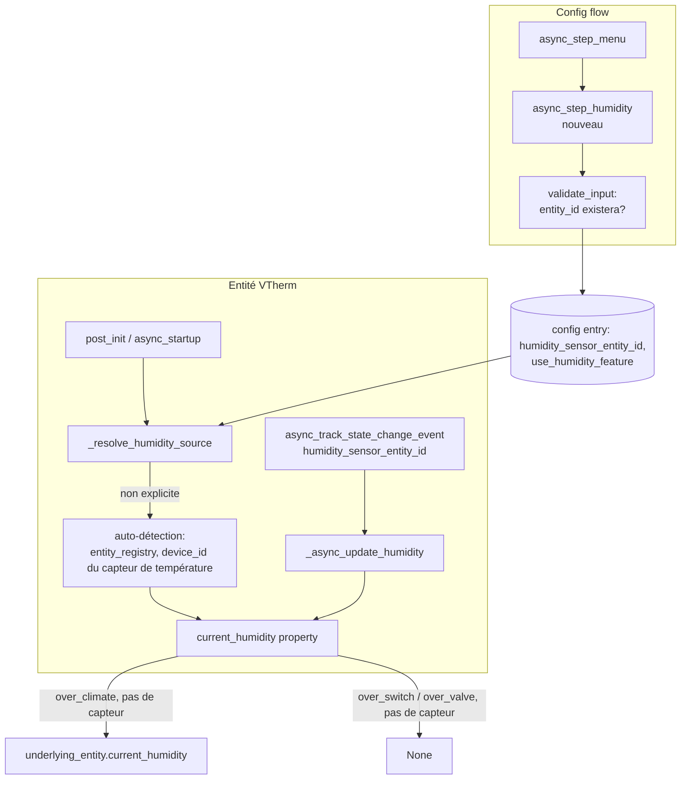
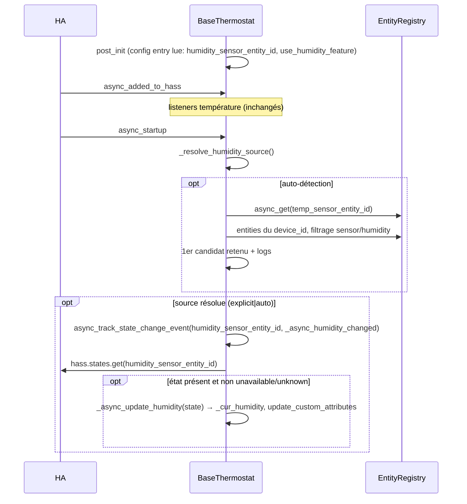

# Conception technique / Technical design — External Humidity Sensor Support (Issue #1964)

- **Fichier / File** : `documentation/tech-docs/issue-1964-design.md`
- **Issue** : [jmcollin78/versatile_thermostat#1964](https://github.com/jmcollin78/versatile_thermostat/issues/1964)
- **Version** : 1.0 · **Statut** : Draft (en attente de validation utilisateur / pending user validation)
- **Date** : 2026-09-17 · **Propriétaire / Owner** : Équipe Versatile Thermostat
- **Documents amont / Upstream documents** :
  - Rapport de revue / Review report : `documentation/tech-docs/issue-1964-review.md`
  - Spécification fonctionnelle / Functional specification : `documentation/tech-docs/issue-1964-specification.md` (FR-001..FR-018, BR-001..BR-008, AC-1..AC-12, Q1..Q4)
- **Divergences avec la spécification / Deviations from the specification** : **aucune / none** (voir §10).
- **Portée du document** : conception détaillée, réalisable et testable. Aucun code n'est modifié dans le cadre de cette conception.

---

# Partie 1 — Version française

## 1. Objectif et périmètre de la conception

Cette conception traduit la spécification fonctionnelle `issue-1964-specification.md` en éléments techniques : composants affectés, modèle de données, algorithme de résolution de la source d'humidité, flux, gestion des erreurs, tests et traductions. Elle couvre l'intégralité des exigences FR-001..FR-018 et des règles BR-001..BR-008, et répond aux questions ouvertes Q1..Q4 (§9).

**Périmètre** : tous types de VTherm (`over_switch`, `over_valve`, `over_climate`) ; humidité purement exposée via l'attribut standard `current_humidity` ; résolution de source « capteur explicite > auto-détecté > entité climate sous-jacente (`over_climate`) > `None` » ; page « Humidité » facultative dans le config flow.

**Hors périmètre** (inchangé) : contrôle d'humidité, `async_set_humidity`/`set_humidity`, algorithmes de régulation, historique/statistiques, entité datetime.

## 2. Faits vérifiés dans le code (base de la conception)

Tous les faits ci-dessous ont été vérifiés sur la branche courante du dépôt :

1. **`current_humidity` n'existe que pour `over_climate`** : `thermostat_climate.py` l. 1159-1163 retourne `underlying_entity(0).current_humidity` (ou `None`). La classe de base `BaseThermostat` (héritée de `ClimateEntity`) n'override pas `current_humidity` → `None` pour `over_switch`/`over_valve` (comportement par défaut de `ClimateEntity` : `self._attr_current_humidity` s'il existe, sinon `None`).
2. **Ambiguïté `_humidity` levée (point d'attention du rapport §5)** : `_humidity` est l'humidité **cible**. Vérifications :
   - `base_thermostat.py` l. 136 et l. 412 : `self._humidity = None` en initialisation, aux côtés de `_fan_mode`, `_swing_mode` (attributs de mode cible).
   - `base_thermostat.py` l. 1589 : `async_set_humidity` (no-op dans la base) — humidité cible.
   - `thermostat_climate.py` l. 1233-1241 : `async_set_humidity` propagation aux underlyings via `set_humidity` puis `self._humidity = humidity` — **seul point d'écriture de `_humidity`**.
   - `underlyings.py` l. 808-820 : `set_humidity` appelle le service `climate.set_humidity` (SERVICE_SET_HUMIDITY) — humidité cible ; l. 987-989 : `current_humidity` lu via `get_underlying_attribute`.
   - **Conclusion** : `_humidity` n'est pas utilisé comme humidité courante dans le code actuel. La mention de `_humidity` dans les notes de l'auteur de l'issue est un choix d'implémentation local dangereux (conflit de sémantique avec l'humidité cible du ClimateEntity HA, où `_humidity` alimente `target_humidity`). **La conception interdit de réutiliser `_humidity` pour l'humidité courante.**
3. **Pattern température (modèle direct)** : `base_thermostat.py` `async_added_to_hass` (l. ~465) : listeners `async_track_state_change_event` sur `_temp_sensor_entity_id` et, si configuré, `_ext_temp_sensor_entity_id` ; lecture initiale dans `async_startup` (l. ~550-609) via `self.hass.states.get(...)` avec garde `STATE_UNAVAILABLE`/`STATE_UNKNOWN` ; gestionnaires `_async_update_temp` (~l. 2172) et `_async_update_ext_temp` (~l. 2193) : `float(state.state)`, rejet `math.isnan`/`math.isinf` via `ValueError`, log `_LOGGER.error` — la valeur précédente est **conservée** en cas d'échec de conversion (seul commentaire : « Unable to update temperature from sensor »).
4. **Config flow** : `async_step_menu` (l. 611) construit `menu_options` dynamiquement ; options conditionnelles (`window`, `motion`, `presence`, `valve_regulation`, `auto_start_stop`, `sync_device_internal_temp`) vs optionnelles inconditionnelles (`advanced`, `lock`). `generic_step` (l. 517) : validation → `merge_user_input` (les clés absentes du `user_input` mais présentes dans le schéma sont **retirées** de `self._infos` — point critique pour la désactivation) → affichage via `add_suggested_values_to_schema` (pré-remplissage depuis `self._infos`). `validate_input` (l. 202) vérifie l'existence d'état pour chaque entity_id d'une liste de clés `CONF_*` (rejet `UnknownEntity`). `check_config_complete` (l. 408) : l'humidité n'y figure pas (facultative → aucune modification nécessaire, FR-013).
5. **Schema de configuration** : `config_schema.py` — patterns `STEP_WINDOW_DATA_SCHEMA` (entity selector + flag central config), `STEP_MAIN_DATA_SCHEMA` (`EntitySelector` avec `domain=[SENSOR_DOMAIN, ...]`, suggéré par defaults).
6. **Tests** : `tests/commons.py` `send_temperature_change_event` (l. 1022) et variantes ; `tests/test_config_flow.py` (assertions `menu_options`) ; `tests/test_sensors.py` (patterns d'entités).
7. Le registre d'entités HA n'est pas utilisé aujourd'hui dans `base_thermostat.py` (aucune référence à `entity_registry` dans le fichier) — l'auto-détection sera le premier usage ; les API nécessaires (`homeassistant.helpers.entity_registry.async_get(hass)`, `er.async_get(entity_id)`, `er.entities_for_device_id(device_id)` — noms exacts à vérifier à l'implémentation, l'API `dr.entities_for_device`/`er` documentée est `RegistryEntry.device_id` + itération `er.entities.values()`) sont des API publiques stables de `homeassistant.helpers.entity_registry`.

## 3. Architecture — composants affectés et responsabilités

| Composant                              | Responsabilité                                                                                               | Nature de la modification                                                                                                         |
| -------------------------------------- | ------------------------------------------------------------------------------------------------------------ | --------------------------------------------------------------------------------------------------------------------------------- |
| `const.py`                             | Nouvelles constantes de configuration                                                                        | Ajout `CONF_HUMIDITY_SENSOR`, `CONF_USE_HUMIDITY_FEATURE`                                                                         |
| `config_schema.py`                     | Nouveau schéma d'étape `STEP_HUMIDITY_DATA_SCHEMA`                                                           | Ajout (toggle + sélecteur, pré-remplissage via `generic_step`)                                                                    |
| `config_flow.py`                       | Option de menu « humidity » + `async_step_humidity` + validation entity_id                                   | Ajout (pattern `window`/`sync_device_internal_temp`)                                                                              |
| `base_thermostat.py`                   | Résolution de la source, listener, lecture initiale, stockage, exposition `current_humidity` pour tous types | Ajout (initialisation, listeners dans `async_added_to_hass`, lecture dans `async_startup`, nouvelle propriété `current_humidity`) |
| `thermostat_climate.py`                | `current_humidity` privilégie le capteur externe, repli underlying                                           | Override de la propriété existante (l. 1159)                                                                                      |
| `underlyings.py`                       | Aucune modification (lecture `current_humidity` existante)                                                   | —                                                                                                                                 |
| `strings.json` + `translations/*.json` | Clés UI menu + page + erreurs                                                                                | Ajout                                                                                                                             |
| `tests/`                               | Tests unitaires (voir §8)                                                                                    | Ajout fichiers/cas                                                                                                                |
| `documentation/{en,fr,de,cs,pl}`       | Doc utilisateur                                                                                              | Mise à jour                                                                                                                       |

Diagramme de composants et flux :



## 4. Modèle de données

### 4.1 Clés de configuration (const.py)

```python
CONF_HUMIDITY_SENSOR = "humidity_sensor_entity_id"   # entity_id optionnel (reprend le nom proposé par l'auteur de l'issue)
CONF_USE_HUMIDITY_FEATURE = "use_humidity_feature"    # boolean, défaut None (= comportement historique, voir sémantique)
```

**Sémantique de `CONF_USE_HUMIDITY_FEATURE` (3 états, implémentés par présence/absence de clés comme le pattern `merge_user_input`)** :
- Clé absente de la config entry → jamais visité la page → **auto-détection active** (UC-1, « zéro configuration »).
- `False` → désactivation explicite (BR-005) : ni capteur, ni auto-détection.
- `True` (+ éventuellement `humidity_sensor_entity_id`) → capteur explicite ou, si absent du sélecteur, auto-détection.

Cela garantit FR-011/BR-002 : l'auto-détection couvre les configs existantes sans aucune action utilisateur, et la désactivation reste possible (BR-005) — le retrait de `humidity_sensor_entity_id` du `user_input` par `merge_user_input` déclenche une nouvelle détection (AC-9).

### 4.2 Attributs internes (BaseThermostat)

L'ambiguïté constatée dans l'issue est levée ainsi :

| Attribut                                                                    | Sémantique                                                                                                        | Existante ? |
| --------------------------------------------------------------------------- | ----------------------------------------------------------------------------------------------------------------- | ----------- |
| `_humidity`                                                                 | **humidité cible** (target humidity, écrite par `async_set_humidity uniquement) — **inchangé, ne pas réutiliser** | Oui         |
| `_cur_humidity` (nouveau)                                                   | **humidité courante** issue de la source résolue (capteur explicite/détecté) ; `None` si jamais de valeur valide  | Non         |
| `_humidity_sensor_entity_id` (nouveau)                                      | entity_id de la source résolue (explicite ou auto-détecté) ; `None` sinon                                         | Non         |
| `_humidity_source` (nouveau, enum str : `"explicit"` / `"auto"` / `"none"`) | provenance, pour diagnostic et log Q1                                                                             | Non         |

On **n'utilise pas** `_attr_current_humidity` : la propriété `current_humidity` est surchargée dans `BaseThermostat` et `ThermostatClimate` (les hands off vers `_cur_humidity`), ce qui évite la double source de vérité et respecte le style du code existant (propriété plutôt qu'attribut "ha").

### 4.3 Persistance / reprise

- `_cur_humidity` n'est **pas** persisté dans `RestoreState`/`StateManager` : la lecture initiale au démarrage (§6) reprend la valeur courante du capteur ou de l'entité sous-jacente (AC-2 couvert par la lecture initiale, pas par un restore). Cohérent avec `_cur_temp`/`_cur_ext_temp` qui ne sont pas non plus restaurés mais relus.
- La source (`humidity_sensor_entity_id` explicite) est persistée dans la config entry (config flow `options`). L'auto-détection n'est **pas** persistée : elle est re-résolue à chaque démarrage/rechargement (BR-004, FR-011, AC-9) — cela évite toute divergence entre la config et un capteur auto-détecté devenu obsolète.
- Attribut de diagnostic : `humidity_sensor_entity_id` (la source résolue) exposé dans `extra_attributes`/attributs personnalisés (`update_custom_attributes`) pour observabilité — pas de nouvelle entité (pas d'entité datetime, décision D6 respectée).

## 5. Algorithme de résolution de la source

Point d'appel : nouvelle méthode `BaseThermostat._resolve_humidity_source()`, appelée :
1. dans `async_startup` (après la lecture de la config, avant la lecture initiale) — FR-011 ;
2. après `post_init` / rechargement de l'entité lors d'une modification de config (cannot: la modification de config déclenche un reload complet de l'entité, qui repasse par `post_init` + `async_startup`) — AC-9.

```
_resolve_humidity_source():
    1. Si CONF_USE_HUMIDITY_FEATURE est explicitement False →
       _humidity_sensor_entity_id = None ; _humidity_source = "none"
       log info "humidity disabled by configuration" ; return
    2. Si humidity_sensor_entity_id (explicite) configuré →
       _humidity_sensor_entity_id = <explicite> ; _humidity_source = "explicit"
       log info "humidity sensor configured: <id>" ; return
    3. Auto-détection (aucun capteur explicite):
       a. temp_sensor_entity_id = self._temp_sensor_entity_id ; si absent → log info, source "none", return
       b. registre =entity_registry.async_get(hass)
          entry = registre.async_get(temp_sensor_entity_id)
          si entry est None ou entry.device_id est None → log info "temperature sensor not attached to a device",
             source "none", return
       c. candidats = [e for e in registre.entities.values()
                       si e.device_id == entry.device_id
                       et e.domain == "sensor"
                       et e.device_class == "sensor.DeviceClass.HUMIDITY"]
          (équivalent : registre.entities_for_device(entry.device_id) filtré ensuite par domain/device_class)
       d. si candidats vide → log info "no humidity candidate on device <id>", source "none", return
       e. si len(candidats)>1 → log info "multiples humidity candidates %s, taking first one",
             [e.entity_id pour e dans candidats]  (FR-005, AC-4)
       f. _humidity_sensor_entity_id = candidats[0].entity_id ; _humidity_source = "auto"
          log info "auto-detected humidity sensor: <id>"
    4. Conformer le listener (§6) et effectuer la lecture initiale.
```

API HA utilisées (stables, `homeassistant.helpers.entity_registry`) : `async_get(hass)` (instance `EntityRegistry`), `RegistryEntry.device_id`, `RegistryEntry.domain`, `RegistryEntry.device_class`, itération de `registry.entities` (mapping entity_id → RegistryEntry) ou `async_get_entity_id` si nécessaire. Domaine : constante `Platform.SENSOR` / `SENSOR_DOMAIN`. Le `device_class` est lu du **registre** (préférence), avec repli sur `hass.states.get(entity_id).attributes.get("device_class")` si l'entrée registre n'existe pas (cas des entités sans registre, rare pour un capteur) — FR-004/H1/H3.

Note : l'auto-détection n'ajoute **pas** de `device_class` validation pour le capteur explicite (l'utilisateur peut légitimement choisir un `input_number` ou un capteur sans device_class ; l'entity_id est valide dès lors qu'il expose un état numérique). C'est cohérent avec `CONF_TEMP_SENSOR` qui accepte plusieurs domaines.

## 6. Flux

### 6.1 Démarrage (lecture initiale + résolution)



- Le listener d'humidité est enregistré dans `async_added_to_hass` **après résolution** (la résolution doit avoir eu lieu ; ordre garanti car `async_startup` est déclenchée par le VTherm API après `async_added_to_hass`). Deux options d'implémentation acceptables : (a) résolution dans `async_added_to_hass` avant l'enregistrement du listener ; (b) listener enregistré dans `async_startup` (le différé de `async_track_state_change_event` n'exige pas l'enregistrement dans `async_added_to_hass`). **Décision : (b)** — la résolution se fait en tête de `async_startup`, le listener suit immédiatement, avec `async_on_remove` comme pour les autres (cohérent avec le chargement dynamique des underlyings déjà différé au `startup`).
- Pour `over_climate`, `current_humidity` (§7) n'a pas besoin de lecture du sous-jacent au démarrage : la propriété délègue à la demande.

### 6.2 Changement d'état du capteur (temps réel — AC-1, révisé FR-017)

`_async_humidity_changed(event)` (pattern `_async_ext_temperature_changed`, avec propagation d'invalidité) :
1. `new_state = event.data.get("new_state")` ; si `None` ou état `STATE_UNAVAILABLE`/`STATE_UNKNOWN` → propagation de l'invalidité : `_cur_humidity = None` + log warning (sans répétition à chaque tick) ; pas de crash.
2. `_async_update_humidity(new_state)` : conversion `float`, rejet `NaN`/`Inf` (ValueError attrapée, log `_LOGGER.error`, **`_cur_humidity = None`** — propagation, FR-017).
3. `update_custom_attributes()` + `async_write_ha_state()` (l'humidité n'affecte aucune régulation : **pas de** `recalculate`, FR-012).

### 6.3 Modification de configuration (AC-9)

Après validation de l'option « Humidité » : `merge_user_input` fusionne (ou retire, cf. §2 fait n°4) les clés dans la config entry → rechargement de l'entité → `post_init` + `async_startup` → nouvelle résolution. Cas :
- ajout d'un capteur explicite → `explicit` prime ;
- suppression du capteur explicite (le sélecteur est vidé) → la clé est retirée d'`_infos` → nouvelle auto-détection (BR-001) ;
- désactivation du toggle → `False` → repli (BR-005).

Le sélecteur pré-rempli : `generic_step` affiche le schéma avec `add_suggested_values_to_schema(data_schema, suggested_values=defaults)` où defaults = `self._infos` **+ résultat d'une auto-détection à la volée dans `async_step_humidity`** (le config flow n'a pas accès au `_humidity_sensor_entity_id` de l'entité ; il exécute le même algorithme §5 directement via `entity_registry.async_get(self.hass)` — code factorisé dans un helper partagé, par ex. `humidity.py`/`commons.py`, pour éviter la duplication entre config flow et entité). Suggested value du sélecteur = `humidity_sensor_entity_id` de `_infos` s'il existe, sinon capteur auto-détecté, sinon vide. + `description_placeholders` affichant le candidat détecté (explicite, pas de boîte noire — FR-007/AC-8).

### 6.4 États invalides et repli (AC-7, BR-003 — révisé par décisions utilisateur du 2026-09-17, FR-017/FR-018)

- Conversion impossible / `NaN` / `Inf` / état `unavailable`/`unknown` : l'invalidité est **propagée** — `_cur_humidity = None` (et non conservation de la dernière valeur valide), log (error pour conversion impossible, warning pour unavailable/unknown, sans répétition à chaque tick). `current_humidity` retourne `None`, valeur standard de l'API `ClimateEntity` (`float | None`) pour l'indéfini. Au retour d'une valeur valide, le capteur reprend immédiatement la priorité.
- Démarrage avec capteur/registry non encore chargés (ordre de chargement HA, cas fréquent — FR-018) : humidité `None` en attendant ; re-tentatives plus tard (listener déjà en place qui se déclenche à la première publication du capteur, et/ou re-tentative différée bornée au démarrage, ex. `async_call_later`).
- `over_climate` sans source résolue : délégation à `underlying_entity(0).current_humidity` — comportement à l'identique de l'actuel (AC-6, FR-009).
- Jamais d'exception non gérée vers HA : tous les chemins sont dans des `try/except ValueError` (conversion) et gardes `None`/états.

### 6.5 Comportement `current_humidity` par type et par source (FR-002/FR-008/BR-008)

| Type                     | Source résolue        | Valeur                                                                                                 |
| ------------------------ | --------------------- | ------------------------------------------------------------------------------------------------------ |
| tous                     | explicit/auto         | `_cur_humidity` (ou `None` si jamais de valeur valide)                                                 |
| over_climate             | none (pas de capteur) | `underlying_entity(0).current_humidity` si underlying dispo, sinon `None` (comportement actuel strict) |
| over_switch / over_valve | none                  | `None` (comportement actuel strict, `ClimateEntity` par défaut)                                        |

## 7. Interfaces et contrats

### 7.1 `BaseThermostat` (nouveau)

```python
@property
def current_humidity(self) -> float | None:
    """Humidité courante ; None si aucune source."""
    return self._cur_humidity if self._humidity_source != "none" else None

# listeners privés :
async def _async_humidity_changed(self, event: Event) -> None
async def _async_update_humidity(self, state: State) -> None
def _resolve_humidity_source(self) -> None   # helper registre potentiellement async (async_get est sync)
```

(Le registre d'entités `entity_registry.async_get(hass)` est synchrone → `_resolve_humidity_source` reste une méthode sync appelée depuis un contexte async, sans I/O bloquante — la lecture registre est en mémoire.)

### 7.2 `ThermostatClimate` (modification)

```python
@property
def current_humidity(self) -> float | None:   # override existant l. 1159
    if self._humidity_source != "none":
        return self._cur_humidity
    if self.underlying_entity(0):
        return self.underlying_entity(0).current_humidity
    return None
```

Aucune autre modification dans `thermostat_climate.py` ; `async_set_humidity` et `set_humidity` restent strictement inchangés (AC-10, FR-012).

### 7.3 Config flow / schéma

`STEP_HUMIDITY_DATA_SCHEMA` (config_schema.py) :
```python
STEP_HUMIDITY_DATA_SCHEMA = vol.Schema({
    vol.Required(CONF_USE_HUMIDITY_FEATURE, default=False): cv.boolean,
    vol.Optional(CONF_HUMIDITY_SENSOR): selector.EntitySelector(
        selector.EntitySelectorConfig(domain=[SENSOR_DOMAIN, INPUT_NUMBER_DOMAIN, NUMBER_DOMAIN]),
    ),
})
```
- `async_step_humidity` : pattern `async_step_sync_device_internal_temp` (`next_step = self.async_step_menu`, `generic_step("humidity", schema, user_input, next_step)`).
- `validate_input` : ajouter `CONF_HUMIDITY_SENSOR` à la liste des clés vérifiées (`hass.states.get(e) is None → UnknownEntity`) — FR-013/AC-8.
- `check_config_complete` : **aucune modification** (clé facultative) — FR-013.
- `async_step_menu` : `menu_options.append("humidity")` inconditionnellement (non central config), comme `advanced`/`lock` — Q3, §9.
- `strings.json` : `menu` option `humidity`, step `humidity` (title/description), placeholders `humidity_detected`, éventuellement `unknown_entity` réutilisé (déjà existant).

Contrats clés :
- idempotence : re-soumission de la page avec les mêmes valeurs ne change rien ;
- la page n'est jamais obligatoire pour finaliser le flow (pas de check_config_complete sur l'humidité) ;
- le toggle `False` retire bien `humidity_sensor_entity_id` (via `merge_user_input`) pour éviter une config hybride incohérente.

## 8. Stratégie de tests (mapping AC-1..AC-12)

Fichiers : `tests/test_humidity.py` (nouveau — entité & runtime), extensions de `tests/test_config_flow.py` (option, page, validation), extensions de `tests/test_sensors.py`/`test_thermostat_climate.py` si leurs harness sont plus adaptés. Mocks : entity registry via `MockConfigEntry`/statemock du pattern existant ; helper `send_humidity_change_event(hass, entity_id, humidity, date)` dans `tests/commons.py` (clone de `send_temperature_change_event`, `hass.bus.async_fire(EVENT_STATE_CHANGED, ...)`) + mock des états `hass.states.async_set`.

| AC    | Cas de test (fichier)                                                                                                                                                                                                                                                                                                                                                                           |
| ----- | ----------------------------------------------------------------------------------------------------------------------------------------------------------------------------------------------------------------------------------------------------------------------------------------------------------------------------------------------------------------------------------------------- |
| AC-1  | `test_humidity.py` : VTherm over_climate/over_switch/over_valve avec `humidity_sensor_entity_id` configuré → lecture initiale + `send_humidity_change_event` → `current_humidity` suit                                                                                                                                                                                                          |
| AC-2  | `test_humidity.py` : reload de l'entité (`async_startup` re-joué / re-création de l'entité) → valeur présente sans événement                                                                                                                                                                                                                                                                    |
| AC-3  | `test_humidity.py` : mock registry avec 1 capteur humidity sur le device du capteur de température → détecté + log info (assert via `caplog`)                                                                                                                                                                                                                                                   |
| AC-4  | idem avec 2-3 candidats → premier retenu (ordre d'insertion du mock registry) + log listant                                                                                                                                                                                                                                                                                                     |
| AC-5  | idem avec 0 candidat → source none + log info, pas d'erreur                                                                                                                                                                                                                                                                                                                                     |
| AC-6  | `test_humidity.py` : over_climate sans capteur sans candidat → `current_humidity` == `underlying.current_humidity` mocké ; over_switch/over_valve → `None` ; aucun log d'erreur                                                                                                                                                                                                                 |
| AC-7  | `test_humidity.py` : événements `unavailable`, `unknown`, `"NaN"`, `"Inf"`, `"abc"` → pas d'exception, `current_humidity` devient **`None`** (invalidité propagée, pas de conservation de l'ancienne valeur — FR-017/BR-003) ; retour à la normale dès valeur valide ; au démarrage avec capteur non chargé → `None` puis valeur après re-tentative réussie (FR-018)                            |
| AC-8  | `test_config_flow.py` : `"humidity" in menu_options` ; sélection → `_infos` correctes ; entity_id inexistant → erreur `unknown_entity` ; sélecteur pré-rempli avec le détecté (mock registry dans le flow) ; finalisation sans visiter la page possible (check_config_complete inchangé)                                                                                                        |
| AC-9  | `test_config_flow.py` + `test_humidity.py` : ajout explicite prime ; suppression explicite → re-détection ; toggle off → repli                                                                                                                                                                                                                                                                  |
| AC-10 | non-régression : la suite existante doit passer à l'identique (l'humidité n'entre dans aucun calcul) ; test dédié : cycle TPI/presets identiques avec et sans humidité active                                                                                                                                                                                                                   |
| AC-11 | exécution complète de la suite (tâche `./container coverage`) sans erreurs récurrentes                                                                                                                                                                                                                                                                                                          |
| AC-12 | inspection : clés présentes dans `strings.json` et **tous** les fichiers `translations/{en,fr,cs,de,pl}.json` ; documentation à jour dans **toutes** les langues (`documentation/{cs,de,en,fr,pl}/`) ; paragraphe « Release 10.4 » complété dans **tous** les README (`README{,-cs,-de,-fr,-pl}.md`) avec la fonctionnalité humidité (exigences FR-014/FR-015, décision utilisateur 2026-09-17) |

## 9. Réponses aux questions ouvertes Q1..Q4

- **Q1 — log de l'écrasement en `over_climate`** : **Non — aucun log** (décision utilisateur du 2026-09-17, tranche Q1). Si un capteur externe est explicitement spécifié, l'utilisateur sait ce qu'il a configuré ; aucun log info/warning de l'écrasement de l'humidité sous-jacente. *(Révision : le log info unique à la résolution initialement proposé est retiré.)*
- **Q2 — état invalide** : **propager l'invalidité** (décision utilisateur du 2026-09-17, tranche Q2) : ne **pas** conserver la dernière valeur valide. Le VTherm doit permettre de « forcer » une valeur invalide : retourner `None` (`ClimateEntity.current_humidity` est typée `float | None`); do not keep the last valid value (user decision of 2026-09-17, FR-017).
- **Q3 — option toujours au menu** : **Oui, faisable et conforme** (confirmé par décision utilisateur du 2026-09-17 — FR-016 : la page « features » ne change pas). `async_step_menu` contient déjà des options inconditionnelles (`advanced`, `lock`) : `menu_options.append("humidity")` lorsque non central config. Le toggle est sur la page elle-même. Aucune condition préalable n'est requise. (Ne pas l'ajouter à `STEP_FEATURES_DATA_SCHEMA` : le toggle vit dans la page dédiée, conformément à D5 — divergence évitée de justesse avec la spec, qui est cohérente.)
- **Q4 — re-tentative si capteur de température unavailable/sans appareil** : **réessayer plus tard** (décision utilisateur du 2026-09-17, tranche Q4 — révise la proposition initiale de « pas de re-tentative »). Au démarrage, le capteur d'humidité (ou le capteur de température utilisé pour la détection) est souvent momentanément indisponible selon l'ordre de chargement des capteurs par HA. Le système doit donc : (1) remonter l'humidité comme **indéfinie** (`None`) tant que le capteur n'est pas disponible ; (2) **re-tenter** la lecture/détection plus tard — mécanisme proposé : re-tentative pilotée par le retour d'une valeur valide du capteur d'humidité (le listener `async_track_state_change_event` déjà en place reçoit l'événement dès que le capteur publie) et/ou temporisation de re-tentative au démarrage (à définir finement en implémentation, ex. `async_call_later` avec retry borné). *(Révision : la re-résolution au seul prochain démarrage/rechargement est jugée insuffisante par l'utilisateur — FR-018/BR-004.)*

## 10. Risques résiduels, hypothèses, traçabilité

### Risques et points de vigilance d'implémentation

1. **`merge_user_input` retire les clés absentes** : la désactivation doit bien retirer `humidity_sensor_entity_id` d'`_infos` (test AC-9). Même mécanisme : vider le sélecteur + toggle off.
2. **`_humidity` vs `_cur_humidity`** : vigilance code review — ne jamais écrire l'humidité courante dans `_humidity` (conflit avec `async_set_humidity`/`target_humidity`). L'issue originale propose un stockage à 3 étages (`_cur_humidity`, `_attr_current_humidity`, `_humidity`) — la conception le réduit à `_cur_humidity` seul (une seule source de vérité).
3. **Ordre du registre** : le « premier candidat dans l'ordre du registre » = ordre d'itération de `registry.entities` (dict d'insertion côté HA) — stabilité supposée H4 ; documenter dans le code que le choix est arbitraire mais déterministe.
4. **Auto-détection dans le config flow** : le helper de détection doit être partagé (pas de duplication d'algorithme) et exécuté avec `self.hass` du flow ; tests à mocker différemment du runtime entité.
5. **`_attr_current_humidity` non utilisé** : vérifier qu'aucune classe ne définit `_attr_current_humidity` (résultat de l'inspection : non — seule la propriété de `thermostat_climate.py` existe).
6. **Traductions multiples** : 5 langues (en, fr, cs, de, pl) **toutes obligatoires** (décision utilisateur 2026-09-17) : `strings.json` + `translations/`, fichiers de documentation `documentation/{cs,de,en,fr,pl}/`, et paragraphe « Release 10.4 » de chaque README (`README{,-cs,-de,-fr,-pl}.md`) complété avec la fonctionnalité humidité.
7. **Listener non enregistré si page jamais visitée + détection** : la source résolue doit exister même sans visiter la page — les tests AC-3/AC-5 en configuration initiale le vérifient.

### Hypothèses de conception

- H3/H4 de la spécification reprises telles quelles (registre accessible, ordre stable).
- La modification de config via le flow recharge l'entité (testé par le pattern `test_config_flow.py` existant — reload implicitement couvert par les tests d'options).
- Le capteur auto-détecté n'est pas supprimable par l'utilisateur sans visiter la page (s'il apparaît et n'est pas souhaité, l'utilisateur désactive via la page) — accepté.

### Traçabilité exigences → conception

| Exigences      | Élément de conception                                                                                                       |
| -------------- | --------------------------------------------------------------------------------------------------------------------------- |
| FR-001         | §4.1 clés de config, §7.3 schéma, disponible tous types (§3)                                                                |
| FR-002         | §6.5 tableau, §7.1/§7.2 propriétés `current_humidity`                                                                       |
| FR-003         | §6.1 lecture initiale, §6.2 listener (pattern température §2 fait 3)                                                        |
| FR-004         | §5 algorithme étapes 3a-3c (entity_registry, device_id, device_class humidity)                                              |
| FR-005         | §5 étape 3e (premier + log listant)                                                                                         |
| FR-006         | §5 étapes 3a/3d (log info, aucun candidat)                                                                                  |
| FR-007         | §7.3 (option menu dédiée, toggle, sélecteur pré-rempli via auto-détection à la volée)                                       |
| FR-008         | §5 (ordre de résolution) + §6.5 (tableau des priorités)                                                                     |
| FR-009         | §6.5 lignes « none » = comportement actuel strict (AC-6)                                                                    |
| FR-010         | §6.4 (gardes + try/except, propagation de l'invalidité via `None`)                                                          |
| FR-011         | §5 points d'appel 1 et 2 (startup + reload sur modification de config)                                                      |
| FR-012         | §6.2 (pas de recalculate), §7.2 (async_set_humidity inchangé), AC-10                                                        |
| FR-013         | §7.3 (validate_input + check_config_complete inchangé)                                                                      |
| FR-014         | §8 impacts doc/traductions — couverture **complète CS, DE, EN, FR, PL** obligatoire                                         |
| FR-015         | §8 impacts doc/traductions — paragraphe « Release 10.4 » **de chaque README** (`README{,-cs,-de,-fr,-pl}.md`) complété      |
| FR-016         | §7.3 — `STEP_FEATURES_DATA_SCHEMA` **inchangé** ; option menu « Humidité » **inconditionnelle** ; toggle sur la page dédiée |
| FR-017         | §6.2/§6.4 — invalidité propagée (`None`), pas de conservation de la dernière valeur                                         |
| FR-018         | §6.4 — démarrage avec capteur non chargé : re-tentatives + `None` en attendant                                              |
| BR-001..BR-008 | respectivement §6.3/§5, §5, §6.4/§9-Q2, §6.1/§6.3, §4.1 (sémantique 3 états), §6.5/AC-6, §6.2, §6.5 (par type)              |

### Impacts documentation

- `documentation/en/*.md` et `documentation/fr/*.md` : section configuration (nouvelle page « Humidité »), mention auto-détection. Idéalement `documentation/{cs,de,pl}` selon conventions.
- `custom_components/versatile_thermostat/strings.json` + `translations/{en,fr,cs,de,pl}.json` (**toutes les langues obligatoires**) : `menu.humidity`, `humidity.title`, `humidity.description`, `humidity.data.humidity_sensor_entity_id`, `humidity.data.use_humidity_feature`, `humidity.section.*` + placeholder `humidity_detected`.
- `documentation/{cs,de,en,fr,pl}/` : documentation de la fonctionnalité dans **toutes** les langues ; paragraphe « Release 10.4 » de **tous** les README (`README{,-cs,-de,-fr,-pl}.md`) complété avec la fonctionnalité « capteur d'humidité externe » (FR-015).

---

# Part 2 — English version

*Structurally identical to the French part above; the following is the abbreviated mirror for bilingual parity. The authoritative version is Part 1.*

## 1. Objective and scope

This design translates `issue-1964-specification.md` into technical elements covering FR-001..FR-018 and BR-001..BR-008, answering Q1..Q4 (§9 of Part 1). Scope: all VTherm types; humidity exposed through the standard `current_humidity` attribute; source resolution "explicit sensor > auto-detected > underlying climate entity (`over_climate`) > `None`"; optional "Humidité" config-flow page.

## 2. Verified code facts

1. `current_humidity` exists only in `thermostat_climate.py` (l. 1159) — underlying delegation; base class returns `None` for `over_switch`/`over_valve`.
2. `_humidity` ambiguity resolved: it is **target** humidity (only written by `async_set_humidity`, `thermostat_climate.py` l. 1240). The design **forbids** reusing it for current humidity; a new `_cur_humidity` attribute is introduced.
3. Temperature pattern (listeners in `async_added_to_hass`, initial read in `async_startup`, `_async_update_temp`/`_async_update_ext_temp` with NaN/Inf rejection and last-value retention) is the direct model.
4. Config flow: `async_step_menu` dynamic options; unconditional options exist (`advanced`, `lock`); `generic_step` + `merge_user_input` (absent keys are **removed** from `_infos`); `validate_input` entity-id existence checks; `check_config_complete` untouched (humidity optional).
5. Entity registry not yet used in `base_thermostat.py`; auto-detection will use `homeassistant.helpers.entity_registry.async_get(hass)`, `RegistryEntry.device_id/domain/device_class`, iteration of `registry.entities`.

## 3..7. Architecture, data model, algorithm, flows, contracts

Identical to Part 1 §3..§7 (see the French sections for Mermaid diagrams, tables, code snippets and the resolution algorithm):
- New keys: `CONF_HUMIDITY_SENSOR = "humidity_sensor_entity_id"`, `CONF_USE_HUMIDITY_FEATURE = "use_humidity_feature"` (3-state semantics: absent → auto-détection enabled; `False` → disabled; `True` → explicit sensor or detection).
- New internal attributes: `_cur_humidity`, `_humidity_sensor_entity_id`, `_humidity_source` (`explicit`/`auto`/`none`); `_humidity` untouched (target).
- Resolution in `_resolve_humidity_source()` called at `async_startup` and on config-change reload; auto-détection over the temp-sensor's `device_id` (first registry candidate, info log listing all candidates, none → fallback).
- Listener `async_track_state_change_event` on the resolved sensor, registered in `async_startup` with `async_on_remove`; `_async_update_humidity`: on invalid state (`unavailable`/`unknown`/`NaN`/`Inf`/non-numeric) the invalidity is **propagated** (`_cur_humidity = None`, logs without repetition), per user decision of 2026-09-17 (FR-017/FR-018); at startup with sensor not yet loaded, retry later and report `None` until available.
- `BaseThermostat.current_humidity` returns `_cur_humidity` when a source is resolved; `ThermostatClimate.current_humidity` overrides to fall back to `underlying_entity(0).current_humidity` when no source — strictly preserving today's behaviour (AC-6).
- Config flow: `STEP_HUMIDITY_DATA_SCHEMA` (toggle + entity selector), `async_step_humidity` (pattern `sync_device_internal_temp`), unconditional `menu_options.append("humidity")` for non-central configs, `CONF_HUMIDITY_SENSOR` added to `validate_input` checks; selector pre-filled via a shared detection helper executed against the flow's `hass`; no change to `check_config_complete`.

## 8. Tests mapped to AC-1..AC-12

Same table as Part 1 §8: new `tests/test_humidity.py` (explicit sensor all 3 types, initial read/reload persistence, auto-detection 1/many/none candidate, invalid states, fallback), extensions in `tests/test_config_flow.py` (menu option, pre-filled selector, unknown entity rejection, finalize without visiting the page, re-detection on config change), plus `send_humidity_change_event` helper in `tests/commons.py`; AC-10 non-regression via the full existing suite; AC-12 via inspection of `strings.json`, **all** `translations/{en,fr,cs,de,pl}.json`, documentation in all languages, and the "Release 10.4" paragraph in every README.

## 9. Answers to Q1..Q4

- **Q1**: No — no log at all when an external sensor is explicitly configured (user decision of 2026-09-17).
- **Q2**: Propagate the invalid value: return `None` (`ClimateEntity.current_humidity` is typed `float | None`); do not keep the last valid value (user decision of 2026-09-17, FR-017).
- **Q3**: Yes — technically feasible: unconditional menu option like `advanced`/`lock`, toggle lives on the page itself.
- **Q4**: No in-session retry; re-resolution at startup and config-change reload, with clear info logs; possible future extension.

## 10. Risks, assumptions, traceability

See Part 1 §10: main residual risks — `merge_user_input` key removal on disable (tested by AC-9), strict separation `_humidity` (target) vs `_cur_humidity` (current), deterministic-but-arbitrary first-candidate rule (assume H4), shared detection helper between flow and entity, **5-language translation sync (all mandatory: CS, DE, EN, FR, PL, including documentation files and the "Release 10.4" paragraph in every README — FR-014/FR-015)**, and the three-state semantics of `use_humidity_feature`. Full requirement-to-design traceability table in Part 1 §10. Documentation impacts: **all of** `documentation/{cs,de,en,fr,pl}/`, `strings.json`, `translations/{en,fr,cs,de,pl}.json`, and `README{,-cs,-de,-fr,-pl}.md`.

**Deviations from the specification: none.**
