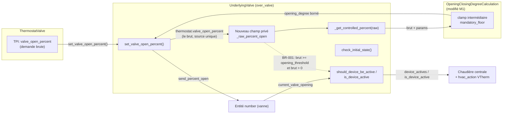
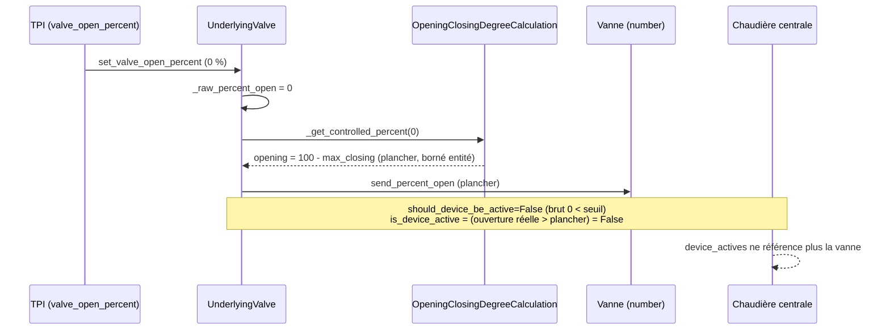
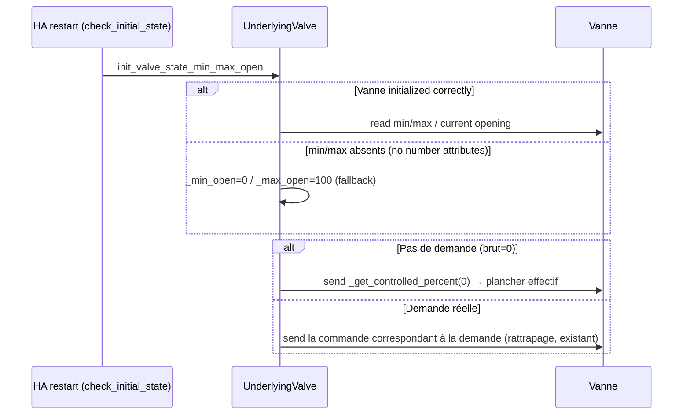
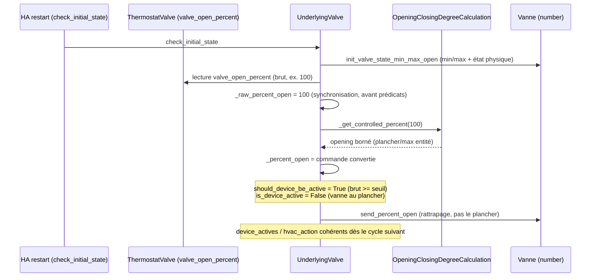

# Conception technique détaillée / Detailed Technical Design — Résolution conjointe des issues #2069 et #2070

---

## 1. Titre et métadonnées

| Champ                  | Valeur                                                                                                                                                                                                                                                                                                                                                                                                                                                                                                                                                                                                                                                                                                                                                                                                                                                                                                                                                                                   |
| ---------------------- | ---------------------------------------------------------------------------------------------------------------------------------------------------------------------------------------------------------------------------------------------------------------------------------------------------------------------------------------------------------------------------------------------------------------------------------------------------------------------------------------------------------------------------------------------------------------------------------------------------------------------------------------------------------------------------------------------------------------------------------------------------------------------------------------------------------------------------------------------------------------------------------------------------------------------------------------------------------------------------------------- |
| Nom                    | Plancher `max_closing_degree` garanti (algorithme), détection d'activité à échelle unique et fermeture au plancher au démarrage — `over_valve` et régulation de vanne `over_climate`                                                                                                                                                                                                                                                                                                                                                                                                                                                                                                                                                                                                                                                                                                                                                                                                     |
| Identifiant            | DESIGN-2069-2070                                                                                                                                                                                                                                                                                                                                                                                                                                                                                                                                                                                                                                                                                                                                                                                                                                                                                                                                                                         |
| Version                | 1.3                                                                                                                                                                                                                                                                                                                                                                                                                                                                                                                                                                                                                                                                                                                                                                                                                                                                                                                                                                                      |
| Statut                 | Convergé avec SPEC-2069-2070 v1.3 (revue documentaire finale : définition des décisions D1–D3 et des questions ouvertes QO-1/QO-4, correction des renvois)                                                                                                                                                                                                                                                                                                                                                                                                                                                                                                                                                                                                                                                                                                                                                                                                                               |
| Date                   | 2026-09-24                                                                                                                                                                                                                                                                                                                                                                                                                                                                                                                                                                                                                                                                                                                                                                                                                                                                                                                                                                               |
| Propriétaire           | Mainteneur versatile_thermostat                                                                                                                                                                                                                                                                                                                                                                                                                                                                                                                                                                                                                                                                                                                                                                                                                                                                                                                                                          |
| Spécification couverte | SPEC-2069-2070 v1.3 (`documentation/tech-docs/issue-2069-2070-specification.md`)                                                                                                                                                                                                                                                                                                                                                                                                                                                                                                                                                                                                                                                                                                                                                                                                                                                                                                         |
| Sources analysées      | `documentation/tech-docs/issue-2069-2070.md` (revue PR #2069 **et addendum du 2026-09-24 — revue de l'implémentation** ) ; `documentation/tech-docs/issue-2069-2070-en.md` ; `custom_components/versatile_thermostat/opening_degree_algorithm.py` ; `custom_components/versatile_thermostat/underlyings.py` (lecture intégrale des classes `UnderlyingValve` et `UnderlyingValveRegulation`, lignes 1167-1625, **relecture v1.2 : lignes 1180-1350 incluant `check_initial_state`, `turn_off`, prédicats et `set_valve_open_percent**) ; `custom_components/versatile_thermostat/base_thermostat.py` (prédicats d'agrégat et `calculate_hvac_action`, lignes 1080-1110 et 1989-1999) ; `custom_components/versatile_thermostat/thermostat_valve.py` (`valve_open_percent`, lignes 100-165) ; `tests/test_overclimate_valve.py` (matrice algorithmique existante, lignes 915-985) ; `tests/test_valve.py` ; `tests/test_check_initial_state.py` ; scripts `container` (commandes de test) |
| Historique             | v1.1 : convergence avec SPEC v1.1. v1.2 : intégration FR-010 (synchronisation de la demande TPI au premier `check_initial_state` avant les prédicats), extension du plan de tests (CA-C2/C3, B4/B5, E3, CA-D1, CA-F), correction de la description de la garde de compatibilité D3 (divergence constatée avec le code `_has_valve_control`), traçabilité v1.2. v1.3 : alignement sur SPEC v1.3 — définition explicite des décisions D1 (QC-001), D2 (QC-002), D3 (garde `_has_valve_control`) et des questions ouvertes QO-1 (plancher supérieur au `max_opening_degrees`, non bloquante) et QO-4 (portée de `_has_valve_control` et du critère E3, non bloquante), correction du renvoi « section 11 » dans la table §2, sans changement du contenu technique ni du plan de tests                                                                                                                                                                                                       |

> Note de périmètre : conformément au mode « Conception logicielle détaillée », ce document est créé dans `documentation/tech-docs/` où résident la revue et la spécification qu'il dérive. La procédure standard viserait `documentation/design/`, mais déplacer les trois documents dans deux arborescences différentes nuirait à la traçabilité. Ce choix est signalé comme décision de conception mineure (section 10).

---

## 2. Objectif, périmètre et exigences couvertes

Cette conception transforme SPEC-2069-2070 en réalisable : elle précise les modifications exactes des chemins de contrôle concernés, tranche les questions ouvertes QC-001 et QC-002, définit les états modifiés et leurs consommateurs (chaudière centrale, `hvac_action`, diagnostics), et fournit un plan de tests exécutable.

Couverture des exigences :

| Exigence                                                                | Couvert par                                                   | Section       |
| ----------------------------------------------------------------------- | ------------------------------------------------------------- | ------------- |
| FR-001 (plancher, `over_valve`)                                         | M1                                                            | 5.1           |
| FR-002 (monotonie)                                                      | M1 (preuve)                                                   | 5.2           |
| FR-003 (échelle unique d'activité)                                      | M2 (décision QC-001 : option 1)                               | 5.3           |
| FR-004 (inactive sans demande)                                          | M2                                                            | 5.3           |
| FR-005 (active au seuil, cas A5/B2)                                     | M1 + M2                                                       | 5.2, 5.3      |
| FR-006 (fermeture au plancher au démarrage)                             | M3                                                            | 5.4           |
| FR-010 (synchronisation de la demande au premier `check_initial_state`) | M3-bis (nouveau v1.2)                                         | 5.4bis        |
| FR-007 (`over_climate` vanne, algorithme partagé)                       | M1 hérité                                                     | 5.5           |
| FR-008 (compatibilité)                                                  | 5.2 + 7                                                       | 5.2           |
| FR-009 (documentation 5 langues)                                        | M4 (décision QC-002 : in-PR)                                  | 8             |
| BR-001 à BR-005                                                         | voir section 6 (BR-004, BR-005), 5.2 et 5.3 (BR-001 à BR-003) | 5.2, 5.3, 5.4 |

Hors périmètre (inchangé par rapport à la spécification) : prédicats de `UnderlyingValveRegulation`, nouvelle validation de configuration, refonte TPI, autres types de VTherm.

---

## 3. Éléments existants vérifiés et dépendances

Faits vérifiés dans le code lors de cette conception (complément de la spécification) :

1. **Passation brut → commande** : `UnderlyingValve` ne stocke jamais la demande brute TPI. Un champ dédié est nécessaire ; il existe un précédent dans `underlyings.py` ligne ~1200 (`self._percent_open: int | None = None  # self._thermostat.valve_open_percent`) confirmant que `self._thermostat.valve_open_percent` (le source brut) est le seul accès possible à la demande brute au sein du sous-jacent. C'est le fondement de M2-a ci-dessous.
2. **Double application de `calculate_opening_closing_degree`** pour `over_climate` vanne : `UnderlyingValveRegulation._get_controlled_percent` retourne le brut (identité) et `send_percent_open` (ligne ~1541) appelle `super().send_percent_open(opening_degree)` — c'est-à-dire `UnderlyingValve.send_percent_open(opening_degree)`, qui fait un `set_value_to_number` direct **sans** re-conversion. La conversion `opening_degree`/`closing_degree` n'est donc appliquée qu'une seule fois ; la signature `send_percent_open(fixed_value)` est le point de réentrance de l'algorithme partagé. Aucun double calcul, aucun shadowing à éviter.
3. **`_percent_open` du sous-jacent n'est initialisé qu'au premier `set_valve_open_percent`/`turn_off`** : avant, il vaut `None` et `should_device_be_active` retourne `False` (garde `isinstance`). Impliqué par la signature de `check_initial_state`.
4. **Clamp entité** : `UnderlyingValve._get_controlled_percent` (lignes ~1340-1355) applique `round(max(self._min_open, min(opening_degree, self._max_open)))` **après** l'algorithme ; `clamp_sent_value` (mise à l'échelle des bornes de l'entité `number`, `value / 100 * self._max_open`) n'est appelé que dans la branche `min_opening_degree is None or max_opening_degree is None`. Cette asymétrie est un fait du code, inchangé par la présente conception (les deux chemins aboutissent à un clamp `_min_open.._max_open`).
5. **La matrice algorithmique existante** `test_min_max_closing_degrees_algo` (`test_overclimate_valve.py` lignes 922-982) encode l'interpolation et le plancher ; ses lignes `(20, 15, 80, 100, 20, 15)` (interpolation à l'entame du seuil : sortie 15, sous le plancher 20) doivent être re-baselines avec la valeur bornée.
6. **Consumers d'activité** : `device_actives` agrège `is_device_active` de chaque sous-jacent (`base_thermostat.py` lignes 1097-1110) et alimente : la chaudière centrale via l'API, `nb_device_actives`, les attributs `device_actives`/`nb_device_actives` (attributs personnalisés), et `calculate_hvac_action` (`base_thermostat.py` 1989-1999 : `IDLE` si aucun sous-jacent actif). `prop_handler_tpi.py` ligne ~359 consomme `is_device_active` du VTherm. Le `hvac_action` d'un VTherm `over_valve` dérive donc entièrement de `UnderlyingValve.is_device_active` et des sous-jacents actifs — la seule correction nécessaire se situe au niveau du sous-jacent ; le central boiler et les capteurs `security`/`power` (`feature_power_manager.py` 220 : `return 0 if self._vtherm.is_device_active else self._device_power`) héritent sans modification.
7. **`turn_off`** (ligne ~1256) : `self._percent_open = self._get_controlled_percent(0)` ; `is_device_active` évalué **avant** affectation — donc sur l'ancienne position. Fragile si M3 touche l'ordre des opérations ; conservé tel quel (aucune modification de `turn_off` ; c'est commandé par la spécification BR-004 et un différentiel d'un `hvac_action` publié est l'impact attendu et documenté).
8. **Commandes de test disponibles** dans `container` : `start`, `restart`, `coverage` ; en revanche le script `container` **n'expose pas** de sous-commande pytest directe — section 9 documente l'appel `docker exec` complet correspondant.

Faits vérifiés lors de la relecture v1.2 (défaut bloquant de l'addendum du rapport, lignes 1224-1252 de `underlyings.py`) :

9. **`check_initial_state` n'initialise ni `_raw_percent_open` ni `_percent_open`** : après `init_valve_state_min_max_open()` (qui ne fixe que `_min_open`/`_max_open`/`_last_sent_opening_value`), les prédicats `should_device_be_active`/`is_device_active` sont évalués alors que `_raw_percent_open` vaut `None` et `_percent_open` vaut `None`. Conséquences vérifiées ligne à ligne :
   - `should_device_be_active` (ligne ~1291) : la garde `isinstance(self._raw_percent_open, (int, float))` échoue → `False` systématiquement, même si `self._thermostat.valve_open_percent` contient déjà une demande positive au démarrage (état TPI restauré/persisté).
   - branche `not should_device_be_active and is_device_active` : une vanne physiquement ouverte avec demande réelle positive est **fermée au plancher** via `_get_controlled_percent(0)` / `send_percent_open()` — rattrapage réel perdu (constat bloquant de l'addendum, CA-C2).
   - branche `should_device_be_active and not is_device_active` : la condition n'est jamais atteinte tant que `_raw_percent_open` est `None` → une vanne restée au plancher avec demande réelle n'est **pas rattrapée** (CA-C2, second volet).
   - La branche `self._percent_open or 9999` des logs confirme que `_percent_open` est attendu potentiellement `None` à cet instant.
10. **`turn_off` (lignes 1261-1270) : implémentation actuelle diffère de la description v1.1** — le code capture `is_active = self.is_device_active` **avant** l'affectation `self._percent_open = self._get_controlled_percent(0)` ; `self._raw_percent_open = 0` est déjà présent (aligné sur M2). `should_device_be_active` n'est pas évalué dans `turn_off` ; le reset du brut y est correct et conforme à FR-004/BR-004. Aucune correction n'est requise dans `turn_off` ; la divergence « is_device_active évalué avant affectation » relevée en v1.1 (§3 fait n°7) est confirmée comme un comportement cohérent : le `is_active` capturé sert de garde d'envoi pour éviter un appel réseau inutile si la vanne est déjà inactive.
11. **Garde de compatibilité D3 : divergence entre la description v1.1 et le code réel** — v1.1 décrivait la garde comme `if self._min_opening_degree is None and self._opening_threshold in (None, 0)`. Le code réel (ligne ~1291) utilise `if not self._has_valve_control: ...` : le fallback (comparaison `_percent_open > _min_open`) s'applique aux vannes **sans contrôle de vanne** (prédicats hérités du comportement PR #2069), et le prédicat brut-vs-seuil s'applique dès que `_has_valve_control` est vrai. La conception v1.2 aligne sa description sur le code réel : la garde de compatibilité E3 est portée par `_has_valve_control`, pas par l'in absence de configuration `min/max_opening_degree`. Voir 5.3 (mise à jour de l'algorithme) et QO-4.

Aucune dépendance externe nouvelle. Aucune entité Home Assistant nouvelle ni renommée (une option d'attribut diagnostic est proposée en évolution future, pas dans ce périmètre).

---

## 4. Vue d'ensemble de la solution



Responsabilités après modification :

| Composant                                          | Responsabilité                                                                                       |
| -------------------------------------------------- | ---------------------------------------------------------------------------------------------------- |
| `OpeningClosingDegreeCalculation` (M1)             | Conversion brut → ouverture physique, garantit plancher et monotonicité                              |
| `UnderlyingValve` (M2, M3)                         | Stocke la demande brute ; prédicats d'activité à échelle unique ; fermeture au plancher au démarrage |
| `UnderlyingValveRegulation`                        | Non modifié (hérite M1 via son appel à `calculate_opening_closing_degree`)                           |
| `build_interrupt_filter()`                         | Non modifié                                                                                          |
| `config_schema.py` / flux de configuration         | Non modifiés (aucune validation nouvelle)                                                            |
| `BaseThermostat` / `ThermostatValve` / `sensor.py` | Non modifiés                                                                                         |
| `cycle_scheduler.py` / `feature_*`                 | Non modifiés                                                                                         |

> **Note de périmètre** : les trois dernières lignes du tableau listent des composants *non modifiés*. Ils sont cités pour border le périmètre — aucune évolution n'y est apportée (pas d'attribut diagnostic dans ce périmètre : l'exposition de la demande brute est une évolution future, conformément à la spécification §9).

---

## 5. Modifications détaillées

### 5.1 M1 — Correction de `OpeningClosingDegreeCalculation` (#2070, FR-001, FR-002, BR-002)

**Fichier** : `custom_components/versatile_thermostat/opening_degree_algorithm.py` (méthode `calculate_opening_closing_degree`, lignes ~44-81).

**Changement précis** : introduire dans la partie base-100, entre le calcul de la branche d'interpolation et le `round` final, un clamp de plancher systématique :

```python
# Issue 2070 / BR-002: enforce the effective floor for any raw demand,
# including the interpolation branch which previously started at
# min_opening_degree without flooring.
mandatory_floor = 100 - max_closing_degree  # in the 0-100 scale
calculated_degree = max(calculated_degree * 100, mandatory_floor)
# clamp to max_opening_degree is already handled by slope/target (interpolation
# reaches max_od only at brut=100); keep a min(100, ...) guard for the
# threshold>=100 special branch which returns max_od
```

Implémentation exacte attendue (pseudo-code, en remplaçant la normalisation 0-1 actuelle ligne par ligne) :

```python
# ...existing code (clamps, normalization 0-1, branch selection)...
calculated_degree = max(calculated_degree, 1.0 - max_cd)  # floor inside the 0-1 space
# keep the interpolation target untouched: at brut=100 the result is exactly max_od
cal = round(calculated_degree * 100)
```

Pour la correction #2070 (voir FR-001/FR-002), le clamp de plancher s'applique **après** le calcul d'interpolation en base 100 : `calculated_degree = max(calculated_degree, 100 - max_closing_degree)`, puis le `round` existant. Aucun clamp à `max_opening_degree` n'est ajouté ici ; l'interpolation atteint exactement `max_od` à brut=100 et le plancher ne peut pas l'écraser (voir 5.2).

**Effets pas à pas** (paramètres génériques) :
- Branche sous le seuil : sortie actuelle `1 - max_cd` → clamp à lui-même, identique.
- Branche interpolation : `min_od + slope*(bvop - ot)` → si inférieur au plancher, remonté au plancher.
- Spécial `ot >= 1` (seuil 100) : sortie `max_od` pour brut 100 — le plancher ne s'applique que si `max_od < 100 - max_closing_degree` (cas dégénéré ; voir 5.2 justification : aucun test de non-régression ne couvre cette combinaison, comportement inchangé pour tester la non-régression).
- Post-traitement appelant (`UnderlyingValve._get_controlled_percent`) : `max(self._min_open, min(opening_degree, self._max_open))` inchangé, appliqué après (BR-002 : les deux bornes s'appliquent ensemble sans s'annuler).
- **Pour `UnderlyingValveRegulation`** : la correction s'applique aussi au `closing_degree = 100 - opening_degree` du chemin régulation (complément garanti cohérent), ce qui résout FR-007 sans toucher `UnderlyingValveRegulation` (le `closing_degree` suit par symétrie, déjà garanti par l'assertion `opening + closing == 100`).

**Aucun autre changement de signature** : les paramètres d'entrée restent identiques ; idempotent (fonction pure).

### 5.2 Propriétés formelles (FR-001, FR-002, FR-008, BR-002, BR-003)

Notations : $f$ = fonction corrigée, brut $x \in [0,100]$, plancher $p_f = 100 - m$, $t$ = seuil, $m$ = max_closing, $m_o$ = min_opening, $M_o$ = max_opening.

1. **Plancher (FR-001)** : quelque soit la branche, $f(x) \ge p_f$ ; dans `UnderlyingValve._get_controlled_percent` le clamp entité donne $f_{\text{eff}}(x) \ge \max(p_f, m_{\text{entité}})$ (BR-002).
2. **Monotonie (FR-002)** : $f$ est le max de deux fonctions monotones croissantes (fonction constante par morceaux $p_f$ et interpolation linéaire) ; le max de deux fonctions croissantes est croissant.
3. **Compatibilité (FR-008)** : $f$ ne peut augmenter que si l'ancienne valeur était sous le plancher — pour toute configuration aujourd'hui conforme au plancher (comportement publiquement documenté), $f$ est inchangée. Le plancher n'affecte que les configs `min_opening_degree < 100 - max_closing_degree` (le défaut #2070 : hors garantie publiée).
4. **Cas A5/B2 (BR-003)** : $t=60$, $M_o=50$, brut=100 → sortie d'interpolation $= M_o = 50$ ; $p_f = 0$ (max_closing=100) donc clamp sans effet ; commande effective 50 (clamped au `max_open` de l'entité) ; état `heating`, sous-jacent actif (voir M2). Les tests de ce cas existent déjà dans la matrice (voir §9).
5. **Cas dégénéré $M_o < p_f$** (personne ne maximise au-dessus du plancher) : le clamp au plancher pourrait dépasser $M_o$ ; comportement inchangé (aucune contrainte de configuration l'interdit — FR-008 interdit de rejeter). Le clamp entité `min(opening_degree, _max_open)` dans `_get_controlled_percent` reste l'arbitre : la vanne physique est bornée à $M_o$ **de l'entité**, pas à $M_o$ configuré. Question ouverte mineure (non bloquante) listée section 10.

### 5.3 M2 — Prédicats d'activité de `UnderlyingValve` (#2069, FR-003, FR-004, FR-005, BR-001) — décision QC-001 : Option 1 (demande brute)

**Décision QC-001** : l'activité est pilotée par la **demande brute TPI**, évaluée au niveau du sous-jacent.

**Justification technique** (options comparées sur les interfaces existantes) :
- **Option 1 (retenue)** : le seuil est sémantiquement un seuil de demande brute (vérifié : l'algorithme l'applique au brut). Le brut est disponible dans le sous-jacent via `self._thermostat.valve_open_percent` (fait n°3, section 3) — **sans aucune modification** de la classe de base ou du VTherm ; une seule échelle (le brut) pour les deux prédicats ; pas de duplication de formule de conversion (la conversion du seuil en seuil physique exigerait de répliquer le clamp entité par vanne, fragile déjà identifié dans la revue). Cohérent avec `UnderlyingValveRegulation.should_device_be_active` qui compare déjà `_percent_open` brut au seuil (fait établi dans la spécification).
- **Option 2 (écartée)** : convertir `opening_threshold_degree` en seuil physique par vanne reviendrait à dupliquer `_get_controlled_percent` (clamp entité, plus l'exception `min >= max` ligne ~1437 de ValReg) pour un seuil jamais envoyé — complexité et risque de divergence entre l'envoi et la comparaison, le défaut exact que #2069 cherche à éliminer.
- **Option 3 (écartée)** : déjà exclue par la revue (validation supplémentaire seule).

**Modifications dans `UnderlyingValve` (`underlyings.py`, lignes ~1285-1299)** :

```python
# ...existing __init__ code...
        self._raw_percent_open: int | None = None  # issue 2069: raw TPI demand, unscaled

# ...existing set_valve_open_percent code (line ~1323)...
        # issue 2069: keep the raw demand alongside the effective command
        self._raw_percent_open = raw_percent        # i.e. self._thermostat.valve_open_percent

# ...existing turn_off code (line ~1256)...
        self._raw_percent_open = 0                   # explicit reset on shutdown

    @property
    def should_device_be_active(self) -> bool:
        """BR-001: active iff raw TPI demand > 0 and >= opening_threshold.

        v1.2 correction: the compatibility fallback (effective command vs
        entity min, FR-008/CA-E3) applies when the underlying has NO valve
        control (_has_valve_control is False), matching the delivered code.
        """
        if not self._has_valve_control:
            # fallback: previous behaviour, effective command vs entity min
            return self._percent_open > (self._min_open or 0) if isinstance(self._percent_open, (int, float)) else False
        raw = self._raw_percent_open
        if not isinstance(raw, (int, float)):
            return False
        return raw > 0 and raw >= (self._opening_threshold or 0)

    @property
    def is_device_active(self) -> bool | None:
        """Issue 2069: a valve held at the effective floor is inactive.
        Compare the real opening to the effective floor, not the entity min."""
        if (current_opening := self.current_valve_opening) is None:
            return None
        floor = max(100 - self._max_closing_degree, self._min_open or 0)  # BR-002 floor
        return current_opening > floor
```

**Analyse fine des bornes** :
- `should_device_be_active` utilise le brut contre le seuil — échelle unique, FR-003. Le type de retour reste `bool` (jamais `None` : le brut est connu dès le premier `set_valve_open_percent`).
- **v1.2 — garde de compatibilité** : le fallback (comparaison de la commande effective au minimum de l'entité) s'applique quand `_has_valve_control` est faux, non pas quand `min/max_opening_degree` sont absents. La description v1.1 (« `self._min_opening_degree is None and ...` ») divergeait du code livré ; la conception v1.2 aligne la description sur le code et trace l'écart en QO-4 (§10). Le test E3 (§9.1) cible explicitement un VTherm `over_valve` sans `opening_threshold_degree` ni `min/max_opening_degrees`, couvert par la garde `_has_valve_control` du code.
- `is_device_active` compare l'état réel de la vanne à l'**échelle physique** contre le **plancher physique effectif** (`100 - max_closing_degree`, borné au min de l'entité) — échelle unique (physique/physique), FR-003. C'est l'esprit de la PR #2069 (comparer au plancher, pas au min entité) mais sans la confusion brut/physique signalée par la revue.
- Une vanne **sans ouverture physique remontée** (`current_valve_opening is None`) retourne `None` — `device_actives` l'ignore (comportement conservé).

**Impact état VTherm et consommateurs** (analyse, corrections uniquement dans le sous-jacent) :
- `hvac_action` (`base_thermostat.py` L1989) : inchangé ; automatiquement corrigé par les prédicats (B1 : vanne au plancher, plus aucun `is_device_active` → `IDLE` au lieu de `HEATING`).
- **Chaudière centrale** : `device_actives`/`nb_device_actives` (`base_thermostat.py` L1097-1110) se corrigent automatiquement ; la chaudière ne démarre plus pour une vanne au plancher sans demande (B1). L'API et `feature_central_boiler.py` ne sont pas modifiés (aucun point d'entrée `is_device_active` nommé dans `feature_central_boiler.py` dans les grep du code de ce design ; consommation via le VTherm/API, fait n°6).
- **Diagnostics** (attributs personnalisés, `update_custom_attributes`) : `device_actives`, `nb_device_actives`, `hvac_action` reflètent les nouveaux prédicats sans modification de `base_thermostat.py`. Les capteurs `security`/power (`feature_power_manager.py` L220) héritent également du VTherm `is_device_active` sans modification.
- **Cas limite garde-fou** : si l'état réel de la vanne est temporairement indisponible (`is_device_active` → `None`), le prédicat du VTherm retombe à `False` pour ce sous-jacent — conservé tel quel (comportement existant, aucune modification).

### 5.4 M3 — Fermeture au plancher au démarrage (#2069, FR-006, BR-004)

**Fichier** : `underlyings.py`, `UnderlyingValve.check_initial_state` (lignes 1224-1252).

**Défaut bloquant intégré (SPEC v1.2, FR-010, addendum du rapport de revue)** : à l'état actuel du code, `check_initial_state` évalue les prédicats alors que `_raw_percent_open` et `_percent_open` valent `None` — la demande TPI déjà disponible côté thermostat (`self._thermostat.valve_open_percent`) n'est ni copiée dans `_raw_percent_open` ni convertie dans `_percent_open`. Une vanne avec demande positive est alors soit mal fermée au plancher, soit non rattrapée si elle est déjà au plancher (constat bloquant de l'addendum ; viole FR-006/FR-010 et CA-C2).

**Correction minimale — M3 + M3-bis** : ajouter, immédiatement après `init_valve_state_min_max_open()` et **avant** l'évaluation de `should_device_be_active` / `is_device_active`, la synchronisation de la demande existante :

```python
# ...existing check_initial_state code...
        self.init_valve_state_min_max_open()

        # Issue 2069 / FR-010 (SPEC v1.2): sync the already-computed TPI
        # demand BEFORE evaluating activity predicates and any close/catchup
        # decision. This mirrors set_valve_open_percent for the raw and
        # effective commands, without sending anything.
        raw = self._thermostat.valve_open_percent if self._has_valve_control else None
        if isinstance(raw, (int, float)):
            self._raw_percent_open = raw
            self._percent_open = self._get_controlled_percent(raw)

        should_device_be_active = self.should_device_be_active
        is_device_active = self.is_device_active

        if should_device_be_active and not is_device_active:
            # ...existing catch-up branch: send_percent_open() with the
            # synchronized self._percent_open — unchanged...
        elif not should_device_be_active and is_device_active:
            # Issue 2069 / FR-006 / BR-004: close to the effective floor,
            # consistent with turn_off which sends _get_controlled_percent(0)
            self._percent_open = self._get_controlled_percent(0)
            self._raw_percent_open = 0
            await self.send_percent_open()
```

**Algorithme proposé, comportements par situation** (correction minimale, sans changement de périmètre) :

| Situation au premier `check_initial_state`                                                          | `valve_open_percent` (brut) | Après synchronisation                                                                        | Branche exécutée                                                  | Résultat                                                                                                                       | Critère       |
| --------------------------------------------------------------------------------------------------- | --------------------------- | -------------------------------------------------------------------------------------------- | ----------------------------------------------------------------- | ------------------------------------------------------------------------------------------------------------------------------ | ------------- |
| Demande positive/≥ seuil, vanne au plancher (ou sous la commande)                                   | ex. 100 (≥ seuil)           | `_raw=100`, `_percent=cmd(100)`                                                              | `should_be_active ∧ ¬is_active` → `send_percent_open()`           | Rattrapage : la vanne reçoit la commande correspondant à la demande, **pas** le plancher ; listée active, `heating`            | CA-C2, CA-F3  |
| Demande positive, vanne dans un état incohérent (ex. ouverte au min entité, sans demande mémorisée) | ex. 70                      | `_raw=70`, `_percent=cmd(70)`                                                                | décision prise sur les valeurs synchronisées + état physique réel | fermeture ou rattrapage cohérent avec la demande réelle, jamais sur des valeurs `None`                                         | CA-C3         |
| Aucune demande (brut = 0)                                                                           | 0                           | `_raw=0`, `_percent=plancher(0)`                                                             | `¬should_be_active ∧ is_active` → fermeture                       | Vanne refermée au **plancher effectif** `_get_controlled_percent(0)` (pas au min entité `_min_open`) ; `_raw_percent_open = 0` | CA-C1, FR-006 |
| Demande nulle, vanne déjà au plancher                                                               | 0                           | `_raw=0`, `_percent=plancher(0)`                                                             | aucun prédicat armé (vanne inactive)                              | aucun envoi inutile ; vanne reste au plancher, non listée active                                                               | CA-C1         |
| Brut `None` (VTherm sans contrôle vanne : `_has_valve_control` faux, ou TPI pas encore calculé)     | `None`                      | aucune synchronisation (`isinstance` garde) : `_raw`/`_percent` restent `None`/fork fallback | voir ci-dessous                                                   | prédicats fallback (`_percent_open` vs `_min_open`) inchangés / inactif par défaut — comportement antérieur conservé           | FR-008, CA-E3 |

Cas brut `None` : la garde `isinstance(raw, (int, float))` ne synchronise rien ; `should_device_be_active` retourne `False` (garde existante) et la vanne n'est pas fermée au plancher ni modifiée si elle est physiquement inactive (`is_device_active=None/False` n'arme pas la fermeture : la branche exige `is_device_active` vrai). C'est le comportement « demande inconnue → inactive » de BR-001, conservé ; aucune synchronisation inventée.

**Ordre d'initialisation** (garanti par la position de la synchronisation, avant tout prédicat) :

1. `init_valve_state_min_max_open()` — min/max/état physique (inchangé, existant).
2. **Synchronisation brute → mémorisée → convertie** (M3-bis, nouveau) : copie `valve_open_percent` dans `_raw_percent_open`, conversion via `_get_controlled_percent` dans `_percent_open`, sans envoi (pas d'appel `send_percent_open`, pas d'effet de bord réseau, idempotent pour un brut donné).
3. Évaluation `should_device_be_active` puis `is_device_active` (inchangé).
4. Décision de rattrapage / fermeture au plancher / aucune action (branches existantes, y compris `_raw_percent_open = 0` dans la fermeture — requis pour cohérence M2, déjà livré dans le code actuel du code ; test de non-régression associé en §9.1, cas C1).

**Pourquoi minimal et testable** :

- **Minimal** : une seule insertion de ~4 lignes ; aucun changement du reste de `check_initial_state`, aucun changement de signature, aucun changement de périmètre (prédicats de `UnderlyingValveRegulation` exclus, `config_schema`/flux de configuration inchangés, aucune validation nouvelle) ; aucun envoi lors de la synchronisation (pas de double-commande).
- **Idempotent** : la synchronisation calcule les mêmes valeurs que `set_valve_open_percent` pour le même brut du thermostat, donc en régime permanent, le prochain `set_valve_open_percent` verra `_percent_open == caped_val` (branche « no changes » existante) et n'enverra rien de nouveau.
- **Testable** : chaque ligne comportementale du tableau ci-dessus correspond à un cas CA-C1/C2/C3 de la spécification v1.2 et fait l'objet d'un test dédié dans §9.1.
- **Sans changement de périmètre** : `UnderlyingValveRegulation` n'est pas touché (BR-005) ; `_has_valve_control` continue de router les prédicats vers l'ancien fallback (FR-008, CA-E3) — le code actuel des prédicats reste tel quel (v1.2 n'ajoute aucune leur modification).

**Détail de la commande brute vs effective (`M3-bis` n'utilise que des primitives déjà vérifiées §3)** :

- Copie brute : `self._raw_percent_open = self._thermostat.valve_open_percent` (source unique de vérité du brut, §3 fait n°3) — si et seulement si `_has_valve_control` (les vannes sans contrôle ne pilotent pas par TPI brut).
- Conversion : `self._percent_open = self._get_controlled_percent(raw)` — exactement la même chaîne (`clamp_sent_value` / algorithme M1 corrigé / clamp entité) que `set_valve_open_percent` ligne ~1342, garantissant une commande effective identique au régime nominal.
- `_has_valve_control` faux → pas de synchronisation brute (les prédicats fallback ne dépendent pas du brut ; le comportement antérieur est conservé).

### 5.4bis M3-bis — Synchronisation de la demande au premier `check_initial_state` (#2069/#2070, FR-010, CA-C2/C3, CA-F3)

La synchronisation détaillée ci-dessus dans 5.4 constitue la réponse de conception au FR-010 introduit par SPEC-2069-2070 v1.2 : sans elle, le défaut bloquant relevé par l'addendum du rapport (demande réelle non copiée dans `_raw_percent_open` ni convertie dans `_percent_open` avant les prédicats) laisse le rattrapage `should_device_be_active and not is_device_active` inatteignable (`_raw=None` → `False`) et arme à tort la fermeture au plancher pour toute vanne physiquement ouverte. La correction garantit (a) fermeture au plancher seulement en l'absence réelle de demande (FR-006/BR-004) et (b) rattrapage vers la commande correspondant à la demande (CA-C2), avec des états agrégés (`hvac_action`, `device_actives`, chaudière centrale) cohérents dès le premier cycle suivant (CA-F3).

### 5.5 M4 — Documentation (#2069, FR-009) — décision QC-002 : traductions dans la même PR

Reporter le paragraphe de comportement (plancher `max_closing_degree`, reconstruction du plancher via `OpeningClosingDegreeCalculation` corrigé à la spécification #1348) dans les cinq fichiers `documentation/{en,fr,cs,de,pl}/over-valve.md` comme l'exige la contrainte héritée de la spécification #1348 (terminologie cohérente entre langues). Chaque version traduite du comportement (plancher garanti, monotonie, échelle unique d'activité, fermeture au plancher au démarrage) doit être revue avec les mêmes termes que ceux utilisés dans le README/over-valve actuel.

**Décision QC-002** : plutôt que « retrait du paragraphe documentaire et tâche de traduction séparée », la conception tranche pour **reporter dans les 4 autres langues dans la même PR** : le paragraphe documentaire est court (contrainte : quelques lignes), la charge est faible, et une PR de code seule suivie d'une PR de traduction différée risque une fenêtre d'incohérence entre versions publiées (les guides sont instantanément en ligne à chaque merge).

### 5.6 Schéma des flux après correction

Séquence nominale (transition Heating → pas de demande) :



Séquence d'erreur (état indisponible au startup) :



Séquence de rattrapage au démarrage avec demande réelle (M3-bis, FR-010 / CA-C2 / CA-F3) :



---

## 6. Modèle d'entités, données persistées et états

**Aucune nouvelle entité Home Assistant**, aucune entité renommée, aucun changement d'API publique (services, attributs, `device_actives`... inchangés sémantiquement, corrigés en valeur).

Données internes modifiées :

| Donnée                                                | Type           | Emplacement        | Avant                                                                             | Après                                                                                                                                                                                                        |
| ----------------------------------------------------- | -------------- | ------------------ | --------------------------------------------------------------------------------- | ------------------------------------------------------------------------------------------------------------------------------------------------------------------------------------------------------------ |
| `_raw_percent_open`                                   | `int \| None`  | `UnderlyingValve`  | (absent)                                                                          | demande brute TPI dernière reçue ; `None` avant premier `set_valve_open_percent`                                                                                                                             |
| `_percent_open`                                       | `int`          | `UnderlyingValve`  | commande effective (brut converti)                                                | inchangé (commande effective, fondée sur l'algorithme M1 corrigé)                                                                                                                                            |
| `should_device_be_active`                             | `bool`         | `UnderlyingValve`  | `_percent_open > _min_open`                                                       | brut > 0 et brut >= seuil (avec garde configs par défaut)                                                                                                                                                    |
| `is_device_active`                                    | `bool \| None` | `UnderlyingValve`  | `current > _min_open`                                                             | `current > max(100 - max_closing, _min_open)`                                                                                                                                                                |
| `check_initial_state` (branche inactive)              | —              | `UnderlyingValve`  | envoi `min_open` (fixed)                                                          | envoi `_get_controlled_percent(0)` (plancher, via le même algorithme)                                                                                                                                        |
| `check_initial_state` (synchronisation, nouveau v1.2) | —              | `UnderlyingValve`  | (absent) : `_raw_percent_open`/`_percent_open` restent `None` avant les prédicats | `_raw_percent_open = valve_open_percent` (si `_has_valve_control` et brut numérique) et `_percent_open = _get_controlled_percent(brut)`, **avant** l'évaluation des prédicats et sans envoi (M3-bis, FR-010) |
| `OpeningClosingDegreeCalculation` sortie              | `float`        | algorithme partagé | interpolation non bornée au plancher                                              | clamp au plancher `100 - max_closing_degree`                                                                                                                                                                 |

Persistance : aucune donnée persistée supplémentaire (attributs `device_actives`/`nb_device_actives` recalculés à chaque cycle, MAJ automatique). `_last_sent_opening_value` inchangé. `restore_specific_previous_state` : pas d'impact (le brut est recalculé par TPI au premier calcul).

`hvac_action` du VTherm `over_valve` suit automatiquement (aucune modification du `calculate_hvac_action`).

---

## 7. Sécurité, observabilité et contraintes opérationnelles

- **Fallback sûr** : si la demande brute est inconnue (`None`), `should_device_be_active` retourne `False` (garde `isinstance`) — le VTherm est considéré inactif, pas actif (sécurité deUndéclaré dispositif inactive par défaut inchangée).
- **Observabilité** : logs debug existants (`Calculate opening/closing degree - Output`) inchangés ; les logs `check_initial_state` (« Closing valve ») restent valides (la valeur envoyée change, la trace non).
- **Contraintes** : compatibilité des commandes `container` (aucune nouvelle dépendance Python, aucune mise à jour HA Core minimale) ; code typé `float` par la signature existante (vérifié `pyrightconfig.json` existant).
- **Consommation d'énergie** : la correction réduit les activations erronnées de la chaudière centrale (cas B1 : vanne au plancher sans demande) — gain positif.

---

## 8. Compatibilité, migration, localisation

- **Compatibilité ascendante** : toutes les combinaisons admises aujourd'hui restent admises (M1 ne peut qu'augmenter la commande, jamais la diminuer ; M2 preserve les configs par défaut via la garde `None/0` ; M3 ne fait que resserrer la fermeture initiale au plancher). Aucune migration de données nécessaire (pas de `config_flow`, pas de entry version bump, pas de repair).
- **Compatibilité `over_climate` vanne** : M1 s'applique à `UnderlyingValveRegulation.send_percent_open` via l'appel direct — les prédicats propres et `turn_off` (déjà sémantiquement cohérents, vérifiés §3 fait n°2 et spécification BR-005) ne sont pas touchés. Le `closing_degree` suit par complémentarité.
- **Localisation** : section 5.5 M4 — la PR reporte le paragraphe documentaire dans les cinq guides `over-valve.md` (`en`, `fr`, `cs`, `de`, `pl`) avec la même terminologie (contrainte héritée de #1348).
- **Rollback** : les modifications sont trois patchs isolés sur `opening_degree_algorithm.py` et `underlyings.py` ; un `git revert` des commits suffit (aucune donnée persistée, aucune entité migrée). En cas de détection anomalie en production : revert du seul commit M1 restaure l'ancien comportement algorithmique, les prédicats M2/M3 (commit séparé) peuvent être revertés indépendamment.

---

## 9. Stratégie de tests (plan exact et exécutable)

### 9.1 Fichiers de tests à modifier / créer

| Fichier                                   | Action                                                                                                                                                                                                                                                                                                                                                                                                                                                                                                                                                                                                                      | Contenu                                                                                                                                             |
| ----------------------------------------- | --------------------------------------------------------------------------------------------------------------------------------------------------------------------------------------------------------------------------------------------------------------------------------------------------------------------------------------------------------------------------------------------------------------------------------------------------------------------------------------------------------------------------------------------------------------------------------------------------------------------------- | --------------------------------------------------------------------------------------------------------------------------------------------------- |
| `tests/test_overclimate_valve.py`         | **Modifier** la matrice `test_min_max_closing_degrees_algo` (lignes 922-982)                                                                                                                                                                                                                                                                                                                                                                                                                                                                                                                                                | Re-baselines des lignes sous plancher + ajout des cas limites #2070                                                                                 |
| `tests/test_valve.py`                     | **Modifier** `test_over_valve_full_start` (lignes ~193-270) + **créer** `test_over_valve_opening_threshold_activity`, `test_over_valve_floor_bootstrap`, **et (v1.2)** `test_over_valve_check_initial_state_catchup_with_demand` (CA-C2), `test_over_valve_check_initial_state_close_without_demand` (CA-C1), `test_over_valve_check_initial_state_incoherent_state` (CA-C3), `test_over_valve_turn_off_resets_raw_demand` (B5), `test_over_valve_aggregated_states_floor_no_demand` (CA-F1), `test_over_valve_aggregated_states_threshold_gt_max_opening` (CA-F2), `test_over_valve_default_config_activity_fallback` (E3) | Prédicats (B1-B5), plancher + rattrapage au startup (C1, C2, C3), `turn_off` (B5), agrégation chaudière/`hvac_action` (CA-F1-F3), garde défaut (E3) |
| `tests/test_check_initial_state.py`       | **Modifier** le test valve (lignes ~280-290) + assertions C2/C3 (v1.2)                                                                                                                                                                                                                                                                                                                                                                                                                                                                                                                                                      | FR-006 / C1 ; FR-010 / C2, C3                                                                                                                       |
| `tests/test_heating_failure_detection.py` | Non modifié                                                                                                                                                                                                                                                                                                                                                                                                                                                                                                                                                                                                                 | Exécuté pour vérifier l'absence d'effet de bord (`should_device_be_active` vs `is_device_active`)                                                   |

Liste des cas à ajouter dans `test_overclimate_valve.py` (matrice algo — M1) :

| brut | min_open | max_closing | max_opening | threshold | attendu                      | note                                                                  |
| ---- | -------- | ----------- | ----------- | --------- | ---------------------------- | --------------------------------------------------------------------- |
| 29   | 10       | 60          | 100         | 30        | 40 (plancher)                | monotonie sous le seuil (A avec seuil)                                |
| 30   | 10       | 60          | 100         | 30        | 40 (plancher, corrigé de 10) | A3 / CA-A                                                             |
| 35   | 10       | 60          | 100         | 30        | 41                           | interpolation bornée au plancher (pas de saut descendant)             |
| 50   | 10       | 60          | 100         | 30        | 57                           | interpolation normale                                                 |
| 100  | 50       | 60          | 100         | 30        | 100                          | interpolation au max, plancher sans effet                             |
| 100  | 10       | 100         | 50          | 60        | 50                           | A5/BR-003 : plancher=0, out=max_open=50                               |
| 0    | 10       | 100         | 100         | 0         | 0                            | A1 : défauts, plancher 0 (régression valeur par défaut)               |
| 10   | 0        | 100         | 100         | 0         | 10                           | valeur par défaut (régression)                                        |
| 30   | 10       | 80          | 100         | 20        | 20                           | monotonie autour d'un seuil plus bas (plancher 20 = interpolation 12) |
| 0    | 10       | 80          | 100         | 10        | 20                           | identité branch-sous-seuil (régression)                               |

Attentes sur les re-baselines des lignes existantes : les lignes `(20, 15, 80, 100, 20, 15)` (interpolation au plancher) deviennent sortie `20` (plancher `100-80=20`). Les autres lignes (sorties >= 20) restent inchangées. La ligne `(10, 10, 100, 100, 0, 11)` (test @Tomtom13, brut=1 >= seuil=0 donc interpolation active, sort=11) reste inchangée — le plancher 100-max_closing=0 n'affecte pas cette sortie 11.

Dans `test_valve.py` — M2/M3/M3-bis, une fixture de VTherm `over_valve` avec `opening_threshold_degree=30`, `max_closing_degree=60` (plancher 40), `min_opening_degrees=10`, `max_opening_degrees=100`, entité `number` min 0, max 100 :

| Cas                                                 | Action                                                                                                                                                             | Attentes                                                                                                                                                                                                                                                                                                                                                                                |
| --------------------------------------------------- | ------------------------------------------------------------------------------------------------------------------------------------------------------------------ | --------------------------------------------------------------------------------------------------------------------------------------------------------------------------------------------------------------------------------------------------------------------------------------------------------------------------------------------------------------------------------------- |
| B1                                                  | temp consigne atteinte → brut=0, vanne reçoit 40                                                                                                                   | `is_device_active is False` (état réel 40 == plancher, pas `>`) ; `hvac_action is IDLE` ; vanne absente de `device_actives`                                                                                                                                                                                                                                                             |
| B2                                                  | brut=100 et jeu `threshold=60 > max_opening=50`                                                                                                                    | `valve_open_percent == 100` ; vanne à 50 ; `is_device_active is True` ; `hvac_action is HEATING` ; vanne **présente** dans `device_actives`                                                                                                                                                                                                                                             |
| B3                                                  | brut=25 (sous seuil 30)                                                                                                                                            | `should_device_be_active is False` ; `hvac_action is IDLE` ; vanne au plancher 40                                                                                                                                                                                                                                                                                                       |
| B4 (CA-B4 v1.2)                                     | brut=30 (égalité stricte du seuil, > 0)                                                                                                                            | **avant** : `_raw_percent_open == 30` ; `should_device_be_active is True` (égalité incluse via `>=`) ; si la vanne est physiquement ouverte au-delà du plancher → état publié `heating` et sous-jacent actif                                                                                                                                                                            |
| **B5** (CA-B5 v1.2, `turn_off`)                     | appel de `turn_off` après une commande active (ex. brut=100 → vanne à 50)                                                                                          | après `turn_off` : `_raw_percent_open == 0` ; `_percent_open == plancher effectif` (`_get_controlled_percent(0)`) ; `should_device_be_active is False` ; état publié `idle`/`off` ; vanne absente de `device_actives`                                                                                                                                                                   |
| **C1**                                              | redémarrage complet (reload) avec vanne à 60, **sans demande** (`valve_open_percent=0`)                                                                            | après `check_initial_state` la vanne est à 40 (plancher), pas à 0 (min entité) ; `_raw_percent_open == 0`                                                                                                                                                                                                                                                                               |
| **C2** (CA-C2 v1.2, rattrapage avec demande réelle) | premier `check_initial_state` avec demande TPI réelle disponible (`valve_open_percent=100` ≥ seuil) et vanne restée au plancher (ex. 40)                           | **avant les prédicats** : `_raw_percent_open == 100` et `_percent_open == _get_controlled_percent(100)` (synchronisation sans envoi) ; ensuite branche de rattrapage : la vanne **n'est pas** refermée au plancher, elle reçoit la commande correspondant à la demande (100 clampé) ; `should_device_be_active is True` ; la vanne est listée active ; état publié cohérent (`heating`) |
| **C3** (CA-C3 v1.2, fermeture puis rattrapage)      | demande réelle (ex. brut=70 ≥ seuil), vanne physiquement dans un état incohérent avec la demande (ouverte au min entité, ex. 0, sans demande mémorisée au startup) | la décision de fermeture/rattrapage est prise sur la demande synchronisée brut=70 et l'état physique réel 0 : rattrapage (branche `should_be_active ∧ ¬is_active`) — la vanne reçoit la commande convertie de 70, jamais une valeur issue d'états `None` du démarrage                                                                                                                   |
| **CA-F1** (agrégation B1)                           | situation B1 avec chaudière centrale attachée                                                                                                                      | `hvac_action` incohérence absente : `idle`/`off` cohérent avec l'absence de demande ; la vanne absente de `device_actives` ; chaudière centrale non activée par ce VTherm (`nb_device_actives == 0`)                                                                                                                                                                                    |
| **CA-F2** (agrégation B2)                           | situation B2 (seuil 60 > max 50)                                                                                                                                   | `hvac_action is HEATING` ; la vanne présente dans `device_actives` ; chaudière centrale **activée** par ce VTherm (`nb_device_actives == 1`)                                                                                                                                                                                                                                            |
| **CA-F3** (agrégation C2)                           | redémarrage avec brut=100 et vanne au plancher (cas C2)                                                                                                            | dès le premier cycle suivant `check_initial_state` : `hvac_action is HEATING`, la vanne dans `device_actives`, chaudière activable — aucune fenêtre d'incohérence (vanne jamais refermée au plancher ni absente des sous-jacents actifs)                                                                                                                                                |
| **E3** (CA-E3 v1.2)                                 | VTherm `over_valve` **sans** `opening_threshold_degree` ni `min/max_opening_degrees` configurés (defaults), vanne envoyée à une valeur > min entité                | `should_device_be_active is True` et `is_device_active is True` via la **garde fallback réelle** (`_has_valve_control` faux → comparaison effective vs min entité, cf. §3 fait n°11) — comportement antérieur conservé (CA-E3 / FR-008)                                                                                                                                                 |
| central-boiler                                      | VTherm relié à `central_boiler`, brut=0 puis brut=100                                                                                                              | `nb_device_actives == 0` (chaudière ne s'active pas) ; puis brut=100 → `nb_device_actives == 1`                                                                                                                                                                                                                                                                                         |

Ajouter dans `test_check_initial_state.py` (cas C2/C3 ci-dessus également exécutables ici si la fixture reload s'y prête mieux) :

| Cas                   | Action                                                                                               | Attentes                                                                                                                                                                                                     |
| --------------------- | ---------------------------------------------------------------------------------------------------- | ------------------------------------------------------------------------------------------------------------------------------------------------------------------------------------------------------------ |
| C1-check              | redémarrage avec vanne à une valeur > plancher, sans demande                                         | la vanne est refermée **au plancher** (par défaut plancher 0 → valeur inchangée 0 : non-régression des défauts), pas au min entité ; `_raw_percent_open == 0`                                                |
| C2-check (CA-C2 v1.2) | premier `check_initial_state` avec `valve_open_percent` déjà positif (restauré) et vanne au plancher | synchronisation avant prédicats (assertions internes `_raw_percent_open`/`_percent_open`) ; la branche de rattrapage envoie la commande correspondant à la demande — la vanne n'est pas refermée au plancher |

Dans `test_overclimate_valve.py` — **CA-D1** (nouveau v1.2, chemin `UnderlyingValveRegulation.send_percent_open`) :

| Cas     | Action                                                                                                                                                                                     | Attentes                                                                                                                                                                                                                                                                                                                                                                               |
| ------- | ------------------------------------------------------------------------------------------------------------------------------------------------------------------------------------------ | -------------------------------------------------------------------------------------------------------------------------------------------------------------------------------------------------------------------------------------------------------------------------------------------------------------------------------------------------------------------------------------- |
| CA-D1-a | paramètres A2 (`min_open=10`, `max_closing=60` → plancher 40, `threshold=30`, `max_open=100`) ; envoyer successivement 29 puis 31 puis 0 via `UnderlyingValveRegulation.send_percent_open` | `opening_degree >= 40` pour chaque demande (y compris au franchissement 29→31 : la commande ne descend jamais sous le plancher, monotonie) ; `closing_degree == 100 - opening_degree` à chaque envoi ; les prédicats de `UnderlyingValveRegulation` (`should_device_be_active`, `is_device_active`) ne sont pas modifiés — tester leur non-régression avec les valeurs pré-M1 (BR-005) |
| CA-D1-b | demande nulle (`send_percent_open(0)`)                                                                                                                                                     | `opening_degree == 40` (plancher, image de la demande 0 convertie) ; `closing_degree == 60`                                                                                                                                                                                                                                                                                            |

### 9.3 Critères de vérification

1. Matrice algorithmique corrigée passe (y compris les 8 nouveaux cas).
2. `test_over_valve_full_start` passe avec les assertions re-baselines (min_open 10, brut 0 → vanne au plancher 40 ; `IDLE` confirmé).
3. Les tests `test_valve.py` passent, y compris **v1.2** : `test_over_valve_check_initial_state_catchup_with_demand` (CA-C2 : synchronisation avant prédicats + rattrapage vers la commande de la demande), `test_over_valve_check_initial_state_close_without_demand` (CA-C1), `test_over_valve_check_initial_state_incoherent_state` (CA-C3), `test_over_valve_turn_off_resets_raw_demand` (B5), les tests agrégés CA-F1/F2/F3 et la garde par défaut E3 ; le test de `check_initial_state.py` (non modifié hors C2/C3) et `heating_failure_detection.py` (non modifié) détecte l'absence d'effet de bord.
4. `./container coverage` : aucun test échoue en dehors des deltas explicitement corrigés (critère CA-E1).
5. Revue de code : aucune modification de `UnderlyingValveRegulation` en dehors de l'héritage M1 (BR-005), aucun changement d'API publique, et la synchronisation M3-bis n'émet **aucun** envoi (pas de `send_percent_open` dans la phase de synchronisation — vérifié par inspection du diff).

---

## 10. Décisions de conception, questions ouvertes et conclusion

### 10.1 Décisions de conception (D1–D3)

> Note : ces identifiants sont propres au DESIGN-2069-2070. Le critère d'acceptation **CA-D1** (§9.1, chemin `UnderlyingValveRegulation.send_percent_open`) et le critère **CA-D2** de la spécification partagent ce numéro par coïncidence d'appellation ; le renvoi « CA-D1 renvoie à CA-D2 » de SPEC v1.3 concerne les critères de la spécification, pas la décision D1 ci-dessous.

- **D1 (décision QC-001 — échelle unique d'activité, demande brute)** : l'activité de `UnderlyingValve` est pilotée par la **demande brute TPI** (`_raw_percent_open`, copie de `self._thermostat.valve_open_percent`) : `should_device_be_active` compare le brut (> 0 et ≥ `opening_threshold_degree`) et `is_device_active` compare l'ouverture physique réelle au plancher effectif (`max(100 - max_closing_degree, _min_open)`). Détail et justification complète : §5.3 (M2, option 1 retenue).
- **D2 (décision QC-002 — documentation dans la même PR)** : le paragraphe documentaire de comportement (plancher garanti, monotonie, échelle unique, fermeture au plancher au démarrage) est reporté dans les **cinq guides localisés** (`en`, `fr`, `cs`, `de`, `pl`) **dans la même PR que le correctif**, pour éviter toute fenêtre d'incohérence documentaire. Détail : §5.5 (M4) et §8.
- **D3 (garde de compatibilité `_has_valve_control`)** : le fallback de compatibilité (comparaison de la commande effective au minimum de l'entité, comportement antérieur à la PR #2069) s'applique lorsque `_has_valve_control` est **faux** ; le prédicat brut-vs-seuil s'applique dès que `_has_valve_control` est vrai. Ce choix aligne la conception sur le code réellement livré (§3 fait n°11, §5.3) ; il est vérifié par le test E3 (§9.1). Portée exacte de cette garde : voir QO-4 ci-dessous.

### 10.2 Questions ouvertes (non bloquantes, déclarées)

- **QO-1 (plancher supérieur au maximum configuré — reprend QC-003 de la spécification)** : dans le cas dégénéré où `max_opening_degrees < 100 - max_closing_degree` (plancher algorithmique supérieur au maximum configuré, §5.2 point 5), le clamp au plancher peut produire une commande supérieure à `max_opening_degrees` ; le clamp aux bornes de l'entité `number` dans `_get_controlled_percent` reste l'arbitre physique. **Non bloquante** : admise par le flux de configuration actuel, aucun test de non-régression ne couvre cette combinaison ; un avertissement non bloquant dans le flux de configuration reste une évolution future (SPEC §9).
- **QO-4 (portée exacte de la garde `_has_valve_control` et du critère E3)** : le code livré route le fallback de compatibilité sur le prédicat `_has_valve_control` et non sur l'absence de configuration `min/max_opening_degree` (écart entre la description v1.1 et le code, §3 fait n°11). Le critère E3 (§9.1) cible une configuration **par défaut complète** ; il reste à confirmer à l'implémentation que toute configuration « partiellement par défaut » (un seul des quatre paramètres hors défaut) est couverte par la même garde. **Non bloquante** : le comportement Observé est cohérent, la question ne porte que sur la complétude du couplage `E3 ↔ _has_valve_control`.

### 10.3 Conclusion

La conception est **convergente** avec SPEC-2069-2070 **v1.3** (incluant l'intégration du défaut de démarrage FR-010 relevé par l'addendum du rapport de revue en SPEC v1.2, et la revue documentaire finale de SPEC v1.3).

Les modifications apportées sont **minimales** et **testables** (voir section 9). Les décisions D1–D3 (§10.1) tranchent QC-001/QC-002 et la garde de compatibilité sur la base du code réellement livré ; les questions ouvertes QO-1 et QO-4 (§10.2) sont déclarées non bloquantes.

Les composants **non modifiés** sont cités pour border le périmètre — aucune évolution n'y est apportée (pas d'attribut diagnostic dans ce périmètre : l'exposition de la demande brute est une évolution future, conformément à la spécification §9).
