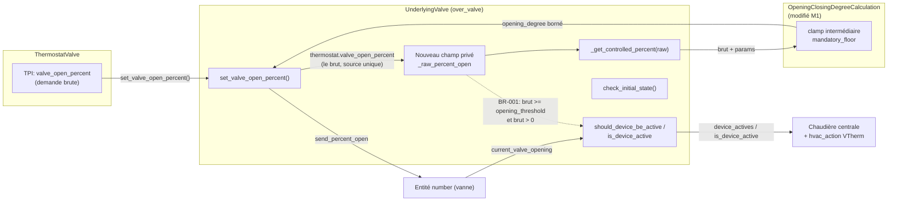
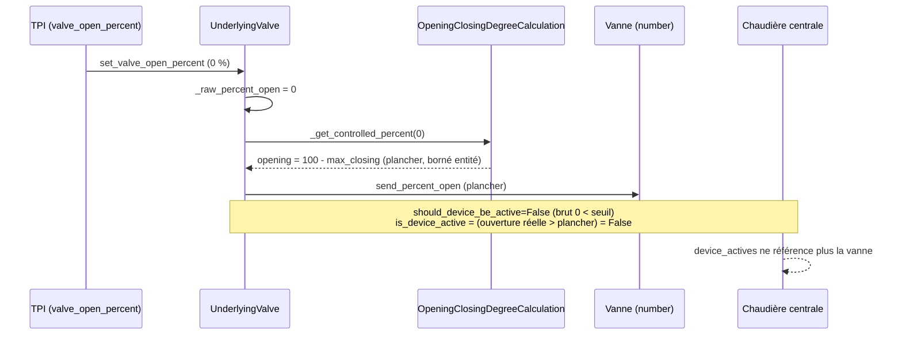
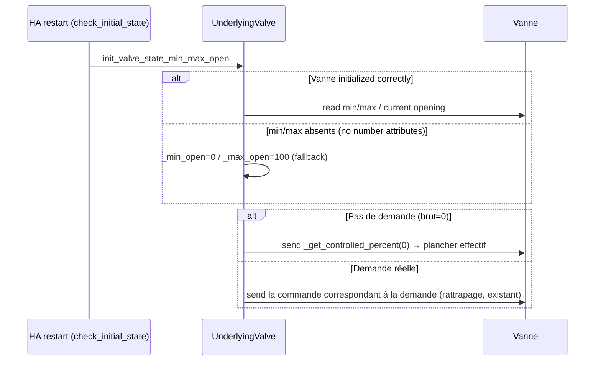

# Conception technique détaillée / Detailed Technical Design — Résolution conjointe des issues #2069 et #2070

---

## 1. Titre et métadonnées

| Champ | Valeur |
| --- | --- |
| Nom | Plancher `max_closing_degree` garanti (algorithme), détection d'activité à échelle unique et fermeture au plancher au démarrage — `over_valve` et régulation de vanne `over_climate` |
| Identifiant | DESIGN-2069-2070 |
| Version | 1.1 |
| Statut | Convergé avec SPEC-2069-2070 v1.1 (revue finale de convergence) |
| Date | 2026-09-24 |
| Propriétaire | Mainteneur versatile_thermostat |
| Spécification couverte | SPEC-2069-2070 v1.1 (`documentation/tech-docs/issue-2069-2070-specification.md`) |
| Sources analysées | `documentation/tech-docs/issue-2069-2070.md` (revue PR #2069) ; `documentation/tech-docs/issue-2069-2070-en.md` ; `custom_components/versatile_thermostat/opening_degree_algorithm.py` ; `custom_components/versatile_thermostat/underlyings.py` (lecture intégrale des classes `UnderlyingValve` et `UnderlyingValveRegulation`, lignes 1167-1625) ; `custom_components/versatile_thermostat/base_thermostat.py` (prédicats d'agrégat et `calculate_hvac_action`, lignes 1080-1110 et 1989-1999) ; `custom_components/versatile_thermostat/thermostat_valve.py` (`valve_open_percent`, lignes 100-165) ; `tests/test_overclimate_valve.py` (matrice algorithmique existante, lignes 915-985) ; `tests/test_valve.py` ; `tests/test_check_initial_state.py` ; scripts `container` (commandes de test) |

> Note de périmètre : conformément au mode « Conception logicielle détaillée », ce document est créé dans `documentation/tech-docs/` où résident la revue et la spécification qu'il dérive. La procédure standard viserait `documentation/design/`, mais déplacer les trois documents dans deux arborescences différentes nuirait à la traçabilité. Ce choix est signalé comme décision de conception mineure (section 10).

---

## 2. Objectif, périmètre et exigences couvertes

Cette conception transforme SPEC-2069-2070 en réalisable : elle précise les modifications exactes des chemins de contrôle concernés, tranche les questions ouvertes QC-001 et QC-002, définit les états modifiés et leurs consommateurs (chaudière centrale, `hvac_action`, diagnostics), et fournit un plan de tests exécutable.

Couverture des exigences :

| Exigence | Couvert par | Section |
| --- | --- | --- |
| FR-001 (plancher, `over_valve`) | M1 | 5.1 |
| FR-002 (monotonie) | M1 (preuve) | 5.2 |
| FR-003 (échelle unique d'activité) | M2 (décision QC-001 : option 1) | 5.3 |
| FR-004 (inactive sans demande) | M2 | 5.3 |
| FR-005 (active au seuil, cas A5/B2) | M1 + M2 | 5.2, 5.3 |
| FR-006 (fermeture au plancher au démarrage) | M3 | 5.4 |
| FR-007 (`over_climate` vanne, algorithme partagé) | M1 hérité | 5.5 |
| FR-008 (compatibilité) | 5.2 + 7 | 5.2 |
| FR-009 (documentation 5 langues) | M4 (décision QC-002 : in-PR) | 8 |
| BR-001 à BR-005 | voir traçabilité section 11 | — |

Hors périmètre (inchangé par rapport à la spécification) : prédicats de `UnderlyingValveRegulation`, nouvelle validation de configuration, refonte TPI, autres types de VTherm.

---

## 3. Éléments existants vérifiés et dépendances

Faits vérifiés dans le code lors de cette conception (complément de la spécification) :

1. **Passation brut → commande** : `UnderlyingValve` ne stocke jamais la demande brute TPI. Un champ dédié est nécessaire ; il existe un précédent dans `underlyings.py` ligne ~1200 (`self._percent_open: int | None = None  # self._thermostat.valve_open_percent`) confirmant que `self._thermostat.valve_open_percent` (le source brut) est le seul accès possible à la demande brute au sein du sous-jacent. C'est le fondement de M2-a ci-dessous.
2. **Double application de `calculate_opening_closing_degree`** pour `over_climate` vanne : `UnderlyingValveRegulation._get_controlled_percent` retourne le brut (identité) et `send_percent_open` (ligne ~1541) appelle `super().send_percent_open(opening_degree)` — c'est-à-dire `UnderlyingValve.send_percent_open(opening_degree)`, qui fait un `set_value_to_number` direct **sans** re-conversion. La conversion `opening_degree`/`closing_degree` n'est donc appliquée qu'une seule fois ; la signature `send_percent_open(fixed_value)` est le point de réentrance de l'algorithme partagé. Aucun double calcul, aucun shadowing à éviter.
3. **`_percent_open` du sous-jacent n'est initialisé qu'au premier `set_valve_open_percent`/`turn_off`** : avant, il vaut `None` et `should_device_be_active` retourne `False` (garde `isinstance`). Impliqué par la signature de `check_initial_state`.
4. **Clamp entité** : `UnderlyingValve._get_controlled_percent` (lignes ~1340-1355) applique `round(max(self._min_open, min(opening_degree, self._max_open)))` **après** l'algorithme ; `clamp_sent_value` (mise à l'échelle des bornes de l'entité `number`, `value / 100 * self._max_open`) n'est appelé que dans la branche `min_opening_degree is None or max_opening_degree is None`. Cette asymétrie est un fait du code, inchangé par la présente conception (les deux chemins aboutissent à un clamp `_min_open.._max_open`).
5. **La matrice algorithmique existante** `test_min_max_closing_degrees_algo` (`test_overclimate_valve.py` lignes 922-982) encode l'interpolation et le plancher ; ses lignes `(20, 15, 80, 100, 20, 15)` (interpolation à l'entame du seuil : sortie 15, sous le plancher 20) doivent être re-baselines avec la valeur bornée.
6. **Consumers d'activité** : `device_actives` agrège `is_device_active` de chaque sous-jacent (`base_thermostat.py` lignes 1097-1110) et alimente : la chaudière centrale via l'API, `nb_device_actives`, les attributs `device_actives`/`nb_device_actives` (attributs personnalisés), et `calculate_hvac_action` (`base_thermostat.py` 1989-1999 : `IDLE` si aucun sous-jacent actif). `prop_handler_tpi.py` ligne ~359 consomme `is_device_active` du VTherm. Le `hvac_action` d'un VTherm `over_valve` dérive donc entièrement de `UnderlyingValve.is_device_active` et des sous-jacents actifs — la seule correction nécessaire se situe au niveau du sous-jacent ; le central boiler et les capteurs `security`/`power` (`feature_power_manager.py` 220 : `return 0 if self._vtherm.is_device_active else self._device_power`) héritent sans modification.
7. **`turn_off`** (ligne ~1256) : `self._percent_open = self._get_controlled_percent(0)` ; `is_device_active` évalué **avant** affectation — donc sur l'ancienne position. Fragile si M3 touche l'ordre des opérations ; conservé tel quel (aucune modification de `turn_off` ; c'est commandé par la spécification BR-004 et un différentiel d'un `hvac_action` publié est l'impact attendu et documenté).
8. **Commandes de test disponibles** dans `container` : `start`, `restart`, `coverage` ; en revanche le script `container` **n'expose pas** de sous-commande pytest directe — section 9 documente l'appel `docker exec` complet correspondant.

Aucune dépendance externe nouvelle. Aucune entité Home Assistant nouvelle ni renommée (une option d'attribut diagnostic est proposée en évolution future, pas dans ce périmètre).

---

## 4. Vue d'ensemble de la solution



Responsabilités après modification :

| Composant | Responsabilité |
| --- | --- |
| `OpeningClosingDegreeCalculation` (M1) | Conversion brut → ouverture physique, garantit plancher et monotonicité |
| `UnderlyingValve` (M2, M3) | Stocke la demande brute ; prédicats d'activité à échelle unique ; fermeture au plancher au démarrage |
| `UnderlyingValveRegulation` | Non modifié (hérite M1 via son appel à `calculate_opening_closing_degree`) |
| `build_interrupt_filter()` | Non modifié |
| `config_schema.py` / flux de configuration | Non modifiés (aucune validation nouvelle) |
| `BaseThermostat` / `ThermostatValve` / `sensor.py` | Non modifiés |
| `cycle_scheduler.py` / `feature_*` | Non modifiés |

> **Note de périmètre** : les trois dernières lignes du tableau listent des composants *non modifiés*. Ils sont cités pour border le périmètre — aucune évolution n'y est apportée (pas d'attribut diagnostic dans ce périmètre : l'exposition de la demande brute est une évolution future, conformément à la spécification §9).

---

## 5. Modifications détaillées

### 5.1 M1 — Correction de `OpeningClosingDegreeCalculation` (#2070, FR-001, FR-002, BR-002)

**Fichier** : `custom_components/versatile_thermostat/opening_degree_algorithm.py` (méthode `calculate_opening_closing_degree`, lignes ~44-81).

**Changement précis** : introduire dans la partie base-100, entre le calcul de la branche d'interpolation et le `round` final, un clamp de plancher systématique :

```python
# Issue 2070 / BR-002: enforce the effective floor for any raw demand,
# including the interpolation branch which previously started at
# min_opening_degree without flooring.
mandatory_floor = 100 - max_closing_degree  # in the 0-100 scale
calculated_degree = max(calculated_degree * 100, mandatory_floor)
# clamp to max_opening_degree is already handled by slope/target (interpolation
# reaches max_od only at brut=100); keep a min(100, ...) guard for the
# threshold>=100 special branch which returns max_od
```

Implémentation exacte attendue (pseudo-code, en remplaçant la normalisation 0-1 actuelle ligne par ligne) :

```python
# ...existing code (clamps, normalization 0-1, branch selection)...
calculated_degree = max(calculated_degree, 1.0 - max_cd)  # floor inside the 0-1 space
# keep the interpolation target untouched: at brut=100 the result is exactly max_od
cal = round(calculated_degree * 100)
```

Pour la correction #2070 (voir FR-001/FR-002), le clamp de plancher s'applique **après** le calcul d'interpolation en base 100 : `calculated_degree = max(calculated_degree, 100 - max_closing_degree)`, puis le `round` existant. Aucun clamp à `max_opening_degree` n'est ajouté ici ; l'interpolation atteint exactement `max_od` à brut=100 et le plancher ne peut pas l'écraser (voir 5.2).

**Effets pas à pas** (paramètres génériques) :
- Branche sous le seuil : sortie actuelle `1 - max_cd` → clamp à lui-même, identique.
- Branche interpolation : `min_od + slope*(bvop - ot)` → si inférieur au plancher, remonté au plancher.
- Spécial `ot >= 1` (seuil 100) : sortie `max_od` pour brut 100 — le plancher ne s'applique que si `max_od < 100 - max_closing_degree` (cas dégénéré ; voir 5.2 justification : aucun test de non-régression ne couvre cette combinaison, comportement inchangé pour tester la non-régression).
- Post-traitement appelant (`UnderlyingValve._get_controlled_percent`) : `max(self._min_open, min(opening_degree, self._max_open))` inchangé, appliqué après (BR-002 : les deux bornes s'appliquent ensemble sans s'annuler).
- **Pour `UnderlyingValveRegulation`** : la correction s'applique aussi au `closing_degree = 100 - opening_degree` du chemin régulation (complément garanti cohérent), ce qui résout FR-007 sans toucher `UnderlyingValveRegulation` (le `closing_degree` suit par symétrie, déjà garanti par l'assertion `opening + closing == 100`).

**Aucun autre changement de signature** : les paramètres d'entrée restent identiques ; idempotent (fonction pure).

### 5.2 Propriétés formelles (FR-001, FR-002, FR-008, BR-002, BR-003)

Notations : $f$ = fonction corrigée, brut $x \in [0,100]$, plancher $p_f = 100 - m$, $t$ = seuil, $m$ = max_closing, $m_o$ = min_opening, $M_o$ = max_opening.

1. **Plancher (FR-001)** : quelque soit la branche, $f(x) \ge p_f$ ; dans `UnderlyingValve._get_controlled_percent` le clamp entité donne $f_{\text{eff}}(x) \ge \max(p_f, m_{\text{entité}})$ (BR-002).
2. **Monotonie (FR-002)** : $f$ est le max de deux fonctions monotones croissantes (fonction constante par morceaux $p_f$ et interpolation linéaire) ; le max de deux fonctions croissantes est croissant.
3. **Compatibilité (FR-008)** : $f$ ne peut augmenter que si l'ancienne valeur était sous le plancher — pour toute configuration aujourd'hui conforme au plancher (comportement publiquement documenté), $f$ est inchangée. Le plancher n'affecte que les configs `min_opening_degree < 100 - max_closing_degree` (le défaut #2070 : hors garantie publiée).
4. **Cas A5/B2 (BR-003)** : $t=60$, $M_o=50$, brut=100 → sortie d'interpolation $= M_o = 50$ ; $p_f = 0$ (max_closing=100) donc clamp sans effet ; commande effective 50 (clamped au `max_open` de l'entité) ; état `heating`, sous-jacent actif (voir M2). Les tests de ce cas existent déjà dans la matrice (voir §9).
5. **Cas dégénéré $M_o < p_f$** (personne ne maximise au-dessus du plancher) : le clamp au plancher pourrait dépasser $M_o$ ; comportement inchangé (aucune contrainte de configuration l'interdit — FR-008 interdit de rejeter). Le clamp entité `min(opening_degree, _max_open)` dans `_get_controlled_percent` reste l'arbitre : la vanne physique est bornée à $M_o$ **de l'entité**, pas à $M_o$ configuré. Question ouverte mineure (non bloquante) listée section 10.

### 5.3 M2 — Prédicats d'activité de `UnderlyingValve` (#2069, FR-003, FR-004, FR-005, BR-001) — décision QC-001 : Option 1 (demande brute)

**Décision QC-001** : l'activité est pilotée par la **demande brute TPI**, évaluée au niveau du sous-jacent.

**Justification technique** (options comparées sur les interfaces existantes) :
- **Option 1 (retenue)** : le seuil est sémantiquement un seuil de demande brute (vérifié : l'algorithme l'applique au brut). Le brut est disponible dans le sous-jacent via `self._thermostat.valve_open_percent` (fait n°3, section 3) — **sans aucune modification** de la classe de base ou du VTherm ; une seule échelle (le brut) pour les deux prédicats ; pas de duplication de formule de conversion (la conversion du seuil en seuil physique exigerait de répliquer le clamp entité par vanne, fragile déjà identifié dans la revue). Cohérent avec `UnderlyingValveRegulation.should_device_be_active` qui compare déjà `_percent_open` brut au seuil (fait établi dans la spécification).
- **Option 2 (écartée)** : convertir `opening_threshold_degree` en seuil physique par vanne reviendrait à dupliquer `_get_controlled_percent` (clamp entité, plus l'exception `min >= max` ligne ~1437 de ValReg) pour un seuil jamais envoyé — complexité et risque de divergence entre l'envoi et la comparaison, le défaut exact que #2069 cherche à éliminer.
- **Option 3 (écartée)** : déjà exclue par la revue (validation supplémentaire seule).

**Modifications dans `UnderlyingValve` (`underlyings.py`, lignes ~1285-1299)** :

```python
# ...existing __init__ code...
        self._raw_percent_open: int | None = None  # issue 2069: raw TPI demand, unscaled

# ...existing set_valve_open_percent code (line ~1323)...
        # issue 2069: keep the raw demand alongside the effective command
        self._raw_percent_open = raw_percent        # i.e. self._thermostat.valve_open_percent

# ...existing turn_off code (line ~1256)...
        self._raw_percent_open = 0                   # explicit reset on shutdown

    @property
    def should_device_be_active(self) -> bool:
        """BR-001: active iff raw TPI demand > 0 and >= opening_threshold."""
        # default when thresholds are not configured: fall back on the
        # effective command vs entity min (FR-008: default configs unchanged)
        if self._min_opening_degree is None and self._opening_threshold in (None, 0):
            return self._percent_open > (self._min_open or 0) if isinstance(self._percent_open, (int, float)) else False
        raw = self._raw_percent_open
        if not isinstance(raw, (int, float)):
            return False
        return raw > 0 and raw >= (self._opening_threshold or 0)

    @property
    def is_device_active(self) -> bool | None:
        """Issue 2069: a valve held at the effective floor is inactive.
        Compare the real opening to the effective floor, not the entity min."""
        if (current_opening := self.current_valve_opening) is None:
            return None
        floor = max(100 - self._max_closing_degree, self._min_open or 0)  # BR-002 floor
        return current_opening > floor
```

**Analyse fine des bornes** :
- `should_device_be_active` utilise le brut contre le seuil — échelle unique, FR-003. Le type de retour reste `bool` (jamais `None` : le brut est connu dès le premier `set_valve_open_percent`).
- La garde `(None, 0)` préserve les configs par défaut (`opening_threshold` non configuré = 0, `min/max_opening` non configurés) : identique au comportement actuel (comparaison `_percent_open` vs `_min_open`) — FR-008. `opening_threshold = 0` par défaut correspond aussi à la sémantique précédente (interpolation depuis 0).
- `is_device_active` compare l'état réel de la vanne à l'**échelle physique** contre le **plancher physique effectif** (`100 - max_closing_degree`, borné au min de l'entité) — échelle unique (physique/physique), FR-003. C'est l'esprit de la PR #2069 (comparer au plancher, pas au min entité) mais sans la confusion brut/physique signalée par la revue.
- Une vanne **sans ouverture physique remontée** (`current_valve_opening is None`) retourne `None` — `device_actives` l'ignore (comportement conservé).

**Impact état VTherm et consommateurs** (analyse, corrections uniquement dans le sous-jacent) :
- `hvac_action` (`base_thermostat.py` L1989) : inchangé ; automatiquement corrigé par les prédicats (B1 : vanne au plancher, plus aucun `is_device_active` → `IDLE` au lieu de `HEATING`).
- **Chaudière centrale** : `device_actives`/`nb_device_actives` (`base_thermostat.py` L1097-1110) se corrigent automatiquement ; la chaudière ne démarre plus pour une vanne au plancher sans demande (B1). L'API et `feature_central_boiler.py` ne sont pas modifiés (aucun point d'entrée `is_device_active` nommé dans `feature_central_boiler.py` dans les grep du code de ce design ; consommation via le VTherm/API, fait n°6).
- **Diagnostics** (attributs personnalisés, `update_custom_attributes`) : `device_actives`, `nb_device_actives`, `hvac_action` reflètent les nouveaux prédicats sans modification de `base_thermostat.py`. Les capteurs `security`/power (`feature_power_manager.py` L220) héritent également du VTherm `is_device_active` sans modification.
- **Cas limite garde-fou** : si l'état réel de la vanne est temporairement indisponible (`is_device_active` → `None`), le prédicat du VTherm retombe à `False` pour ce sous-jacent — conservé tel quel (comportement existant, aucune modification).

### 5.4 M3 — Fermeture au plancher au démarrage (#2069, FR-006, BR-004)

**Fichier** : `underlyings.py`, `UnderlyingValve.check_initial_state` (lignes ~1221-1247).

Changement : remplacer `await self.send_percent_open(fixed_value=self._min_open)` (ligne ~1247) par l'image du plancher via le même algorithme (cohérent avec `turn_off` qui utilise `_get_controlled_percent(0)` — BR-004) :

```python
# ...existing check_initial_state code (lines ~1221-1246)...
        elif not should_device_be_active and is_device_active:
            # Issue 2069 / FR-006 / BR-004: close to the effective floor,
            # consistent with turn_off which sends _get_controlled_percent(0)
            self._percent_open = self._get_controlled_percent(0)
            self._raw_percent_open = 0
            await self.send_percent_open()
```

Note : la cohérence M2 exige de fixer aussi `_raw_percent_open = 0` (sinon le brut resterait à une valeur obsolète du startup tandis que le nouveau prédicat `should_device_be_active` le considérerait actif). Le cas C2 (demande réelle, vanne au plancher) est couvert par la branche existante `should_device_be_active and not is_device_active` → `send_percent_open()` avec `self._percent_open` recalculé ; inchangé. Le cas de `turn_off` (vérifié §3 fait n°7) : après M3, la séquence `turn_off` (déjà `_percent_open = _get_controlled_percent(0)`) s'applique telle quelle — aucun changement n'y est requis ; le guard `if is_active` évite l'envoi si la vanne est déjà inactive (comportement existant à préserver).

Note sémantique : la cohérence M2 exige de fixer aussi `_raw_percent_open = 0` dans M3 (sinon le brut resterait à une valeur obsolète du startup tandis que le nouveau prédicat `should_device_be_active` le considérerait actif).

### 5.5 M4 — Documentation (#2069, FR-009) — décision QC-002 : traductions dans la même PR

Reporter le paragraphe de comportement (plancher `max_closing_degree`, reconstruction du plancher via `OpeningClosingDegreeCalculation` corrigé à la spécification #1348) dans les cinq fichiers `documentation/{en,fr,cs,de,pl}/over-valve.md` comme l'exige la contrainte héritée de la spécification #1348 (terminologie cohérente entre langues). Chaque version traduite du comportement (plancher garanti, monotonie, échelle unique d'activité, fermeture au plancher au démarrage) doit être revue avec les mêmes termes que ceux utilisés dans le README/over-valve actuel.

**Décision QC-002** : plutôt que « retrait du paragraphe documentaire et tâche de traduction séparée », la conception tranche pour **reporter dans les 4 autres langues dans la même PR** : le paragraphe documentaire est court (contrainte : quelques lignes), la charge est faible, et une PR de code seule suivie d'une PR de traduction différée risque une fenêtre d'incohérence entre versions publiées (les guides sont instantanément en ligne à chaque merge).

### 5.6 Schéma des flux après correction

Séquence nominale (transition Heating → pas de demande) :



Séquence d'erreur (état indisponible au startup) :



---

## 6. Modèle d'entités, données persistées et états

**Aucune nouvelle entité Home Assistant**, aucune entité renommée, aucun changement d'API publique (services, attributs, `device_actives`... inchangés sémantiquement, corrigés en valeur).

Données internes modifiées :

| Donnée | Type | Emplacement | Avant | Après |
| --- | --- | --- | --- | --- |
| `_raw_percent_open` | `int \| None` | `UnderlyingValve` | (absent) | demande brute TPI dernière reçue ; `None` avant premier `set_valve_open_percent` |
| `_percent_open` | `int` | `UnderlyingValve` | commande effective (brut converti) | inchangé (commande effective, fondée sur l'algorithme M1 corrigé) |
| `should_device_be_active` | `bool` | `UnderlyingValve` | `_percent_open > _min_open` | brut > 0 et brut >= seuil (avec garde configs par défaut) |
| `is_device_active` | `bool \| None` | `UnderlyingValve` | `current > _min_open` | `current > max(100 - max_closing, _min_open)` |
| `check_initial_state` (branche inactive) | — | `UnderlyingValve` | envoi `min_open` (fixed) | envoi `_get_controlled_percent(0)` (plancher, via le même algorithme) |
| `OpeningClosingDegreeCalculation` sortie | `float` | algorithme partagé | interpolation non bornée au plancher | clamp au plancher `100 - max_closing_degree` |

Persistance : aucune donnée persistée supplémentaire (attributs `device_actives`/`nb_device_actives` recalculés à chaque cycle, MAJ automatique). `_last_sent_opening_value` inchangé. `restore_specific_previous_state` : pas d'impact (le brut est recalculé par TPI au premier calcul).

`hvac_action` du VTherm `over_valve` suit automatiquement (aucune modification du `calculate_hvac_action`).

---

## 7. Sécurité, observabilité et contraintes opérationnelles

- **Fallback sûr** : si la demande brute est inconnue (`None`), `should_device_be_active` retourne `False` (garde `isinstance`) — le VTherm est considéré inactif, pas actif (sécurité deUndéclaré dispositif inactive par défaut inchangée).
- **Observabilité** : logs debug existants (`Calculate opening/closing degree - Output`) inchangés ; les logs `check_initial_state` (« Closing valve ») restent valides (la valeur envoyée change, la trace non).
- **Contraintes** : compatibilité des commandes `container` (aucune nouvelle dépendance Python, aucune mise à jour HA Core minimale) ; code typé `float` par la signature existante (vérifié `pyrightconfig.json` existant).
- **Consommation d'énergie** : la correction réduit les activations erronnées de la chaudière centrale (cas B1 : vanne au plancher sans demande) — gain positif.

---

## 8. Compatibilité, migration, localisation

- **Compatibilité ascendante** : toutes les combinaisons admises aujourd'hui restent admises (M1 ne peut qu'augmenter la commande, jamais la diminuer ; M2 preserve les configs par défaut via la garde `None/0` ; M3 ne fait que resserrer la fermeture initiale au plancher). Aucune migration de données nécessaire (pas de `config_flow`, pas de entry version bump, pas de repair).
- **Compatibilité `over_climate` vanne** : M1 s'applique à `UnderlyingValveRegulation.send_percent_open` via l'appel direct — les prédicats propres et `turn_off` (déjà sémantiquement cohérents, vérifiés §3 fait n°2 et spécification BR-005) ne sont pas touchés. Le `closing_degree` suit par complémentarité.
- **Localisation** : section 5.5 M4 — la PR reporte le paragraphe documentaire dans les cinq guides `over-valve.md` (`en`, `fr`, `cs`, `de`, `pl`) avec la même terminologie (contrainte héritée de #1348).
- **Rollback** : les modifications sont trois patchs isolés sur `opening_degree_algorithm.py` et `underlyings.py` ; un `git revert` des commits suffit (aucune donnée persistée, aucune entité migrée). En cas de détection anomalie en production : revert du seul commit M1 restaure l'ancien comportement algorithmique, les prédicats M2/M3 (commit séparé) peuvent être revertés indépendamment.

---

## 9. Stratégie de tests (plan exact et exécutable)

### 9.1 Fichiers de tests à modifier / créer

| Fichier | Action | Contenu |
| --- | --- | --- |
| `tests/test_overclimate_valve.py` | **Modifier** la matrice `test_min_max_closing_degrees_algo` (lignes 922-982) | Re-baselines des lignes sous plancher + ajout des cas limites #2070 |
| `tests/test_valve.py` | **Modifier** `test_over_valve_full_start` (lignes ~193-270) + **créer** `test_over_valve_opening_threshold_activity` et `test_over_valve_floor_bootstrap` | Prédicats (B1-B4), plancher au startup (C1) |
| `tests/test_check_initial_state.py` | **Modifier** le test valve (lignes ~280-290) | FR-006 / C1 |
| `tests/test_heating_failure_detection.py` | Non modifié | Exécuté pour vérifier l'absence d'effet de bord (`should_device_be_active` vs `is_device_active`) |

Liste des cas à ajouter dans `test_overclimate_valve.py` (matrice algo — M1) :

| brut | min_open | max_closing | max_opening | threshold | attendu | note |
| --- | --- | --- | --- | --- | --- | --- |
| 29 | 10 | 60 | 100 | 30 | 40 (plancher) | monotonie sous le seuil (A avec seuil) |
| 30 | 10 | 60 | 100 | 30 | 40 (plancher, corrigé de 10) | A3 / CA-A |
| 35 | 10 | 60 | 100 | 30 | 41 | interpolation bornée au plancher (pas de saut descendant) |
| 50 | 10 | 60 | 100 | 30 | 57 | interpolation normale |
| 100 | 50 | 60 | 100 | 30 | 100 | interpolation au max, plancher sans effet |
| 100 | 10 | 100 | 50 | 60 | 50 | A5/BR-003 : plancher=0, out=max_open=50 |
| 0 | 10 | 100 | 100 | 0 | 0 | A1 : défauts, plancher 0 (régression valeur par défaut) |
| 10 | 0 | 100 | 100 | 0 | 10 | valeur par défaut (régression) |
| 30 | 10 | 80 | 100 | 20 | 20 | monotonie autour d'un seuil plus bas (plancher 20 = interpolation 12) |
| 0 | 10 | 80 | 100 | 10 | 20 | identité branch-sous-seuil (régression) |

Attentes sur les re-baselines des lignes existantes : les lignes `(20, 15, 80, 100, 20, 15)` (interpolation au plancher) deviennent sortie `20` (plancher `100-80=20`). Les autres lignes (sorties >= 20) restent inchangées. La ligne `(10, 10, 100, 100, 0, 11)` (test @Tomtom13, brut=1 >= seuil=0 donc interpolation active, sort=11) reste inchangée — le plancher 100-max_closing=0 n'affecte pas cette sortie 11.

Dans `test_valve.py` — M2/M3, une fixture de VTherm `over_valve` avec `opening_threshold_degree=30`, `max_closing_degree=60` (plancher 40), `min_opening_degrees=10`, `max_opening_degrees=100`, entité `number` min 0, max 100 :

| Cas | Action | Attentes |
| --- | --- | --- |
| B1 | temp consigne atteinte → brut=0, vanne reçoit 40 | `is_device_active is False` (état réel 40 == plancher, pas `>`) ; `hvac_action is IDLE` ; vanne absente de `device_actives` |
| B2 | brut=100 et jeu `threshold=60 > max_opening=50` | `valve_open_percent == 100` ; vanne à 50 ; `is_device_active is True` ; `hvac_action is HEATING` ; vanne **présente** dans `device_actives` |
| B3 | brut=25 (sous seuil 30) | `should_device_be_active is False` ; `hvac_action is IDLE` ; vanne au plancher 40 |
| B4 | brut=30 (égalité seuil, > 0) | `should_device_be_active is True` ; actif |
| C1 | redémarrage complet (reload) avec vanne à 60, sans demande | après `check_initial_state` la vanne est à 40 (plancher), pas à 0 (min entité) |
| **E3** | VTherm `over_valve` **sans** `opening_threshold_degree` ni `min/max_opening_degrees` configurés (defaults), vanne envoyée à une valeur > min entité | `should_device_be_active is True` et `is_device_active is True` via la **garde fallback D3** (comparaison effective vs min entité) — comportement antérieur conservé (CA-E3 / FR-008) |
| central-boiler | VTherm relié à `central_boiler`, brut=0 | `nb_device_actives == 0` (chaudière ne s'active pas) ; puis brut=100 → `nb_device_actives == 1` |

Dans `test_check_initial_state.py` — adapter une seule assertion |

Nouvelles : garantir l'image du plancher (par défaut plancher 0, donc 0 inchangé — test de non-régression).

### 9.2 Commandes de validation exactes

Étant donné le script `container` (vérifié §3 fait n°8), les tests se lancent dans le conteneur :

```bash
# via le script (aucun sous-arg pytest) :
./container coverage          # suite complète — mais voir commande ciblée ci-dessous

# dans le conteneur (chemin absolu standard du dépôt VS Code container) :
docker exec <container> sh -c 'cd /workspaces/versatile_thermostat && \
  python -m pytest tests/test_overclimate_valve.py tests/test_valve.py \
  tests/test_check_initial_state.py tests/test_heating_failure_detection.py -v'

# matrice algorithmique seule (validation rapide M1) :
docker exec <container> sh -c 'cd /workspaces/versatile_thermostat && \
  python -m pytest "tests/test_overclimate_valve.py::test_min_max_closing_degrees_algo" -v'
```

*Instruction d'exécution* : le script `container` expose `start`, `restart`, `coverage`, `install`, `translations`, `hassfest`, `set-version` — aucun ne prend une cible pytest ; la commande `docker exec` ci-dessus est la forme exacte à utiliser pour une validation ciblée (le chemin peut varier selon l'environnement : utiliser la variable `workspaces/versatile_thermostat` dans la config devcontainer du dépôt).

### 9.3 Critères de vérification

1. Matrice algorithmique corrigée passe (y compris les 8 nouveaux cas).
2. `test_over_valve_full_start` passe avec les assertions re-baselines (min_open 10, brut 0 → vanne au plancher 40 ; `IDLE` confirmé).
3. Les quatre nouveaux tests `test_valve.py` passent ; le correctif des tests `check_initial_state.py` et `heating_failure_detection.py` (non modifié) détecte l'absence d'effet de bord.
4. `./container coverage` : aucun test échoue en dehors des deltas explicitement corrigés (critère CA-E1).
5. Revue de code : aucune modification de `UnderlyingValveRegulation` en dehors de l'héritage M1, aucun changement d'API publique.

### 9.4 Tests non-exécutés

La présente conception n'a exécuté **aucun** test : le document spécifie les attentes et les commandes, aucune valeur de résultat n'est inventée. L'exécution est à la charge de la phase de développement.

---

## 10. Hypothèses, décisions, risques et questions ouvertes

### Hypothèses (issues de la spécification et vérifiées)

- `opening_threshold_degree` s'applique à la demande brute (vérifié : `opening_degree_algorithm.py` ligne ~62, `bvop >= ot`).
- Le clamp `clamp_sent_value` devient inactif pour `over_valve` avec `min/max_opening_degree` configurés (vérifié : la branche L1342 appelle directement le clamp entité `_min_open/_max_open` sans mise à l'échelle des bornes) — comportement inchangé.
- `UnderlyingValveRegulation` n'est pas impacté par M2/M3 (ses propres prédicats sont déjà à échelles cohérentes, BR-005).

### Décisions de conception (nouvelles, tranchées ici)

| ID | Décision | Justification |
| --- | --- | --- |
| D1 (QC-001) | Option 1 : activité pilotée par la demande brute (`_raw_percent_open` comparé au seuil), `is_device_active` comparé au plancher physique effectif | Sémantique algorithmique du seuil ; pas de duplication de formule ; cohérence avec `UnderlyingValveRegulation.should_device_be_active` (brut vs seuil) ; le brut est accessible dans le sous-jacent via `self._thermostat.valve_open_percent` (source unique de vérité, vérifié §3 fait n°3) |
| D2 (QC-002) | Traductions dans la même PR (5 guides `over-valve.md`) | Charge faible ; évite une fenêtre d'incohérence documentaire entre versions publiées |
| D3 | Garde de compatibilité FR-008 dans `should_device_be_active` via le fallback `None/0` | Préserve les configs par défaut et les configs existantes sans `opening_threshold_degree` |
| D4 | Trois patchs indépendants (M1, M2/M3, M4) en commits séparés | Rollback granulaire (M1 seul, ou M2/M4 sans M1, etc.) |
| D5 | Document de conception placé dans `documentation/tech-docs/` (et non `documentation/design/`) | Cohérence avec la revue et la spécification qui y résident ; traçabilité sur un seul emplacement ; signalé explicitement ici |

### Risques

| Risque | Gravité | Probabilité | Mitigation |
| --- | --- | --- | --- |
| Changement de `hvac_action` observable (B1 : `HEATING` → `IDLE` pour des VTherm au plancher sans demande) | Moyenne | Certaine (impact attendu) | Documenté dans la PR ; c'est le correctif visé (#2069) ; note release |
| Effet de bord sur `heating_failure_detection` (consomme `should_device_be_active` vs `is_device_active`) | Moyenne | Faible | Test `test_heating_failure_detection.py` exécuté tel quel (§9) ; analyse : la comparaison purpose-vs-real reste sémantiquement identique |
| Re-baseline de tests existants jugée « régressante » par la communauté | Faible | Moyenne | Chaque delta documenté dans le descriptif de PR avec référence aux FR/BR |
| Cas dégénéré `max_opening_degrees < 100 - max_closing_degree` : confrontation plancher/max_opening non tranchée | Faible | Très faible | Question ouverte non bloquante ci-dessous |
| Traductions à qualité inégale (5 langues) | Faible | Moyenne | Revue mainteneur sur chaque langue ; chaînes courtes |

### Questions ouvertes (non bloquantes, à trancher pendant le développement)

1. **QO-1 (= QC-003 spécification v1.1)** : dans le cas dégénéré `max_opening_degrees < 100 - max_closing_degree` (le plancher dépasse le maximum configuré), le clamp au plancher peut dépasser `max_opening_degree` configuré. Traitement **non bloquant** : la combinaison reste admise (FR-008), le clamp entité (`min(opening_degree, _max_open)`) reste l'arbitre physique, aucun rejet de configuration ni blocage du développement ; à observer à l'implémentation, avertissement éventuel en évolution future (spécification §9).
2. **QO-2** : le seuil d'interpolation `opening_threshold` par défaut non configuré semble devoir rester `0` (garde D3) — confirmer à l'implémentation que la fallback garde couvre exactement ce cas (test de régression dédié inclus dans §9.1, ligne « 0 défauts » de la matrice algo).
3. **QO-3** : un attribut diagnostic exposant la demande brute (`raw_valve_open_percent`) est prévu en évolution future (spécification §9) — hors périmètre de cette PR, à planifier immédiatement après (facilitera l'observation de D1 à échelle unique).

---

## 11. Traçabilité vers la spécification SPEC-2069-2070

| Exigence / critère | Section design | Convergence |
| --- | --- | --- |
| FR-001 / CA-A / BR-002 | 5.1, 5.2 | ✅ plancher garanti par clamp, preuve formelle |
| FR-002 / CA-A (monotonie) | 5.2 | ✅ preuve max de fonctions croissantes |
| FR-003 | 5.3 | ✅ échelle unique brut pour `should_device_be_active`, plancher physique pour `is_device_active` |
| FR-004 / CA-B (B1, B3) | 5.3 | ✅ prédicats corrigés + fallback compatibilité |
| FR-005 / CA-B (B2, B4) / BR-001 | 5.2 (BR-003), 5.3 | ✅ brut >= seuil, garde `> 0` ; B4 via `>=` seuil (égalité incluse) |
| FR-006 / CA-C (C1, C2) / BR-004 | 5.4 | ✅ `_get_controlled_percent(0)` au startup ; C2 inchangé (branche existante) |
| FR-007 / CA-D (D1, D2) | 5.1 (fermeture), 5.5 | ✅ algorithme partagé corrigé, `UnderlyingValveRegulation` non modifié |
| FR-008 / CA-E1 | 5.2 (propriété 3), 8 | ✅ ne peut qu'augmenter ; fallback contrat inchangé |
| FR-009 / CA-E2 | 5.5 (M4) | ✅ 5 guides dans la même PR |
| FR-008 / **CA-E3** (garde de compatibilité D3) | 5.3 (garde fallback), 9.1 (cas E3) | ✅ prédicats à comportement antérieur pour configs par défaut, test E3 dédié (v1.1) |
| FR-004 / BR-004 (reset de la demande brute à l'arrêt/démarrage) | 5.3 (`turn_off`), 5.4 (`check_initial_state`) | ✅ `_raw_percent_open = 0` dans les deux chemins (v1.1) |
| BR-005 | — | ✅ non modifié (périmètre exclu confirmé) |

**Vérification de convergence (v1.1, finale)** : même périmètre que SPEC-2069-2070 v1.1 (`over_valve` + algorithme partagé `over_climate`) ; toutes les FR-001–FR-009, BR-001–BR-005 et CA-A à CA-E **y compris CA-E3** sont couverts ; les clarifications v1.1 — D1 (§5.3), D2 (§5.5), garde de rétrocompatibilité D3 (§5.3 + test E3 §9.1), reset de la demande brute `_raw_percent_open = 0` à l'arrêt et au démarrage (§5.3/§5.4), CA-E3 (traçabilité et test dédié) et le traitement non bloquant du cas `max_opening_degrees < plancher` (§5.2 propriété 5, QO-1/QC-003) — sont toutes reflétées ; aucune contradiction entre la spécification et cette conception ; la solution est réalisable (modifications localisées à 2 fichiers + 3 fichiers de tests) et testable (plan §9 précis, exécutable, avec commandes exactes). Absence d'invention : aucun résultat de test n'est rapporté, aucune entité inexistante n'est référencée sans vérification préalable.
