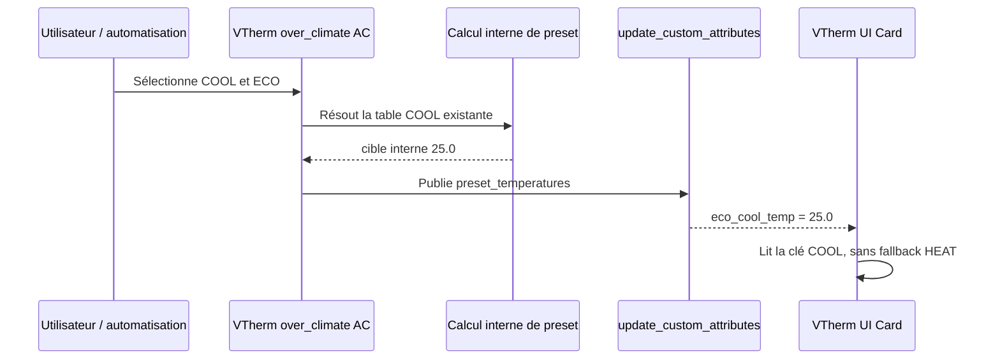

# Conception technique - Issue #2075 : contrat AC cohérent

- **Statut :** proposée pour validation avant développement
- **Version :** 1.1
- **Date :** 2026-09-30
- **Propriétaire :** à désigner
- **Sources normatives :** [revue #2075](issue-2075-review.md), [spécification #2075](issue-2075-specification.md)
- **Périmètre vérifié :** intégration Home Assistant `versatile_thermostat`. La version déployée de la VTherm UI Card n'est pas établie par les sources.

## 1. Objectif et périmètre

Cette conception couvre exactement les deux corrections de production et leurs tests :

1. un VTherm `over_valve` avec `ac_mode=True` expose et accepte `HEAT`, `COOL`, `SLEEP` et `OFF` ;
2. un VTherm `over_climate` avec `ac_mode=True` publie dans `preset_temperatures` les clés COOL lues par la carte : `eco_cool_temp`, `comfort_cool_temp`, `boost_cool_temp` et, lorsqu'elles sont configurées, `${preset}_cool_away_temp`.

La preuve runtime distingue les deux couches `over_climate` : avec `HEAT=19.0` et `COOL=25.0`, la cible interne devient `25.0` en `COOL` et `find_preset_temp(ECO)` retourne `25.0`. Le défaut est le contrat public : l'absence de `eco_cool_temp` fait retomber le lecteur local de carte sur `eco_temp=19.0`.

Le plan minimal est donc limité à `ThermostatOverValve.build_hvac_list()` et à `BaseThermostat.update_custom_attributes()`, cette dernière étant limitée aux `over_climate` AC. Aucun changement n'est conçu pour `find_preset_temp()`, `init_presets()`, `update_states()`, la régulation, les nombres de configuration ou le code de la carte.

**Faisabilité : confirmée.** Les deux défauts sont localisés et couverts par des tests rouges. Il n'existe pas de contradiction bloquante ; la version de carte déployée est une compatibilité à confirmer, pas un bloqueur du contrat attesté.

## 2. Faits vérifiés et historique causal

| Sujet | Fait vérifié | Confiance | Conséquence |
| --- | --- | --- | --- |
| Modes `over_valve` | Avec AC, `build_hvac_list()` retourne `[COOL, SLEEP, OFF]`. | Élevée : runtime et `git blame`. | Ajouter `HEAT` sans retirer `SLEEP`. |
| Cause `over_valve` | `e095f54036365fca1cd6f7e5b4733d7b7cce568c` (2026-09-17) a introduit cette branche AC. | Élevée : attribution directe par `git blame`. | Corriger la surcharge introduite par ce commit. |
| Calcul interne | Le scénario `19.0 -> 25.0` donne cible interne `25.0` et `find_preset_temp(ECO)=25.0`. | Élevée : test runtime discriminant. | Ne modifier aucun chemin interne de calcul ou d'état. |
| Contrat public | `preset_temperatures` n'a ni `eco_cool_temp`, ni autres clés COOL / COOL-away. | Élevée : test rouge et lecture de `update_custom_attributes()`. | Compléter l'attribut pour `over_climate` AC seulement. |
| Lecteur de carte | La copie locale ignorée cherche `${preset}_cool_temp`, puis `${preset}_cool_away_temp`, avant repli HEAT. | Élevée pour la copie ; moyenne pour le déploiement. | Publier `*_cool_temp`, jamais un nom dérivé du suffixe interne AC. |
| Cause du contrat incomplet | `27b0b364bae9315338a715257835248cab51647d` (2025-11-09) a introduit `preset_temperatures` sans clés COOL ; `7ea0b86220e322e5e36c50d4f19f5c90a291d267` et `0ab8aca006c1a2b10bdba2fca39c11800dc3ebcc` l'ont conservé. | Élevée : historique Git vérifié. | Ajouter les clés sans modifier les clés HEAT. |
| Historique de carte | L'artefact est ignoré, sans version, manifeste ni commit attribuable ici. | Faible pour son antériorité. | Ne pas lui attribuer de cause Git ; confirmer la version déployée. |

## 3. Composants et responsabilités

| Composant | Responsabilité | Modification conçue |
| --- | --- | --- |
| `ThermostatOverValve.build_hvac_list()` | Capacités HVAC de vanne. | Avec AC : ordre stable `HEAT`, `COOL`, `SLEEP`, `OFF`. Sans AC : inchangé. |
| `BaseThermostat.update_custom_attributes()` | Contrat public `preset_temperatures`. | Ajouter les clés COOL et COOL-away pour les seuls `over_climate` AC ; conserver toutes les clés HEAT et leur convention away actuelle. |
| `BaseThermostat.find_preset_temp()` | Sélection interne de preset. | Aucun changement : la sélection COOL est déjà prouvée correcte. |
| `BaseThermostat.init_presets()` / `update_states()` | Initialisation et publication d'état. | Aucun changement : aucun écrasement interne ne reste à rechercher. |
| `StateManager`, `ThermostatOverClimate`, régulation, sous-jacent | Calcul, régulation et commande. | Aucun changement ; non-régressions seulement. |
| Entités `number` | Valeurs HEAT, COOL et absence. | Aucune migration, renommage ou modification. |
| VTherm UI Card | Lecture des attributs. | Hors périmètre de code ; version déployée à confirmer. |

## 4. Modèle de données et contrat

Les clés HEAT existantes restent inchangées. Pour un `over_climate` AC, le contrat ajoute uniquement :

| Clé publique | Source | Publication |
| --- | --- | --- |
| `eco_cool_temp` | preset COOL `ECO` | toujours |
| `comfort_cool_temp` | preset COOL `COMFORT` | toujours |
| `boost_cool_temp` | preset COOL `BOOST` | toujours |
| `eco_cool_away_temp` | preset COOL-away `ECO` | selon convention away existante |
| `comfort_cool_away_temp` | preset COOL-away `COMFORT` | selon convention away existante |
| `boost_cool_away_temp` | preset COOL-away `BOOST` | selon convention away existante |

`FROST` n'a pas de variante COOL. Aucune clé fondée sur le suffixe interne AC ne doit être proposée, publiée ou documentée : elle ne correspond pas au lecteur attesté.

Les valeurs de validation sont `eco_temp=19.0`, `eco_cool_temp=25.0`, `eco_away_temp=16.0` et `eco_cool_away_temp=29.0`. Elles distinguent les tables sans imposer de valeur utilisateur.

### Invariants

1. `find_preset_temp(ECO)` reste à `25.0` en `COOL` et à `19.0` en `HEAT` dans le scénario discriminant.
2. La régulation et la commande sous-jacente restent inchangées ; la commande régulée peut différer de la cible fonctionnelle.
3. Les changements de preset, nombre et présence/absence ne mélangent pas les tables HEAT et COOL.
4. `OFF`, `SLEEP`, `FAN_ONLY` et `DRY` conservent leur comportement existant ; aucune règle ne leur est ajoutée.
5. Les VTherm hors `over_valve` pour les modes, et hors `over_climate` AC pour les clés, restent inchangés.

## 5. Flux de contrôle

Pour `over_valve`, le flux se limite à la liste de capacités : avec AC, l'entité publie `HEAT`, `COOL`, `SLEEP`, `OFF`, puis les transitions existantes conservent leur comportement.

## 6. Plan minimal de production

1. Compléter la branche AC de `ThermostatOverValve.build_hvac_list()` avec `HEAT`, en gardant `SLEEP` et la surcharge.
2. Compléter `BaseThermostat.update_custom_attributes()` avec les trois clés COOL et, uniquement lorsque configurées, les trois clés COOL-away, seulement pour `over_climate` AC.
3. Ajouter ou adapter les deux tests rouges, puis exécuter les validations complémentaires.

Il n'y a pas de modification conditionnelle dans `find_preset_temp()`, `init_presets()` ou `update_states()`. Le test $19\,°C / 25\,°C$ prouve déjà le calcul interne ; il ne doit plus servir à localiser un écrasement interne.

## 7. Stratégie de tests

### Tests rouges de correction

| ID | Test ciblé | Échec prouvé | Attendu |
| --- | --- | --- | --- |
| RT-001 | `tests/test_valve.py::test_over_valve_sleep_mode` : test `over_valve` AC de `build_hvac_list()` et acceptation HVAC. | `[COOL, SLEEP, OFF]` exclut `HEAT`. | `[HEAT, COOL, SLEEP, OFF]`; `HEAT` et `COOL` acceptés, `SLEEP` conservé. |
| RT-002 | `tests/test_auto_regulation.py::test_over_climate_ac_preset_temperatures_publish_cool_target` : test `over_climate` AC de contrat public avec `19.0`, `25.0` et variants away. | Cible / `find_preset_temp(ECO)` à `25.0`, mais pas de `eco_cool_temp`; le lecteur résout `eco_temp=19.0`. | Clés `*_cool_temp` et `${preset}_cool_away_temp` présentes lorsqu'elles sont configurées ; aucun fallback HEAT. |

### Validations complémentaires

| ID | Validation | Preuve attendue |
| --- | --- | --- |
| VC-001 | Calcul HEAT -> COOL -> HEAT | `19.0`, `25.0`, puis `19.0`, sans changement de calcul. |
| VC-002 | Régulation `over_climate` | La commande suit la régulation HEAT/COOL existante depuis la cible fonctionnelle. |
| VC-003 | Preset et nombres | Réapplication et mises à jour isolent les tables HEAT et COOL, avec publication correcte. |
| VC-004 | Présence / absence | `16.0` HEAT-away et `29.0` COOL-away restent distincts. |
| VC-005 | Modes transitoires | Tests existants `OFF`, `FAN_ONLY`, `DRY` et comportement `SLEEP` ne régressent pas. |
| VC-006 | Périmètre et indisponibilité | VTherm hors périmètre, clés HEAT, `frost_*` et comportement d'indisponibilité restent inchangés. |
| VC-007 | Carte compatible | Une version déclarée compatible affiche 25.0 / 29.0 sans fallback HEAT. |

## 8. Exploitation, sécurité et limites

- Aucun secret, accès réseau, stockage, permission ou événement Home Assistant n'est ajouté.
- Les preuves observables sont `hvac_modes`, la cible interne, `find_preset_temp(ECO)`, `preset_temperatures` et, pour la non-régression, la commande régulée existante.
- Les clés historiques ne sont ni supprimées ni renommées.
- Le risque résiduel est la compatibilité de version de la carte. La copie locale établit le lecteur de clés COOL, mais la version déployée reste à identifier avant la validation d'affichage.

## 9. Décisions, risques et questions

1. La liste `over_valve` reste explicite afin de préserver `SLEEP`, avec ajout de `HEAT`.
2. Le contrat public COOL est `*_cool_temp` et `${preset}_cool_away_temp`, uniquement pour les `over_climate` AC.
3. Le calcul interne $19\,°C / 25\,°C$ est une non-régression déjà prouvée, non une piste de correction.
4. La carte n'est pas modifiée dans ce dépôt et aucune compatibilité non vérifiée n'est inventée.

| Élément | Risque ou question | Action |
| --- | --- | --- |
| Carte déployée | Son schéma peut différer de la copie ignorée. | Confirmer sa version et son lecteur avant VC-007 / AC-010. |
| Valeurs away absentes | La convention actuelle doit être préservée. | Vérifier les assertions d'attribut de RT-002 et VC-004. |
| Périmètre `over_climate` | Une publication élargie modifierait un contrat non demandé. | Garde explicite de type et AC, vérifiée par VC-006. |

Il n'y a aucune contradiction bloquante. La question de version limite uniquement l'affirmation de compatibilité d'affichage pour un déploiement donné.

## 10. Traçabilité

`RT-001` et `RT-002` sont les deux tests rouges. La colonne « validations » référence les vérifications complémentaires à exécuter avec eux.

| Exigence / critère | Production concernée | Tests rouges | Validations |
| --- | --- | --- | --- |
| FR-001, FR-002, BR-001, AC-001, AC-002 | `ThermostatOverValve.build_hvac_list()` | RT-001 | VC-005, VC-006 |
| FR-003, FR-004, BR-002, AC-003, AC-004 | Invariant de calcul interne | RT-002 | VC-001, VC-002 |
| FR-005, BR-003 | Régulation inchangée | RT-002 | VC-002 |
| FR-006, FR-012, FR-013, BR-006, BR-007, AC-005, AC-009, AC-013 | `BaseThermostat.update_custom_attributes()` | RT-002 | VC-003, VC-004, VC-007 |
| FR-007, FR-008, BR-004, AC-006 | Attribut public et tables existantes | RT-002 | VC-001, VC-003 |
| FR-009, FR-010, BR-005, AC-007 | Attribut public et comportements existants | RT-002 | VC-003, VC-004 |
| FR-011, AC-008 | Aucun changement transitoire | RT-001, RT-002 | VC-005 |
| FR-014, AC-011 | Gestion d'indisponibilité inchangée | RT-002 | VC-006 |
| FR-015, NFR-001 à NFR-005, AC-012 | Ensemble minimal des deux méthodes | RT-001, RT-002 | VC-001 à VC-006 |
| AC-010 | Contrat public compatible avec carte | RT-002 | VC-007 |

La conception conserve le périmètre de la spécification, couvre tous les FR et AC mis à jour, et est faisable et testable avec les deux tests rouges et les validations complémentaires définies.
