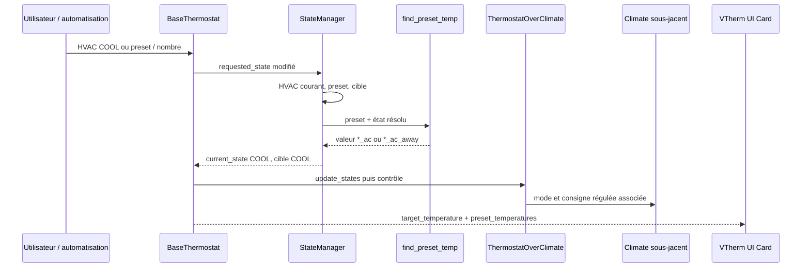

# Conception technique - Issue #2075 : cohérence AC

- **Statut :** proposée pour validation avant développement
- **Version :** 1.0
- **Date :** 2026-09-30
- **Propriétaire :** à désigner
- **Sources normatives :** [revue #2075](issue-2075-review.md), [spécification #2075](issue-2075-specification.md)
- **Périmètre de dépôt vérifié :** intégration Home Assistant `versatile_thermostat`. Le code source et la version de la VTherm UI Card à prendre en charge ne sont pas établis par les sources analysées.

## 1. Objectif et décision de périmètre

Cette conception couvre exactement les trois corrections validées :

1. un VTherm `over_valve` avec `ac_mode=True` expose et accepte `HEAT`, `COOL`, `SLEEP` et `OFF` ;
2. un VTherm `over_climate` AC sélectionne, publie et envoie une consigne COOL en `COOL`, puis de nouveau une consigne HEAT en `HEAT` ;
3. `preset_temperatures` expose à la VTherm UI Card les températures COOL, y compris les variantes absence lorsqu'elles sont configurées.

La correction ne change ni les algorithmes de régulation, ni les entités `number`, ni la configuration, ni le code de la carte, ni les autres types de VTherm. Elle ne requiert aucune migration.

**Faisabilité : confirmée.** Les modes, les tables de presets AC, le calcul d'état et l'attribut public existent déjà dans le dépôt. Aucune contradiction bloquante avec la spécification n'a été trouvée. La cause précise de la mauvaise consigne observée reste à démontrer par le test de reproduction défini en section 8 ; cette incertitude ne bloque pas les deux autres corrections, mais bloque la sélection d'un changement de production supplémentaire dans le chemin de consigne.

## 2. Faits vérifiés, diagnostic et hypothèses

| Sujet | Fait vérifié | Diagnostic / hypothèse | Conséquence de conception |
| --- | --- | --- | --- |
| Modes `over_valve` | `ThermostatOverValve.build_hvac_list()` retourne actuellement `[COOL, SLEEP, OFF]` si AC est actif. Le test paramétré de `test_over_valve_sleep_mode` attend cette liste. | Défaut déterministe et local : `HEAT` est explicitement omis. | Ajouter `HEAT` dans cette surcharge et mettre à jour le test existant ; conserver `SLEEP`. |
| Tables AC | `init_presets()` charge `CONF_PRESETS_WITH_AC` et `CONF_PRESETS_AWAY_WITH_AC`. Les nombres AC existent et `TemperatureNumber.async_set_native_value()` transmet leur nom canonique au VTherm. | Les données COOL existent ; ce n'est pas une absence de nombres ou de configuration. | Ne pas créer ni renommer de nombre. Vérifier le rafraîchissement de la table active par les tests. |
| Sélection de preset | `find_preset_temp()` ajoute `_ac` en `COOL` et conserve aussi `_ac` si l'état courant transitoire est `OFF`, `FAN_ONLY` ou `DRY` et l'état demandé est `COOL`. | La sélection nominale COOL est présente dans le code lu. Elle dépend toutefois d'états implicites (`current_state`/`requested_state`) et non d'un mode source explicitement fourni. | Ne pas conclure à une cause racine sur lecture statique. Écrire le test discriminant avant le correctif ; centraliser la règle seulement si ce test montre un chemin non couvert ou un écrasement ultérieur. |
| Ordre de calcul | `StateManager.calculate_current_state()` calcule HVAC, puis preset, puis température. Dans une transition nominale, le HVAC courant devient donc `COOL` avant l'appel à `find_preset_temp()`. | L'hypothèse « `current_state` reste à HEAT durant la transition nominale » est contredite par ce chemin. | Le test doit observer chaque étape et la commande sous-jacente, pas seulement la valeur finale. |
| Réapplication | `init_presets()` réapplique le preset courant ; `set_preset_temperature()` force un recalcul seulement si le nom du preset modifié commence par le preset actif ; `update_states()` publie l'état puis lance le contrôle et la commande sous-jacente. | Cause probable, non prouvée : une réapplication d'initialisation, de preset ou de nombre peut appeler la sélection avec un état courant transitoire non couvert, ou remplacer après coup une cible correctement calculée. | Tester séparément changement HVAC, re-sélection de preset, mise à jour de nombre et initialisation/restauration. Ajouter des traces de test sur les états demandé/courant et la dernière température envoyée. |
| Attribut public | `update_custom_attributes()` publie aujourd'hui seulement `frost`, `eco`, `comfort`, `boost` et leurs clés `*_away_temp` ; aucune clé AC n'est publiée. | Défaut déterministe de contrat public, indépendant de la consigne effective. | Ajouter des clés AC distinctes, sans supprimer ni modifier les clés chauffage existantes. |

La cause racine du symptôme `over_climate` n'est donc **pas établie** par les sources disponibles. Le comportement nominal lu semble déjà satisfaire la sélection COOL. Les hypothèses restent : état transitoire non couvert (notamment `SLEEP`), restauration/initialisation sans changement détecté, ou réécriture ultérieure par une notification sous-jacente. Le test de la section 8 est le contrôle peu coûteux qui les départage.

## 3. Composants et responsabilités

| Composant | Responsabilité dans la correction | Modification minimale envisagée |
| --- | --- | --- |
| `ThermostatOverValve.build_hvac_list()` | Construire les capacités HVAC propres aux vannes. | Avec AC : retourner dans un ordre stable `HEAT`, `COOL`, `SLEEP`, `OFF`. Sans AC : ne rien changer. |
| `BaseThermostat.init_presets()` | Charger les tables chauffage/AC et absence, puis réappliquer le preset restauré. | Pas de modification prévue sans test de défaillance. Couvrir sa réapplication dans les tests de restauration. |
| `StateManager` | Résoudre l'état courant à partir de l'état demandé et des gestionnaires de sécurité, fenêtre, central et auto start/stop. | Pas de modification prévue : son ordre HVAC -> preset -> température est l'invariant requis. |
| `BaseThermostat.find_preset_temp()` | Convertir preset + état effectif/intention en valeur chauffage ou refroidissement. | Point de correction conditionnel : factoriser au besoin la décision « table AC » dans une règle unique, sans changer les règles existantes OFF/FAN_ONLY/DRY. |
| `BaseThermostat.update_states()` | Publier cible/HVAC, déclencher le contrôle et l'envoi au sous-jacent. | Pas de modification prévue sans preuve d'écrasement. Les assertions doivent vérifier son ordre observable. |
| `ThermostatOverClimate` / `UnderlyingClimate` | Réguler et envoyer la consigne effective au climat sous-jacent. | Aucun changement d'algorithme. Vérifier la dernière consigne envoyée et l'appel de service. |
| `BaseThermostat.update_custom_attributes()` | Publier le contrat `preset_temperatures`. | Ajouter les clés AC pour un `over_climate` AC ; conserver toutes les clés actuelles et leur sémantique de valeur `0` absente. |
| `TemperatureNumber.async_set_native_value()` et `BaseThermostat.set_preset_temperature()` | Propager un changement de nombre vers la table de preset, puis demander un recalcul. | Aucun changement prévu. Les tests doivent prouver l'isolement HEAT/COOL et l'absence/présence. |
| Copie locale ignorée de la VTherm UI Card | Lire `preset_temperatures` et rechercher les clés de preset. | Hors périmètre de code. L'artefact `config/www/community/versatile-thermostat-ui-card/versatile-thermostat-ui-card.js` a été inspecté : pour cette copie seulement, son lecteur construit `${preset}_${suffix}_temp` et `${preset}_${suffix}_away_temp`. |

## 4. Modèle d'état, données et invariants

### États pertinents

- `requested_state` exprime l'intention utilisateur ou automatisation ; `current_state` est l'état rendu effectif par `StateManager`.
- Pour un état normal, `current_state.hvac_mode` doit devenir `requested_state.hvac_mode` avant le calcul de température.
- Les modes `OFF`, `FAN_ONLY` et `DRY` sont transitoires connus : lorsque `requested_state.hvac_mode == COOL`, ils doivent conserver la table `_ac`.
- `SLEEP` est une capacité propre à `over_valve`. La spécification demande de préserver son comportement, sans lui attribuer une nouvelle règle de régulation ou de table de preset.

### Tables de température

| Contexte | Source attendue pour `ECO`, `COMFORT`, `BOOST` | Exemple discriminant |
| --- | --- | --- |
| HEAT, présent | `<preset>` | `eco_temp = 19.0` |
| COOL, présent | `<preset>_ac` | `eco_ac_temp = 25.0` |
| HEAT, absence configurée | `<preset>_away` | `eco_away_temp = 16.0` |
| COOL, absence configurée | `<preset>_ac_away` | `eco_ac_away_temp = 29.0` |

`FROST` n'a pas de variante AC : aucune clé `frost_ac_*` n'est proposée. Une valeur indisponible ne doit jamais être remplacée par une valeur de l'autre table ; le comportement actuel d'indisponibilité ou de valeur par défaut reste applicable et doit être observé dans les tests.

### Invariants à préserver

1. En mode normal, la table est déterminée par le HVAC courant ; en mode transitoire documenté, elle est déterminée par l'intention HVAC demandée.
2. Toute consigne publiée comme cible doit être la même valeur fonctionnelle que celle transmise au climat, sous réserve du décalage de régulation existant et explicitement testé.
3. Un changement de nombre COOL ne change pas la valeur HEAT stockée, et inversement.
4. Les clés historiques de `preset_temperatures` restent inchangées et continuent d'être publiées.
5. La présence ne choisit une variante `*_away` que lorsque la fonctionnalité est configurée et que l'absence est détectée.

## 5. Contrats et point minimal de publication

### Contrat Home Assistant

- `hvac_modes` de `over_valve` AC contient exactement `HEAT`, `COOL`, `SLEEP`, `OFF` dans l'ordre choisi et stabilisé par le test. `async_set_hvac_mode(HEAT)` et `async_set_hvac_mode(COOL)` restent acceptés par l'entité.
- La cible publique du climate (`target_temperature`) doit correspondre à la consigne fonctionnelle sélectionnée. Pour un `over_climate` régulé, la commande transmise peut être la température régulée existante : le test doit alors comparer aussi la valeur attendue selon la règle de régulation, plutôt que supposer une égalité brute non existante.
- Les attributs `current_state` et `requested_state` restent observables ; aucun nouveau format n'est requis.

### Contrat `preset_temperatures` proposé

Pour un `over_climate` avec `ac_mode=True`, conserver les clés chauffage existantes et ajouter :

| Clé | Valeur source | Condition |
| --- | --- | --- |
| `eco_ac_temp` | `_presets[ECO_AC]` | toujours pour AC |
| `comfort_ac_temp` | `_presets[COMFORT_AC]` | toujours pour AC |
| `boost_ac_temp` | `_presets[BOOST_AC]` | toujours pour AC |
| `eco_ac_away_temp` | `_presets_away[ECO_AC_AWAY]` | valeur effective si configurée, sinon `0` comme les clés away historiques |
| `comfort_ac_away_temp` | `_presets_away[COMFORT_AC_AWAY]` | même règle |
| `boost_ac_away_temp` | `_presets_away[BOOST_AC_AWAY]` | même règle |

Ces six clés sont une proposition de conception fondée sur les conventions de nommage des presets et des entités `number`, et confirmée pour la copie locale ignorée inspectée `config/www/community/versatile-thermostat-ui-card/versatile-thermostat-ui-card.js` : son lecteur construit les clés `${preset}_${suffix}_temp` et `${preset}_${suffix}_away_temp`. Cette inspection confirme ce schéma uniquement pour cet artefact local ; elle ne constitue pas un contrat de carte déployée et n'établit ni sa version ni son manifeste.

**Condition de livraison :** avant de figer l'implémentation et d'exécuter AC-010, relever la version réellement prise en charge et vérifier son schéma dans son code source, sa documentation versionnée ou un test navigateur. Si elle attend un autre schéma, ne pas renommer les clés historiques : ajouter uniquement les alias explicitement validés, tester ces alias et documenter la compatibilité.

## 6. Flux de contrôle conçu

### Séquence nominale HEAT -> COOL -> HEAT

1. L'appel `async_set_hvac_mode(COOL)` met uniquement `requested_state.hvac_mode` à `COOL`.
2. `update_states()` appelle `StateManager` ; en absence de gestionnaire prioritaire, celui-ci met `current_state.hvac_mode` à `COOL`, puis recalcule preset et cible.
3. `find_preset_temp(ECO)` choisit `eco_ac`; avec le jeu discriminant, la cible est `25.0`, et non `19.0`.
4. `update_states()` publie la cible, applique le HVAC aux sous-jacents, puis lance le contrôle qui transmet la consigne pertinente au climat.
5. Le retour à `HEAT` refait exactement la séquence en sélectionnant `eco`, soit `19.0`.

### Preset, nombre et présence

- La re-sélection ou la réapplication de `ECO` passe par la même résolution de table et doit conserver `eco_ac` en COOL.
- La modification du nombre `eco_ac` appelle `set_preset_temperature("eco_ac", ...)`. Si ECO est actif, le recalcul forcé met à jour cible, publication et commande sans modifier `_presets[ECO]`.
- En absence, `find_preset_temp()` prend la variante away de la clé déjà suffixée `_ac`. Le test doit donc contrôler `eco_ac_away`, pas seulement le dictionnaire publié.

### Modes transitoires, annulations et indisponibilité

- `OFF`, `FAN_ONLY` et `DRY` conservent les règles actuelles : intention COOL -> table AC. Les tests existants de fenêtre/FAN_ONLY et d'auto-start-stop/DRY sont des non-régressions à conserver et compléter seulement si nécessaire.
- `SLEEP` ne doit pas introduire une nouvelle sélection de table. Son entrée/sortie pour `over_valve` garde les comportements d'ouverture, d'action HVAC et de chaudière existants.
- Si le climat sous-jacent est `unavailable` ou `unknown`, `ThermostatOverClimate.underlying_changed()` conserve le chemin actuel sans commande de remplacement. Il est interdit d'ajouter un repli HEAT dans ce cas.
- Lors d'une restauration, `init_presets()` doit réappliquer le preset restauré avec l'état HVAC résolu. Cette séquence est à tester, car elle est la piste probable la plus proche pour une cible réécrite après initialisation.

## 7. Plan de modification minimal et garde-fous

1. Modifier `ThermostatOverValve.build_hvac_list()` pour inclure `HEAT` dans la branche AC, sans supprimer la surcharge ni `SLEEP`.
2. Étendre uniquement la construction de `preset_temperatures` dans `BaseThermostat.update_custom_attributes()` avec les six clés AC proposées, limitée à `over_climate` AC conformément au périmètre. Ne pas toucher aux nombres ni aux clés historiques.
3. Ajouter d'abord le test de reproduction de consigne. Seulement s'il échoue sur le commit cible, corriger le plus proche des trois points qui l'explique :
   - `find_preset_temp()` si la valeur retournée est déjà HEAT avec HVAC/intentions COOL observées ;
   - l'appel depuis `init_presets()` ou `set_preset_temperature()` si le recalcul n'est pas déclenché ou lit le mauvais état ;
   - `update_states()` ou le flux `ThermostatOverClimate` si la cible est COOL avant le contrôle, puis la commande sous-jacente redevient HEAT.
4. Préférer, si une correction de sélection est nécessaire, un unique résolveur interne de « source de preset AC » réutilisé par les branches normal, OFF, FAN_ONLY et DRY. Il doit prendre explicitement HVAC courant et HVAC demandé, afin que la règle soit testable ; ne pas élargir silencieusement cette règle à `SLEEP`.

Cette stratégie évite une modification spéculative : le code lu contient déjà les gardes conçues pour COOL et les modes transitoires connus. Elle corrige néanmoins le défaut observé au point qui sera effectivement démontré par la reproduction.

## 8. Stratégie de tests et critère discriminant préalable

### Test de reproduction obligatoire avant toute correction de consigne

Ajouter dans le fichier de tests `over_climate` le scénario suivant, avec un climat sous-jacent fictif qui supporte `HEAT` et `COOL` :

1. Configurer `ac_mode=True`, preset `ECO`, `eco_temp=19.0`, `eco_ac_temp=25.0`; ajouter `eco_away_temp=16.0` et `eco_ac_away_temp=29.0` pour les sous-cas présence.
2. Activer `HEAT`, sélectionner `ECO`, attendre la fin des tâches et affirmer : état courant HEAT, cible publique `19.0`, et commande sous-jacente associée à 19.0 ou à sa valeur régulée HEAT explicitement calculée.
3. Activer `COOL` sans changer le preset. Après `update_states()` et après le cycle de contrôle, affirmer : `requested_state=COOL`, `current_state=COOL`, `find_preset_temp(ECO)=25.0`, cible publique `25.0`, et dernière commande sous-jacente COOL associée à 25.0 ou à sa valeur régulée COOL.
4. Réappliquer `ECO`, puis modifier le nombre `eco_ac` à `26.0`; réaffirmer cible/commande à 26.0 et `eco_temp` encore à 19.0.
5. Revenir à `HEAT`; affirmer 19.0. Modifier `eco_temp` à `18.0`; affirmer 18.0 et `eco_ac` encore à 26.0.

Ce test discrimine les causes : une divergence dès l'étape 3 identifie la sélection/ordre d'état ; une valeur correcte à l'étape 3 puis erronée aux étapes 4 ou 5 identifie une réapplication ; une cible correcte mais une commande incorrecte localise l'écrasement après `update_states()`.

### Matrice de validation

| Test ciblé | Preuve attendue | Exigences et critères couverts |
| --- | --- | --- |
| Extension de `test_over_valve_sleep_mode` ou test dédié | Liste AC exacte, acceptation de HEAT et COOL, `SLEEP` toujours fonctionnel | FR-001, FR-002, BR-001, AC-001, AC-002 |
| Nouveau scénario discriminant HEAT=19 / COOL=25 | État demandé/courant, cible et commande sous-jacente utilisent la table correcte dans les deux sens | FR-003 à FR-007, BR-002 à BR-004, AC-003, AC-004 |
| Réapplication de preset COOL | Réappliquer ECO ne repasse pas à 19 | FR-008, AC-005 |
| Mise à jour des deux `number` | Mise à jour isolée de chaque table, cible et commande rafraîchies | FR-009, BR-004, AC-006 |
| Présence/absence | 16 en HEAT-away et 29 en COOL-away, sans échange | FR-010, BR-005, AC-007 |
| Régression transitoire | OFF/FAN_ONLY/DRY avec intention COOL garde `_ac`; SLEEP conserve son comportement de vanne | FR-011, AC-008, FR-015 |
| Test d'attribut public | Les six clés AC ont les valeurs attendues; les clés HEAT historiques et `frost_*` restent inchangées | FR-012, FR-015, AC-009, AC-012 |
| Indisponibilité sous-jacente / valeur absente | Aucun repli implicite COOL -> HEAT ; comportement existant observable | FR-014, AC-011 |
| Validation manuelle ou navigateur avec version de carte déclarée | La carte affiche 25 et 29 dans son mode COOL | FR-013, NFR-002, AC-010, AC-013 |

Les tests HEAT existants, les tests de `number`, `test_window_action_fan_only_ac_mode_uses_ac_preset_temp` et les tests DRY existants doivent être exécutés comme régressions ciblées. Une assertion spécifique sur `preset_temperatures` est nécessaire : aucun test actuel ne couvre les valeurs AC publiées.

## 9. Observabilité, sécurité et exploitation

- Aucun secret, accès réseau, stockage persistant ou permission Home Assistant supplémentaire n'est ajouté.
- Les attributs existants `current_state`, `requested_state`, `target_temperature` et `preset_temperatures` suffisent à diagnostiquer la sélection ; les tests doivent les capturer lorsque le défaut est reproduit.
- Les événements HVAC/preset existants restent les sources d'audit ; aucun nouvel événement n'est nécessaire.
- Le risque opérationnel principal est un écart entre la copie locale ignorée inspectée et la carte réellement installée. L'inspection confirme le schéma `${preset}_${suffix}_temp` et `${preset}_${suffix}_away_temp` pour cette copie seulement ; la version déployée reste à identifier et sa compatibilité de schéma doit être vérifiée avant AC-010.

## 10. Décisions, risques, questions ouvertes et traçabilité

### Décisions proposées

1. Conserver une liste explicite `over_valve` avec les quatre modes, plutôt que supprimer sa surcharge et perdre `SLEEP`.
2. Publier les clés `*_ac_temp` et `*_ac_away_temp` en addition des clés existantes ; ne pas substituer les clés chauffage.
3. Rendre le test $19\,°C$ HEAT / $25\,°C$ COOL bloquant avant toute modification de `find_preset_temp()`, `init_presets()` ou `update_states()`.
4. Déclarer la compatibilité UI Card seulement après identification et vérification de la version effectivement prise en charge ; le schéma est confirmé pour la copie locale ignorée inspectée, mais cette preuve ne vaut pas pour la carte déployée.

### Risques et questions à décider

| Élément | Risque ou question | Décision / action requise |
| --- | --- | --- |
| Cause de consigne | Le défaut rapporté peut appartenir à un état de démarrage ou à un commit/configuration non reproduit par le chemin statique actuel. | Exécuter le test discriminant sur le commit de correction visé et conserver les états/calls observés. |
| Carte déployée | La carte installée peut être d'une version différente de la copie locale ignorée inspectée, dont le lecteur construit `${preset}_${suffix}_temp` et `${preset}_${suffix}_away_temp`. | Identifier la version déployée et vérifier son schéma avant AC-010 ; ajouter des alias seulement s'ils sont prouvés nécessaires. |
| Transitoires | `SLEEP` n'est pas explicitement traité comme source AC dans `find_preset_temp()`. | Préserver son comportement ; ne pas inventer de règle. Ouvrir une décision séparée seulement si un scénario réel exige une consigne en SLEEP. |
| Régulation | Une assertion naïve d'égalité entre cible et commande peut échouer avec un offset de régulation légitime. | Tester la valeur régulée attendue ou désactiver/rendre neutre la régulation dans le scénario de sélection. |
| Indisponibilité | Une valeur manquante peut aujourd'hui donner `0` dans les attributs, ce qui n'est pas la même chose qu'une valeur de consigne. | Conserver cette convention d'attribut pour compatibilité, et vérifier qu'elle n'entraîne pas un repli HEAT. |

### Traçabilité complète

| Exigence / critère | Composant principal | Validation |
| --- | --- | --- |
| FR-001, FR-002, AC-001, AC-002 | `ThermostatOverValve.build_hvac_list()` | Test modes/sleep over_valve |
| FR-003 à FR-009, AC-003 à AC-006 | `StateManager`, `find_preset_temp()`, `update_states()`, `ThermostatOverClimate`, nombres | Reproduction 19/25, reapply preset, mises à jour de nombres |
| FR-010, AC-007 | `find_preset_temp()`, tables `_away` | Scénarios absence HEAT/COOL |
| FR-011, AC-008 | Règles transitoires de `find_preset_temp()` et `StateManager` | Régressions OFF/FAN_ONLY/DRY/SLEEP |
| FR-012, AC-009 | `update_custom_attributes()` | Test de dictionnaire `preset_temperatures` |
| FR-013, AC-010, AC-013, NFR-002 | Contrat public et version de UI Card | Inspection de version et validation carte |
| FR-014, AC-011 | Gestion sous-jacente indisponible | Test indisponibilité sans repli croisé |
| FR-015, AC-012, NFR-001 à NFR-005 | Ensemble des modifications minimales | Tests HEAT existants, nombres et VTherm hors périmètre |

La conception confirme donc le même périmètre que la spécification, sans contradiction bloquante. Les deux défauts structurels (`over_valve` et attributs de carte) sont directement localisés ; la correction du flux `over_climate` est faisable et testable, mais son point de modification définitif doit être choisi après le résultat du test de reproduction, non sur une hypothèse statique.