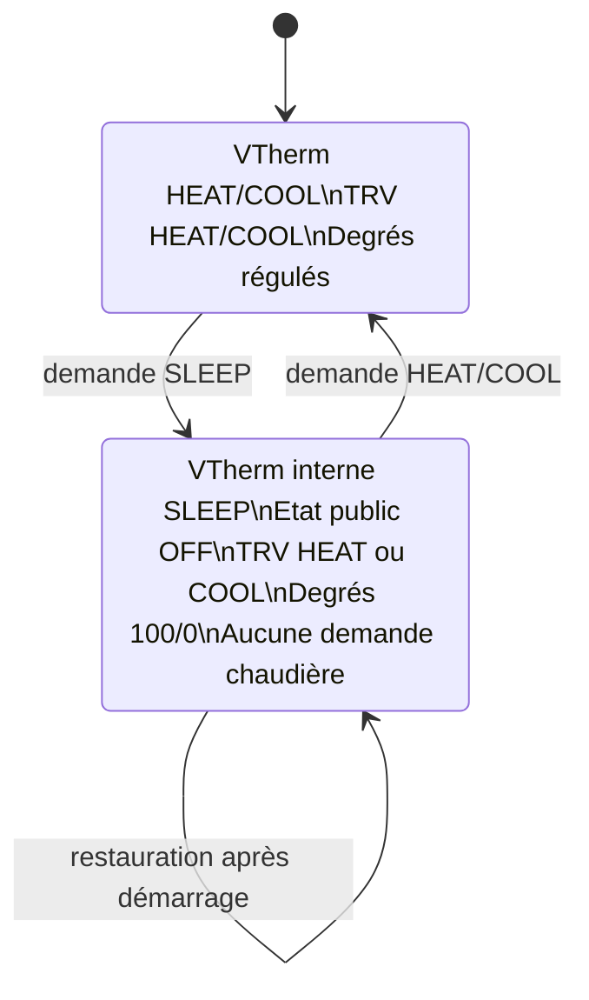
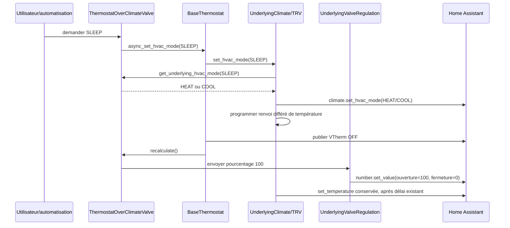

# Conception technique - issue #2077 : sommeil / maintenance de `ThermostatOverClimateValve`

- **Statut :** implémentée, validation locale réussie
- **Version :** 1.0
- **Date :** 2026-09-29
- **Propriétaire :** a désigner
- **Périmètre :** `ThermostatOverClimateValve` et ses sous-jacents directs uniquement
- **Sources fonctionnelles normatives :** [revue #2077](issue-2077-review.md), [spécification #2077](issue-2077-specification.md)
- **Code vérifié (information de faisabilité, non normatif) :** `thermostat_climate_valve.py`, `base_thermostat.py`, `underlyings.py`, `vtherm_hvac_mode.py`, `test_overclimate_valve.py`

## 1. Objectif et exigences couvertes

Corriger le sommeil de `ThermostatOverClimateValve` pour qu'une TRV recevant `OFF` comme ordre de fermeture physique reste réellement ouverte pour la maintenance. La correction dissocie strictement :

| Couche                               | Sommeil attendu                          |
| ------------------------------------ | ---------------------------------------- |
| Mode interne VTherm                  | `SLEEP`                                  |
| Etat public Home Assistant du VTherm | `OFF`                                    |
| Commande HVAC physique de la TRV     | `HEAT`, ou `COOL` si `ac_mode` est actif |
| Commandes de degrés                  | ouverture 100 %, fermeture 0 %           |
| Activité VTherm et chaudière         | aucune demande                           |

Cette conception couvre FR-001 a FR-013 et AC-001 a AC-009. Elle exclut explicitement `over_valve` sans climat sous-jacent, les autres types de VTherm, les réglages constructeur et toute modification globale du mapping public `SLEEP -> OFF`.

## 2. Faits vérifiés et dépendances

1. `BaseThermostat.update_states` applique le changement de mode à tous les `UnderlyingClimate`, puis publie le mode public par `to_legacy_ha_hvac_mode`. Le mapping public doit donc rester inchangé.
2. `UnderlyingClimate.set_hvac_mode` transforme actuellement le mode reçu en commande HA, vérifie la puissance pour `HEAT`/`COOL`, et programme un renvoi différé de température lors d'une activation. Ce renvoi reprend successivement `last_sent_temperature`, `regulated_target_temperature`, puis `target_temperature`.
3. `ThermostatOverClimateValve.recalculate` force déjà `valve_open_percent` a 100 en sommeil. `_send_regulated_temperature` délègue ensuite le pourcentage aux `UnderlyingValveRegulation`.
4. `ThermostatOverClimateValve` force déjà `hvac_action` a `OFF`, `should_device_be_active` a `False` et `device_actives` a une liste vide pendant le sommeil. Ces garde-fous isolent la demande de chaudière de l'état matériel de la TRV.
5. `UnderlyingClimate.check_initial_state` réutilise actuellement le mode interne restauré. Sans interception, un `SLEEP` restauré est reconverti en `OFF`.
6. `UnderlyingValveRegulation.check_initial_state` ne force actuellement pas la paire de degrés de sommeil : sa condition considère le sommeil comme non actif. La restauration ne satisfait donc pas assurément FR-006 sans adaptation locale.

## 3. Décision de conception

### 3.1 Point d'interception retenu

Introduire la résolution du **mode physique du sous-jacent** à l'entrée de `UnderlyingClimate.set_hvac_mode`, derrière un crochet polymorphe défini par le thermostat. Ce point est le plus local qui couvre à la fois :

- la transition fonctionnelle (`BaseThermostat.update_states`),
- le contrôle d'état initial (`UnderlyingClimate.check_initial_state`),
- tous les appels existants qui activent réellement la TRV,
- le dédoublonnage d'envoi et le renvoi différé de consigne déjà centralisés dans `UnderlyingClimate`.

Le comportement spécifique reste exclusivement dans `ThermostatOverClimateValve`. Le mapping `to_legacy_ha_hvac_mode(SLEEP) == OFF` n'est ni modifié ni contourné pour l'état public du VTherm.

### 3.2 Modification minimale proposée

| Fichier                       | Symbole                                                              | Changement proposé                                                                                                                                                                                                                                             |
| ----------------------------- | -------------------------------------------------------------------- | -------------------------------------------------------------------------------------------------------------------------------------------------------------------------------------------------------------------------------------------------------------- |
| `base_thermostat.py`          | nouvelle méthode protégée `get_underlying_hvac_mode(requested_mode)` | Retourne `requested_mode` par défaut. Ainsi tous les thermostats existants conservent exactement leur comportement.                                                                                                                                            |
| `thermostat_climate_valve.py` | surcharge `ThermostatOverClimateValve.get_underlying_hvac_mode`      | Retourne `COOL` si `requested_mode == SLEEP` et `ac_mode`, sinon `HEAT` si `requested_mode == SLEEP`; retourne le mode demandé dans tous les autres cas.                                                                                                       |
| `underlyings.py`              | `UnderlyingClimate.set_hvac_mode`                                    | Résout le mode physique une fois, avant la comparaison d'état, le contrôle de puissance, l'écriture interne, l'appel `climate.set_hvac_mode` et la décision de renvoi différé de température. Les opérations suivantes utilisent exclusivement ce mode résolu. |
| `underlyings.py`              | `UnderlyingValveRegulation.check_initial_state`                      | Ajoute une branche prioritaire de sommeil après l'initialisation des bornes : fixe `_percent_open` a 100, appelle `send_percent_open()` et sort. L'envoi est volontairement inconditionnel pour rétablir aussi le degré de fermeture a 0.                      |

La méthode `async_set_hvac_mode` déjà surchargée par `ThermostatOverClimateValve` ne doit pas être utilisée comme interception : déléguer ensuite au parent réintroduirait la commande `SLEEP`, donc `OFF`, dans la boucle générique. Surcharger intégralement `update_states` est écarté car cela dupliquerait la machine d'état commune et augmenterait sensiblement le risque de régression.

### 3.3 Contrat du crochet

```
get_underlying_hvac_mode(requested_mode: VThermHvacMode) -> VThermHvacMode
```

- **Entrée :** le mode interne voulu par le VTherm.
- **Sortie par défaut :** exactement l'entrée.
- **Sortie `ThermostatOverClimateValve` :** `HEAT` ou `COOL` uniquement pour l'entrée `SLEEP`; le choix dépend uniquement de `ac_mode`.
- **Idempotence :** une résolution répétée avec les mêmes entrées retourne le même mode; elle ne change aucun état.
- **Erreur :** aucune exception fonctionnelle attendue. Si une configuration rend le mode retourné non supporté par la TRV, le mécanisme existant de l'appel de service, ses journaux et sa reprise s'appliquent.

## 4. Modèle d'états et flux de données





## 5. Ordonnancement détaillé

### 5.1 Entrée en sommeil

1. La requête conserve `SLEEP` dans `requested_state` puis `current_state`.
2. `BaseThermostat.update_states` demande `set_hvac_mode(SLEEP)` au sous-jacent. Avant tout effet, `UnderlyingClimate` résout ce mode en `HEAT` ou `COOL` via la surcharge locale.
3. Le contrôle de puissance existant s'applique au mode physique actif. Une indisponibilité de puissance empêche l'appel de service, sans transformer le VTherm en demande de chaudière.
4. `UnderlyingClimate` annule seulement un ancien renvoi différé incompatible, envoie le nouveau mode physique, mémorise ce mode physique, puis programme le renvoi de température existant.
5. La base publie toujours `OFF` pour le VTherm car elle convertit le mode interne `SLEEP` avec le mapping existant. Elle conserve l'événement fonctionnel `SLEEP` et son motif d'arrêt.
6. `recalculate` fixe `valve_open_percent` a 100; le cycle de contrôle transmet ce pourcentage aux `UnderlyingValveRegulation`, qui calculent et envoient 100 % d'ouverture et 0 % de fermeture dans les bornes configurées.
7. Le callback différé de température se déclenche avec le délai existant. Il doit être conservé : certaines TRV exigent une consigne après une activation `HEAT`/`COOL`. Une transition ultérieure vers `OFF` l'annule par le mécanisme existant.
8. Les propriétés déjà spécialisées du thermostat gardent `hvac_action=OFF`, `should_device_be_active=False`, `device_actives=[]` et donc `nb_device_actives=0`. La TRV peut être physiquement en mode actif sans devenir une demande chaudière.

### 5.2 Sortie du sommeil

1. Une demande `HEAT` ou `COOL` remplace le mode interne `SLEEP` sans réinitialiser consigne ni préréglage.
2. Le crochet retourne ce mode sans transformation. La TRV reste dans le même mode si elle y est déjà, et `UnderlyingClimate` déduplique l'appel; un renvoi de température déjà prévu peut donc finir normalement.
3. `recalculate` ne force plus 100 %. Il réutilise TPI et les filtres existants; les degrés reviennent à la valeur régulée.
4. Les indicateurs d'activité reprennent leur calcul habituel. Une demande chaudière ne peut apparaître qu'à partir du comportement normal, jamais de l'état sommeil résiduel.

### 5.3 Démarrage ou restauration en sommeil

1. L'état restauré demeure interne `SLEEP`, avec représentation publique `OFF` et motif sommeil déjà restauré par `ThermostatOverClimateValve.restore_specific_previous_state`.
2. Lors de l'initialisation du climat, `UnderlyingClimate.check_initial_state` demande le mode interne restauré si la TRV est inactive. La résolution au début de `set_hvac_mode` le convertit en `HEAT`/`COOL`; la TRV reçoit donc le bon mode et le renvoi différé de température est reprogrammé.
3. Lors de l'initialisation de la vanne, la branche sommeil prioritaire de `UnderlyingValveRegulation.check_initial_state` envoie sans condition la paire dérivée de 100 %, y compris la fermeture a 0. Elle n'évalue pas `should_be_on`, qui doit rester faux pour préserver l'invariant chaudière.
4. Une fois tous les sous-jacents initialisés, le flux commun recalcule et contrôle l'état. Les envois répétés sont idempotents au niveau fonctionnel : ils reconfirment le contrat sommeil sans modifier l'état public ni créer d'activité VTherm.

## 6. Erreurs, observabilité et contraintes opérationnelles

- **Climat indisponible ou commande rejetée :** ne pas ajouter de rattrapage propre a #2077. Conserver l'erreur/journal de l'appel de service et le comportement existant de réinitialisation ou de réparation. Les invariants VTherm restent dérivés de `is_sleeping`, donc restent a l'arrêt.
- **Entité de degré indisponible ou limites incompatibles :** `send_percent_open` conserve le calcul et le traitement d'erreur existants. Le test doit vérifier la trace/journal déjà émis, pas inventer un nouveau diagnostic. L'ouverture physique n'est alors pas garantie et ne doit pas être annoncée comme réussie.
- **TRV sans `HEAT`/`COOL` compatible :** la résolution peut conduire a un appel rejeté; c'est une incompatibilité de matériel hors périmètre, explicitement non masquée par un repli sur `OFF` qui refermerait la vanne.
- **Puissance :** le contrôle de puissance de `UnderlyingClimate` est exécuté pour la commande physique. Il faut vérifier en test qu'il ne traduit pas cet état matériel en demande de chaudière. Aucune réservation ou politique de puissance nouvelle n'est introduite par la conception.
- **Observabilité :** les événements HVAC du VTherm restent `SLEEP`; l'état HA reste `OFF`. Les logs de commande du sous-jacent permettent de constater `HEAT`/`COOL`; les attributs existants de régulation de vanne exposent les degrés envoyés.
- **Sécurité et confidentialité :** aucun accès, secret, service externe ni donnée nouvelle.

## 7. Plan de tests précis

Les tests proposés modifient principalement `tests/test_overclimate_valve.py`. Ils emploient les `MockClimate` et entités `number` existants, attendent la fin des tâches HA et, pour le renvoi différé, avancent le temps ou invoquent le callback selon le patron déjà utilisé dans le dépôt.

| Test                                                                         | Préparation et action                                                                                              | Assertions obligatoires                                                                                                                                                                                                                   | Critères                               |
| ---------------------------------------------------------------------------- | ------------------------------------------------------------------------------------------------------------------ | ----------------------------------------------------------------------------------------------------------------------------------------------------------------------------------------------------------------------------------------- | -------------------------------------- |
| Adaptation du test existant `test_over_climate_valve_vtherm_hvac_mode_sleep` | `HEAT`, puis `SLEEP` avec `ac_mode=False`                                                                          | Etat public `OFF`; interne `SLEEP`; climat sous-jacent `HEAT` et non `OFF`; ouverture 100, fermeture 0; consigne et preset inchangés; `hvac_action=OFF`, `is_device_active=False`, `should_device_be_active=False`, `nb_device_actives=0` | AC-001, AC-002, AC-003                 |
| Nouveau scénario `ac_mode`                                                   | Initialiser le même montage avec `CONF_AC_MODE=True`, demander `SLEEP`                                             | Etat public `OFF`; climat sous-jacent `COOL`; degrés 100/0; mêmes invariants d'inactivité                                                                                                                                                 | AC-004                                 |
| Sortie de sommeil                                                            | Depuis le premier scénario, demander `HEAT` avec une demande TPI donnant 40 %                                      | Sous-jacent `HEAT`; preset/consigne conservés; ouverture 40 et fermeture 60, donc plus 100/0; activité calculée normalement                                                                                                               | AC-005                                 |
| Renvoi différé de température                                                | Espionner `climate.set_temperature`; entrer en sommeil et déclencher le délai `resend_delay_sec`                   | Une consigne non nulle est renvoyée après le mode physique actif, avec la priorité `last_sent_temperature`, puis régulée, puis cible; aucune commande différée ne survit a une sortie immédiate vers `OFF`                                | FR-010, contrainte de consigne, AC-007 |
| Restauration chauffage                                                       | Restaurer un VTherm en `SLEEP` avec climat initial `OFF` et degrés quelconques, puis initialiser climat et nombres | Après initialisation complète : public `OFF`, interne `SLEEP`, climat `HEAT`, degrés 100/0, invariants chaudière a l'arrêt                                                                                                                | AC-006, FR-011                         |
| Restauration climatisation                                                   | Même test avec `ac_mode=True`                                                                                      | Climat `COOL`, autres assertions identiques                                                                                                                                                                                               | AC-004, AC-006                         |
| Indisponibilité climat/nombre                                                | Marquer le climat ou un nombre `unavailable` avant la transition ou la restauration                                | Aucun indicateur VTherm/chaudière ne devient actif; le mécanisme de log/erreur existant est observé; aucune exception non gérée                                                                                                           | AC-007                                 |
| Non-régression locale                                                        | Exercices existants hors sommeil : `HEAT`, `COOL`, et `OFF` réel de `ThermostatOverClimateValve`                   | Les modes transmis et degrés existants restent inchangés; `OFF` réel transmet toujours `OFF`                                                                                                                                              | AC-008                                 |
| Non-régression de portée                                                     | Exécuter les tests `over_valve` existants et les tests génériques d'`UnderlyingClimate`                            | Aucun changement d'attente ni nouveau test imposant un comportement sommeil a `over_valve`                                                                                                                                                | AC-009                                 |

Le test de chaudière doit utiliser le point d'observation déjà employé par le dépôt (compteur d'appareils actifs ou faux gestionnaire de chaudière). Il doit prouver l'absence de demande fonctionnelle plutôt que déduire cette absence du seul mode physique de la TRV.

## 8. Faisabilité et couverture des critères

| Critère         | Faisabilité                                     | Mécanisme de conception                                                                                             |
| --------------- | ----------------------------------------------- | ------------------------------------------------------------------------------------------------------------------- |
| AC-001 / AC-004 | Oui                                             | Résolution locale `SLEEP -> HEAT/COOL` avant tout appel HA du sous-jacent                                           |
| AC-002          | Oui                                             | Calcul existant a 100 %, plus réémission de restauration des deux degrés                                            |
| AC-003 / AC-008 | Oui, sous validation de test                    | Les propriétés spécialisées ignorent déjà le mode physique de la TRV pendant `is_sleeping`                          |
| AC-005          | Oui                                             | Retour identitaire du crochet et calcul TPI inchangé                                                                |
| AC-006          | Oui après la branche de restauration des degrés | La résolution couvre le climat; la nouvelle branche couvre la vanne                                                 |
| AC-007          | Oui, sans mécanisme d'erreur nouveau            | Réutilisation des erreurs, journaux et tentatives existantes; invariants calculés indépendamment                    |
| AC-009          | Oui                                             | Le crochet par défaut est identitaire et `UnderlyingValveRegulation` reste réservé a la régulation directe de vanne |

## 9. Hypothèses, risques, divergences et questions ouvertes

### Hypothèses retenues

- `HEAT` est accepté comme mode physique de maintenance hors `ac_mode`, et `COOL` l'est avec `ac_mode`, conformément a la spécification.
- `UnderlyingClimate.set_hvac_mode` demeure l'unique passage de commande HVAC physique de ce flux; les appels de restauration et de fonctionnement normal y transitent.
- Les protections actuelles de `ThermostatOverClimateValve` constituent bien la source de vérité de l'activité chaudière.

### Risques

- Une TRV peut accepter le mode physique mais appliquer une logique interne de consigne inattendue. Le renvoi différé existant réduit ce risque sans le supprimer.
- Le contrôle de puissance exécuté pour `HEAT`/`COOL` doit être couvert en intégration : il ne doit pas déclencher de demande chaudière pendant le sommeil.
- L'ouverture physique effective dépend du matériel et des bornes des entités `number`; la correction garantit la commande, pas la télémétrie mécanique réelle.

### Divergences et bloqueurs

- **Aucune divergence fonctionnelle détectée** entre les deux sources approuvées et cette conception.
- **Aucun bloqueur de conception identifié.** Le seul écart actuel au contrat FR-011 est technique : la restauration ne réapplique pas de façon garantie la commande HVAC physique ni les deux degrés. Les deux adaptations proposées le couvrent.
- Question non bloquante : confirmer en développement le mécanisme de test le plus fiable pour faire avancer le callback `resend_delay_sec` sans rendre le test dépendant du temps réel.
- Question non bloquante : décider ultérieurement si une incompatibilité déclarée par une TRV doit recevoir un diagnostic dédié; ce n'est pas nécessaire a la correction #2077.

## 10. Traçabilité et conclusion

La proposition est convergente avec la spécification approuvée : elle conserve `SLEEP` en interne et `OFF` publiquement, commande `HEAT`/`COOL` uniquement a la TRV concernée, maintient 100 % / 0 % de degrés, préserve les invariants de chaudière, traite la sortie et la restauration, et ne modifie pas le mapping global `SLEEP -> OFF`.

Avant implémentation, l'acceptation doit porter sur le crochet identitaire en base, la surcharge strictement limitée a `ThermostatOverClimateValve`, l'envoi inconditionnel des deux degrés a la restauration et le plan de tests ci-dessus.