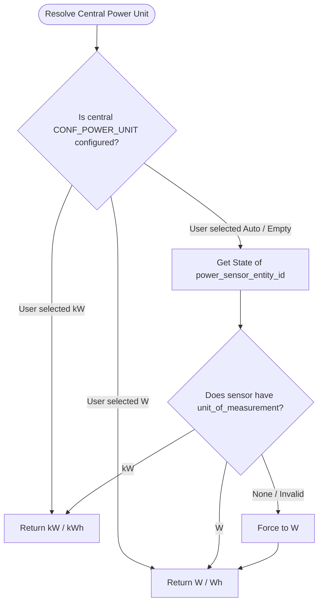

# Customizable and Adaptive Power/Energy Unit Specification (#1671)

## Overview

This document specifies the technical design to resolve issue #1671. The goal is to allow users to explicitly specify the power unit of all power attributes and adapt automatically to the power unit used by their configured sensors. Additionally, it addresses issue #2022 where `TotalPowerActiveDeviceForBoilerSensor` was lacking a `native_unit_of_measurement` property despite having a `SensorDeviceClass.POWER` device class, causing errors or warnings in Home Assistant.

## Architecture

To support customizable and adaptive units, the power and energy unit resolution follows a clear hierarchy:

### 1. Central Power Unit Resolution (Central Level)
The central power manager resolved unit is used for central operations, central sensors, and power shedding calculations. It is resolved as follows:
- **User Override**: If the user explicitly selects a power unit (`W` or `kW`) in the central power configuration, this unit is strictly respected.
- **Sensor Auto-adaptation**: If set to `Auto` (the default), the integration inspects the state of both central sensors (`power_sensor_entity_id` and `max_power_sensor_entity_id`) to dynamically extract their `unit_of_measurement` (valid values: `W`, `kW`).
- **Forced Fallback**: If the unit cannot be fetched dynamically at runtime (e.g., during startup when the sensor is not yet available, or if its state is unavailable), the integration **forces the unit to `W`** to avoid invalid state representations.

### 2. VTherm Power Unit Resolution (VTherm Level)
Each VTherm has its own power unit, independent from the central unit, applied to its `device_power` configuration and to its own power/energy sensors (`MeanPowerSensor`, `EnergySensor`).
- **Explicit choice only**: The unit is chosen from `W` or `kW` (defaulting to `W`). There is no `Auto` mode at this level because `device_power` is a manually entered value, not a sensor.
- **Scope**: This unit drives the interpretation of `device_power` and the display unit of the VTherm's own sensors. It does not affect the central unit.

### 3. Internal Normalized Calculations (Always in Watts)
Instead of dealing with unit conversions back and forth inside individual calculations and algorithms (which clutter the code and introduce high potential for bugs), **all internal calculations are executed strictly in Watts (`W`) and Watt-hours (`Wh`)**. This choice ensures a consistent and robust unit for all intermediate algorithmic evaluations (shedding, startup capability, available power, cumulative boiler sums, and energy accumulation).
- **Input Normalization (Boundary)**:
  - Whenever a VTherm's `device_power` configuration is read, it is normalized to Watts on-the-fly (multiplied by 1000 if the VTherm's unit is `kW`).
  - Whenever the main power sensor's or maximum power sensor's state value is retrieved, it is normalized to Watts if the sensor's current unit of measurement is `kW` (multiplied by 1000).
  - The restored total energy value (`total_energy`), persisted in the VTherm's configured unit, is converted **once** to Watt-hours on restore to align internal storage on Watt-hours.
- **Core Processing**:
  - Functions such as `calculate_shedding()` and `check_power_available()` in `FeatureCentralPowerManager`, as well as the energy accumulation (`total_energy`), operate completely with raw Watts / Watt-hours. No mixed-unit branching or unit verification occurs inside the core business logic.
- **Output De-normalization (Boundary / Display)**:
  - Values written back to sensors (`MeanPowerSensor`, `EnergySensor`, `TotalPowerActiveDeviceForBoilerSensor`) or exposed in state attributes (`add_custom_attributes`) are converted from Watts / Watt-hours to their designated display unit on-the-fly when stored or outputted.

### Unit Resolution Flow



## Class & Attribute Changes

### Configuration Schema
We introduce `CONF_POWER_UNIT` as a configuration option in the integration's schemas.

- **Files**: [custom_components/versatile_thermostat/const.py](custom_components/versatile_thermostat/const.py), [custom_components/versatile_thermostat/config_schema.py](custom_components/versatile_thermostat/config_schema.py)
- **Constant**: `CONF_POWER_UNIT = "power_unit"`
- **Schema**:
  - Add `CONF_POWER_UNIT` to `STEP_CENTRAL_POWER_DATA_SCHEMA` (central configuration). It presents a dropdown with options: `W`, `kW`, and `Auto` (defaults to `Auto`). The `STEP_NON_CENTRAL_POWER_DATA_SCHEMA` is left unchanged: no power sensor exists at that level (sensors are central-only).
  - Add `CONF_POWER_UNIT` to `STEP_MAIN_DATA_SCHEMA` (VTherm's main schema, where `CONF_DEVICE_POWER` is configured). It presents options: `W` or `kW` (defaults to `W`).

### Configuration Migration
Adding `CONF_POWER_UNIT` requires migrating existing config entries to preserve the unit currently displayed by the sensors (hence the continuity of Home Assistant long-term statistics).

- **Files**: [custom_components/versatile_thermostat/__init__.py](custom_components/versatile_thermostat/__init__.py), [custom_components/versatile_thermostat/const.py](custom_components/versatile_thermostat/const.py), [custom_components/versatile_thermostat/config_flow.py](custom_components/versatile_thermostat/config_flow.py)
- **Version**: bump `CONFIG_MINOR_VERSION` from `3` to `4` (constants are reused by `config_flow.py`).
- **Logic** (new `if version <= 203:` block in `async_migrate_entry`):
  - For every VTherm (excluding the central configuration) that has `CONF_DEVICE_POWER`: freeze `CONF_POWER_UNIT = "W"` if `device_power > 100`, otherwise `"kW"`. This exactly reproduces the historical `THRESHOLD_WATT_KILO` heuristic to keep the already-displayed unit.
  - For the central configuration: freeze `CONF_POWER_UNIT = "Auto"` (the unit will be resolved from the sensors).

### Central Power Feature Manager
The central power manager acts as the source of truth for the central/global power units and orchestrates unit-converted power operations.

- **File**: [custom_components/versatile_thermostat/feature_central_power_manager.py](custom_components/versatile_thermostat/feature_central_power_manager.py)
- **Properties**:
  - `power_unit` property: resolves either from central user config `CONF_POWER_UNIT`, or from the configured `power_sensor_entity_id` unit of measurement attribute, or falls back to `W`.
- **Helpers**:
  - Add normalization helpers inside the central power manager:
    ```python
    def to_watts(self, power: float, unit: str) -> float:
        """Convert any power value to Watts."""
        if unit == "kW":
            return power * 1000.0
        return power

    def from_watts(self, power_w: float, target_unit: str) -> float:
        """Convert a Watts value to a target display unit."""
        if target_unit == "kW":
            return power_w / 1000.0
        return power_w
    ```
- **Updates to calculation logic**:
  - In all internal algorithms (such as `calculate_shedding()`), normalize all inputs into Watts first:
    - Get `current_power_w = self.to_watts(self.current_power, self.power_unit)`
    - Get `max_power_w = self.to_watts(self.current_max_power, self.power_unit)`
    - For VTherms, read `device_power_w = self.to_watts(vtherm.device_power, vtherm.power_unit)`
  - Run calculations entirely using these Watt units.

### Sensors

#### MeanPowerSensor & EnergySensor
These sensors strictly use the respective VTherm's own configured power unit, rather than the central power manager's unit, avoiding sudden visual unit disruptions.

- **File**: [custom_components/versatile_thermostat/sensor.py](custom_components/versatile_thermostat/sensor.py)
- **Properties**:
  - `native_unit_of_measurement` in `MeanPowerSensor`:
    - Directly return the VTherm's configured `power_unit` (either `W` or `kW`, defaulting to `W`).
  - `native_unit_of_measurement` in `EnergySensor`:
    - Returns `UnitOfEnergy.WATT_HOUR` if the VTherm's power unit is `W`, or `UnitOfEnergy.KILO_WATT_HOUR` if the VTherm's power unit is `kW`.
- **Heuristic removal**: The old unit detection based on `THRESHOLD_WATT_KILO` (`sensor.py`) is removed in favor of the VTherm's configured unit.
- **Value Output**:
  - Although computed and accumulated in Watts / Watt-hours internally, the values assigned to `_attr_native_value` inside `async_my_climate_changed()` are converted on-the-fly to the VTherm's configured unit via `from_watts()` (or its energy equivalent).
  - Since `total_energy` is now stored in Watt-hours, the value restored on startup (previously in the configured unit) is converted once to Watt-hours in `base_thermostat.py` on state restore.

#### TotalPowerActiveDeviceForBoilerSensor
This sensor previously lacked a `native_unit_of_measurement` property. We expose it directly, and it aligns with the central manager's resolved unit.

- **File**: [custom_components/versatile_thermostat/sensor.py](custom_components/versatile_thermostat/sensor.py)
- **Properties**:
  - `native_unit_of_measurement`:
    - Returns the central power manager's resolved unit (defaults to `W` if unavailable).
- **Summation calculation**:
  - When totaling active VTherm power in `calculate_total_power()`, sum each active VTherm's `mean_cycle_power` after normalizing it to Watts (using `to_watts(entity.power_manager.mean_cycle_power, entity.power_unit)`).
  - Convert this aggregated Watts sum to the boiler sensor's unit (the central manager's resolved unit) using the helper `from_watts()` before writing to `_attr_native_value` on the boiler active power sensor.

### Extra State Attributes
Expose the resolved units in the extra state attributes to aid in troubleshooting and UI rendering.

- **File**: [custom_components/versatile_thermostat/feature_power_manager.py](custom_components/versatile_thermostat/feature_power_manager.py)
- **Updates**: Add `power_unit` and `energy_unit` values (originating from each VTherm's own configured `power_unit`) inside the `power_manager` dictionary under `add_custom_attributes`. Add `central_power_unit` referring to the central manager's resolved unit.

### Translations
The new `CONF_POWER_UNIT` field and its dropdown option labels must be translated.

- **Files**: [custom_components/versatile_thermostat/strings.json](custom_components/versatile_thermostat/strings.json) and every file under [custom_components/versatile_thermostat/translations/](custom_components/versatile_thermostat/translations/) (`cs`, `de`, `el`, `en`, `fr`, `it`, `pl`, `ru`, `sk`, `zh-Hans`).
- **Updates**: Add the `power_unit` key in the `data`/`data_description` sections of the relevant steps, plus the `selector` block (`translation_key`) for the option labels (`W`, `kW`, `Auto`).

---

## Validation and Tests Plan

### Unit and Integration Tests

1. **Unit Consistency and Conversion Checks**:
   - Class tests added in [tests/test_sensors.py](tests/test_sensors.py) to check that a VTherm's configured `power_unit` drives the unit of its measurement entities (`W`/`kW` and `Wh`/`kWh`).
   - Test the `to_watts`/`from_watts` normalization helpers in `FeatureCentralPowerManager`.
   - Assert that if the central power configuration is set to `Auto` and the power sensor has no state, the central unit falls back to `W`.

2. **Power Shedding and Allocation with Mixed Units**:
   - Add targeted test cases in [tests/test_power.py](tests/test_power.py) / [tests/test_central_power_manager.py](tests/test_central_power_manager.py) where the central power sensor is in `W` but some VTherms are configured with `device_power` in `kW` and others in `W`. Verify that shedding decisions remain correct thanks to the unified Watts processing.

3. **Central Boiler Sensor Conformity and Summation**:
   - Test suite [tests/test_central_boiler.py](tests/test_central_boiler.py) verifying that `TotalPowerActiveDeviceForBoilerSensor` consistently reports an appropriate unit of measurement (fixes #2022), and when summing VTherms with mixed units (e.g. one 1500W and one 2.0kW), the computed total is correctly converted and summed (e.g. 3500W or 3.5kW, matching the sensor's unit).

4. **Configuration Migration**:
   - Test in [tests/test_migration.py](tests/test_migration.py) verifying that migration freezes `CONF_POWER_UNIT` to `W` if `device_power > 100` and to `kW` otherwise for a VTherm, and to `Auto` for the central configuration, preserving the previously displayed unit.

5. **Persisted Energy Continuity**:
   - Test verifying that the restored `total_energy` value (expressed in the configured unit) is converted once to Watt-hours internally and rendered without disruption in the display unit.
