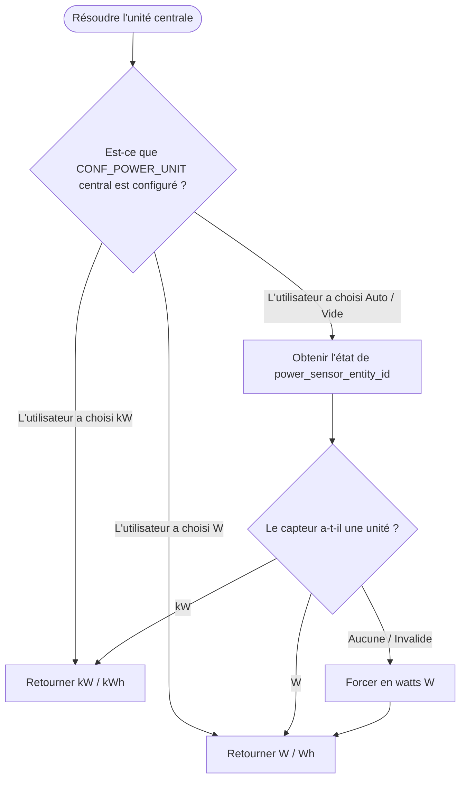

# Spécification Technique : Unités de puissance/énergie personnalisables et adaptatives (#1671)

## Présentation générale

Ce document spécifie la conception technique nécessaire pour résoudre l'issue #1671. L'objectif est de permettre aux utilisateurs de spécifier explicitement l'unité de puissance pour tous les attributs de puissance et de s'adapter automatiquement aux unités de puissance des capteurs configurés. De plus, cela résout l'issue #2022 où l'entité `TotalPowerActiveDeviceForBoilerSensor` manquait de la propriété `native_unit_of_measurement` malgré une classe d'appareil configurée sur `SensorDeviceClass.POWER`, ce qui générait des erreurs ou des avertissements dans Home Assistant.

## Architecture

Pour prendre en charge des unités personnalisables et adaptatives, la résolution des unités de puissance et d'énergie suit une hiérarchie claire et gère des unités potentiellement hétérogènes entre les thermostats (VTherms) et la configuration centrale :

Les clés internes du sélecteur de configuration et des traductions utilisent les valeurs minuscules `w`, `kw` et `auto`. À la frontière des entités Home Assistant, ces clés sont converties vers les unités d'affichage légales `W` et `kW`. Les helpers de conversion doivent accepter les deux représentations afin que les valeurs issues de Home Assistant et celles issues de la configuration empruntent le même chemin de conversion.

### 1. Résolution de l'unité centrale (Niveau Central)
L'unité résolue par le gestionnaire de puissance central sert d'unité de référence pour les opérations globales, les capteurs centraux et les algorithmes de délestage. Elle est résolue comme suit :
- **Surcharge utilisateur** : Si l'utilisateur choisit explicitement une unité de puissance (`W` ou `kW`) dans la configuration centrale, cette unité est strictement respectée.
- **Auto-adaptation des capteurs** : Si le paramètre est positionné sur `Auto` (valeur par défaut), l'intégration inspecte l'état des deux capteurs centraux (`power_sensor_entity_id` et `max_power_sensor_entity_id`) pour en extraire dynamiquement leur attribut `unit_of_measurement` (valeurs valides : `W` ou `kW`).
- **Repli forcé (Fallback)** : Si l'unité ne peut pas être récupérée au démarrage (capteur indisponible ou état inconnu), l'intégration **force l'unité en Watts (`W`)** pour éviter des états `None` ou incohérents.

### 2. Résolution de l'unité VTherm (Niveau VTherm)
Chaque VTherm dispose de sa propre unité de puissance, indépendante de l'unité centrale, appliquée à sa configuration `device_power` et à ses capteurs de puissance/énergie (`MeanPowerSensor`, `EnergySensor`).
- **Choix explicite uniquement** : L'unité est choisie parmi `W` ou `kW` (valeur par défaut : `W`). Il n'existe pas de mode `Auto` à ce niveau car `device_power` est une valeur saisie manuellement et non un capteur.
- **Portée** : Cette unité pilote l'interprétation de `device_power` et l'unité d'affichage des capteurs propres au VTherm. Elle n'affecte pas l'unité centrale.

### 3. Calculs internes normalisés (Toujours en Watts)
Plutôt que d'effectuer des conversions d'unités répétitives et bidirectionnelles au cœur même des calculs et des algorithmes (ce qui alourdirait le code et introduirait un fort risque d'erreurs), **tous les calculs internes de l'intégration s'exécutent strictement en Watts (`W`) et en Watt-heures (`Wh`)**. Ce choix assure une unité de mesure cohérente et robuste pour toutes les évaluations algorithmiques intermédiaires (gestion du délestage, évaluation de la capacité de démarrage, puissance disponible globale, cumuls de chaudière et cumul d'énergie).
- **Normalisation à l'entrée (Frontière)** :
  - Dès lors que la configuration `device_power` d'un VTherm est lue, elle est normalisée en Watts (multipliée par 1000 si le VTherm est configuré en `kW`).
  - Dès que la valeur d'état du capteur de puissance principal ou du capteur de puissance maximale est lue, elle est normalisée en Watts (multipliée par 1000 si l'unité déclarée par l'état actuel de l'entité est `kW`).
  - La valeur d'énergie totale (`total_energy`) restaurée au démarrage — persistée dans l'unité configurée du VTherm — est convertie **une seule fois** en Watt-heures lors de la restauration, afin d'aligner le stockage interne sur les Watt-heures.
- **Traitement interne** :
  - Les opérations clés telles que `calculate_shedding()` et `check_power_available()` dans `FeatureCentralPowerManager`, ainsi que le cumul d'énergie (`total_energy`), manipulent uniquement des Watts / Watt-heures bruts. L'algorithme métier est ainsi épuré de toute logique d'unités hétérogènes.
- **Dénormalisation à la sortie (Restitution / Affichage)** :
  - Les valeurs affectées aux capteurs (`MeanPowerSensor`, `EnergySensor`, `TotalPowerActiveDeviceForBoilerSensor`) ou exposées dans les attributs complémentaires (`add_custom_attributes`) sont converties à la volée depuis l'unité de stockage interne (Watts / Watt-heures) vers l'unité d'exposition désignée.

### Flux de résolution d'unité centrale



## Modifications des classes et des attributs

### Schéma de Configuration
Nous introduisons `CONF_POWER_UNIT` comme option de configuration dans les schémas d'intégration.

- **Fichiers** : [custom_components/versatile_thermostat/const.py](custom_components/versatile_thermostat/const.py), [custom_components/versatile_thermostat/config_schema.py](custom_components/versatile_thermostat/config_schema.py)
- **Constante** : `CONF_POWER_UNIT = "power_unit"`
- **Schéma** :
  - Ajouter `CONF_POWER_UNIT` dans `STEP_CENTRAL_POWER_DATA_SCHEMA` (configuration centrale). Il présente un menu déroulant avec les choix : `W`, `kW` et `Auto` (valeur par défaut : `Auto`). Le schéma `STEP_NON_CENTRAL_POWER_DATA_SCHEMA` n'est pas modifié : aucun capteur de puissance n'existe à ce niveau (les capteurs sont exclusivement centraux).
  - Ajouter `CONF_POWER_UNIT` dans `STEP_MAIN_DATA_SCHEMA` (schéma principal du VTherm, là où `CONF_DEVICE_POWER` est configuré). Il présente un menu déroulant avec les choix : `W` et `kW` (valeur par défaut : `W`).

### Migration de la configuration
L'ajout de `CONF_POWER_UNIT` nécessite une migration des entrées de configuration existantes afin de préserver l'unité actuellement affichée par les capteurs (et donc la continuité des statistiques long terme de Home Assistant).

- **Fichiers** : [custom_components/versatile_thermostat/__init__.py](custom_components/versatile_thermostat/__init__.py), [custom_components/versatile_thermostat/const.py](custom_components/versatile_thermostat/const.py), [custom_components/versatile_thermostat/config_flow.py](custom_components/versatile_thermostat/config_flow.py)
- **Version** : incrémenter `CONFIG_MINOR_VERSION` de `3` à `4` (les constantes sont reprises par `config_flow.py`).
- **Logique** (nouveau bloc `if version <= 203:` dans `async_migrate_entry`) :
  - Pour chaque VTherm (hors configuration centrale) possédant `CONF_DEVICE_POWER` : figer `CONF_POWER_UNIT = "W"` si `device_power > 100`, sinon `"kW"`. Ceci reproduit exactement l'heuristique historique `THRESHOLD_WATT_KILO` afin de conserver l'unité déjà affichée.
  - Pour la configuration centrale : figer `CONF_POWER_UNIT = "Auto"` (l'unité sera résolue depuis les capteurs).

### Gestionnaire Central de Puissance (Central Power Feature Manager)
Le gestionnaire de puissance central fait office de source de vérité pour déterminer les unités de puissance et d'énergie actives de la configuration centrale et gère les conversions d'unités de puissance.

- **Fichier** : [custom_components/versatile_thermostat/feature_central_power_manager.py](custom_components/versatile_thermostat/feature_central_power_manager.py)
- **Propriétés** :
  - Propriété `power_unit` : résout l'unité soit depuis la configuration utilisateur centrale `CONF_POWER_UNIT`, soit depuis l'attribut d'unité du capteur `power_sensor_entity_id`, soit retourne par défaut `W`.
- **Méthodes d'aide à la normalisation** :
  - Ajouter des helpers pour convertir à l'entrée et à la sortie :
    ```python
    def to_watts(self, power: float, unit: str) -> float:
      """Convertit une valeur de puissance en Watts.

      Accepte les clés du sélecteur ("w", "kw") et les unités Home Assistant ("W", "kW").
      """
        if to_internal_power_unit(unit) == "kw":
            return power * 1000.0
        return power

    def from_watts(self, power_w: float, target_unit: str) -> float:
      """Convertit une valeur de Watts vers l'unité de restitution cible.

      Accepte les clés du sélecteur ("w", "kw") et les unités Home Assistant ("W", "kW").
      """
        if to_internal_power_unit(target_unit) == "kw":
            return power_w / 1000.0
        return power_w
    ```
- **Prise en compte dans l'algorithme** :
  - Dans tous les calculs internes de délestage (p. ex. `calculate_shedding()`), normaliser d'abord toutes les entrées en Watts :
    - Établir `current_power_w = self.to_watts(self.current_power, self.power_unit)`
    - Établir `max_power_w = self.to_watts(self.current_max_power, self.power_unit)`
    - Pour chaque VTherm, évaluer `device_power_w = self.to_watts(vtherm.device_power, vtherm.power_unit)`
  - Réaliser l'intégralité du calcul avec ces valeurs brutes exemptes d'unités hétérogènes.

### Capteurs (Sensors)

#### MeanPowerSensor & EnergySensor
Ces capteurs utilisent strictement l'unité de puissance configurée pour leur VTherm parent respectif, évitant les sauts d'unités indésirables d'un thermostat à l'autre.

- **Fichier** : [custom_components/versatile_thermostat/sensor.py](custom_components/versatile_thermostat/sensor.py)
- **Propriétés** :
  - `native_unit_of_measurement` de la classe `MeanPowerSensor` :
    - Retourne directement l'unité `power_unit` configurée sur le VTherm (choix : `W` ou `kW`, valeur par défaut : `W`).
  - `native_unit_of_measurement` de la classe `EnergySensor` :
    - Retourne `UnitOfEnergy.WATT_HOUR` si l'unité de puissance du VTherm est `W`, ou `UnitOfEnergy.KILO_WATT_HOUR` si elle est configurée sur `kW`.
- **Suppression de l'heuristique** : L'ancienne détection d'unité basée sur `THRESHOLD_WATT_KILO` (`sensor.py`) est supprimée au profit de l'unité configurée du VTherm.
- **Restitution des valeurs** :
  - Bien que calculées et cumulées en Watts / Watt-heures en interne, les valeurs affectées à `_attr_native_value` lors de l'appel à `async_my_climate_changed()` sont converties à la volée vers l'unité configurée du VTherm via `from_watts()` (ou son équivalent énergie).
  - `total_energy` est persistée dans l'unité associée à `power_unit` (`Wh` pour W, `kWh` pour kW), et `total_energy_unit` identifie cette unité. À la restauration, les états historiques utilisent d'abord `configuration.power_unit` persisté, puis la configuration courante migrée lorsqu'aucune unité historique n'est disponible. Une unité restaurée différente de l'unité configurée est convertie puis immédiatement réécrite dans l'unité configurée.

#### TotalPowerActiveDeviceForBoilerSensor
Ce capteur manquait auparavant de la propriété `native_unit_of_measurement`. Nous l'exposons directement, et elle s'aligne sur l’unité du gestionnaire de puissance central.

- **Fichier** : [custom_components/versatile_thermostat/sensor.py](custom_components/versatile_thermostat/sensor.py)
- **Propriétés** :
  - `native_unit_of_measurement` :
    - Retourne l'unité résolue par le gestionnaire de puissance central (se replie sur `W` si indisponible).
- **Calcul global de cumul** :
  - Lors des cycles d'évaluation dans `calculate_total_power()`, normaliser la puissance de chaque VTherm actif en Watts (via `to_watts(entity.power_manager.mean_cycle_power, entity.power_unit)`) avant de calculer leur cumul brut en Watts.
  - Convertir ce cumul brut en Watts dans l'unité centrale cible via `from_watts()` avant d'assigner l'état final à `_attr_native_value`.

#### Seuil de puissance d'activation de la chaudière
Le `ActivateBoilerPowerThresholdNumber` expose la même unité résolue que le capteur de puissance chaudière. Les deux valeurs sont normalisées en Watts avant comparaison. Les anciens seuils restaurés sans unité enregistrée sont considérés comme des Watts, puis convertis dans l'unité d'affichage courante.

### Attributs d'état additionnels (Extra State Attributes)
Exposer les unités résolues dans les attributs d'état supplémentaires pour faciliter le dépannage et le rendu dans l'interface utilisateur.

- **Fichier** : [custom_components/versatile_thermostat/feature_power_manager.py](custom_components/versatile_thermostat/feature_power_manager.py)
- **Mises à jour** : Ajouter les valeurs `power_unit` et `energy_unit` issues de la configuration de chaque VTherm dans le dictionnaire `power_manager` dans `add_custom_attributes`. Ajouter `central_power_unit` pointant vers l'unité centrale résolue. Convertir `device_power` et `mean_cycle_power` vers `power_unit`, ainsi que `current_power` et `current_max_power` vers `central_power_unit`, avant leur exposition.

### Traductions
Le nouveau champ `CONF_POWER_UNIT` et les libellés des options du menu déroulant doivent être traduits.

- **Fichiers** : [custom_components/versatile_thermostat/strings.json](custom_components/versatile_thermostat/strings.json) et l'ensemble des fichiers de [custom_components/versatile_thermostat/translations/](custom_components/versatile_thermostat/translations/) (`cs`, `de`, `el`, `en`, `fr`, `it`, `pl`, `ru`, `sk`, `zh-Hans`).
- **Mises à jour** : Ajouter la clé `power_unit` dans les sections `data`/`data_description` des étapes concernées, ainsi que le bloc `selector` (`translation_key`) pour les libellés des options (`W`, `kW`, `Auto`).

---

## Plan de validation et de test

### Implémentation complétée (v1 - Phase de traduction)

✅ **Étape 1 : Normalisation de `device_power` et implémentation des conversions** (COMPLÉTÉ)
- Normalisation de `device_power` en Watts à l'initialisation dans `feature_power_manager.py`
- Conversion des valeurs affichées `MeanPowerSensor` et `EnergySensor` depuis Watts/Wh vers l'unité configurée
- Conversion de `total_energy` restaurée depuis l'unité configurée vers Wh interne (une seule fois au démarrage)
- Toutes les conversions testées syntaxiquement via `python3 -m py_compile`

✅ **Étape 2 : Traductions et schéma de configuration** (COMPLÉTÉ)
- Ajout des clés `power_unit` et `central_power_unit` dans `strings.json` (maître anglais)
- Traduction sélecteur complétée dans les 10 fichiers de localisation :
  - ✅ fr.json (Français)
  - ✅ en.json (Anglais supplémentaire)
  - ✅ de.json (Allemand)
  - ✅ cs.json (Tchèque)
  - ✅ el.json (Grec)
  - ✅ it.json (Italien)
  - ✅ pl.json (Polonais)
  - ✅ ru.json (Russe)
  - ✅ sk.json (Slovaque)
  - ✅ zh-Hans.json (Chinois simplifié)
- Tous les fichiers JSON validés comme syntaxiquement corrects

### Tests unitaires et d'intégration (Phase 2 - Complétée)

1. ✅ **Vérification de la cohérence des unités et conversions** :
  - [tests/test_sensors.py](tests/test_sensors.py) vérifie que la configuration `power_unit` d'un VTherm détermine l'unité de ses entités de mesure (`W`/`kW` et `Wh`/`kWh`).
  - [tests/test_central_power_manager.py](tests/test_central_power_manager.py) vérifie les helpers de normalisation et le repli sur `W` lorsqu'un capteur central est absent ou utilise une unité invalide.
  - [tests/test_config_flow.py](tests/test_config_flow.py) vérifie les valeurs par défaut et disponibles des formulaires VTherm (`W`, `kW`) et central (`W`, `kW`, `Auto`).

2. ✅ **Délestage et comportement face à des unités hétérogènes** :
  - [tests/test_power.py](tests/test_power.py) vérifie qu'un VTherm configuré en `kW` est normalisé en Watts avant le calcul de puissance disponible.

3. ✅ **Conformité et somme du capteur chaudière globale** :
  - [tests/test_central_boiler.py](tests/test_central_boiler.py) vérifie l'unité de mesure et la somme convertie d'unités mixtes (1500 W + 2,0 kW = 3,5 kW).
  - Il vérifie aussi les seuils d'activation de chaudière et la restauration d'un ancien seuil de 1000 W avec une centrale en kW.

4. ✅ **Migration de configuration** :
  - [tests/test_migration.py](tests/test_migration.py) vérifie la migration de `CONF_POWER_UNIT` aux frontières 99, 100 et 101, ainsi que `Auto` pour la configuration centrale.

5. ✅ **Continuité de l'énergie persistée** :
  - [tests/test_state_manager.py](tests/test_state_manager.py) vérifie qu'une énergie restaurée en `kWh` est convertie une seule fois en Wh interne et reste correctement affichable en kWh, y compris après le changement de l'unité configurée d'un VTherm.
