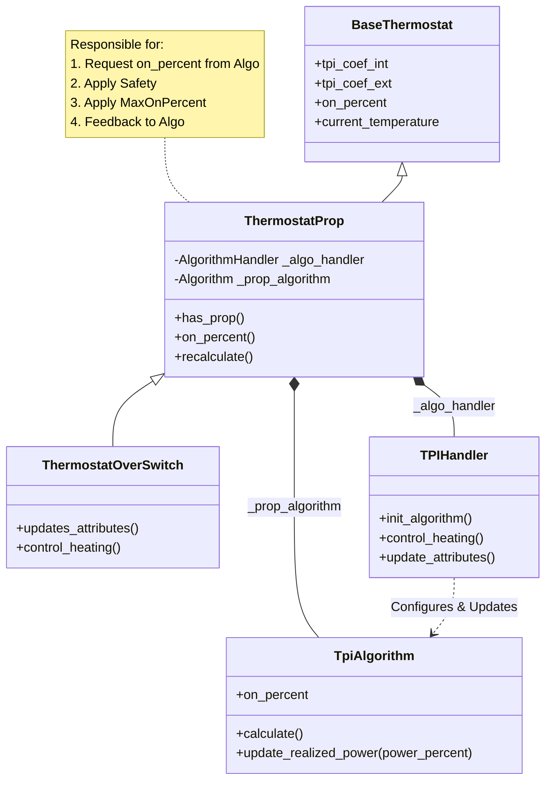
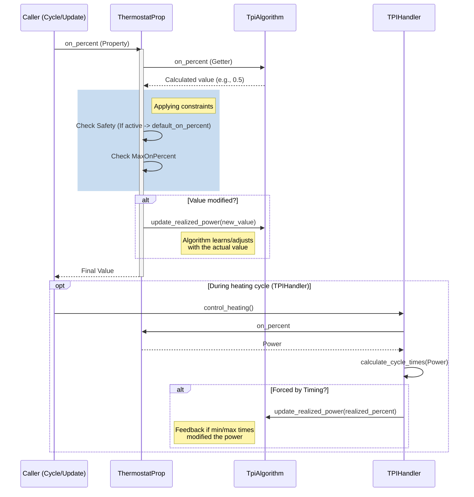

# New Structure of `ThermostatProp` (Refactor)

This document details the new architecture of the `ThermostatProp` class and its associated components following recent refactorings. The main objective was to centralize safety and clamping logic in the parent class and introduce a feedback mechanism to the algorithms.

## Main Changes

1.  **Centralization of Safety and Clamping**:
    *   Previously, each algorithm (TPI, SmartPI) managed its own safety logic ("safe" mode) and limitation (`max_on_percent`).
    *   Now, **`ThermostatProp`** is solely responsible for applying these constraints via its `on_percent` property. The algorithm proposes a raw value, and `ThermostatProp` modifies it if necessary.

2.  **Feedback Mechanism (`update_realized_power`)**:
    *   Since the algorithm no longer knows the final value used (as it's modified by `ThermostatProp` or temporal constraints), an `update_realized_power(val)` method has been added.
    *   `ThermostatProp` calls this method to inform the algorithm of the power *actually* applied. This is crucial for learning algorithms (like SmartPI or AutoTPI) that need to "know" what really happened.

3.  **Encapsulation via `Handler`**:
    *   Logic specific to each type (TPI vs SmartPI) is delegated to a **Handler** (e.g., `TPIHandler`).
    *   The Handler now interacts via the **public properties** of `BaseThermostat` (e.g., `self.thermostat.tpi_coef_int`) instead of accessing protected private attributes (`_tpi_coef_int`), improving maintainability.

4.  **Timing Utilities (`timing_utils`)**:
    *   Cycle time calculation (`on_time_sec`, `off_time_sec`) has been extracted into `timing_utils.calculate_cycle_times`.
    *   This calculation now returns a `forced_by_timing` indicator if timing constraints (min_on/off) forced a power modification. This also triggers feedback to the algorithm.

## Architecture Diagram (Mermaid)

## Data Flow (Power Calculation)

The following diagram shows how power is calculated and how feedback is sent back.

## Key Concepts

### Power Calculation Flow

1. **Request**: A component requests the `on_percent` value from `ThermostatProp`
2. **Algorithm Calculation**: The underlying algorithm (TPI, SmartPI, etc.) calculates a raw power percentage
3. **Constraint Application**: `ThermostatProp` applies safety mode and max_on_percent constraints
4. **Feedback**: If the value was modified, the algorithm is notified via `update_realized_power()`

### Responsibility Separation

- **Algorithm**: Focuses purely on calculating the optimal power based on temperature differential and learned parameters
- **ThermostatProp**: Manages safety constraints, power limits, and coordinates feedback
- **Handler**: Bridges the thermostat entity with the specific algorithm implementation
- **Timing Utils**: Handles time-based constraints (min_on_time, min_off_time) that may further modify power output

## Benefits of This Architecture

1. **Single Responsibility**: Each component has a clear, focused purpose
2. **Maintainability**: Changes to safety logic or constraints only require updates in one place
3. **Learning Support**: Algorithms receive accurate feedback about actual power applied, improving learning accuracy
4. **Extensibility**: New algorithms can be added by implementing the algorithm interface and creating a corresponding handler
5. **Testability**: Isolated components are easier to unit test independently