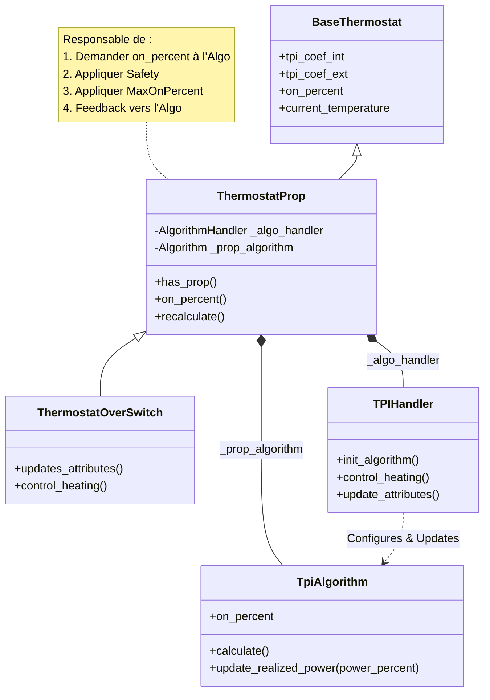
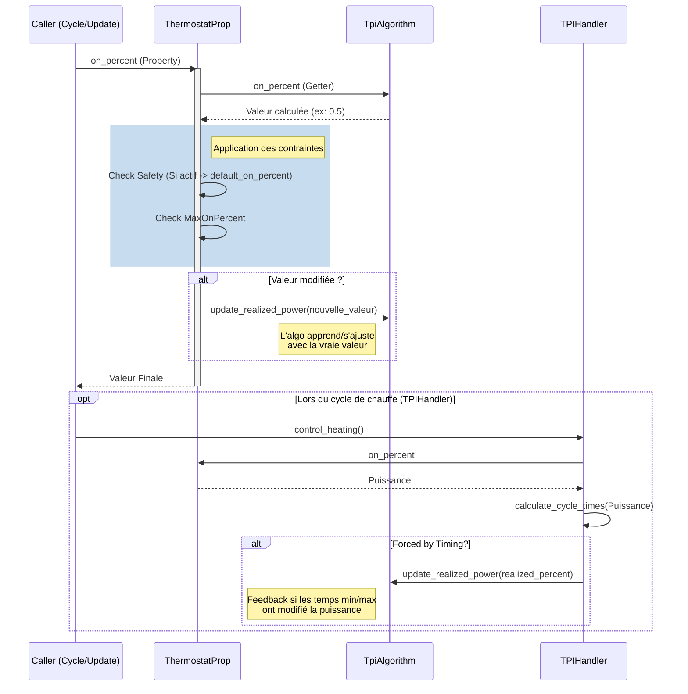

# Nouvelle Structure de `ThermostatProp` (Refactor)

Ce document détaille la nouvelle architecture de la classe `ThermostatProp` et de ses composants associés suite aux récents refactorings. L'objectif principal était de centraliser la logique de sécurité et de "clamping" (limitation) dans la classe parente et d'introduire un mécanisme de feedback vers les algorithmes.

## Changements Principaux

1.  **Centralisation de la Sécurité et du Clamping** :
    *   Auparavant, chaque algorithme (TPI, SmartPI) gérait sa propre logique de sécurité (mode "safe") et de limitation (`max_on_percent`).
    *   Désormais, **`ThermostatProp`** est le seul responsable de l'application de ces contraintes via sa propriété `on_percent`. L'algorithme propose une valeur brute, et `ThermostatProp` la modifie si nécessaire.

2.  **Mécanisme de Feedback (`update_realized_power`)** :
    *   Puisque l'algorithme ne connait plus la valeur finale utilisée (car modifiée par `ThermostatProp` ou par des contraintes temporelles), une méthode `update_realized_power(val)` a été ajoutée.
    *   `ThermostatProp` appelle cette méthode pour informer l'algorithme de la puissance *réellement* appliquée. C'est crucial pour les algorithmes d'apprentissage (comme SmartPI ou AutoTPI) qui doivent "savoir" ce qui s'est réellement passé.

3.  **Encapsulation via `Handler`** :
    *   La logique spécifique à chaque type (TPI vs SmartPI) est déléguée à un **Handler** (ex: `TPIHandler`).
    *   Le Handler interagit désormais via les **propriétés publiques** de `BaseThermostat` (ex: `self.thermostat.tpi_coef_int`) au lieu d'accéder aux attributs privés protégés (`_tpi_coef_int`), améliorant la maintenabilité.

4.  **Utilitaires de Temps (`timing_utils`)** :
    *   Le calcul des temps de cycle (`on_time_sec`, `off_time_sec`) a été extrait dans `timing_utils.calculate_cycle_times`.
    *   Ce calcul retourne désormais un indicateur `forced_by_timing` si les contraintes de temps (min_on/off) ont forcé une modification de la puissance. Cela déclenche également le feedback vers l'algorithme.

## Schéma d'Architecture (Mermaid)

## Flux de Données (Calcul de la Puissance)

Le diagramme suivant montre comment la puissance est calculée et comment le feedback est renvoyé.

