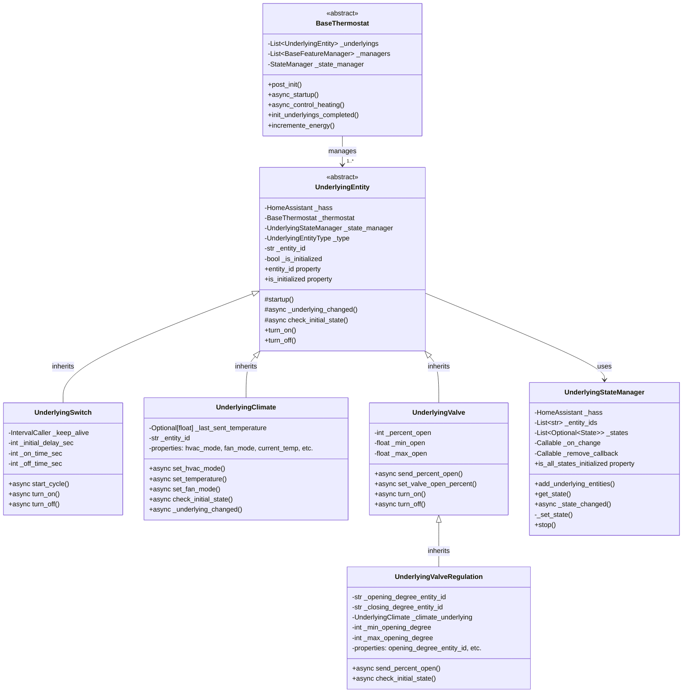
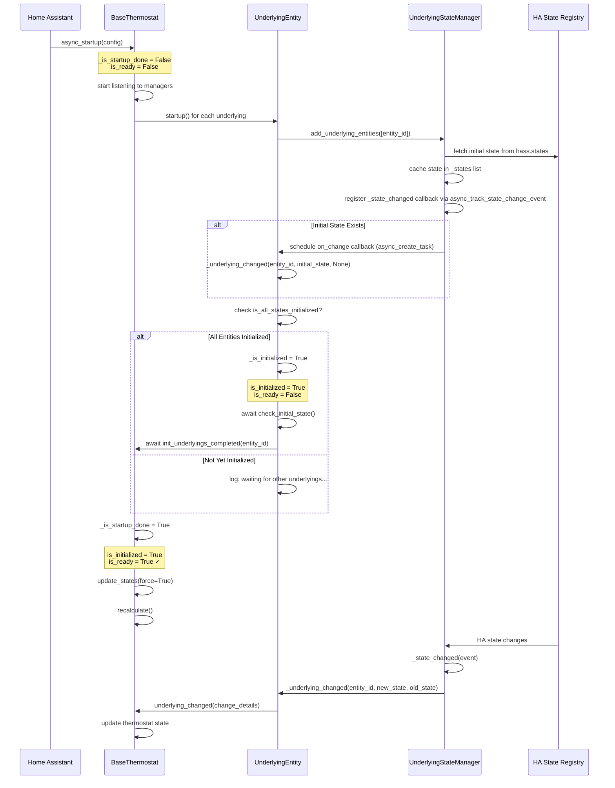
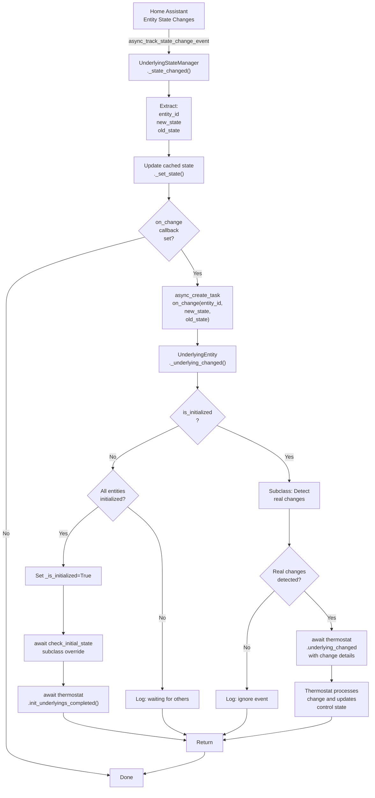
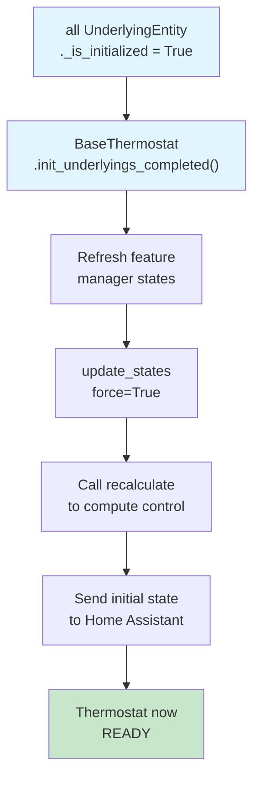

# Underlying Entities System Documentation

## Overview

The **Underlying Entities System** is a core architectural component of VersatileThermostat that manages communication between the thermostat and real Home Assistant entities (climate, switch, valve). It implements a publish-subscribe pattern with centralized state management to decouple the thermostat logic from Home Assistant entity details.

### Key Concept

The underlying system creates abstraction layers around Home Assistant entities:

```
Home Assistant Entity (climate, switch, valve)
        ↓
UnderlyingStateManager (state caching, listening)
        ↓
UnderlyingEntity subclass (climate/switch/valve-specific logic)
        ↓
BaseThermostat (business logic, control algorithms)
```

### Benefits

- **Abstraction:** Thermostat doesn't directly depend on Home Assistant entities
- **Decoupling:** State changes are handled asynchronously via callbacks
- **Centralization:** All state access goes through UnderlyingStateManager
- **Flexibility:** Easy to add new underlying types (custom entity support)
- **Reusability:** Same underlying can be used by multiple thermostats

---

## Architecture

### Class Diagram



---

## Core Components

### UnderlyingStateManager

**File:** [underlying_state_manager.py](../../custom_components/versatile_thermostat/underlying_state_manager.py)

**Purpose:** Centralized state manager that listens to Home Assistant state change events for underlying entities and maintains a cache of their last known states.

**Responsibilities:**
- Listen to state changes for multiple underlying entities via `async_track_state_change_event`
- Cache the last known `State` object for each monitored entity
- Invoke callbacks when states change
- Manage listener lifecycle (start/stop)
- Track initialization status of all monitored entities

**Key Attributes:**

| Attribute          | Type                    | Description                                             |
| ------------------ | ----------------------- | ------------------------------------------------------- |
| `_hass`            | `HomeAssistant`         | Home Assistant instance                                 |
| `_entity_ids`      | `List[str]`             | List of entity IDs being monitored                      |
| `_states`          | `List[Optional[State]]` | Cached state objects (parallel list with `_entity_ids`) |
| `_on_change`       | `Optional[Callable]`    | Callback function invoked on state changes              |
| `_remove_callback` | `Optional[Callable]`    | Reference to state change event listener (for cleanup)  |

**Lifecycle Methods:**

```python
def __init__(hass: HomeAssistant, on_change: Callable = None)
    # Initialize manager with no monitored entities
    # Entities can be added dynamically later

def add_underlying_entities(entity_ids: List[str]) -> None
    # Add entities to monitor at runtime
    # Retrieves initial state from Home Assistant
    # Re-registers state change listener for updated entity list
    # Schedules on_change callbacks for entities with initial state

def stop() -> None
    # Stop listening to state changes
    # Cleans up event listener
    # Prevents further callbacks
```

**State Access:**

```python
def get_state(entity_id: str) -> Optional[State]
    # Return cached State object for entity_id
    # Returns None if entity not found in manager

@property
def is_all_states_initialized -> bool
    # Check if ALL monitored entities have valid states
    # Considers state "valid" if:
    #   - State is not None
    #   - State is not STATE_UNAVAILABLE
    #   - State is not STATE_UNKNOWN
    # Returns False if any entity missing or unavailable
    # Returns True only if all entities have valid states
```

**Internal Methods:**

```python
async def _state_changed(event) -> None
    # Internal callback invoked by Home Assistant on state changes
    # Extracts entity_id, new_state, old_state from event
    # Updates cached state via _set_state()
    # Schedules on_change callback if present

def _set_state(entity_id: str, state: Optional[State]) -> bool
    # Update cached state for entity_id
    # Returns True if update was processed
    # Raises UnknownEntity if entity_id not managed

def _index_of(entity_id: str) -> Optional[int]
    # Return index of entity_id in _entity_ids list
    # Returns None if entity not found
```

**Usage Example:**

```python
# In UnderlyingEntity.__init__
self._state_manager = UnderlyingStateManager(
    self._hass,
    on_change=self._underlying_changed
)

# In UnderlyingEntity.startup()
self._state_manager.add_underlying_entities([self._entity_id])

# When state changes in Home Assistant, _underlying_changed() is called
```

**State Initialization Flow:**

1. Manager created (no entities monitored yet)
2. `add_underlying_entities([entity_id])` called
3. Manager fetches initial state from Home Assistant via `hass.states.get(entity_id)`
4. If state exists and is not unavailable, schedules `on_change` callback
5. State change listener registered for all monitored entities
6. When Home Assistant state changes, `_state_changed()` is invoked
7. New state is cached and `on_change` callback is scheduled

---

### UnderlyingEntity (Base Class)

**File:** [underlyings.py](../../custom_components/versatile_thermostat/underlyings.py) - Lines 70-320

**Purpose:** Abstract base class representing any Home Assistant entity that the thermostat controls (climate, switch, or valve).

**Responsibilities:**
- Manage communication with a single underlying Home Assistant entity
- Listen to state changes via UnderlyingStateManager
- Execute control commands on the underlying entity (service calls)
- Coordinate initialization with thermostat
- Maintain entity state and availability status

**Key Attributes:**

| Attribute                     | Type                       | Description                                        |
| ----------------------------- | -------------------------- | -------------------------------------------------- |
| `_hass`                       | `HomeAssistant`            | Home Assistant instance                            |
| `_thermostat`                 | `BaseThermostat`           | Reference to parent thermostat                     |
| `_type`                       | `UnderlyingEntityType`     | Type of entity (SWITCH, CLIMATE, VALVE)            |
| `_entity_id`                  | `str`                      | Home Assistant entity ID (e.g., `climate.bedroom`) |
| `_hvac_mode`                  | `Optional[VThermHvacMode]` | Current HVAC mode (OFF, HEAT, COOL, SLEEP)         |
| `_state_manager`              | `UnderlyingStateManager`   | Manages state listening and caching                |
| `_is_initialized`             | `bool`                     | True when entity received initial valid state      |
| `_on_cycle_start_callbacks`   | `List[Callable]`           | Callbacks invoked when control cycle starts        |
| `_last_command_sent_datetime` | `datetime`                 | Timestamp of last service call (rate limiting)     |

**Lifecycle Methods:**

```python
def __init__(hass, thermostat, entity_type, entity_id)
    # Initialize underlying with Home Assistant and thermostat references
    # Create UnderlyingStateManager with this._underlying_changed as callback
    # Set initialization status to False

def startup() -> None
    # Called during thermostat startup
    # Register entity_id with UnderlyingStateManager
    # Triggers initial state retrieval and on_change callback

async def check_initial_state() -> None
    # Called when all underlying entities first initialized
    # Validates and corrects state mismatches between thermostat and underlying
    # Abstract method - implemented by subclasses
```

**State Change Flow:**

```python
async def _underlying_changed(
    entity_id: str,
    new_state: Optional[State],
    old_state: Optional[State] = None
) -> None
    # Called by UnderlyingStateManager when state changes
    # Parameters:
    #   - entity_id: the entity that changed
    #   - new_state: new State object from Home Assistant
    #   - old_state: previous State object (optional)
```

**Initialization Sequence:**

1. If `not self.is_initialized`:
   - Check if `self._state_manager.is_all_states_initialized` (all monitored entities have states)
   - If yes:
     - Set `self._is_initialized = True`
     - Call `await self.check_initial_state()` (subclass override)
     - Notify thermostat: `await self._thermostat.init_underlyings_completed(self._entity_id)`
     - Return (don't process state change as real change)
2. If already initialized:
   - Process state change (may trigger thermostat control)
   - Update thermostat attributes and state
   - Update central boiler sensors if applicable

**Properties:**

```python
@property
def entity_id() -> str
    # Return the Home Assistant entity ID

@property
def entity_type() -> UnderlyingEntityType
    # Return type of entity (SWITCH, CLIMATE, VALVE, etc.)

@property
def is_initialized() -> bool
    # Return True if entity has received initial valid state
    # Return False if state not yet available or unavailable
```

**Control Methods (Abstract):**

```python
async def turn_on() -> None
    # Turn on the underlying entity (subclass specific)

async def turn_off() -> None
    # Turn off the underlying entity (subclass specific)

async def set_hvac_mode(hvac_mode: VThermHvacMode) -> bool
    # Set HVAC mode on the underlying entity
    # Return True if mode changed, False if already in that mode

async def set_temperature(temperature: float, max_temp: float, min_temp: float) -> None
    # Set target temperature on underlying entity
    # (Only applicable to climate underlyings)
```

**Utility Methods:**

```python
def register_cycle_callback(callback: Callable) -> None
    # Register callback to be called when control cycle starts

def clamp_sent_value(value: float) -> float
    # Clamp/adapt value to underlying entity constraints
    # Default: return value unchanged
    # Subclasses override to apply min/max constraints

async def send_value_to_number(number_entity_id: str, value: int) -> None
    # Send a value to a number entity via service call
    # Used by valve underlyings to set opening/closing degrees
```

---

### UnderlyingClimate

**File:** [underlyings.py](../../custom_components/versatile_thermostat/underlyings.py) - Lines 705-1030

**Purpose:** Specialized UnderlyingEntity for controlling Home Assistant climate entities (thermostats, TRVs, air conditioning).

**Responsibilities:**
- Send temperature and HVAC mode commands to climate entity
- Monitor climate entity state changes (HVAC mode, current temp, target temp)
- Validate temperature changes against min/max constraints
- Notify thermostat of significant climate changes
- Manage fan mode, humidity, swing mode (if supported)

**Unique Attributes:**

| Attribute                    | Type                 | Description                                                       |
| ---------------------------- | -------------------- | ----------------------------------------------------------------- |
| `_last_sent_temperature`     | `Optional[float]`    | Last temperature sent to underlying (prevents duplicate commands) |
| `_cancel_set_fan_mode_later` | `Optional[Callable]` | Delayed fan mode command cancellation                             |
| `_min_sync_entity`           | `Optional[float]`    | Minimum temperature for offset calibration sync                   |
| `_max_sync_entity`           | `Optional[float]`    | Maximum temperature for offset calibration sync                   |
| `_step_sync_entity`          | `Optional[float]`    | Step size for temperature calibration sync                        |

**Unique Methods:**

```python
async def set_hvac_mode(hvac_mode: VThermHvacMode) -> bool
    # Set HVAC mode on underlying climate entity
    # Check power availability before turning on
    # Send SERVICE_SET_HVAC_MODE service call
    # Return True if mode changed

async def set_temperature(temperature: float, max_temp: float, min_temp: float) -> None
    # Set target temperature on underlying climate entity
    # Clamp temperature to min/max constraints of underlying
    # Check if temperature change exceeds step size (prevents redundant commands)
    # Send SERVICE_SET_TEMPERATURE service call
    # Track _last_sent_temperature to avoid echoing changes back

async def check_initial_state() -> None
    # Validate thermostat and climate are synchronized
    # If thermostat OFF but climate ON: turn climate OFF
    # If thermostat ON but climate OFF: turn climate ON
    # Prevents startup state mismatches

async def _underlying_changed(
    entity_id: str,
    new_state: Optional[State],
    old_state: Optional[State] = None
) -> None
    # Called when underlying climate state changes
    # Detect real changes: HVAC mode, HVAC action, target temperature, fan mode
    # Ignore minor temperature fluctuations (< step size)
    # Ignore temperature changes that break min/max range
    # Call parent's _underlying_changed for base processing
    # Call thermostat.underlying_changed() with detected changes
    # Return early if state unavailable or not yet initialized

async def set_fan_mode(fan_mode: str) -> None
    # Set fan mode on underlying climate entity
    # Add rate limiting delay (2 seconds) to prevent excessive commands
    # Some AC units don't handle rapid fan mode changes well

async def set_humidity(humidity: int) -> None
    # Set humidity on underlying climate entity

async def set_swing_mode(swing_mode: str) -> None
    # Set swing mode on underlying climate entity

async def set_swing_horizontal_mode(swing_horizontal_mode: str) -> None
    # Set horizontal swing mode on underlying climate entity
```

**Properties:**

```python
@property
def hvac_mode() -> Optional[VThermHvacMode]
    # Return current HVAC mode from underlying climate

@property
def fan_mode() -> Optional[str]
    # Return current fan mode from underlying climate

@property
def hvac_action() -> Optional[HVACAction]
    # Calculate HVAC action from underlying state
    # If current_temp < target_temp: HEATING
    # If current_temp > target_temp: IDLE
    # If HVAC mode OFF: OFF

@property
def current_humidity() -> Optional[float]
    # Return current humidity from underlying

@property
def underlying_current_temperature() -> Optional[float]
    # Return current temperature from underlying

@property
def underlying_target_temperature() -> Optional[float]
    # Return target temperature from underlying

@property
def last_sent_temperature() -> Optional[float]
    # Return last temperature sent to underlying

@property
def supported_features() -> ClimateEntityFeature
    # Return feature flags from underlying climate

@property
def hvac_modes() -> List[VThermHvacMode]
    # Return list of HVAC modes supported by underlying

# ... many more attribute properties ...
```

**Change Detection in _underlying_changed:**

When a state change is received, UnderlyingClimate checks:

1. Is entity available? (not STATE_UNAVAILABLE, not STATE_UNKNOWN)
2. Has HVAC mode changed?
3. Has HVAC action changed?
4. Has target temperature changed AND change exceeds step size AND is within min/max range?
5. Has fan mode changed?

If NO real changes detected → ignore event (avoid loops)

If changes detected → call `await self._thermostat.underlying_changed()` with details

---

### UnderlyingSwitch

**File:** [underlyings.py](../../custom_components/versatile_thermostat/underlyings.py) - Lines 317-690

**Purpose:** Specialized UnderlyingEntity for controlling switch entities (heating elements, boilers, heaters).

**Responsibilities:**
- Turn switch on/off based on thermostat control
- Implement on/off cycling with configurable timing
- Maintain switch keep-alive (prevent idle timeouts)
- Support command inversion (for switches that use opposite logic)
- Track energy consumption via cycle timing

**Unique Attributes:**

| Attribute                          | Type                 | Description                                            |
| ---------------------------------- | -------------------- | ------------------------------------------------------ |
| `_initial_delay_sec`               | `int`                | Delay before initial turn-on (prevent startup surge)   |
| `_keep_alive`                      | `IntervalCaller`     | Periodic keep-alive to prevent auto-shutoff            |
| `_on_time_sec`                     | `int`                | Duration to keep switch ON in current cycle            |
| `_off_time_sec`                    | `int`                | Duration to keep switch OFF in current cycle           |
| `_async_cancel_cycle`              | `Optional[Callable]` | Callback to cancel running cycle                       |
| `_should_relaunch_control_heating` | `bool`               | Flag to restart control cycle after current cycle ends |
| `_is_removed`                      | `bool`               | Track if entity removed (prevent operations)           |
| `_vswitch_on`                      | `Optional[str]`      | Virtual switch on command (if supported)               |
| `_vswitch_off`                     | `Optional[str]`      | Virtual switch off command (if supported)              |

**Unique Methods:**

```python
async def start_cycle(
    hvac_mode: VThermHvacMode,
    on_time_sec: int,
    off_time_sec: int,
    on_percent: int,
    force: bool = False
) -> None
    # Start a new on/off cycle with specified timing
    # If force=True: cancel existing cycle and start new one
    # If force=False: queue cycle to start after current cycle ends
    # Set on_time_sec and off_time_sec for this cycle
    # Call _turn_on_later() after initial delay if appropriate

async def _turn_on_later(delay_sec: float) -> None
    # Turn on switch after delay
    # Send SERVICE_TURN_ON service call
    # Schedule _turn_off_later() for off_time_sec duration

async def _turn_off_later(delay_sec: float) -> None
    # Turn off switch after delay
    # Send SERVICE_TURN_OFF service call
    # Increment thermostat energy counter
    # If cycle should be relaunched: restart control_heating

async def turn_on() -> None
    # Turn on switch immediately
    # Send SERVICE_TURN_ON service call

async def turn_off() -> None
    # Turn off switch immediately
    # Send SERVICE_TURN_OFF service call

async def set_hvac_mode(hvac_mode: VThermHvacMode) -> bool
    # Update internal HVAC mode state
    # Return True if mode changed

async def _keep_alive_callback() -> None
    # Periodic callback to keep switch alive
    # Send toggle command if configured with keep_alive_sec
    # Prevents switches from auto-shutting off due to inactivity
```

**Properties:**

```python
@property
def is_inversed() -> bool
    # Return True if switch commands should be inverted
    # Delegates to thermostat.is_inversed

@property
def initial_delay_sec() -> int
    # Return initial delay before first turn-on

@property
def keep_alive_sec() -> float
    # Return keep-alive interval in seconds

@property
def hvac_action() -> HVACAction
    # Return HEATING if switch is ON, OFF if switch is OFF
```

**Cycle Control Example:**

```
VTherm ON, Proportional Algorithm calculates: on_percent=70%

start_cycle(hvac_mode=HEAT, on_time_sec=42, off_time_sec=18, on_percent=70)
    ↓
_turn_on_later(0 seconds)
    ↓
Switch turns ON ← (42 seconds ON period)
    ↓
_turn_off_later(42 seconds elapsed)
    ↓
Switch turns OFF ← (18 seconds OFF period)
    ↓
_turn_on_later(18 seconds elapsed)
    ↓
[Cycle repeats every 60 seconds]
```

---

### UnderlyingValve

**File:** [underlyings.py](../../custom_components/versatile_thermostat/underlyings.py) - Lines 1226-1420

**Purpose:** Specialized UnderlyingEntity for controlling valve entities (TRVs, heating valves).

**Responsibilities:**
- Control valve opening percentage (0-100%)
- Send opening/closing degree values to number entities
- Track valve state and current opening percentage
- Respect min/max opening constraints
- Synchronize thermostat valve_open_percent with underlying valve

**Unique Attributes:**

| Attribute                  | Type              | Description                                      |
| -------------------------- | ----------------- | ------------------------------------------------ |
| `_percent_open`            | `Optional[int]`   | Calculated valve opening percentage (0-100%)     |
| `_min_open`                | `Optional[float]` | Minimum valid opening percentage from underlying |
| `_max_open`                | `Optional[float]` | Maximum valid opening percentage from underlying |
| `_last_sent_opening_value` | `Optional[int]`   | Last opening value sent to underlying            |

**Unique Methods:**

```python
def init_valve_state_min_max_open() -> None
    # Extract min/max opening values from valve entity attributes
    # Set _min_open, _max_open from entity attributes
    # Default to 0-100 if no min/max specified

async def check_initial_state() -> None
    # Called when valve is first initialized
    # Compare should_device_be_active with is_device_active
    # If should be open but is closed: send percent_open to open it
    # If should be closed but is open: send percent_open=_min_open to close it

async def send_percent_open(fixed_value: int = None) -> None
    # Send opening percentage to the valve number entity
    # Send SERVICE_SET_VALUE service call
    # Track _last_sent_opening_value for comparison

async def set_valve_open_percent() -> None
    # Update valve based on thermostat.valve_open_percent
    # Clamp value to underlying entity constraints
    # Only send command if percentage actually changed

async def turn_on() -> None
    # Open valve by calling set_valve_open_percent()

async def turn_off() -> None
    # Close valve by setting percent_open to _min_open
```

**Properties:**

```python
@property
def should_device_be_active() -> bool
    # Return True if valve should be open (percent_open > min_open)

@property
def is_device_active() -> bool
    # Return True if valve is currently open (current_valve_opening > min_open)

@property
def current_valve_opening() -> Optional[float]
    # Return current valve opening percentage from underlying entity state

@property
def percent_open() -> int
    # Return calculated valve opening percentage

@property
def last_sent_opening_value() -> Optional[int]
    # Return last opening percentage sent to underlying valve
```

---

### UnderlyingValveRegulation

**File:** [underlyings.py](../../custom_components/versatile_thermostat/underlyings.py) - Lines 1433-1626

**Purpose:** Specialized UnderlyingValve for advanced TRV regulation with separate opening and closing degree control.

**Inheritance:** `UnderlyingValve` → `UnderlyingValveRegulation`

**Responsibilities:**
- Map valve opening percentage to opening/closing degree entities
- Distinguish between opening and closing actions (for asymmetric valve behavior)
- Validate minimum/maximum opening degree constraints
- Control opening threshold (prevent small undesired openings)
- Support optional closing degree entity

**Unique Attributes:**

| Attribute                   | Type                | Description                                                    |
| --------------------------- | ------------------- | -------------------------------------------------------------- |
| `_opening_degree_entity_id` | `str`               | Number entity ID for opening degrees                           |
| `_closing_degree_entity_id` | `str`               | Number entity ID for closing degrees (optional)                |
| `_climate_underlying`       | `UnderlyingClimate` | Associated climate entity for HVAC mode control                |
| `_min_opening_degree`       | `int`               | Minimum opening degree (default: 0)                            |
| `_max_opening_degree`       | `float`             | Maximum opening degree (default: 100)                          |
| `_max_closing_degree`       | `int`               | Maximum closing degree for inverse control (default: 100)      |
| `_opening_threshold`        | `int`               | Percentage below which valve is considered closed (default: 0) |
| `_has_max_closing_degree`   | `bool`              | True if closing degree entity is configured                    |

**Unique Methods:**

```python
async def check_initial_state() -> None
    # Initialize valve min/max opening from entity attributes
    # Compare should_device_be_active with is_device_active
    # If mismatch: send appropriate opening/closing command

def startup() -> None
    # Register both opening_degree and closing_degree entities with state manager
    # Add entities to monitoring list
    # (Note: does not call super().startup() - manages entities directly)

async def send_percent_open(fixed_value: int = None) -> None
    # Calculate opening/closing degree values from percentage
    # Call OpeningClosingDegreeCalculation.calculate_opening_closing_degree()
    # Send opening_degree via super().send_percent_open()
    # Send closing_degree to closing entity if present

async def turn_off() -> None
    # Set valve to OFF
    # Set percent_open = 0
    # Send opening/closing degrees
    # Set underlying climate to OFF
```

**Degree Mapping:**

The opening/closing degree calculation maps valve percentage to two separate control values:

- **Opening Degree:** Used to open the valve (0-100 scale)
- **Closing Degree:** Used to actively close valve (inverse control, 0-100 scale)

This allows support for asymmetric TRV behavior where opening and closing require different control values.

**Initialization Flow:**

```
ThermostatOverClimateValve.async_startup()
    ↓
Call parent ThermostatOverClimate.async_startup()
    ↓
Register UnderlyingClimate entities and startup()
    ↓
Register UnderlyingValveRegulation entities and startup()
    ↓
Each UnderlyingValveRegulation.startup() registers:
    - opening_degree_entity_id
    - closing_degree_entity_id (if configured)
    ↓
UnderlyingStateManager listens to both entities
    ↓
When both entities receive initial states:
    ↓
_is_initialized = True
    ↓
check_initial_state() validates synchronization
```

**Properties:**

```python
@property
def hvac_modes() -> List[VThermHvacMode]
    # Return [HEAT, SLEEP, OFF] for valve regulation

@property
def opening_degree_entity_id() -> str
    # Return entity ID for opening degree control

@property
def closing_degree_entity_id() -> str
    # Return entity ID for closing degree control

@property
def min_opening_degree() -> int
    # Return minimum opening degree

@property
def has_closing_degree_entity() -> bool
    # Return True if closing degree entity is configured

@property
def valve_entity_ids() -> List[str]
    # Return list of all valve-related entity IDs

@property
def is_device_active() -> bool
    # Return True if opening value > opening_threshold

@property
def should_device_be_active() -> bool
    # Return True if hvac_mode != OFF and percent_open > opening_threshold

@property
def hvac_action() -> HVACAction
    # Calculate action from last_sent_opening_value
    # If opening > (100 - max_closing_degree): HEATING
    # If opening > 0: IDLE
    # Otherwise: OFF
```

---

## Initialization and Readiness States

### Readiness Concept

The thermostat uses two distinct states to track its operational readiness:

| State           | Property         | Condition                                                 | Usage                                           |
| --------------- | ---------------- | --------------------------------------------------------- | ----------------------------------------------- |
| **Initialized** | `is_initialized` | All underlying entities have received valid initial state | Indicates entities are connected and responsive |
| **Ready**       | `is_ready`       | `is_initialized` AND `_is_startup_done`                   | Indicates thermostat is fully operational       |

**Key relationships:**
```python
# In BaseThermostat
@property
def is_initialized(self) -> bool:
    """Check if all underlyings are initialized"""
    for under in self._underlyings:
        if not under.is_initialized:
            return False
    return True

@property
def is_ready(self) -> bool:
    """Check if all underlyings are ready (initialized AND startup complete)"""
    return self._is_startup_done and self.is_initialized
```

**Readiness Phases:**
1. **Startup Phase:** After `async_startup()` begins but before completion
   - `is_initialized` = False (waiting for underlying states)
   - `is_ready` = False (startup not complete)

2. **Initialization Phase:** Underlyings receive initial states
   - `is_initialized` = True (when all underlyings have valid states)
   - `is_ready` = False (startup still in progress)

3. **Operational Phase:** After `_is_startup_done = True`
   - `is_initialized` = True
   - `is_ready` = True ✓ (thermostat ready to control)

---

## Initialization Flow

### Complete Startup Sequence



### Phase 1: Thermostat Startup

1. **`BaseThermostat.async_startup()` called:**
   - Start listening to all feature managers
   - Retrieve previous saved state from Home Assistant
   - Initialize presets

2. **For each UnderlyingEntity:**
   - Call `underlying.startup()`
   - Register cycle start callbacks

### Phase 2: Underlying Entity Registration

3. **In `UnderlyingEntity.startup()`:**
   - Call `self._state_manager.add_underlying_entities([entity_id])`
   - UnderlyingStateManager adds entity to monitored list
   - Fetches initial state from `hass.states.get(entity_id)`
   - If state exists and valid, schedules `_underlying_changed` callback

4. **UnderlyingStateManager initialization:**
   - `_entity_ids.append(entity_id)`
   - `_states.append(initial_state)` (may be None)
   - `async_track_state_change_event(hass, _entity_ids, _state_changed)` registered
   - If initial state valid: `hass.async_create_task(on_change(entity_id, state, None))`

### Phase 3: First State Change (Initial State)

5. **`UnderlyingEntity._underlying_changed()` called with initial state:**
   - Check: `if not self.is_initialized:`
   - Check: `if self._state_manager.is_all_states_initialized:`
     - ALL monitored entities must have valid states
   - If all initialized:
     - Set `self._is_initialized = True`
     - Call `await self.check_initial_state()` (subclass override)
     - Call `await self._thermostat.init_underlyings_completed(self._entity_id)`
     - Return (do NOT process as regular state change)
   - If not all initialized:
     - Log "waiting for other underlyings"
     - Return

### Phase 4: Thermostat Completion (All Underlyings Initialized)

6. **`BaseThermostat.init_underlyings_completed()` called:**
   - All underlying entities are now `is_initialized = True`
   - Refresh all manager states
   - Call `update_states(force=True)` to update internal state
   - Call `recalculate()` to trigger initial control calculation
   - Send initial thermostat state to Home Assistant

7. **`BaseThermostat.async_startup()` completes:**
   - Set `self._is_startup_done = True`
   - **Thermostat is now `is_ready = True`** ✓
   - Ready for operational control cycles

### Phase 5: Readiness Guard in Control Cycles

8. **`BaseThermostat.async_control_heating()` called:**
   - **Check: `if not self.is_ready:`**
     - If not ready: log "not yet initialized or startup not done" and skip cycle
     - Returns `False` (no control executed)
   - If ready: proceed with normal control logic
   - Continue with manager checks, window management, etc.

### Phase 6: Ongoing State Changes

9. **On subsequent Home Assistant state changes:**
   - `UnderlyingStateManager._state_changed(event)` invoked by Home Assistant
   - Update cached state: `_set_state(entity_id, new_state)`
   - Call `on_change` callback: `_underlying_changed(entity_id, new_state, old_state)`
   - Subclass `_underlying_changed` implementation:
     - Check for real changes (not just noise)
     - Call `self._thermostat.underlying_changed()` with change details
     - Thermostat updates control state (only if `is_ready`)

---

## State Change Flow Diagram

### Activity Diagram: _state_changed Flow



### Propagation Path: UnderlyingClimate

```
Home Assistant state changes
    ↓
UnderlyingStateManager._state_changed()
    ↓
UnderlyingClimate._underlying_changed()
    ↓
super()._underlying_changed() [UnderlyingEntity base]
    ↓
Check initialization status
    ↓
If initialized, extract attributes:
  - HVAC mode
  - HVAC action
  - Current temperature
  - Target temperature
  - Fan mode
    ↓
Filter out non-significant changes:
  - Minor temperature fluctuations (< step_size)
  - Out-of-range temperatures
  - Duplicate values
    ↓
If changes detected:
  await self._thermostat.underlying_changed(
    under=self,
    new_hvac_mode=detected_mode,
    new_hvac_action=detected_action,
    new_target_temp=detected_temp,
    new_fan_mode=detected_fan,
    new_state=new_state,
    old_state=old_state
  )
    ↓
ThermostatOverClimate.underlying_changed() processes:
  - Updates internal state
  - May trigger control_heating()
  - Updates HA state representation
```

---

## Readiness Behavior and Control Cycles

### Understanding the Readiness States

The distinction between `is_initialized` and `is_ready` is crucial for proper thermostat operation:

#### is_initialized State
- **When:** Set to `True` when all underlying entities have received their first valid state
- **Where:** In `UnderlyingEntity._underlying_changed()` after `is_all_states_initialized` check
- **Purpose:** Ensures all underlying entities are responsive and connected to Home Assistant
- **Used by:** Initialization sequence, basic state queries

**Code flow:**
```python
# In UnderlyingEntity._underlying_changed()
if not self.is_initialized:
    if self._state_manager.is_all_states_initialized:
        self._is_initialized = True  # ← Set here
        await self.check_initial_state()
        if self._thermostat.is_initialized:
            await self._thermostat.init_underlyings_completed(self._entity_id)
```

#### is_ready State
- **When:** Set to `True` when `is_initialized=True` AND `_is_startup_done=True`
- **Where:** In `BaseThermostat.async_startup()` after all initialization steps complete
- **Purpose:** Ensures the thermostat has fully initialized AND underlying entities are responsive
- **Used by:** Control heating cycles, critical operations

**Code flow:**
```python
# In BaseThermostat.async_startup()
# ... all initialization steps ...
self._is_startup_done = True  # ← Sets is_ready=True

# In async_control_heating()
if not self.is_ready:  # ← Guard against premature control
    _LOGGER.info("... not yet initialized or startup not done. Skip cycle")
    return False
```

### Control Cycle Readiness Guard

The most critical use of `is_ready` is in `async_control_heating()`:

```python
async def async_control_heating(self, timestamp=None, force=False) -> bool:
    _LOGGER.debug(
        "Checking new cycle. hvac_mode=%s, safety_state=%s, "
        "preset_mode=%s, force=%s",
        self, self.vtherm_hvac_mode, self._safety_manager.safety_state,
        self.vtherm_preset_mode, force,
    )

    # Guard: Do not execute any control if not ready
    if not self.is_ready:
        _LOGGER.info(
            "%s - async_control_heating is called but the entity is not "
            "ready yet (not initialized or startup not done). Skip the cycle",
            self
        )
        return False

    # Safe to proceed with normal control logic
    await self._window_manager.manage_window_auto(in_cycle=True)
    # ... continue with safety checks, feature managers, etc ...
```

**Why this guard is essential:**

| Scenario | is_initialized | is_ready | Behavior |
|----------|---|---|----------|
| Startup beginning | False | False | Skip control (safe) |
| Underlyings received first state | True | False | Skip control (still initializing) |
| Thermostat fully initialized | True | True | Execute control ✓ |
| Entity becomes unavailable later | False | False | Skip control (wait for recovery) |

### Implications for Underlying Entity Types

#### UnderlyingSwitch
- During initialization phase (`is_ready=False`): No cycling occurs
- After readiness (`is_ready=True`): On/off cycles activate based on algorithm
- If any underlying becomes uninitialized: All switching pauses

#### UnderlyingClimate
- During initialization phase (`is_ready=False`): No temperature/mode changes sent
- After readiness (`is_ready=True`): Temperature and HVAC mode changes propagate
- If any underlying becomes uninitialized: All mode changes blocked

#### UnderlyingValve/UnderlyingValveRegulation
- During initialization phase (`is_ready=False`): Valve stays at last known position
- After readiness (`is_ready=True`): Valve percentage changes based on thermostat algorithm
- If any underlying becomes uninitialized: Valve movements blocked

### State Transitions Timeline

```
Time    Event                                  is_initialized  _is_startup_done  is_ready
────────────────────────────────────────────────────────────────────────────────────────
T0      async_startup() called                 False           False             False
        
T1      UE1 receives initial state             False           False             False
        (waiting for UE2, UE3...)
        
T2      UE2 receives initial state             False           False             False
        (waiting for UE3...)
        
T3      UE3 receives initial state             True            False             False
        All initialized, check_initial_state()
        
T4      async_startup() completes              True            True              True ✓
        _is_startup_done = True
        
Tn      UE2 becomes unavailable                False           True              False
        (connection lost)
        
Tn+1    UE2 recovers & sends state             True            True              True ✓
        (back to operational)
```

### Propagation Path: UnderlyingValveRegulation

```
Home Assistant state changes (opening_degree or closing_degree entity)
    ↓
UnderlyingStateManager._state_changed()
    ↓
UnderlyingValveRegulation._underlying_changed()
    ↓
super()._underlying_changed() [UnderlyingValve and UnderlyingEntity base classes]
    ↓
Check initialization status
    ↓
If initialized, update internal state:
  - Check if valve is active (opening > threshold)
  - Update hvac_action based on opening percentage
    ↓
(Most valve changes don't need to propagate to thermostat
 unless synchronized with climate changes)
```

---

## Check Initial State Phase

### Purpose

After all underlying entities are registered and initialized, `check_initial_state()` validates that the thermostat and underlying entities are in synchronized states. This prevents issues like:

- Thermostat OFF but underlying entity ON (wasting energy)
- Thermostat ON but underlying entity OFF (not heating/cooling)
- Valve closed when thermostat expects it open

### UnderlyingClimate Implementation

```python
async def check_initial_state(self):
    """Prevent the underlying to be on but thermostat is off"""
    is_device_active = self._state_manager.get_state(self._entity_id).state not in [
        HVACMode.OFF, STATE_UNAVAILABLE, STATE_UNKNOWN
    ]
    hvac_mode = self._thermostat.vtherm_hvac_mode

    if hvac_mode == VThermHvacMode_OFF and is_device_active:
        # Thermostat is OFF but climate is ON → turn climate OFF
        await self.set_hvac_mode(VThermHvacMode_OFF)

    elif hvac_mode != VThermHvacMode_OFF and not is_device_active:
        # Thermostat is ON but climate is OFF → turn climate ON
        await self.set_hvac_mode(hvac_mode)
```

**Flow:**

```
check_initial_state() called
    ↓
Get current underlying state
    ↓
Compare with thermostat state
    ↓
If mismatch detected:
  - Log warning with details
  - Send corrective command to underlying
    ↓
Underlying is now synchronized
```

### UnderlyingValveRegulation Implementation

```python
async def check_initial_state(self):
    """Handle initial valve state change and hvac_mode"""
    self.init_valve_state_min_max_open()

    should_be_on = (
        hvac_mode != VThermHvacMode_OFF
        and not self._thermostat.is_sleeping
    )
    is_on = (
        device_valve_opening is not None
        and device_valve_opening > self._opening_threshold
    )

    if should_be_on and not is_on:
        # Should be open but is closed
        self._percent_open = self._thermostat.valve_open_percent
        await self.send_percent_open()

    elif not should_be_on and is_on:
        # Should be closed but is open
        self._percent_open = self._opening_threshold
        await self.send_percent_open()
        await self._climate_underlying.set_hvac_mode(VThermHvacMode_OFF)
```

### Activity Diagram: Initialization and Check Initial State



---

## Configuration and Entity Registration

### Adding Underlying Entities

Underlying entities are registered in the thermostat's `post_init()` method:

```python
# Example: UnderlyingClimate creation
def post_init(self, config_entry: ConfigData):
    super().post_init(config_entry)

    climate_entity_id = config_entry.get(CONF_CLIMATE_ENTITY)

    self._underlyings.append(
        UnderlyingClimate(
            hass=self._hass,
            thermostat=self,
            climate_entity_id=climate_entity_id
        )
    )
```

### Dynamic Entity Addition

Underlying entities can also be added at runtime:

```python
# In UnderlyingValveRegulation.startup()
def startup(self):
    entities = [self._opening_degree_entity_id]
    if self._has_max_closing_degree:
        entities.append(self._closing_degree_entity_id)

    self._state_manager.add_underlying_entities(entities)
```

This allows:
- Late entity discovery
- Optional entities (e.g., closing degree entity is optional)
- Dynamic feature enablement

---

## Error Handling and Edge Cases

### Unavailable Entities

When an underlying entity becomes unavailable (loses connection):

1. **State becomes `STATE_UNAVAILABLE` or `STATE_UNKNOWN`**
2. **UnderlyingStateManager updates cached state**
3. **`is_all_states_initialized` returns False** (if entity is required)
4. **Thermostat may pause control** (depends on feature configuration)

### Entity Removal

If an underlying entity is deleted from Home Assistant:

1. **`_underlying_changed()` called with `new_state=None`**
2. **UnderlyingEntity detects unavailable state**
3. **Thermostat logs error and may disable features**

### Initialization Timeout

If an underlying entity never provides an initial state:

1. **`is_all_states_initialized` remains False**
2. **Thermostat waits indefinitely** (no timeout mechanism)
3. **Manual restart of Home Assistant may be needed**
4. **Check entity exists and is not filtered in HA configuration**

### State Change Loops

Prevention mechanisms:

1. **UnderlyingClimate._underlying_changed():**
   - Compares with `_last_sent_temperature`
   - Ignores temperature changes smaller than step size
   - Ignores changes sent by thermostat itself

2. **Rate Limiting:**
   - Service calls include rate limiting
   - `_last_command_sent_datetime` prevents rapid commands

3. **Change Detection:**
   - Only real changes trigger propagation
   - Noise and minor fluctuations are filtered

---

## Performance Considerations

### State Manager Efficiency

- **Single listener per thermostat:** `UnderlyingStateManager` uses single `async_track_state_change_event()` call for all entities
- **Cached states:** No repeated calls to `hass.states.get()`
- **Async callbacks:** State changes scheduled as tasks (non-blocking)

### Memory Usage

- **One UnderlyingStateManager per underlying entity:** Created in `__init__`
- **Cache overhead:** O(n) where n = number of monitored entity IDs
- **Typical:** 1-3 entities per underlying = minimal overhead

### Control Frequency

- **Upper bound:** State changes from Home Assistant
- **Typical rate:** 0.5-2 Hz (once per second or less)
- **Burst handling:** Async queueing prevents blocking

---

## Common Patterns and Examples

### Creating a Custom Underlying Type

```python
class UnderlyingLight(UnderlyingEntity):
    """Control a light entity"""

    def __init__(self, hass, thermostat, light_entity_id):
        super().__init__(
            hass=hass,
            thermostat=thermostat,
            entity_type=UnderlyingEntityType.LIGHT,
            entity_id=light_entity_id
        )

    async def turn_on(self):
        await self.hass_services_async_call(
            "light",
            "turn_on",
            {ATTR_ENTITY_ID: self._entity_id}
        )

    async def turn_off(self):
        await self.hass_services_async_call(
            "light",
            "turn_off",
            {ATTR_ENTITY_ID: self._entity_id}
        )

    async def check_initial_state(self):
        # Custom initialization logic
        pass
```

### Handling Multiple Underlying Entities

```python
# ThermostatOverClimateValve manages both climate and valve
for under in self._underlyings:  # Climate entities
    under.startup()

for under_valve in self._underlyings_valve_regulation:  # Valve entities
    under_valve.startup()
```

### Detecting Thermostat-Originated Changes

```python
# In UnderlyingClimate._underlying_changed()
new_target_temp = new_state.attributes.get("temperature")

# Compare with last sent temperature to detect if change came from thermostat
if new_target_temp == self._last_sent_temperature:
    # Change was from thermostat, ignore
    return

# Otherwise it's from external source (user interaction, automation, etc.)
```

---

## Testing Underlying Entities

### Unit Test Example

```python
async def test_underlying_climate_initialization(hass):
    """Test that UnderlyingClimate initializes correctly"""
    # Setup initial state
    hass.states.async_set("climate.bedroom", "heat", {
        "current_temperature": 20,
        "target_temperature": 21,
        "hvac_action": "heating"
    })

    # Create thermostat and underlying
    thermostat = create_test_thermostat(hass)
    underlying = UnderlyingClimate(
        hass=hass,
        thermostat=thermostat,
        climate_entity_id="climate.bedroom"
    )

    # Startup
    underlying.startup()
    await hass.async_block_till_done()

    # Verify initialization
    assert underlying.is_initialized
    assert underlying.hvac_mode == "heat"
    assert underlying.underlying_current_temperature == 20
```

---

## Summary

The Underlying Entities System provides:

1. **Abstraction Layer:** Separates thermostat logic from Home Assistant entity details
2. **State Management:** Centralized state caching and listening via UnderlyingStateManager
3. **Type Safety:** Specialized classes for each entity type (climate, switch, valve)
4. **Initialization Coordination:** Synchronization between thermostat and underlying entities
5. **Change Propagation:** Event-driven updates from Home Assistant to thermostat
6. **Error Handling:** Graceful handling of unavailable/removed entities
7. **Extensibility:** Easy to add new underlying types or customize behavior

This architecture enables robust, efficient, and maintainable integration with Home Assistant's diverse entity ecosystem.
