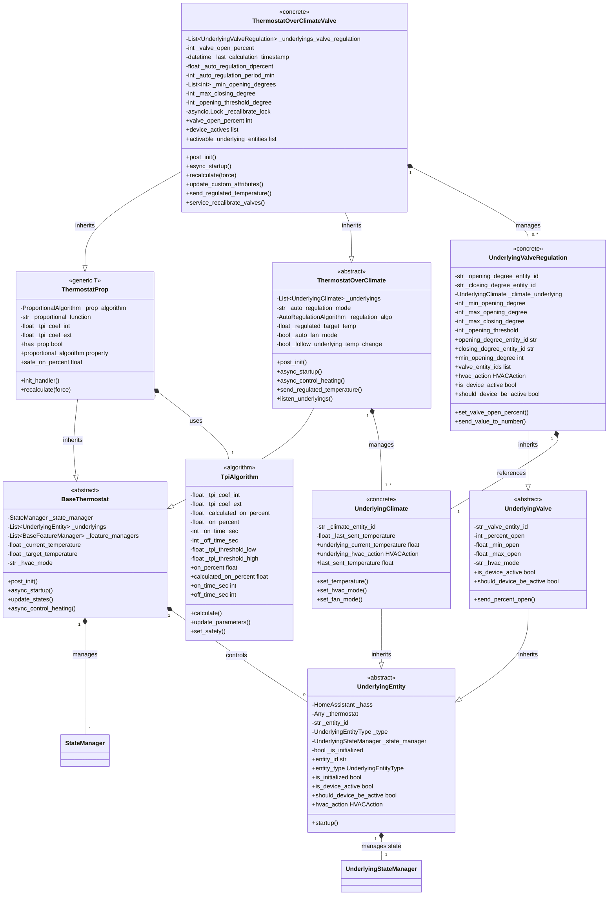

# VTherm Over Climate with Direct Valve Control Documentation

## Overview

This document describes the architecture and operation of a VersatileThermostat configured to control an underlying climate entity (typically a Thermostatic Radiator Valve - TRV) with direct valve regulation through opening/closing degree entities.

This configuration combines:

- **ThermostatOverClimateValve**: A thermostat that sends commands to both a climate entity AND directly controls valve opening/closing degrees
- **Proportional Algorithm (TPI)**: Calculates the optimal valve opening percentage based on temperature differences
- **Dual Underlying System**: Manages both climate communication and valve regulation in parallel
- **Auto-Regulation**: Monitors and respects minimum/maximum opening degrees and opening thresholds

## Architecture Overview



## Core Components

### ThermostatOverClimateValve

The main thermostat class that combines climate control with direct valve regulation.

**Key Attributes:**

- `_underlyings`: List of `UnderlyingClimate` entities (one for each controlled TRV)
- `_underlyings_valve_regulation`: List of `UnderlyingValveRegulation` entities (parallel valve control)
- `_valve_open_percent`: Current valve opening percentage (0-100%)
- `_auto_regulation_dpercent`: Minimum percentage change to trigger a valve command
- `_auto_regulation_period_min`: Minimum period (in minutes) between valve recalculations
- `_min_opening_degrees`: List of minimum opening degrees per valve
- `_max_opening_degrees`: List of maximum opening degrees per valve
- `_max_closing_degree`: Maximum closing degree to consider valve actively heating
- `_opening_threshold_degree`: Degree below which valve is considered closed
- `_last_calculation_timestamp`: When the valve percentage was last calculated
- `_prop_algorithm`: TPI algorithm instance (inherited from ThermostatProp)
- `_recalibrate_lock`: Lock for valve recalibration sequence

**Key Responsibilities:**

1. **Dual Control**: Manages both UnderlyingClimate and UnderlyingValveRegulation entities
2. **TPI Calculation**: Uses proportional algorithm to calculate valve opening percentage
3. **Auto-Regulation**: Respects minimum/maximum degree constraints and recalculation periods
4. **Temperature Synchronization**: Sends adjusted target temperatures to underlying climate
5. **Valve Positioning**: Sends opening/closing degree commands to valve entities
6. **Recalibration**: Provides service to physically recalibrate valve limits

### ThermostatProp[T]

Base class providing proportional algorithm support.

**Generic Type Parameter:**
- `T`: Type of underlying entity (e.g., `UnderlyingClimate`)

**Key Attributes:**
- `_prop_algorithm`: The TPI calculation algorithm
- `_proportional_function`: Algorithm type (TPI, SmartPI, etc.)
- `_tpi_coef_int`: Internal temperature coefficient
- `_tpi_coef_ext`: External temperature coefficient
- `_tpi_threshold_low`: Temperature threshold for TPI application
- `_tpi_threshold_high`: Temperature threshold for TPI application

**Key Methods:**
- `init_handler()`: Initialize the proportional algorithm handler
- `recalculate(force)`: Trigger proportional algorithm calculation
- `has_prop`: Property indicating if proportional algorithm is active
- `proportional_algorithm`: Property returning the algorithm instance
- `safe_on_percent`: Property returning current on-percentage with safety checks

### ThermostatOverClimate

Base class for climate-based thermostats.

**Key Attributes:**
- `_underlyings`: List of `UnderlyingClimate` entities
- `_auto_regulation_mode`: Temperature regulation mode
- `_regulation_algo`: Regulation algorithm for auto-mode
- `_regulated_target_temp`: Calculated target temperature for auto-mode
- `_auto_fan_mode`: Automatic fan mode configuration
- `_follow_underlying_temp_change`: Whether to follow temperature changes from underlying

**Key Methods:**
- `post_init()`: Initialize thermostat configuration
- `async_startup()`: Start listening to underlying entities
- `async_control_heating()`: Main control loop
- `send_regulated_temperature()`: Send temperature commands to underlying climate
- `listen_underlyings()`: Set up state change listeners
- `underlying_changed()`: Handle underlying climate state changes

### TpiAlgorithm

Proportional algorithm using Time Proportional Integral (TPI) method.

**Key Attributes:**
- `_tpi_coef_int`: Coefficient for internal temperature delta
- `_tpi_coef_ext`: Coefficient for external temperature delta
- `_calculated_on_percent`: Raw calculation result (0.0-1.0)
- `_on_percent`: Final on-percentage accounting for safety and limits
- `_on_time_sec`: Calculated ON duration in seconds
- `_off_time_sec`: Calculated OFF duration in seconds
- `_tpi_threshold_low`: Low threshold for TPI application
- `_tpi_threshold_high`: High threshold for TPI application

**Calculation Formula:**

$$\text{on\_percent} = \text{coef\_int} \times (\text{target\_temp} - \text{current\_temp}) + \text{coef\_ext} \times (\text{target\_temp} - \text{ext\_temp})$$

**Key Methods:**
- `calculate()`: Perform TPI calculation
- `update_parameters()`: Update algorithm coefficients at runtime
- `set_safety()`: Enable safety mode with default on-percentage
- `unset_safety()`: Disable safety mode

### UnderlyingEntity

Abstract base for all underlying device types.

**Key Attributes:**
- `_hass`: Home Assistant instance
- `_thermostat`: Reference to parent thermostat
- `_entity_id`: Entity identifier
- `_type`: Entity type (SWITCH, CLIMATE, VALVE, VALVE_REGULATION)
- `_state_manager`: Tracks entity state changes
- `_is_initialized`: Whether the entity has received an initial state

**Abstract Properties:**
- `is_device_active`: Whether device is currently active
- `should_device_be_active`: Whether device should be active based on mode

**Lifecycle Methods:**
- `startup()`: Initialize and register for state changes
- `entity_state_changed()`: Handle state change events
- `check_initial_state()`: Validate initial state upon startup

### UnderlyingClimate

Controls an underlying climate (thermostat) entity.

**Key Attributes:**
- `_climate_entity_id`: ID of the climate entity
- `_last_sent_temperature`: Last temperature sent to avoid redundant commands
- Synchronization parameters for multi-sensor setups

**Key Methods:**
- `set_temperature()`: Send target temperature to underlying climate
- `set_hvac_mode()`: Change HVAC mode (HEAT, OFF, etc.)
- `set_fan_mode()`: Change fan mode
- `get_underlying_attribute()`: Read attribute from underlying entity state

**Key Properties:**
- `underlying_current_temperature`: Current temperature from underlying
- `underlying_hvac_action`: Current HVAC action (HEATING, IDLE, OFF)
- `underlying_target_temperature`: Target temperature from underlying
- `last_sent_temperature`: Last temperature sent to prevent loops

### UnderlyingValve

Base class for valve control.

**Key Attributes:**
- `_valve_entity_id`: ID of the valve number entity
- `_percent_open`: Current opening percentage
- `_min_open`: Minimum opening value from entity
- `_max_open`: Maximum opening value from entity
- `_hvac_mode`: Current HVAC mode

**Key Methods:**
- `send_percent_open()`: Send opening percentage to valve
- `init_valve_state_min_max_open()`: Read min/max from entity attributes

**Abstract Properties:**
- `is_device_active`: Whether valve is actively heating
- `should_device_be_active`: Whether valve should be active

### UnderlyingValveRegulation

Concrete implementation for TRV valve regulation with opening/closing degree control.

**Key Attributes:**
- `_opening_degree_entity_id`: ID of opening degree number entity
- `_closing_degree_entity_id`: ID of closing degree number entity (optional)
- `_climate_underlying`: Reference to paired `UnderlyingClimate`
- `_min_opening_degree`: Minimum opening degree allowed
- `_max_opening_degree`: Maximum opening degree allowed
- `_max_closing_degree`: Degree threshold for active heating detection
- `_opening_threshold`: Degree below which valve is considered closed
- `_percent_open`: Current opening percentage (0-100)

**Key Methods:**
- `set_valve_open_percent()`: Calculate and send valve opening based on thermostat percentage
- `send_percent_open()`: Send opening percentage to opening degree entity
- `send_value_to_number()`: Direct command to number entity
- `startup()`: Initialize listeners for opening/closing degree entities
- `check_initial_state()`: Validate initial valve state and position if needed
- `turn_off()`: Set valve to fully closed
- `turn_on()`: Set valve to fully open

**Key Properties:**
- `opening_degree_entity_id`: ID of opening degree entity
- `closing_degree_entity_id`: ID of closing degree entity
- `min_opening_degree`: Minimum opening degree
- `valve_entity_ids`: List of all valve-related entity IDs
- `hvac_action`: Current HVAC action based on opening percentage
- `is_device_active`: Whether valve opening exceeds threshold
- `should_device_be_active`: Whether valve should be active based on mode
- `current_valve_opening`: Current opening percentage of valve
- `last_sent_opening_value`: Last opening value sent to entity

## Interaction Flow

### Initialization Sequence

```
1. ThermostatOverClimateValve.__init__()
   - Initialize _underlyings list (will be populated)
   - Initialize _underlyings_valve_regulation list
   - Set valve-related attributes
   ↓
2. post_init()
   - Call parent ThermostatOverClimate.post_init()
   - Load valve configuration (min/max opening degrees, thresholds)
   - Create UnderlyingClimate for each underlying entity
   - Create UnderlyingValveRegulation for each opening degree entity
   - Load TPI algorithm parameters
   ↓
3. async_startup()
   - Call parent ThermostatOverClimate.async_startup()
   - Start UnderlyingClimate entities
   - Start UnderlyingValveRegulation entities
   - Register listeners for state changes
   ↓
4. Entities are ready
   - Receive initial temperature
   - First control_heating cycle triggers
```

### Valve Control Cycle

```
async_control_heating():
    ↓
1. Calculate target temperature
    ↓
2. Send temperature to UnderlyingClimate
    ↓
3. ThermostatProp.recalculate()
    - Call TpiAlgorithm.calculate()
    - Get on_percent based on temperature deltas
    - Calculate _valve_open_percent
    ↓
4. Check if valve recalculation is needed:
    - Has period_min elapsed?
    - Is change > auto_regulation_dpercent?
    ↓
5. send_regulated_temperature()
    - Send valve opening % to UnderlyingValveRegulation
    - UnderlyingValveRegulation.set_valve_open_percent()
      - Maps percentage to opening degree value
      - Respects min/max constraints
      - Sends to opening_degree_entity_id number entity
    ↓
6. Update custom attributes and state
```

### Valve Opening Percentage Calculation

```
recalculate(force=False):

    Check recalculation conditions:
    - If sleeping: valve_open_percent = 100
    - If OFF: valve_open_percent = 0

    Otherwise:
    1. Get on_percent from TpiAlgorithm
       on_percent = safe_on_percent (0.0 to 1.0)

    2. Convert to percentage
       new_valve_percent = round(on_percent * 100)

    3. Apply auto-regulation filter
       If new_valve_percent < auto_regulation_dpercent:
           new_valve_percent = 0

    4. Check if change is significant
       dpercent = new_valve_percent - current_percent
       If |dpercent| < auto_regulation_dpercent:
           Skip update
           Schedule recalculation later

    5. Store new percentage
       _valve_open_percent = new_valve_percent
       _last_calculation_timestamp = now
```

### TPI Algorithm Flow

```
TpiAlgorithm.calculate(target_temp, current_temp, ext_temp, slope, hvac_mode):

1. Validate inputs
    If target_temp or current_temp is None:
        calculated_on_percent = 0
        Return

2. Calculate temperature deltas
    If COOL mode:
        delta_temp = current_temp - target_temp
        delta_ext_temp = ext_temp - target_temp (if available)
    Else (HEAT mode):
        delta_temp = target_temp - current_temp
        delta_ext_temp = target_temp - ext_temp (if available)

3. Apply TPI thresholds (if configured)
    If slope is available and thresholds are set:
        Check if within threshold range
        If not: on_percent = 0, return

4. Calculate on_percent
    calculated_on_percent = (tpi_coef_int * delta_temp) +
                           (tpi_coef_ext * delta_ext_temp)

5. Clamp result
    Ensure: 0 <= calculated_on_percent <= 1

6. Apply safety mode (if enabled)
    If safety mode:
        on_percent = default_on_percent
    Else:
        on_percent = calculated_on_percent

7. Apply max_on_percent limit (if configured)
    If on_percent > max_on_percent:
        on_percent = max_on_percent

8. Calculate on/off times
    on_time_sec = on_percent * cycle_min * 60
    off_time_sec = (1 - on_percent) * cycle_min * 60

    If on_time_sec < minimal_activation_delay:
        on_time_sec = 0, on_percent = 0

    If off_time_sec < minimal_deactivation_delay:
        off_time_sec = 0, on_percent = 1
```

## Valve Degree Mapping

The system maps valve opening percentage (0-100%) to opening degree values:

```
Mapping Logic:

valve_open_percent = 0
    → opening_degree = min(min_opening_degree, opening_threshold)
    → closing_degree = max(max_closing_degree, opening_threshold)

valve_open_percent between 0 and 100
    → opening_degree = min_opening_degree +
                       (max_opening_degree - min_opening_degree) *
                       (valve_open_percent / 100)
    → closing_degree = proportionally calculated

valve_open_percent >= 100
    → opening_degree = max_opening_degree
    → closing_degree = 0 (or min_closing_degree if available)

Constraints Applied:
- opening_degree never goes below min_opening_degree
- opening_degree never exceeds max_opening_degree
- closing_degree never exceeds max_closing_degree
- Values only sent if change > auto_regulation_dpercent
- Minimum period_min between consecutive updates
```

## Valve Recalibration Service

The feature provides a service to recalibrate valve opening/closing limits.

**Service Call:**
```
service: versatile_thermostat.service_recalibrate_valves
target:
  entity_id: climate.thermostat_name
data:
  delay_seconds: 30
```

**Recalibration Sequence:**

1. Lock the thermostat (prevent mode/temperature changes)
2. Turn off VTherm (set HVAC mode to OFF)
3. Turn on underlying climate(s)
4. Wait for stabilization
5. Send opening degree to maximum
6. Wait for delay
7. Send closing degree to maximum / opening to minimum
8. Wait for delay
9. Restore previous requested state
10. Unlock the thermostat

**Use Cases:**
- New TRV installation (initial calibration)
- TRV replacement
- Recalibration after winter season
- Correction of stuck valves

## Configuration Parameters

| Parameter                    | Type      | Description                                                   |
| ---------------------------- | --------- | ------------------------------------------------------------- |
| `opening_degree_list`        | List[str] | Entity IDs of opening degree number entities                  |
| `closing_degree_list`        | List[str] | Entity IDs of closing degree number entities (optional)       |
| `min_opening_degrees`        | List[int] | Minimum opening degree per valve (default: 0)                 |
| `max_opening_degrees`        | List[int] | Maximum opening degree per valve (default: 100)               |
| `max_closing_degree`         | int       | Degree threshold for active heating detection (default: 100)  |
| `opening_threshold_degree`   | int       | Threshold below which valve is closed (default: 0)            |
| `auto_regulation_dpercent`   | float     | Minimum percentage change to send command (default: 1%)       |
| `auto_regulation_period_min` | int       | Minimum period between recalculations in minutes (default: 5) |
| `tpi_coef_int`               | float     | TPI coefficient for internal temperature (default: 0.6)       |
| `tpi_coef_ext`               | float     | TPI coefficient for external temperature (default: 0.01)      |

## State Management

The thermostat maintains detailed state information:

```python
# Custom attributes
extra_state_attributes = {
    "vtherm_over_climate_valve": {
        "have_valve_regulation": true,
        "valve_regulation": {
            "underlyings_valve_regulation": [
                ["number.trv_1_opening", "number.trv_1_closing"]
            ],
            "on_percent": 45.5,
            "power_percent": 45.5,
            "function": "TPI",
            "tpi_coef_int": 0.6,
            "tpi_coef_ext": 0.01,
            "tpi_threshold_low": 0.0,
            "tpi_threshold_high": 0.0,
            "minimal_activation_delay": 30,
            "minimal_deactivation_delay": 30,
            "min_opening_degrees": [10, 10],
            "opening_threshold_degree": 0,
            "max_closing_degree": 100,
            "max_opening_degrees": [100, 100],
            "valve_open_percent": 45,
            "auto_regulation_dpercent": 1.0,
            "auto_regulation_period_min": 5,
            "last_calculation_timestamp": "2024-02-08T15:30:00+01:00"
        },
        "underlying_valves": {
            "number.trv_1_opening": {
                "hvac_action": "HEATING",
                "percent_open": 45,
                "last_sent_opening_value": 45,
                "min_opening_degree": 10,
                "max_opening_degree": 100
            }
        }
    }
}
```

## Key Features

### Parallel Dual Control
- Climate entity receives temperature commands
- Valve opening degree entities receive direct valve position commands
- Both operate independently and simultaneously

### Intelligent Auto-Regulation
- Respects physical valve constraints (min/max opening degrees)
- Prevents excessive command spamming (period and delta checks)
- Smooth transitions between opening percentages

### TPI Proportional Algorithm
- Uses both internal and external temperature deltas
- Configurable coefficients for different room characteristics
- Threshold-based activation to avoid hunting

### Safety and Constraints
- Minimum/maximum opening degree limits per valve
- Opening threshold for device activity detection
- Closing degree threshold for active heating detection
- Sleep mode sets valve to 100% (fully open)
- Off mode sets valve to 0% (fully closed)

### Valve Recalibration
- Automated service for physical valve limit calibration
- Prevents deadlocks during recalibration
- Restores previous state after completion

## Performance Considerations

The valve regulation system is designed for efficiency:

- **Event-Driven**: Only responds to state changes and scheduled recalculations
- **Lazy Updates**: Only sends commands when change exceeds threshold
- **Period Throttling**: Respects minimum recalculation period
- **Async Operations**: All Home Assistant calls are async
- **Lock-Based**: Prevents concurrent modifications during recalibration

## Error Handling

The system handles various error scenarios:

| Scenario                      | Handling                                        |
| ----------------------------- | ----------------------------------------------- |
| Missing opening degree entity | Logs warning, valve regulation disabled         |
| Missing closing degree entity | Treated as optional, proceeds without           |
| Invalid min/max degrees       | Automatically corrected with log message        |
| No external temperature       | Uses zero delta, proportional to internal only  |
| Uninitialized underlying      | Waits for initial state before sending commands |
| Recalibration timeout         | Unlocks thermostat and logs error               |

---

*This documentation reflects the architecture as of the current implementation. See the source files for the most up-to-date implementation details.*
