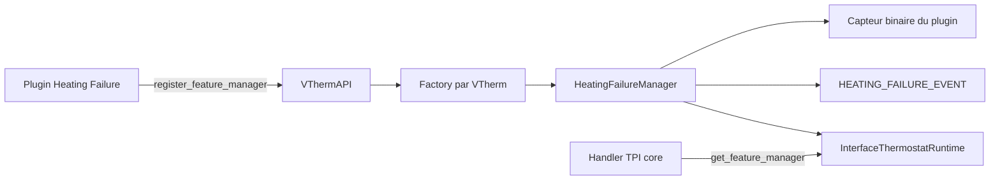

# Extraction de la détection de panne en plugin

## Objectif

Extraire la fonctionnalité `feature_heating_failure_detection` du domaine
`versatile_thermostat` vers une intégration autonome `vtherm_heating_failure_detection`.
Le plugin doit fournir le même comportement de détection chauffage/refroidissement,
les mêmes événements et un capteur binaire équivalent, sans importer de modules privés
du core.

Le core conserve uniquement les contrats génériques nécessaires aux `FeatureManager`
externes et aux algorithmes proportionnels.

## État de départ vérifié

- Le mécanisme de factory est déjà disponible dans `vtherm_api` :
  `InterfaceFeatureManagerFactory`, registre `register_feature_manager`, et création
  d'une instance par thermostat dans `BaseThermostat`.
- Les managers externes sont créés à l'initialisation puis réessayés au démarrage si le
  plugin est chargé après le core ; leur `refresh_state()` est appelé à chaque cycle.
- `vtherm_api` 0.4.0 est déjà la dépendance du core. Il publie le registre de factories,
  `EventType.HEATING_FAILURE_EVENT` et `write_event_log` pour que les plugins produisent
  les mêmes lignes de journal que le core.
- Le core implémente déjà les accès runtime ajoutés pour Auto Fan : `entry_infos`,
  `regulated_target_temperature`, `underlying_fan_modes`,
  `async_set_underlying_fan_mode`, `update_custom_attributes` et
  `async_write_ha_state`.
- La détection actuelle est dans `feature_heating_failure_detection_manager.py` et est
  encore instanciée directement par `BaseThermostat`.
- La fonctionnalité est couverte par 29 tests dédiés, dont des scénarios intégrés,
  les templates, le diagnostic de vannes et le contrat d'événement.
- `InterfaceThermostatRuntime` ne fournit pas encore tous les accès employés par le
  manager actuel. Les accès privés `_underlyings` et les imports du core ne doivent pas
  franchir la frontière du plugin.

## Périmètre fonctionnel

Le plugin doit, pour chaque VTherm configuré :

1. Détecter une panne de chauffage lorsque `on_percent` est supérieur ou égal au seuil
   pendant le délai configuré sans hausse de température suffisante.
2. Détecter une panne de refroidissement lorsque `on_percent` est inférieur ou égal au
   seuil pendant le délai configuré alors que la température augmente.
3. Respecter le mode HVAC désactivé, l'absence d'algorithme proportionnel et le template
   d'activation.
4. Publier l'événement `versatile_thermostat_heating_failure_event` avec le payload
   actuel, y compris `failure_type`, seuil, délai, état du template et diagnostic.
5. Exposer les attributs de suivi actuellement disponibles et un capteur binaire de
   panne ayant un état actif si une panne de chauffage ou de refroidissement est active.
6. Continuer à transmettre l'état de panne à l'algorithme TPI, sans couplage du TPI à
   l'intégration du plugin.

Hors périmètre de cette extraction : modifier l'algorithme de détection, changer les
valeurs par défaut, créer des réparations automatiques ou modifier le format des
événements.

## Architecture cible



### Nouveau dépôt / domaine

Créer un dépôt autonome et monter son composant sous
`custom_components/vtherm_heating_failure_detection` pour le développement local.
Le `manifest.json` déclare `dependencies: ["versatile_thermostat"]`, `config_flow:
true`, une contrainte `vtherm_api>=0.4.0` et son propre numéro de version.

Structure proposée :

```text
custom_components/vtherm_heating_failure_detection/
  __init__.py          # registre/désenregistre la factory et recharge les VTherm
  manifest.json
  const.py
  config_flow.py       # entrée globale et entrées ciblées par unique_id de VTherm
  factory.py           # HeatingFailureManagerFactory
  manager.py           # algorithme et publication des événements
  binary_sensor.py     # état par VTherm configuré
  translations/en.json
  translations/fr.json
  tests/
```

Le modèle de configuration est celui de `vtherm_hysteresis` : une entrée globale porte
les valeurs par défaut, et une entrée ciblée les surcharge pour un `unique_id` de
VTherm. Une entrée ciblée ne stocke que les champs explicitement renseignés : elle ne
doit jamais écraser les autres valeurs par des valeurs par défaut de formulaire.

Pendant la transition, le plugin est la première source de configuration lorsqu'une
valeur y est explicitement configurée. Pour chaque paramètre, la résolution doit être
la suivante, du plus prioritaire au moins prioritaire :

1. valeur spécialisée du plugin pour le VTherm ;
2. valeur centrale du plugin ;
3. valeur spécialisée legacy du VTherm dans le core ;
4. valeur centrale legacy du core, lorsque le VTherm est configuré pour l'utiliser ;
5. valeur par défaut historique.

L'absence d'une valeur plugin signifie donc un repli vers le core, tandis qu'une valeur
explicite, y compris `enabled: false`, prévaut sur le core. Les clés legacy sont lues
via la vue runtime publique `entry_infos`; le plugin ne doit pas importer les constantes
ni les modules privés du core. Une factory crée un manager lorsqu'au moins une
configuration plugin ou legacy est effective pour le thermostat. Une modification,
création ou suppression d'entrée recharge seulement les VTherm concernés.

### Pérennité après retrait du core

Le retrait futur de la feature du core est une rupture fonctionnelle planifiée pour une
version majeure, plusieurs mois après la release de transition. Cette mise à jour doit
être transparente pour un utilisateur ayant déjà configuré le plugin : aucune entrée du
plugin ne doit être recréée, modifiée manuellement ou reconfigurée.

Le core majeur retire le manager, le ConfigFlow, le capteur et les chaînes legacy, mais
préserve les clés historiques déjà persistées dans les config entries centrale et
spécialisées. Elles deviennent des données de compatibilité en lecture seule. Le plugin
continue de les lire par `entry_infos` et leur applique le même ordre de priorité ; il
ne dépend donc pas de l'implémentation fonctionnelle supprimée du core. Les clés ne
peuvent être supprimées qu'à l'occasion d'une version majeure ultérieure, après la fin
annoncée de cette compatibilité.

Les entrées du plugin restent la source prioritaire. Ainsi, une configuration plugin
existante conserve strictement son comportement après la mise à jour majeure, tandis
qu'une valeur plugin non renseignée continue de bénéficier du repli legacy préservé,
sans action de l'utilisateur.

### Contrat runtime restant à compléter

La factory, son registre, le chargement différé et la publication d'attributs sont déjà
en place. L'extraction requiert seulement d'étendre `InterfaceThermostatRuntime` avec
des primitives métier, et non avec les classes internes du core :

- `has_prop: bool`, `requested_hvac_mode`, `now` et `on_percent` ; les températures
  nécessaires au calcul sont déjà exposées ;
- `get_feature_manager(name) -> InterfaceFeatureManager | None` pour que le TPI lise
  l'état de manière générique ;
- `send_event(event_type, payload)` ;
- une vue immuable et typée des vannes, par exemple `ValveDiagnosticState(entity_id,
  should_be_active, is_active)`, au lieu de `_underlyings` ;
- `update_custom_attributes()` et `async_write_ha_state()` restent les mécanismes de
  publication déjà offerts au manager.

`InterfaceFeatureManager` doit aussi documenter `add_custom_attributes(...)` comme hook
optionnel, déjà traité comme tel par le core. Le plugin utilise directement
`vtherm_api.write_event_log` : aucune exposition supplémentaire du helper de log n'est
nécessaire. Les nouvelles signatures doivent être couvertes par les doubles de test de
`vtherm_api`.

### Adaptations du core

Le core :

- retire l'import, l'instanciation, le refresh explicite, les propriétés typées et les
  attributs non enregistrés de `FeatureHeatingFailureDetectionManager` ;
- conserve, sans le réécrire, le cycle générique existant des managers externes et ajoute
  seulement un index par `name` dans `BaseThermostat` pour implémenter
  `get_feature_manager` ;
- remplace dans `prop_handler_tpi` l'accès direct au manager par une recherche du nom
  stable `heating_failure_detection`. L'absence du plugin vaut `False` ;
- retire l'étape de ConfigFlow, les schémas, constantes, chaînes, traductions, capteur
  binaire et documentation appartenant à cette feature ;
- ne supprime ni `EventType.HEATING_FAILURE_EVENT` ni le mécanisme générique
  `send_event`, qui sont le contrat d'intégration.

Le plugin conserve l'identifiant de manager `heating_failure_detection`. Son manager
ajoute les attributs sous la clé existante `heating_failure_detection_manager`, afin de
préserver les tableaux de bord et automatisations qui les lisent.

Le capteur binaire est créé par le plugin et se met à jour via un signal dispatcher émis
par le manager. Son `unique_id` devient nécessairement celui du plugin, mais une reprise
de confort de l'ancien `entity_id` est effectuée lorsque le capteur legacy est déjà
inactif : le plugin identifie l'entrée legacy associée au même appareil VTherm, retire
uniquement son entrée de registre devenue obsolète, puis suggère son ancien `object_id`
au capteur plugin. Les tableaux de bord et automatisations continuent alors de
fonctionner. Si le capteur legacy est encore actif, aucune entrée n'est retirée afin
d'éviter un conflit ; le README et les guides indiquent de désactiver la feature legacy
et de recharger l'entrée plugin avant de migrer.

## Migration utilisateur

La migration est en deux releases afin d'éviter de désactiver une détection existante
sans action visible :

1. Release de transition : publier le plugin, conserver la feature dans le core et
  afficher dans la documentation la procédure de configuration du plugin. Le ConfigFlow
  du plugin crée explicitement l'entrée centrale puis les entrées ciblées : les deux
  formulaires sont préremplis depuis les clés legacy pertinentes et restent soumis à
  confirmation de l'utilisateur. Pour une entrée ciblée, le flow lit soit les valeurs
  spécialisées du VTherm, soit les valeurs de la configuration centrale core lorsque
  ce VTherm l'utilise. Tant qu'aucune valeur plugin ne surcharge un paramètre, la valeur
  spécialisée ou centrale du core continue de s'appliquer selon l'ordre de priorité
  défini ci-dessus. Un seul manager doit être actif par VTherm : dès qu'une
  configuration plugin est pertinente, il remplace le manager legacy pour ce VTherm et
  applique lui-même les replis legacy.
2. Release majeure d'extraction, plusieurs mois plus tard : retirer la feature du core
  sans toucher aux entrées du plugin. Le core cesse de modifier les clés legacy mais
  les préserve dans les entrées centrale et spécialisées existantes comme données de
  compatibilité en lecture seule. Le plugin les lit encore comme valeurs de repli ; ses
  entrées existantes conservent donc leur comportement sans intervention utilisateur.
  Une réparation persistante avertit lorsqu'une ancienne configuration active n'a pas
  été importée ou qu'elle fournit encore une valeur de repli utilisée par le plugin.

Une migration automatique qui crée des entrées de configuration de plugin sans
interaction n'est pas retenue : elle rend les conflits d'entrées globales/ciblées et les
identifiants de capteur difficiles à expliquer et à annuler.

## Plan de développement

1. **Contrat API complémentaire** *(réalisé)* : ajouter les seules primitives runtime manquantes,
  la vue de diagnostic typée et le hook d'attributs documenté dans `vtherm_api`, avec
  des tests unitaires. Publier une version supérieure à 0.4.0.
2. **Support core minimal** *(réalisé)* : implémenter ces primitives et la recherche générique de
  manager ; réutiliser sans modification le registre, le chargement différé et le
  rafraîchissement externe déjà présents. Faire passer le TPI par cette recherche et
  tester plugin absent, manager présent et manager détectant une panne.
3. **Plugin** *(réalisé, couverture à compléter)* : créer la factory et son enregistrement idempotent en s'appuyant sur
  l'API 0.4.0, puis le stockage de configuration effective et la logique du manager,
  en déplaçant l'algorithme sans changement de règle ni de payload. Implémenter une
  résolution par champ : spécialisation plugin, centrale plugin, spécialisation core,
  centrale core, puis défaut historique. Les formulaires de spécialisation doivent
  distinguer les champs non renseignés des valeurs explicitement choisies.
4. **Entités plugin** *(réalisé, couverture à compléter)* : implémenter le ConfigFlow
  global/ciblé, le capteur binaire, les signaux de mise à jour, le rechargement ciblé
  des VTherm et le flow d'import explicite. Il reste à couvrir le parcours ConfigFlow
  complet, la création des capteurs par configuration centrale et l'absence de doublon
  avec une spécialisation.
5. **Nettoyage core majeur** : retirer le manager et toutes ses surfaces ConfigFlow,
   capteur et textes seulement après que les tests plugin valident le contrat complet.
   Conserver les clés déjà persistées et une lecture runtime compatible, sans les
   exposer ni les modifier, afin que le plugin puisse assurer le repli legacy.
6. **Migration et documentation** *(partiellement réalisé)* : publier la release de
  transition, puis l'extraction, avec réparation, guide de migration et notes de
  release. Le README du plugin documente déjà le flow d'import et l'absence de reprise
  de l'identifiant de capteur ; il reste à mettre à jour les cinq guides VTherm, les
  notes de release et l'index de documentation.

## Tests et critères d'acceptation

Migrer les 29 tests actuels vers le plugin, puis ajouter au minimum :

- factory enregistrée, désenregistrée et chargée après un VTherm déjà construit ;
- configuration globale, surcharge ciblée partielle, mise à jour d'options et
  rechargement ciblé ;
- parcours ConfigFlow complet : préremplissage et confirmation de l'entrée centrale,
  puis préremplissage d'un VTherm spécialisé et d'un VTherm utilisant la centrale core ;
- priorité par champ : spécialisation plugin, centrale plugin, spécialisation core,
  centrale core et défaut historique, y compris le cas `enabled: false` explicite ;
- absence de valeur plugin : maintien de la configuration legacy spécialisée ou
  centrale du core, sans double exécution de manager ;
- mise à jour majeure du core : conservation des entrées plugin existantes et du
  comportement effectif, avec lecture des clés legacy centrale et spécialisée
  préservées, sans reconfiguration utilisateur ;
- absence de configuration et absence de plugin : aucune erreur et TPI reçoit `False` ;
- parité chauffage/refroidissement, template, arrêt HVAC, capteur binaire, attributs et
  payload d'événement complet ;
- capteurs binaires : création pour tous les VTherm couverts par une entrée globale,
  exclusion des VTherm spécialisés, absence de doublon et mise à jour dispatcher ;
- diagnostic de vannes au travers de la nouvelle vue typée, sans import du core ;
- import legacy explicite et réparation d'une configuration non migrée ;
- reprise de l'ancien `entity_id` d'un capteur legacy inactif ; conservation du nouveau
  `unique_id` plugin et avertissement documentaire lorsque le capteur legacy est encore
  actif ;
- tests de contrats `vtherm_api` des seules primitives ajoutées et tests d'intégration
  Home Assistant du plugin.

La migration est acceptable lorsque le core n'importe plus le manager, le plugin
fonctionne avec le core installé seul, les événements restent compatibles et les suites
API/core/plugin passent indépendamment.

## Documentation et traductions

Mettre à jour les cinq guides actuels de détection dans `documentation/cs`, `de`, `en`,
`fr` et `pl` pour pointer vers le plugin et expliquer l'import, la configuration
centrale du plugin, la spécialisation d'un VTherm et l'ordre de priorité avec le repli
legacy préservé après la future extraction majeure du core. Traduire les chaînes du plugin dans au moins les langues
actuellement maintenues par le plugin avant la release ; la publication de l'extraction
doit aussi synchroniser README, index de documentation, notes de release et traductions
Home Assistant concernées.